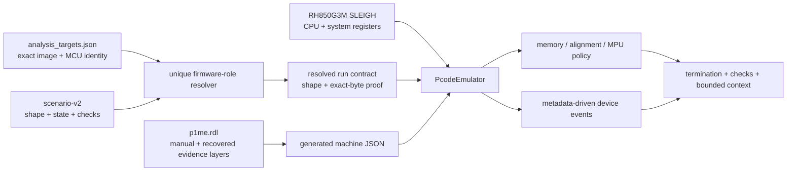
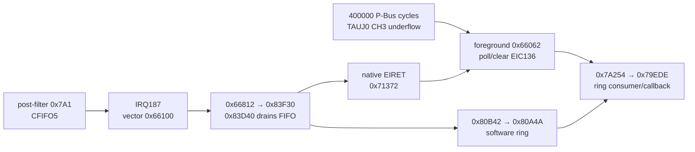

# RH850 build and execution testing

`tools/rh850` is the single interactive entry point. Its hierarchy names the
thing being operated on rather than the execution backend:

|Task|Command|
|---|---|
|Build or inspect the pinned GNU environment|`tools/rh850 toolchain …`|
|Regenerate or check P1M-E projections|`tools/rh850 model update` or `tools/rh850 model check`|
|Build and test payload sources, or test a retained ELF|`tools/rh850 test payload INPUT… --stop POINT --assert EXPR`|
|Test a raw or byte-pinned CodeFlash image|`tools/rh850 test codeflash IMAGE …`|
|Test scenarios against registered exact firmware|`tools/rh850 test firmware TARGET SCENARIO…`|
|Run retained RH850 regression suites|`tools/test rh850`|

The toolchain is GCC 16.2.0, binutils 2.46.1, and GDB 18.1 with
repository-local simulator fixes. Builds and instruction simulation use the
same image and `v850e3v5` architecture. There is no GCC 13 compatibility path,
compiler-profile selection, backend-selection flag, or legacy command alias.
On a prepared host, verify the environment with:

```bash
tools/rh850 toolchain doctor
tools/rh850 toolchain self-test
```

`toolchain self-test` builds a full 1 MiB low-address CodeFlash section with
code at `0x0008F800`, plus a freestanding C function and assembly harness in
high RAM. It checks that all CodeFlash blocks remain distinct, crosses between
CodeFlash and RAM with positive and negative format-VI branches, executes the C
function, and verifies deterministic RAM results. The C function computes from
a volatile local rather than a folded constant. This exercises C compilation,
linking, full-image ELF loading, real low-address instruction fetch, far control
flow, and basic register/stack/memory execution together.

## Build, execute, and verify a payload

One invocation compiles C/assembly sources, links at the addresses in the supplied
linker script, runs that exact ELF to a completion point, and checks its result:

```bash
tools/rh850 test payload path/to/entry.S path/to/payload.c \
  --linker-script path/to/payload.ld \
  --memory-region 0xFEBF0000,0x10000 \
  --stop payload_done \
  --assert '*(unsigned int *)0xFEBF0100 == 0x12345678' \
  --output-dir build/out/payload-experiment
```

Here `payload_done` and the result address/value belong to the experiment, not
to a stock firmware calibration. The CLI owns breakpoint installation, execution,
and postcondition evaluation; no hand-written GDB run sequence is needed.
Without `--linker-script`, supply one already-linked ELF:

```bash
tools/rh850 test payload build/out/payload-experiment/payload.elf \
  --memory-region 0xFEBF0000,0x10000 \
  --stop payload_done \
  --assert '*(unsigned int *)0xFEBF0100 == 0x12345678'
```

Caller inputs and `--output-dir` resolve from the caller's working directory.
Source compilation preserves repository-relative includes and external source
directories' sibling headers. The compiler uses the pinned freestanding RH850
ABI; the linker script owns placement and the entry point.

Both payload and CodeFlash tests require:

- a completion symbol as seen by GDB, or a numeric address, through `--stop`
  (CodeFlash specs may supply it);
- at least one postcondition: repeatable `--assert EXPR`, or `--expect TEXT`
  for an explicit harness script's output;
- a finite execution deadline, `--timeout SECONDS` (default 30).

An entry-only stop, missing contract, failed predicate, unexpected final PC,
debugger error, missing expected output, or timeout fails the command. Loading
or inspecting an image alone is not a passing test. The timeout runs inside the
container; a host-side deadline also removes the container if its client stalls.

The payload command retains `payload.elf` and `build.txt` when building,
`output.txt`, and `report.json` with the verdict, tested ELF hash, stop, and
postconditions. Without `--output-dir`, it uses a unique directory beneath
`build/out/rh850-payload/`. A failed rebuild cannot reuse an earlier passing
verdict. Existing ELF inputs are tested in place and identified in the report.

For multi-stage harnesses, repeat `--command`/`-ex` to supply the complete GDB
execution script, including `run` or `continue`. The shared executor still
checks completion and postconditions. Scripts run as a GDB command file so a
debugger error terminates evaluation instead of falling through to a success
message. Raw debugger inspection remains available through `toolchain run`;
it has no test verdict.

`tools/test rh850` selects the retained compiler-ABI, device-model, payload,
CodeFlash, and exact-firmware suites. It does not automatically build or test
an arbitrary new experiment, and does not include signer-host tests or the
separate processor/project milestone audits.

## Specification-backed P1M-E machine

`tools/rh850 test firmware` uses Ghidra's modern `PcodeEmulator` and the
vendored RH850G3M SLEIGH language. It is separate from GNU `sim/v850`: the
p-code machine loads the exact registered CodeFlash/DataFlash identities,
rejects CodeFlash overlays, applies the SystemRDL memory/register model, and
faults on an unmapped or uninitialized read instead of supplying zero.

The canonical device source is `data/devices/p1me.rdl`.
`tools/rh850 model update` compiles it into:

- `data/generated/p1me_machine.json`, consumed by the Ghidra machine;
- `data/p1m_sfr_labels.csv`, consumed by the Ghidra device-profile scripts;
- `data/p1me_product_memory.json`, consumed by product/memory checks.

All three projections and their code consumers are discoverable through
`tools/artifact`. The generated machine model separates public-manual regions
and registers from `target_derived` recovered register behavior. Its product
records identify `R7F701381` and `R7F701383` individually; the runtime checks
the selected target's exact MCU identity rather than treating “P1M-E” as one
undifferentiated part.

### Architecture

The machine has one owner for each layer:

1. `ghidra/ghidra_v850/data/languages/` defines RH850G3M instruction and
   system-register semantics. Synchronization opcodes share the processor
   language's ordering-boundary userop; the machine records `SYNCE`, `SYNCM`,
   `SYNCP`, and `SYNCI` separately from their decoded instruction mnemonics.
   MPU and interrupt system registers use the G3M selector map from
   R01US0123EJ0140.
2. `data/devices/p1me.rdl` defines the P1M-E address spaces, register widths,
   access policy, reset rules, evidence class, and peripheral trigger
   relationships. Generated JSON/CSV files are projections, not competing
   sources. Java dispatches generated trigger/reset metadata; it does not select
   TAUJ, RSCFD, FACI, or ICU-S behavior by register-name tables.
3. `data/analysis_targets.json` supplies exact MCU, processor language,
   CodeFlash identity, and optional DataFlash identity. It is not a capability
   whitelist.
4. A scenario supplies external state, a target-independent structural
   firmware-role selector, stop addresses, checks, optional hash-bound RAM
   artifacts, and instruction-boundary external events. `gpr_fill` states the
   general-register baseline once; `registers` contains overrides and
   system-register state. `pre_reset_memory` exercises reset retention/clearing.
5. `RunP1MEMachine.java` resolves each role uniquely from the selected analyzed
   firmware, records the structural and exact-byte proof, composes the machine
   with `PcodeEmulator`, and enforces execute/read/write policy before each
   operation. One target session loads immutable images and model data once,
   then runs each scenario with fresh emulator state.
6. Reports embed the resolved run contract, external inputs, explicit termination
   reason, check results, fault provenance, and a bounded recent-PC window.
   An output-inspection fault becomes a failed check with a structured `error`
   and `actual: "unavailable"`; it never replaces the original execution fault.
   `termination_reason: "expected-fault"` describes execution independently of
   check success. A failing check still makes the report and CLI fail.

### Implementation plan and tracked status

The implementation extends Ghidra's `PcodeEmulator`; it does not add a QEMU TCG
target or a second RH850 decoder. This keeps instruction semantics in the
repository's existing SLEIGH language and makes exact registered addresses,
processor contexts, and project inventories directly reusable. GNU `sim/v850`
remains a separate execution engine for differential checks; it is not the
device-model runtime.



|Workstream|Design and invariant|Tracked status|
|---|---|---|
|CPU execution|Use the vendored RH850G3M SLEIGH language; preserve distinct decoded synchronization mnemonics while sharing one ordering-boundary p-code operation.|Implemented for the exact paths and synthetic instruction corpus. The processor fixture covers arithmetic/flags, loads/stores, branches, calls/returns, `CAXI` compare-exchange, `DI`/`EI`, system-register selectors, trap/exception return, MPU registers, and synchronization decode. This is not a claim that every G3M opcode has an independent semantic test.|
|Memory subsystem|Load registered CodeFlash/DataFlash by exact hash; map LocalRAM, GlobalRAM, SFR, and alias regions from generated data; use the target language's little-endian byte order; enforce read/write/execute policy, initialized-state provenance, alignment, and per-register access widths before side effects.|Implemented. PE1/self LocalRAM aliases are kept coherent. Unknown MMIO, illegal widths, and uninitialized reads fault.|
|Reset behavior|Initialize architectural reset registers and the SLEIGH-internal load-link monitor centrally; apply generated P1M-E reset-source rules before deciding which RAM regions to clear.|Implemented for `none`, `power-on`, `system-1-pin`, `system-1-cvm`, `system-2`, and `application-1`. A fresh machine has `ll_valid=0` and initialized `ll_addr`; scenarios need no monitor workaround.|
|Peripheral scheduler|Complete instruction-triggered device events at retirement, then apply external inputs before the next instruction. Equal-boundary external inputs retain scenario order.|Implemented. `after_instructions` selects a deterministic boundary; `clock.p_bus_cycles` supplies independent peripheral-clock progression. There is no inferred CPU-cycle ratio or wall-clock polling.|
|Interrupts|Arbitrate modeled EIC requests using EIMK, PSW.ID/NP, PMR, ISPR, priority, and channel-number tie-break; save EIPC/EIPSW/EIIC and select direct or INTBP vectors; invalidate the load-link reservation.|Implemented for modeled EIINT channels. Edge acceptance clears EIRF; level requests remain until their source clears. Native `EIRET` applies automatic ISPR release when pre-return EP=0 and INTCFG.ISPC=0; protected software ISPR writes are ignored. Reserved channels without a supported reset contract fault on injection.|
|TAUJ|Progress software-triggered interval timers from explicit P-Bus cycles, applying CK0–CK2 prescalers, retaining fractional progress, reloading on underflow, and raising the channel request.|Implemented for the bounded TAUJ0 interval path, including MD0 immediate-start requests. CK3/BRS and other timer modes fault rather than invent behavior. Clock events are functional stimulus, not CPU/silicon timing.|
|RSCFD|Retain buffer-16 transmit behavior; model common receive FIFOs 3 and 5 using generated control/status/window/pointer/interrupt relationships.|Receive inputs explicitly start **post-filter**. Mode/enable gates, payload capacity, queue depth, overflow, interrupt threshold, sticky flags, oldest-message windows, and native pointer pops are modeled. CAN1's receive level is the OR of modeled FIFO sources. Acceptance-filter execution, global RFIFOs, arbitration, bus timing, and error-state evolution are not modeled.|
|FACI / CodeFlash|CodeFlash fetches execute from immutable registered image bytes. Scenario overlays and ordinary writes are rejected. Only the exact status-clear command has a modeled FACI transition.|Bounded implementation. Unsupported FACI commands fault before side effects; erase/program, protection, sequencer timing, and cache-coherency behavior remain unimplemented.|
|ICU-S|Expose only recovered registers and exact command-five/callback transitions. Treat supplied output words as scenario state, not generated cryptography.|Implemented within that recovered boundary. No provisioned-key or AES-CMAC silicon claim.|
|Integration|Expose model generation through `tools/rh850 model update` and `tools/rh850 model check`, and batched execution through `tools/rh850 test firmware`; bind identity through the existing target registry; retain one JSON report per scenario under `build/out/`.|Implemented. No parallel capability manifest, target whitelist, project lifecycle, backend selector, or legacy CLI alias exists.|
|Verification|Discover target-owned scenarios deterministically and require unique role resolution before exact-byte execution; retain instruction fixtures and negative machine cases.|`tools/test rh850_firmware` runs the machine gate. `make verify-processor` now requires it after the synthetic instruction fixture, before optional working-project audits. GNU simulation remains an independent backend.|

Progress:

- [x] Select and integrate the Ghidra p-code execution framework.
- [x] Establish strict registered-image, memory-map, alias, and fault behavior.
- [x] Generate the device specification from SystemRDL and bind reset metadata.
- [x] Implement architectural processor reset state, STAC-controlled RAM reset,
  alignment, MMIO width, and MPU enforcement.
- [x] Add deterministic peripheral scheduling and the exact TAUJ, RSCFD, FACI,
  INTC-register, and recovered ICU-S paths required by retained scenarios.
- [x] Add exact-firmware and negative regression scenarios and CLI integration.
- [x] Add manual-backed EIINT arbitration/entry/return, explicit TAUJ clock
  progression, and an exact Camry receive-to-foreground scenario.
- [ ] Add mutating FACI commands and CodeFlash coherency only with an exact
  programming path and byte-level postconditions.
- [ ] Extend peripherals and instruction tests incrementally from failing exact
  paths; never fill undocumented behavior with permissive stubs.

The functional model currently covers PE1/self LocalRAM aliasing,
STAC-controlled Application/System reset RAM rules, G3M alignment and MPU
overlap permissions, per-register MMIO access widths, TAUJ0 interval progression,
EIINT delivery, common receive FIFOs, recovered RSCFD transmit buffers, the FACI
status-clear command, and the explicitly recovered ICU-S surface. Unknown MMIO,
illegal widths, uninitialized state, and unsupported FACI commands are hard
faults carrying PC, address, size, access kind, and evidence provenance.
A known register without a behavior model remains ordinary typed storage; it
does not acquire invented side effects.

ICU-S is intentionally marked `recovered`: the public P1M-E manual names the
block but does not publish its full register or cryptographic semantics. The
model executes the stock command-five submit and native input/output callbacks,
but supplied ICU-S data words are scenario inputs. It does not claim to derive
a provisioned key or emulate the hardware AES-CMAC implementation.

Check that all projections match the source without rewriting them:

```bash
tools/rh850 model check
```

Run one or more deterministic scenarios by registered target name:

```bash
tools/rh850 test firmware camry-8965F3307000 \
  tests/fixtures/rh850/machine/camry-8965F3307000/camry_f33_can_foreground.json \
  tests/fixtures/rh850/machine/camry-8965F3307000/camry_f33_rscfd_tx.json
```

The command writes one report per scenario. Each report embeds the resolved run
contract: unique candidate count, resolved entry, structural signature, exact
matched-code hash, exact entry-instruction hash, image/model identities, initial
state contract, stop addresses, checks, and termination reason. Scenario RAM
initialization is explicit; RAM artifacts require SHA-256 identities.
Unsupported fields and all attempts to initialize registered
CodeFlash/DataFlash directly are rejected before execution.

External `events` require `kind`, nonnegative `after_instructions`, and
`evidence`. Supported kinds:

- `clock`: positive `p_bus_cycles`; advances enabled modeled TAUJ channels.
- `can-rx`: `fifo`, `boundary: "post-filter"`, `can_id`, and `data_hex`;
  optional `fd`, `extended`, 12-bit `label`, and 16-bit `timestamp`.
  Classical lengths are 0–8; FD additionally permits 12/16/20/24/32/48/64 bytes.
  Label/timestamp are explicit accepted-message metadata, not recovered by a
  simulated filter or timestamp clock.
- `interrupt`: `channel`; requests a modeled EIC source. Unknown/reserved
  channels fail closed.

Stop addresses are terminal: events scheduled after reaching a stop are not
executed. Unsupported modes and missing state remain faults.


The default functional profile establishes instruction, register, memory, and
modeled-device behavior only. It makes no cycle-timing, silicon, vehicle, or
physical-safety claim. Register rules tagged `manual` come from the public
Renesas manuals. Rules tagged `recovered`, notably ICU-S behavior, remain
exact-firmware-derived rather than public silicon specifications.

The retained scenarios use semantic structural selectors, not fixed entry
addresses. For the tracked Camry image the resolver currently produces:

|Domain|Resolved Camry entry|Exercised machine boundary|
|---|---|---|
|Ring publication|`0x00080A4A`|producer record, `SYNCP`, cursor advance|
|RSCFD transmit|`0x000852FE`|buffer-16 identifier/data and transmit request|
|TAUJ0 setup|`0x0006639C`|mode, prescaler, and calibrated reload values|
|INTC acknowledge|`0x00066062`|EIC136 pending-bit poll and clear|
|CAN receive to foreground|`0x00066062`|TAUJ underflow/poll, common FIFO 5, IRQ187 entry/native return, software-ring publication and foreground consumption|
|FACI command|`0x00078AE6`|status-clear command and ready state|
|ICU-S command five|`0x0008A720`|validated command submission and recovered state|
|ICU-S input callback|`0x0008A538`|four input words fed to the ICU-S data register|
|ICU-S output callback|`0x0008A5AE`|four supplied output words copied to RAM|
|Reset and MPU|`0x00078AEA` / `0x00078AE6`|RAM clearing, aliases, deny, and overlap-grant rules|

The Crown fixture resolves the same portable byte-store role from the Crown
image to `0x00077F16`; the equivalent Camry entry is `0x00078AE6`. This proves
cross-target role resolution and exact execution, not semantic equivalence of
the complete firmware images.

### Exact Camry receive-to-foreground proof

`camry_f33_can_foreground.json` exercises stock `8965F3307000` CodeFlash
(`42dce8efc42f6ae31718e7713fa2d26bb9191b4a82439778aee4d7afded9b0e7`).
The scenario supplies a synthetic classical `0x7A1` frame
`02 3e 00 00 00 00 00 00` after acceptance filtering, with label `0x34`.
Exact rule 43 at `0x23368` supplies that ID/label and destination `0x2000`
(common FIFO 5). This is not the normal `0x090`/B6 RFIFO1 path.

Byte/disassembly checks matter here: table cells `0x22FA0`, `0x22FAC`, and
`0x22FB4` contain **FIFO-3 base addresses**, but the native `0x83D40` reader adds
`8`, `8`, and `0x100`, selecting FIFO 5 at `0xFFD2018C`, `0xFFD201EC`, and
`0xFFD23680`. The actual INTBP word at `0x204EC` points to `0x66100`, not
`0x71508`.



The verified run executes **1,274 exact instructions** and stops at `0x7A272`,
immediately after the foreground ring-drain call. Twelve postconditions check
the preserved record bytes, producer/consumer cursor advancement, empty queue,
timer acknowledgement, one interrupt entry/return, saved poll PC, and released
ISPR priority.

The starting state is deliberately bounded: scenario-owned zero Local RAM,
explicit online/started communication state and completed initialization gate,
operating CAN status, and a pre-running steady-period timer. No executable
overlay, replacement ISR, boot emulation, diagnostic-service completion, or
vehicle observation is claimed. Controller-mode initialization/status evolution
outside those supplied preconditions remains unmodeled.


Run the narrow gate with:

```bash
tools/test rh850_firmware
```

This gate also covers strict schema/event rejection, unknown-MMIO and unsupported
device-event faults, executable-overlay rejection, unique role resolution on
Camry/Crown, and preservation of an execution fault when subsequent output
inspections fail. It does not promote recovered ICU-S behavior to a silicon claim.

## CodeFlash simulation

`tools/rh850 test codeflash` executes a raw CodeFlash image at its real
addresses, with optional RAM residents loaded at exact addresses:

```bash
tools/rh850 test codeflash path/to/CodeFlash.bin \
  --entry 0x00012340 \
  --load 0xFEBF0000=path/to/resident.bin \
  --memory-region 0xFEBE0000,0x20000 \
  --stop 0xFEBF0080 \
  --assert '*(unsigned int *)0xFEBF0100 == 0x12345678'
```

This tests an explicitly bounded experiment on a newly acquired binary: no
registered-target knowledge is required, and entry may point into CodeFlash
or any `--load` range. The stop and result in the example describe the loaded
experimental resident. As with payload tests, a completion point and checked
postcondition are mandatory; there is no default inspection-as-success path.
`--output-dir` retains the linked ELF, modeled image, and output for debugging.

### Specs

Once a target's execution contract is understood, capture it as a spec and
everything becomes byte-pinned:

```bash
tools/rh850 test codeflash firmware/camry-8965F3307000/CodeFlash.bin \
  --spec tests/fixtures/rh850/camry_f33_gate2_codeflash_sim.json \
  --expect 'GATE2_RESULT=0x222 FRESHNESS_ARG=1 ROOT_BOOL=1'
```

A spec (see the JSON files in `tests/fixtures/rh850/`) pins the image size and
SHA-256, an assembly harness (stock GP/TP/SP context, call-boundary stubs),
RAM-load pockets (address + maximum size), memory regions, an explicit `stop`,
one ordered GDB script, and instruction overlays. Each overlay replaces bytes at a known
address — but only after verifying the original bytes still match, so any
image drift aborts before execution. The harness models privileged
boot/context installation and hardware-heavy callees; everything else (stock
startup JARLs, RAM-clear, scheduler, foreground) runs unmodified at its
original address.

The TSS3 signer does not use a Camry-only checked-in spec. The dump onboarding
workflow generates byte-pinned overlays and a GP/TP/SP harness from each
resolved firmware contract, then executes the same universal payload against
that exact CodeFlash:

```bash
tools/toyota ram onboard path/to/CodeFlash.bin
```

Its two clean simulator processes share one linked ELF: one reaches the
GlobalRAM helper through the complete post-foreground fallback, the other
through the timer-bounded idle branch. Boot, context, startup-final, and
hardware-heavy foreground callees are explicit generated overlays; their
preimages remain bound to the supplied dump.

One gate runs every modeled scenario — generic synthetic image, the F33
Gate-2 stock/root-only/stage-2/stage-3 differential, the F33 and Corolla
H/F RAM residents, and the universal signer fallback/idle paths on every
registered Camry, Crown, and Corolla H/F CodeFlash:

```bash
tools/test rh850_codeflash
```

These executions found a real pre-deployment defect: a non-inlined `call0`
helper linked at VMA zero became an absolute call to `0x46` after loading the
resident at `0xFEBF0000`. Both the F33 and Corolla canaries/proxies now
inline target calls.

### Proof boundary

A passing simulation proves the executed CPU instructions, exact low user-area
CodeFlash preimages, call targets, RAM placement, and modeled state transitions
— nothing else. GNU `sim/v850` does **not** model P1M-E LocalRAM aliases,
instruction-cache state or the RAM publication effect of dummy-read /
`SYNCP` / `SYNCI`, MPU/IPG access checks, ECC, reset-class RAM initialization,
interrupts, peripherals, watchdogs, command-5 hardware permission, or timing.
It also does not prove `MCTL.MA=0` misalignment exceptions unless a specific
CPU model implements and exercises them. MMIO-heavy payloads need explicit
register models; do not treat simulator success as evidence for RSCFD, ICU-S,
FACI, ECM, or timing behavior. An isolated bench or in-vehicle canary remains
required per target.

### Simulator fixes

Upstream GNU `sim/v850` has a long-standing format-VI 32-bit-immediate decoder
bug affecting `jarl32`/`jr32`/`jmp32` (the `imm32` cache in `v850.igen` used a
relational `<` where a shift was intended, and assembled the encoded halfwords
in the wrong order; still present on upstream master). The repository toolchain
applies two patches:

- `binutils-v850-sim-imm32.patch` fixes format-VI immediate word assembly;
- `binutils-v850-sim-codeflash-map.patch` replaces the legacy 32 KiB mirrored
  backing store for `0x00000000..0x000FFFFF` with a complete 1 MiB store —
  without it every `0x8000`-byte block overwrites the previous alias.

`tools/rh850 toolchain self-test` covers both fixes before accepting the simulator.

## Rebuilding the GNU setup

`tools/toolchains/v850-gcc/Dockerfile` owns the Ubuntu digest and GCC,
binutils, and GDB source revisions. Each cloned release is checked against its
pinned commit. `tools/rh850` owns the single image tag used by every command.

Build and verify it with:

```bash
tools/rh850 toolchain build
tools/rh850 toolchain doctor
tools/rh850 toolchain self-test
```

`tools/rh850 toolchain image` prints the canonical tag without requiring Docker.
Generic callers should use the wrapper rather than copying version strings
into argument defaults. `--toolchain`, `--image`, and `build-compat-image` are
not supported; `RH850_TOOLCHAIN_IMAGE` no longer changes image selection.

Historical compiler outputs and audit records remain immutable evidence, not
a reason to retain a second supported compiler. Current ECU payload builders
all enter the pinned toolchain through `tools/rh850`; builder CLIs do not accept
an image or compiler override. A compiler upgrade can change bytes without
changing behavior, so field-qualified historical binaries remain separate from
newly built artifacts until the new artifacts receive their own qualification.

`tools/rh850 toolchain run ...` is the escape hatch for invoking any
`v850-elf-*` program with the repository mounted at `/src`; for example,
`tools/rh850 toolchain run v850-elf-objdump -d build/out/example.elf`.
Builders use `tools/rh850 toolchain run --work-dir PATH ...` when they need a
scratch directory mounted at `/out`; dependent compile, conversion, and
inspection commands are batched into one container invocation.
`tools/rh850_toolchain.py` provides the canonical command construction and
provenance to Python callers.

## Official Renesas options

Renesas also ships two useful but separate products:

1. **[CS+ RH850 instruction simulator](https://www.renesas.com/en/software-tool/simulator-cs-rh850-family).**
   It models RH850 CPU instructions, registers, and address space. It is not a
   P1M-E peripheral emulator.
2. **[Cycle-Accurate Simulator for RH850](https://www.renesas.com/en/software-tool/cycle-accurate-simulator-rh850).**
   P1M-E is explicitly listed among the supported devices. It is an optional
   licensed CS+ component and is the official path when cycle timing matters.
   Renesas currently advertises executable-file support for CC-RH and GHS, not
   GNU `v850-elf`, so this is not a drop-in executor for our deployment ELF.

The current **CC-RH V2.08.00** compiler has a Linux x86-64 distribution in
addition to Windows; Renesas publishes it through the
[compiler installation guide](https://www.renesas.com/en/software-tool/compiler-installation-guide).
CC-RH is an external reference tool, not an alternative compiler selected by
`tools/rh850` or part of the supported GNU build path.

The official CS+ simulator remains valuable as an independent implementation,
especially for ISA edge cases and CC-RH differential tests. Renesas documents
[command-line Python automation of CS+](https://www.renesas.com/en/document/apn/cs-integrated-development-environment-introductory-guide-using-python-automating-debugging-cs),
so a Windows CI/VM lane is possible if we acquire/install the Renesas package.
The GNU simulator is the lower-friction default because it is already inside
the compiler image and runs the exact ELF we build.
