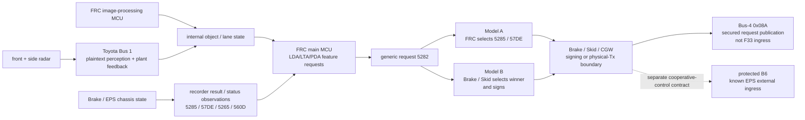

# 2026 Camry live TSS3/EPS baseline

## Scope and evidence

On 2026-08-26 the maintainer's 2026 Toyota Camry produced an identity-bound TSK
baseline covering EPS diagnostics, a stationary READY CAN segment, a bounded
PROGRAMMING handoff, and an XCP CONNECT-only probe. Raw/privacy-minimized source
evidence is retained under `targets/camry-2026/raw-20260826/`; the
reproducible compact analysis is
`data/generated/camry_2026_tsk_baseline.json`.

Sections 1–8 preserve the original **dynamic field evidence**, not a Camry CodeFlash analysis. Corolla H/F names there are used only where the wire behavior itself strongly transfers. Section 9 adds the subsequently acquired exact `8965F3307000` CodeFlash and replaces the firmware-transfer boundary only for facts proved target-natively there; remaining timing/limit/signer questions stay explicit.

## 1. Exact EPS identity and route

The application answers F181 with two 16-byte records:

- primary `8965F3307000`;
- secondary `8A3113303100`.

Exact same-image code fixes the secondary record as software/compatibility identity,
not a neighboring-blob label. F181 callback `0x4FA26` emits count 2 and copies its two
16-byte records from `0x20860` and `0x17DC0`. Startup `0x637EE -> 0x62D5E` compares
`JB1BA101` at `0x17DA0` against `0x20850`, then the five-byte `8A311` prefix at
`0x17DC0` against `0x20870`; either mismatch sets the protected error value passed to
`0x70A92`, while the JB mismatch additionally writes `0x5A` to `FEBF066C`. Callback
`0x4F9DE` is separately DID2032's one-record producer from `0x17D80`
(`8965H33030A00`) and is not an F181 record.

F18C returns ECU serial `8965033K9011J2740743`. The observed normal-harness
route is ELM327 parameter 1, logical bus 1, physical request `0x7A1`, response
`0x7A9`. The identity probe received responses from its bounded checks of SIDs
`0x10`, `0x22`, `0x23`, `0x27`, `0x3E`, and `0x19`; this is not a complete
application service-table census.

No prior tracked source in this repository contains exact F181
`8965F3307000`, so no firmware-static Corolla/Sienna result is promoted by
identity alone.

## 2. Initial PROGRAMMING handoff — bootstrap boundary later superseded by §9

The bounded DEFAULT -> EXTENDED -> PROGRAMMING probe succeeds and the diagnostic
endpoint reappears on the same explicit route. Bootloader F181 is exactly
`02 || 32*0x21`, matching the placeholder shape directly observed on the tracked
Denso EPS family. Functional `0x777` also receives a session-control response
around the handoff.

For this **initial** baseline, that was useful family evidence but intentionally
stopped short of boot SecurityAccess, DID `0201/0202/0203`, RequestDownload,
`0x10F0`, `0xFF00`, or RAM-exec claims; the TSK recovery gate correctly refused
to copy H/F/Sienna geometry by family resemblance. Section 9 later supersedes
that acquisition boundary with direct F33 evidence: the exact old-stack
authenticated bootstrap and read-only RAM payload path are now proven. The
application-retention/operational-signer boundary remains separate.

## 3. Vehicle CAN topology is strongly TSS3-like

The stationary READY capture spans 59.98 seconds and contains 134,989 incoming
CAN rows. The stream census is 22 ID/DLC streams on bus 0, 179 on bus 1, and the
same 22-ID/DLC set on bus 2. Buses 0/2 reproduce the familiar TSS3 CAN-FD family
including `0x123/16` and `0x180..0x18C`; only `0x189/64` has a non-identical
payload sequence between the two observed logical buses in this segment.

The steering/state network on bus 1 contains the same important carrier family
seen on Corolla H/F-era routes:

| ID | DLC | frames | observed rate |
|---|---:|---:|---:|
| `0x00F` | 8 | 619 | ~10.31 Hz |
| `0x025` | 32 | 6,188 | ~103.15 Hz |
| `0x030` | 32 | 6,188 | ~103.15 Hz |
| `0x090` | 32 | 6,187 | ~103.14 Hz |
| `0x0AA` | 8 | 6,187 | ~103.13 Hz |
| `0x0D7` | 32 | 3,094 | ~51.57 Hz |
| `0x101` | 8 | 3,095 | ~51.58 Hz |
| `0x116` | 8 | 2,627 | ~43.79 Hz |
| `0x127` | 8 | 3,777 | ~62.97 Hz |
| `0x176` | 8 | 1,949 | ~32.48 Hz |
| `0x51E` | 8 | 61 | ~1.02 Hz |

Classic `0x131/8` and `0x2E4/8` steering commands are absent. `0x0B6/32` is
also absent, but stock LTA was not deliberately transitioned during the segment;
zero B6 is therefore **not** evidence that this Camry lacks the H/F-style
protected lateral command.

## 4. H/F state formats transfer unusually well

### 4.1 `0x030`

All **6,188/6,188** frames satisfy the exact H/F packer relation
`B7 = low8(sum(B0..B6) + 0x38)`. Applying the H/F steering-wheel-torque layout
produces a dynamic `-1.75..+1.80 N.m` value with 143 unique samples, while the
coarser H/F truncation field spans `-1.7..+1.8 N.m`. That is substantially
stronger than an ID/DLC coincidence.

The transferred H/F B6 status locations are behaviorally plausible but are not
yet assigned Camry firmware semantics. B6[0] begins high and clears at about
0.202 s; B6[1] toggles in two short intervals around 4.9-5.8 s; B6[2] and B6[3]
stay clear. In H/F these locations have specific validity/fault/current-monitor
provenance, but those code-level names remain **candidate transfers** until Camry
firmware or independent diagnostic joins support them.

### 4.2 `0x025`

The H/F DBC geometry decodes coherently: steering angle spans `-12.0..+19.5 deg`,
fraction exercises all signed 0.1-degree nibble values from `-0.7..+0.7`, and
the signed rate field spans `-80..+70` in the existing prior-art deg/s
interpretation. This is strong wire-layout continuity, not a substitute for the
Camry receiver/producer code.

### 4.3 legacy checksum/state carriers

The ordinary Toyota checksum validates every retained `0x101` (3,095/3,095),
`0x127` (3,777/3,777), and `0x176` (1,949/1,949) frame. The capture is stationary:
all H/F-compatible wheel-speed fields decode zero with clear wheel-fault bits,
brake/gas remain inactive, and the `0x127` gear field is raw `0` throughout.
Raw `0` is prior-art-compatible with `P`; the same repository previously observed
raw `3` while a Corolla was driving and treated it as D. The later controlled
Camry READY/selector pass in §8 supersedes this initial bound and directly closes
all five values `P=0, R=1, N=2, D=3, B=4` on this exact vehicle.

## 5. `0x51E B0[7]` Ready transition

The strongest new state result is a real transition on the wire already joined
statically in H/F to Techstream DID `0x1033 Ready Status`:

| capture time | B0[7] | payload |
|---:|---:|---|
| 0.0176 s | 0 | `0000610000000000` |
| 0.9943 s | 1 | `8000610000000000` |
| 16.0042 s | 1 | `8000620000000000` |

Thus this Camry starts the retained READY segment with the bit clear and then
asserts it about one second later. This strongly corroborates `0x51E B0[7]` as a
cross-vehicle TSS3 Ready-status carrier and supplies the first retained `0 -> 1`
transition in this repository. The later controlled NRTD→READY pass in §8
independently reproduces the transition with the passive logger already active
before the operator is told to enter READY, closing the remaining causal ambiguity
for state decoding while still bounding exact button-to-frame latency.

## 6. XCP uses an extended endpoint, reaches staging, and is stock-disabled before command dispatch (VAR-134 / CORR-165)

The earlier `0x7F7 -> 0x7F8` interpretation was wrong for exact F33. Rule 46 is
programmed directly into the P1M-E RSCFD `GAFLID` register. In that register bit 31
is **IDE**, not a generic packed-ID marker, so `0x9FDC0002` means classic
**extended CAN ID `0x1FDC0002`**; the response word `0x9FE00002` likewise means
extended `0x1FE00002`. Rule 46 attaches label `0x37`, routes into receive FIFO 1,
and the label/slot tables resolve exactly to `0x8312E -> 0x830D0`.

The 2026-09-06 parked live probe closes physical ingress rather than merely inferring it.
With openpilot stopped, exact F181 reverified, and no steering/XCP-write command sent, a
single non-command marker `00 11 22 33 44 55 66 77` on extended `0x1FDC0002` changed
`FEBE4C34` from the prior stale CONNECT bytes to that exact marker. Panda reported zero
TX blocks; `FEBE5004/5005` remained clear and `FEBE4EE6` remained `0x5A`. Therefore the
frame passes physical CAN, rule 46, FIFO1, owner-0 receive routing, `0x8312E`, and
`0x830D0` staging.

The reason CONNECT still cannot run is an independent fixed-CodeFlash gate.
`0x821D6` calls `0x830C0 -> 0x98E80` before parsing any XCP command. `0x98E80` reads
CodeFlash byte **`0x30D68`**, which is **`0x5A`** in `8965F3307000`; any nonzero value
returns `1`, while `0x821D6` enters CONNECT/command parsing only when that return is
zero. Thus the live transport/owner predicates can all be true and `FEBE4EE6` can be
`0x5A` while stock protocol dispatch remains disabled. The old standard-ID timeout and
CORR-124's runtime-admission explanation are superseded by CORR-165.

## 7. NRTD P5 identities and cruise-control wire joins

A second stationary **Not Ready to Drive** pass used only diagnostic reads, one
bounded EXTENDED-session read check, and passive CAN observation. It closes the
Camry-native FRC and Brake/EPB identities that VAR-051 left open:

| module | bus | request -> response | exact F181 | supporting identity |
|---|---:|---|---|---|
| `FRC_P5` | 1 | `0x792 -> 0x79A` | `8646F3315000` | `0105=8646C06091`; F18C `TN69400026030404235J`; `1FFF=06000000000000000000` |
| category-435 Brake/EPB | 1 | `0x7B0 -> 0x7B8` | `F152633K0000` | `0105=8954147040`; F18C `8954147040CFC1800985` |

The same physical requests timed out on logical buses 0 and 2 in the bounded
sweep. Both exact software IDs are new to the tracked local openpilot firmware
corpus even though their `8646F33...` / `F152633...` families are familiar; they
are therefore retained as Camry-native identities rather than forced into an
older platform match.

### 7.1 FRC cruise diagnostic oracles work on this exact car

The current-GTS+ SID-`0x22` transport recovered in TMS-057 transfers directly to
this FRC. `0x1901`, `0x1905`, `0x1906`, `0x1912`, `0x1914`, `0x1918`, `0x1928`,
and `0x1202` all return positive data in NRTD. Isolated operator button presses
then make the named control states observable without inference from timing:

- **MAIN:** `0x1906 e080e0008000 -> e0c0e0008000 -> baseline`;
- **RES+:** `e080e0008000 -> e080e0808000 -> e0a0e0808000 -> baseline`;
- **SET-:** `e080e0008000 -> e080e0408000 -> baseline`;
- **CANCEL:** `e080e0008000 -> e080e0208000 -> baseline`;
- **following distance:** `0x1912` changes persistently (`03 -> 04` in the
  isolated run and `04 -> 01` in the synchronized run).

This validates the FRC P5 diagnostic vocabulary dynamically on the exact Camry.
The engagement-state oracles (`0x1905` permission and `0x1914` ACC control in
operation) stay in their non-engaged NRTD states, so actual cruise engagement
still requires a later READY/driving observation.

### 7.2 `0x0FE/32` is the momentary cruise-switch CAN carrier

A single-Panda synchronized run retained 1,742 FRC oracle samples and 90,932
passive CAN frames while MAIN, RES+, SET-, CANCEL, and following-distance were
pressed sequentially. The four momentary `0x1906` edges join directly to bus-1
`0x0FE/32` at about **33.19 Hz**. Ignoring independently rolling integrity/counter
bytes, the stable data tuple `(B3,B4,B6,B7)` is `(3F,00,C3,62)` and becomes:

| operator input | event tuple `(B3,B4,B6,B7)` | XOR from baseline |
|---|---|---|
| MAIN | `(3F,00,C3,66)` | `B7 ^= 04` |
| RES+ | `(BF,00,43,62)` | `B3 ^= 80`, `B6 ^= 80` |
| SET- | `(3F,80,C3,22)` | `B4 ^= 80`, `B7 ^= 40` |
| CANCEL | `(3F,40,C3,42)` | `B4 ^= 40`, `B7 ^= 20` |

Each event returns to the same baseline around the corresponding FRC diagnostic
edge. That is a direct dynamic CAN/Techstream join; it does not by itself name
the producer ECU or authorize transmitting `0x0FE`.

Following-distance is a different, persistent state. When FRC DID `0x1912`
changed `04 -> 01` at 16.874632 s, two low-transition passive candidates changed
within about 12 ms and stayed changed: bus-1 `0x251/8` B5 `88 -> 28` at
16.885741 s, and bus-1 `0x5AF/32` B24 `F0 -> E4` at 16.886393 s. Those are
**candidate ordinary-CAN distance-state carriers only** pending an independent
repeat/enum sweep; no Toyota signal name or producer is assigned yet.

### 7.3 Corolla Brake `0x107E` does not directly transfer

The Camry Brake/EPB ECU answers DID `0x102F` (`f700fd007c00a9000000`), but
`0x107E` returns `requestOutOfRange` both in the tested default session and after
a positive EXTENDED-session entry. The ECU was returned to DEFAULT immediately
after the check. Therefore the Corolla `ABS_P5` `ADS Control EPS Pinion Angle2`
monitor is **not** a usable Camry live oracle under these tested sessions, and it
must not be copied into Camry integration assumptions.

The deterministic interpretation is
`data/generated/camry_2026_nrtd_p5.json`, generated by
`tools/targets/camry/analysis/analyze_camry_2026_nrtd_p5.py` and verified by
`tests/verify_camry_2026.py`. Raw source identities are pinned separately
in `targets/camry-2026/raw-20260826/NRTD_MANIFEST.txt` so VAR-051's READY
baseline remains independently reproducible.

## 8. Controlled NRTD→READY and complete `0x127` gear enum

A third passive field pass was started while the vehicle was stationary and
**Not Ready to Drive**. Only `Panda.can_recv()` was used after route/safety-mode
configuration; the retained capture scripts contain no CAN transmit call, UDS,
SecurityAccess, RoutineControl, reset, download, or vehicle-control path. After
the logger was confirmed running, the operator was explicitly told to enter
READY and then exercise the selector while holding the brake.

### 8.1 `0x51E B0[7]` is now controlled NRTD→READY evidence

The first 60-second capture directly records:

| capture time | B0[7] | payload |
|---:|---:|---|
| `0.070314 s` | 0 | `0000640000000000` |
| `5.213083 s` | 1 | `80006e0000000000` |

Because the logger was already active in NRTD before the READY instruction, this
is stronger causal evidence than VAR-051's earlier startup segment: `0x51E B0[7]`
is directly suitable as the Camry Ready-state carrier. The operator's physical
button press itself was not machine-timestamped, so exact action→frame latency is
still not claimed.

### 8.2 `0x127` closes `P=0, R=1, N=2, D=3, B=4`

The first selector run was intended to include B, but the operator immediately
reported afterward that B had been missed. The wire sequence therefore provides
a clean reversible P/R/N/D round trip rather than an inferred missing event:

| time | raw `0x127` gear | operator state | representative payload |
|---:|---:|---|---|
| `0.016697 s` | 0 | P | `00100000000ebe0c` |
| `12.560082 s` | 1 | R | `00100000001e8deb` |
| `14.443866 s` | 2 | N | `00100000002e8dfb` |
| `17.525321 s` | 3 | D | `00100000003e8d0b` |
| `21.129039 s` | 2 | N | `00100000002e8dfb` |
| `23.014504 s` | 1 | R | `00100000001e8deb` |
| `25.192386 s` | 0 | P | `00100000000e8edc` |

A second 25-second READY/stationary capture was then started specifically for B.
After its initial P baseline, the operator performed D→B→D:

| time | raw `0x127` gear | operator state | representative payload |
|---:|---:|---|---|
| `5.107709 s` | 3 | D | `00100000003e8d0b` |
| `9.480908 s` | 4 | B | `00100000004e8d1b` |
| `13.626834 s` | 3 | D | `00100000003e8d0b` |

The Toyota checksum validates **3,777/3,777** first-run `0x127` frames and
**1,634/1,634** B-run frames. Bus-1 `0x0AA` is also byte-identical at
`1a6f1a6f1a6f1a6f` for all 6,187 + 2,677 retained frames, matching the earlier
zero-motion Camry baseline and independently supporting the stationary condition.

Therefore the complete prior-art enum is now **directly validated on this exact
Camry**: `P=0`, `R=1`, `N=2`, `D=3`, `B=4`. This closes the Camry read-only gear
measurement boundary. It does not authorize transmitting any frame or automatically
transfer the validation to a different Toyota platform.

The deterministic artifact is `data/generated/camry_2026_ready_gear.json`, built
by `tools/targets/camry/analysis/analyze_camry_2026_ready_gear.py` and checked by
`tests/verify_camry_2026.py`. Exact capture/script hashes and the
operator-sequence correction are pinned in
`targets/camry-2026/raw-20260826/READY_GEAR_MANIFEST.txt`.

## 9. Exact `8965F3307000` CodeFlash and target-native steering contract

The fourth stationary/NRTD pass acquired the exact EPS CodeFlash rather than
continuing to transfer H/F firmware semantics. The successful identity- and
Ready-guarded collector returned the complete configured 2-MiB transport range:
524,288/524,288 unique words, zero conflicts, zero duplicates, and zero SPI
errors. The raw dump SHA-256 is
`b588c7258699beee77669d1f5f09bb17ef8b189b941b46f344a07378c3aaa727`.
The lower 1 MiB is populated while the upper 1 MiB is entirely erased `0xFF`, so
the deterministic normalized CodeFlash is the exact lower half, SHA-256
`42dce8efc42f6ae31718e7713fa2d26bb9191b4a82439778aee4d7afded9b0e7`.

The acquisition also replaces VAR-051's boot-family boundary with direct F33
evidence. Stock boot SID `0x23` CodeFlash access rejects the read, but boot
SecurityAccess succeeds; DID `0x0203` returns the old-stack selector, zero
`0x0201/0x0202` records are accepted, RequestDownload accepts
`FEBF0000/0x1000`, `0x10F0` accepts the authenticated envelope, and `0xFF00`
starts the retained read-only range payload. These are exact Camry bootstrap
facts. They do **not** prove that a Corolla H/F application-retention carrier or
operational command-5 permission survives unchanged after boot-to-application
handoff.

### 9.1 Application Rx continuity and target-native SecOC

The generated normal-Rx descriptor table is at `0x21FE8` with 43 descriptors.
Every one of the 40 Corolla-H descriptors exists on this target; Camry adds only
`0x116/8`, `0x0D8/8`, and `0x1DA/8`. Relative to the older Sienna image, Camry
removes the old `2E4/191/131/2FD/132/423/020` receive set and adds
`116/D8/B6`. This is configuration continuity, not a blanket semantic-transfer
claim.

The exact three-record protected receive table is at **`0x25848`** and contains
only `0x00F`, `0x0D7`, and `0x0B6`. The shared crypto configuration immediately
before it selects `{type=1, selector=4}`; target-native `0x8A8E4` programs ICU-S
**command 7**. B6 is regenerated as **PDU44**: 32 secured bytes, 28 application
bytes plus an FV4/CMAC28 trailer, full FV46, full CMAC128, freshness ID 2, and
crypto handle 0. Thus the earlier H/F conclusion that B6 belongs to the same
slot-4 authenticated receive family as `00F/D7` is now independently true for
F33 itself.

### 9.2 B6 wire layout: Target Lateral ID + target steering angle

Camry's COM scalar extractor is at `0x7D12A`; target-native code fixes TP at
`0x23DFC`, signal-to-PDU table `0x22488`, PDU table `0x226C0`, and PDU-buffer
offset table `0x22840`. PDU44 begins at COM offset `0x1B7` and owns configured
signals 259..275. Its scalar unpacker `0x4BD46` recovers, among the companion
fields:

- **signal 261 = B3[5:0]**, unsigned six-bit selector;
- **signal 262 = B4:B5**, signed 16-bit steering target;
- signals 263..273 occupy B6..B10;
- B28..B31 remain the SecOC trailer rather than application fields.

Signal 261 is now nameable rather than merely structurally analogous to H.
`0x58074` stages B3 and `0xBCD62` snapshots it; target-native `0xCEFFC` consumes
that snapshot and recognizes values `1/4/10/11/18/19`. Toyota's P5 EMPS
**Target Lateral ID** dictionary assigns those exact values
`PCS/LDA/Hands Off LTA/LTA-LCA/SDG/PDA`. A second target-native consumer
`0xCB73A` recognizes raw 49, which the same Toyota dictionary names
`Self-Propelled Transport`. The numeric/consumer join therefore closes B3 as
**Target Lateral ID** on this Camry.

Signal 262 is staged `gp-0x3748 -> gp+0x39FA -> gp-0x970` and consumed by
**`0xCCF0E`**, which computes a saturated `2 * signed16(B4:B5)` target followed
by interpolation/history; `0xCCFB2` applies mode-dependent target limits and
`0xCEE7C` independently supervises the same target snapshot. The remaining
question was whether this target quantity was specifically steering angle or a
more generic steering-domain scalar. The Camry's own feedback path closes that
question.

### 9.3 Camry-native `0x025` measured Steering Angle closes signal 262

CAN-FD `0x025` is target-native PDU35 at COM offset `0x127`. Its unpacker
`0x4B59E` extracts signal 187 as signed12 coarse angle and signal 188 as signed4
fraction. `0x47AE0` consumes the exact coarse field, and the target's own DID
`0x1037` table row at `0x293AC` points to callback `0x4DBF8`, which consumes that
same value. Toyota P5 names DID `0x1037` **Steering Angle** and gives the coarse
raw value a `1.5 deg/count` conversion.

The normal control path independently reconstructs the same feedback:
`0xB3B06` forms `15*coarse + signed_fraction`, and `0xCE9EA` converts it through
`*0x6FB/0x200`; the signed nibble therefore supplies the `0.1 deg` fraction of
the coarse 1.5-degree representation. `0xCEADA` republishes the valid measured
angle into a redundant triple. The corrected complete comparator at `0xCD128`
then votes the B6-derived target triple and the `0x025`-derived measured-angle
triple, applies the **same `0xB76/0x400` gain to each, and subtracts measured
from target**. This target-native closed loop is direct evidence that B6
**signal 262 / B4:B5 is the target steering-angle command**.

The integer gains also give an exact linearized controller-equivalent scale:
one B6 count corresponds to `1024/17870 deg`, approximately `0.0573027 deg` or
`1.0001215 mrad`. That is a derived relation between the two target-native
controller domains, including Toyota's DID `0x1037` degree scale; the firmware
does not literally label B6's wire engineering unit "mrad", and integer
truncation/saturation still applies.

PDU44's target-native receive supervision reloads to **seven foreground ticks**.
The exact F33 TAUJ0 CH3 tick period and the resulting wall-clock timeout are now
closed target-natively in §12.1; the H 5-ms figure is no longer transferred.

The compact artifact is `data/generated/camry_8965F3307000_codeflash.json`,
bound to exact target-native decompiler bodies in
`data/generated/camry_8965F3307000_decompiler_evidence.json` and independently
checked by `tests/verify_camry_8965F3307000.py`. Raw acquisition
provenance is retained in `raw-20260826/CODEFLASH_MANIFEST.txt`.

## 10. Exact DataFlash + CPU-visible RAM SecOC-key recovery result

A fifth exact-target NRTD experiment used the already-proven F33 authenticated
`FEBF0000/0x1000 -> 0x10F0 -> 0xFF00` range-reader family to collect the
physical 32-KiB DataFlash, the complete 128-KiB PE1 LocalRAM view, and the
complete 64-KiB GlobalRAM view. Every acquisition was identity-bound to
`8965F3307000 / 8A3113303100`, required bus-1 `0x51E` Ready=0 before the
PROGRAMMING handoff, re-observed the exact boot placeholder, used the old-stack
zero-`0201/0202` authenticated payload contract, and completed with zero range
conflicts. The retained hashes are:

- DataFlash `FF200000..FF207FFF`:
  `231fbdde4ef317931d8f1ff20ff131650f7d773c124a179b0ae3dc98bf8e4432`;
- PE1 LocalRAM `FEBE0000..FEBFFFFF` / 128 KiB:
  `0ddef478b15bcf3241c56573463eda25ba018081629daf0042fcae1204c435a7`;
- GlobalRAM `FEEF8000..FEF07FFF` / 64 KiB:
  `53c8370237c681d4105c513be5096461ac735ffcb9577995c7203216165006a4`.

The DataFlash storage result is unambiguous at the already-recovered NvM
geometry. Object 15 occupies the familiar raw/xor55/xoraa records at
`0xFF206E00/0xFF206D00/0xFF206C00`, but **all three copies are invalid** and
there is no valid decoded consensus. More specifically, the corresponding
16-byte second/key fields at **`0xFF206E14`, `0xFF206D14`, and `0xFF206C14`
are all raw zero bytes**. Thus the 4514000-era plaintext-object-15 result does
not transfer to this exact F33 ECU.

The PE1 LocalRAM snapshot independently validates why the generic legacy
extractor correctly refused F33 instead of projecting the old `FEBE6E34`
layout. Interpreting `FEBE6E34..FEBE6FF3` as fourteen 0x20-byte legacy key
records gives **0/14 valid record checksums**. The old KEY_1 field at
`0xFEBE6E60` is zero; the old KEY_4 field at `0xFEBE6EC0` belongs to a
checksum-invalid record; and the old `0xFEBF42E0` factory-key record is zero.
Conversely, the exact F33 application-SecurityAccess root
`893e08418c741ffa2a9c044bffa55813` appears exactly once at **`0xFEBF7B80`**,
matching the H/F startup-mirror position and demonstrating that the LocalRAM
stream is structured target state rather than an empty/broken acquisition.
Neither the payload-build root nor the boot-SA root appears as a raw 16-byte
LocalRAM or GlobalRAM value.

One acquisition caveat is explicit: the LocalRAM range reader itself is loaded
at `FEBF0000..FEBF0FFF`, so those 4096 bytes are overwritten before the range
is read. They are excluded from key-search conclusions. The rest of PE1
LocalRAM had 100% word coverage (32,768/32,768); GlobalRAM likewise had 100%
coverage (16,384/16,384), with zero conflicts, duplicates, or stream-time SPI
errors in both retained runs.

The READY oracle collected alongside this experiment is healthy and directly
contains the F33-native protected domain: bus 1 has 618 `0x00F/8`, 6,190
`0x090/32`, 3,095 **`0x0D7/32`**, 2,629 `0x116/8`, and 63 `0x24D/8` frames
over about 59.98 seconds. `0x0B6` was not exercised in this stationary
capture. `kai-openpilot` matcher commit
`2bfbef37fddbdf4e499a4adc55005474f3c5ffcf` parsed 208 sync samples plus 813
protected samples (including capped `0x0D7` FD samples) and exhaustively tested
every eligible sliding 16-byte window:

- DataFlash: **32,753 / 32,753**, zero survivors;
- PE1 LocalRAM: **126,946** eligible windows after excluding the payload span,
  zero survivors;
- GlobalRAM: **65,521 / 65,521**, zero survivors.

This closes the simple CPU-visible-key hypothesis for the retained post-handoff
memories: **no raw 16-byte window in the complete DataFlash, non-clobbered PE1
LocalRAM, or GlobalRAM authenticates the captured Camry SecOC traffic under the
recovered Toyota CMAC formats.** It does *not* imply that ICU-S slot 4 is empty.
Exact F33 firmware already proves command-7 verification selects slot 4, and the
live `0x0D7` stream demonstrates an operational protected domain. The natural
interpretation is therefore that the active slot-4 secret is not present as a
raw CPU-visible value in these retained stores. A transient application-only
RAM value could also be cleared by the application-to-boot handoff, so the RAM
negative is scoped to the post-handoff snapshots rather than every instant of
application runtime.

Raw acquisition, payload, oracle, and retained matcher provenance live under
`targets/camry-2026/raw-20260826/secoc-recovery/`; deterministic compact
interpretation is `data/generated/camry_8965F3307000_secoc_recovery.json`.

## 11. What this changes for openpilot work

The exact Camry image removes the largest firmware-transfer uncertainty from the
lateral path. `0x025`, B6, the protected `00F/D7/B6` set, ICU-S slot-4 receive
verification, Target Lateral ID, and the target-vs-measured steering-angle loop
are now F33-native facts rather than Corolla assumptions. Section 12
subsequently closes the exact F33 lateral/runtime prerequisites statically: the
5.000-ms foreground tick, the mode2 limit calibration, the companion control
fields, the monitor/torque/current feedback oracles, the application runtime
anchors, and the static carrier geometry. The earlier read-only CarState
evidence (`0x030` torque, `0x51E` Ready, `0x127` gear, FRC cruise oracles)
remains complementary live evidence.

The original stock-B6-capture blocker in this section is superseded by
VAR-081/CORR-134. The retained relay-correct drives already contain complete
LTA/LCA-active intervals with zero B6 and recover Bus-4 `0x08A` as the lateral-
request representation. The current blockers are therefore narrower and
producer-directed:

1. identify who produces the observed Bus-4 `0x08A`; its absence from Panda bus 1
   means the retained capture does not distinguish a Bus-1-side request transformed
   before observation from a Bus-4-side producer/echo;
2. recover `0x08A`/`0x081` producer, integrity/authentication, and arbitration ownership
   without assuming either frame is transformed into exact-F33 B6;
3. recover the stock chassis/reference-to-steering-assembly authority handoff that
   produces factory steering with B6 absent; evaluate B6 separately as an optional
   external cooperative-control ingress rather than as the stock-LTA transport;
4. only after that chain is known, validate signing latency/jitter, driver-override
   and motor-current response policy, and `0x351/0x394/0x4A3` fault/recovery behavior;
5. perform a bounded relay-correct steering experiment only after those producer,
   protection, arbitration, and safety gates close. FRC `0x1601/0x1914` remains
   useful independent corroboration, not a prerequisite for identifying the retained
   LTA/LCA interval.

Production output remains disabled. The exact firmware substantially reduces the
remaining work, but it does not by itself authorize steering transmission.

## 12. Exact F33 static lateral/runtime prerequisite closure

This section is the canonical home for the target-native static closure of the
remaining F33 lateral prerequisites (ledger: **VAR-056**): foreground timing,
the B6 mode2 limit calibration, companion control fields, feedback monitors,
application runtime anchors, and the static carrier geometry. All claims are
exact `8965F3307000` firmware-static results on the retained CodeFlash from
§9; none is transferred from Corolla H/F or Sienna. Static closure does not
authorize transmitting any frame.

### 12.1 Foreground timing: TAUJ0 CH3 steady 5.000 ms

Foreground timer `0x66062` (TAUJ0 channel 3) is configured for a **steady
5.000-ms period after one 5.125-ms first interval**. The startup interval is a
deliberate first-reload artifact, not jitter. PDU44's seven-tick receive
supervision (§9.2/§9.3) therefore expires at a **nominal 35 ms** after the last
authenticated B6 delivery. This is the exact-F33 replacement for the H/F timing
boundary and is the number the live stock-sender cadence capture must confirm
before any sender schedule is fixed.

### 12.2 Target Lateral ID 11 selects supervisor mode2; exact mode2 calibration

Target Lateral ID (signal 261, §9.2) directly selects the steering supervisor's
**mode2** control family: value `11` (LTA-LCA) is consumed as the mode2
selector. The exact mode2 limit calibration is:

- **±1745 B6 counts (~±100 deg)** absolute target limit;
- **78 counts (~4.47 deg)** per effective modulo-64 sequence gap;
- the effective sequence gap is **capped at 8**.

These are target-native constants, not H/F transfers; the H/F ±1745/78 figures
are now independently corroborated as the exact-F33 values rather than copied.

### 12.3 Companion B6 control fields

The companion-field semantics recovered in the mode2 consumers are:

- **signal 265 = 1** suppresses one additive contribution term;
- **signals 269/270** are `/100` percentage contributions; **zero removes**
  the term entirely;
- **signal 268** is the application-side modulo-64 sequence counter (the
  receiver-side sequence state was already closed in §9);
- the remaining secondary fields stay **unnamed** — no OEM field name is
  assigned without firmware or diagnostic evidence.

### 12.4 Feedback oracles: angle-velocity monitor, torque, and Q current

Exact F33 diagnostic joins close the feedback side:

- `0x025` **signal 189 is Steering Angle Velocity**, via the exact DID1036
  callback `0x4DBBC`. The LTA/LCA monitor uses **abs(raw) > 100** with
  **79-cycle persistence**.
- DID1035 **Steering Wheel Torque** callback `0x4DB70` scales **raw/256 N.m**
  with validity magic `0xA5AA5AA5`. The **±2109 raw (~±8.238 N.m)** bound is an
  **acquisition/representation clamp, not an override threshold**.
- DID1151 **Motor Actual Current Q Axis** callback `0x4E394` computes
  **(raw*100)/0x80**. The first-class 6,065-function Ghidra graph resolves
  `GP-0x5158` to `FEBE66A8` and finds **9 direct driver-torque references
  (7 reads / 2 writes)**; it resolves `GP-0x50F2` to `FEBE670E` and finds
  **6 direct Q-current references (4 reads / 2 writes)**. **Neither exact
  address has a direct Ghidra reference inside the cooperative `C8xxx-D1xxx`
  B6 control cone.** This supersedes the scratch-project 4→5 textual census
  (CORR-122). Computed aliases without a Ghidra data reference, DMA, hardware
  mutation, and unrecovered code remain outside the bounded negative.

### 12.5 Application runtime anchors

For runtime construction against this exact image:

- context init `0x715B4` loads EBASE=`20000`, INTBP=`20200`, GP=`FEBEB800`,
  TP=`23DFC`, SP=`FEBE2000`;
- coordinator `0x637EE` performs 21 startup calls `0x637F6..0x63846`, with the
  final call `0x701EA(0)`, then `ei`, then foreground `0x66062`;
- boot calls C9A/E54/F80/10C6, validity 119E.

### 12.6 Live carrier correction: `FEBF0000` rejected, high tail verified

The later live startup-retention probes supersede the static low-pocket carrier
assumption from VAR-056. The real stock application startup **overwrites** the
`FEBF0000..FEBF0307` candidate; `stock-retention-20260826.json` has
`prefix_648_byte_exact=false` and `shell_retained=false`. That pocket remains
useful as authenticated boot staging, but it is not a production resident
application carrier.

A separate high-tail probe closes the actual retained executable geometry on this
exact F33:

- **`FEBFF9F0..FEBFFBFB`**, exactly **524 bytes**;
- live marker execution from the tail succeeded;
- after the real stock application startup, all 524 bytes survived byte-for-byte;
- retained SHA-256
  `89ffed31c24e746a57171e6f3e22f99d1e78d57b63bccb8778c7fe715d18800c`;
- application F181 `8965F3307000 / 8A3113303100` reappeared normally;
- Panda `safety_tx_blocked_delta=0`.

This tail is inside MPU region 1 `FEBF7C00..FEBFFBFC`: context 0 MPAT `0xB8`
(supervisor R/W/X), context 1 MPAT `0xA8` (supervisor R/X). It is now recorded as
exact-target dynamic evidence in `data/variant_ram_exec_requirements.json`. The
old audited low-linked canary/proxy binaries remain reproducible static build
evidence only and must not be treated as post-startup production residents.

The live evidence is pinned under `targets/camry-2026/raw-20260826/`;
`tests/verify_camry_8965F3307000.py` and the corrected
`tests/verify_camry_8965F3307000.py` prevent regression.

## 13. Non-persistent application-mode signer installation

The production question is narrower after the high-tail result: can stock F33,
already online in the application, accept arbitrary bytes into that tail and then
transfer control there without the PROGRAMMING handoff? Exact firmware closes the
**placement** half and leaves the **control-transfer** half open.

### 13.1 XCP write/DAQ callbacks exist, but exact F33 disables their stock CAN command ingress

F33 contains the standard XCP command map at `0x22B24` and callback table at
`0x22B50`. Target-native callbacks include `SET_MTA 0x82C62`, `DOWNLOAD 0x81FFE`,
`MODIFY_BITS 0x820C4`, `SHORT_UPLOAD 0x82B1A`, and measurement-only DAQ. The write
validator at `0x98F2C` admits `FEBF7C00..FEBFFBFF`, which fully covers the
live-proven high tail. GET_SEED/UNLOCK are unconfigured. These are real handler
semantics, but **they are not a stock-reachable placement primitive on this calibration**.

The physical endpoint is classic extended CAN, not standard diagnostic CAN:

- request hardware-formatted word `0x9FDC0002` -> extended **`0x1FDC0002`** at
  `0x21F50` and rule46 `0x23398`;
- response hardware-formatted word `0x9FE00002` -> extended **`0x1FE00002`** at
  `0x21F48`.

Rule46 is on RSCFD controller 1, uses mask selector 0 -> `0xC00007FF`, attaches
label `0x37`, and routes to receive FIFO1. FIFO1's base label `0x09` maps `0x37`
back to rule index 46. Rule46's owner-0 callback selector is `0x20`, selecting slot5;
slot5 points to route record `0x21AA4`, whose exact key is `0x9FDC0002` and callback
is `0x8312E`. Live SID23 observation independently proved FIFO1/owner/transport state
active and the marker probe proved the request reaches `FEBE4C34`.

Protocol execution stops one layer later. Before CONNECT or any opcode lookup,
`0x821D6` calls `0x830C0 -> 0x98E80`. Exact CodeFlash `0x30D68=0x5A`; `0x98E80`
returns nonzero immediately for that value, and `0x821D6` processes XCP only when the
return is zero. This is a fixed stock-calibration negative, not a remaining session,
Panda, bus, FIFO, or communication-owner ambiguity. Consequently native XCP DAQ is not
the next Camry steering observer and XCP DOWNLOAD is not a stock production RAM loader.
The 52-byte DAQ profile remains useful as an observation specification for the audited
RAM-resident observer.

The high-tail carrier itself remains verified: `FEBFF9F0..FEBFFBFB` survives stock
startup and executes. Production work therefore again needs a **stock-reachable volatile
byte-placement surface as well as a safe control-transfer primitive**, or a different
stock mechanism that supplies both. Do not patch `0x30D68` merely to preserve the old
XCP architecture; that would turn a stock production design into another firmware-patch
design.

### 13.2 Why the tail begins exactly at `FEBFF9F0`

The seven-selector custom calibration/XCP family at `0x2B250` maps
`FB/FA/F5/F3/EB/EA/E4` to
`0x98FBA/0x9901A/0x99152/0x99266/0x9930E/0x99388/0x99414`. The final four are the
standard calibration-page operations **BUILD_CHECKSUM (`F3`)**, **SET_CAL_PAGE
(`EB`)**, **GET_CAL_PAGE (`EA`)**, and **COPY_CAL_PAGE (`E4`)**. SET/GET_CAL_PAGE
mutate/report the two lower-RAM page-state bytes `FEBE5EC4/5EC5`. `0x991D2` is the
page-address translator: the recovered path uses it from BUILD_CHECKSUM to translate
between CodeFlash `0x10000..0x17DEF` and the RAM shadow. No recovered use feeds an
instruction fetch or branch target.

The E4 handler invokes `0x993F0`, which copies CodeFlash `0x10000..0x17DEF` to
LocalRAM `FEBF7C00..FEBFF9EF`. Normal stock application startup independently does
the **same copy**: entry `0x20880 -> 0x637EE`, then callsite `0x63822 -> 0x636D4`.
The `0x636D4` and `0x993F0` 36-byte copy loops are byte-identical and the startup
copy occurs before the later interrupt-enable point. The source page is therefore
materialized as ordinary calibration data during every stock startup, not only by
a diagnostic request.

A target-native recovered-function census finds **zero function entries** in the
32,240-byte source page and **zero function-owned flow edges** into it; the mirrored
`FEBF7C00..FEBFF9EF` range likewise has **zero recovered flow edges**. No application
consumer of the page-state bytes outside this calibration/XCP machinery is recovered.
This closes the tempting "calibration overlay executes from RAM" composition as a
**data-shadow path, not a recovered control-transfer primitive**.

The verified carrier begins on the very next byte:

```text
FEBF7C00 + 0x7DF0 = FEBFF9F0
```

Thus the 524-byte region is the residual tail above the stock calibration shadow
and immediately below the MPU-region-1 upper bound, not an arbitrary guessed hole.

### 13.3 Rank 2 — stock RID `0x100F` really reaches command 5, but is not a signer API

The exact application RoutineControl table at `0x26918` contains RID `0x100F`.
Its row in callback table `0x256DC` is
`{0x100F, precondition 0x8B858, action 0x8B872}`. The action reaches the stock
crypto state machine:

```text
0x8B872 -> 0x6A0AE -> 0x69C58 -> 0x69BD8 -> command-5 dispatcher 0x89440
```

This is a real stock application command-5 path and is valuable as a permission /
hardware oracle. It does **not** expose a general SecOC signing service. The
command-5 arm at `0x69BD8` uses a fixed **16-byte** internal input at
`FEBE5186` and private result at `FEBE51B6`; neither cell is inside the XCP write
window and the result is not returned as an arbitrary tester-controlled MAC API.
It therefore cannot directly sign the 7-byte `0x00F` authenticated input or the
36-byte protected-FD inputs needed by `0x0D7/0x0B6`.

### 13.4 Ordinary application UDS does not supply an alternative loader

The exact application service table at `0x25C54` configures
`10/11/14/19/22/23/27/28/2E/31/34/36/37/3E/85/AB/BA`. There is no SID `0x3D`
WriteMemoryByAddress. SID `0x23` is the bounded RMBA reader; SID `0x2E` is the
configured DID-write engine rather than arbitrary memory access. SIDs `0x34/0x36/0x37`
have null direct application callbacks and are admitted only in session 2; the real
download state belongs to the already-known disruptive PROGRAMMING path. SID `0x11`
ECUReset is weaker still in this exact calibration: its service object has a null
direct callback, session-2-only policy, no subfunction table, and zero subfunctions,
so there is no ordinary application reset worker to compose with retained RAM.

The remaining application diagnostic classes have now been enumerated target-natively
for the PC-pivot question rather than dismissed by service name:

- **WDBI `0x2E`** resolves through a six-class static table and then an exact
  13-entry DID table at `0x25640`: `0204, 2001, 2002, 2005, 2006, 2007, 2008,
  2009, 200D, 2010, 2012, 2013, 2014`. Every precondition/write callback is a fixed
  CodeFlash target; the generic lower worker caps its internal payload staging at
  `<8` bytes. None of the 13 write callbacks treats payload bytes as an address or
  performs request-derived indirect control flow.
- **RoutineControl `0x31`** has all 19 F33 rows reconstructed from `0x256DC`.
  Every non-null precondition/action is fixed CodeFlash; RID `0x1010` is null/null.
  RID `0x100F` remains the crypto oracle described above, but no RID accepts a tester
  PC/address or installs a callback.
- **Proprietary SID `0xBA`** copies at most 64 request bytes into fixed state, then
  dispatches through exactly ten 16-byte CodeFlash operation records at `0x27EC4`
  (`F1/F3/F4/F5/F6/F7/F8/F9/FA/FB`). All 20 start/finish callbacks are fixed
  CodeFlash functions; none reinterprets request bytes as an executable address.
- **Proprietary SID `0xAB`** has three fixed selector callbacks at `0x25AFC` and a
  64-slot event catalogue at `0x2AB70`, with exactly 51 populated IDs and type bytes
  `11/22/33/44/55`. Request state lives at `FEBF45D0..FEBF45E3`, below the XCP
  writer. The selectors format/read bounded event IDs and merge event-data buffers
  into the DCM response; the catalogue is not a function-pointer/address table.

Thus every **recovered configured application diagnostic class with plausible
write/control semantics** is now bounded away from a tester-chosen PC transfer.
This is not a general memory-safety proof of undiscovered code, but there is no
remaining known UDS/proprietary/factory-test service to mine for a straightforward
runtime call primitive. No Techstream engineering/calibration operation recovered
to date improves this bound. The current Techstream/GTS+ host corpus also supplies no OEM-facing name
that turns F33 RID `0x100F` into a general signer service. Its relevant `0x7F7`
host evidence is instead bounded to Unified CUW/reset choreography: after ECU
reset an EachArea writer emits raw `0x7F7 || FE 10 81` as one post-reset tail
frame. That proves Toyota tooling knows the route family, but not that Techstream
exposes the application's arbitrary XCP `DOWNLOAD` as a normal runtime engineering
function; the F33 firmware bytes above remain the authority for that write path.

### 13.5 Control-transfer audit: the missing primitive

CORR-186 refreshes the current denominator to the first-class **6,065-function**
F33 project. `ExportIndirectControlTransfers.java` now reports **496** decoded
indirect transfers total (**403 `jarl` + 93 `jmp`**) and **487** in application
CodeFlash (**395 `jarl` + 92 `jmp`**). `ClassifyComputedCallTargets.java` classifies
**495 / 487** respectively; the one total-count difference is the reset thunk
`jmp 0x1E1E[r0] @ 0x32`, which has no containing function and is outside the
application region. This supersedes the older 312/305 scratch-corpus denominator.

Of the 495 classifier sites, **161** have a nearest defining load with a direct
operand reference: 152 reference CodeFlash/data objects, **9** reference lower-RAM
cells, and **zero** reference `FEBF7C00..FEBFFBFF`. Another 330 have a locally
resolved register/field definition without an operand reference; the remaining
four exceed the local 24-instruction backtracker and are closed separately below.
The nine directly referenced lower-RAM sites reduce to five concrete cells, all
below the XCP floor: boot-only `FEBF0FD0` (`0x435E/0x437C/0x440E`), `FEBF6B04`
(`0x73EE6`, with writer `0x73EEE` selecting only fixed CodeFlash `0x766F4/0x767EA`),
`FEBF117C`, `FEBF1194`, and `FEBE5628`. The `FEBE5628` service callback is derived
from fixed CodeFlash service configuration; recovered request bytes do not become
a function address. Thus the stronger current census adds lower-RAM dispatch state
but still recovers **no XCP-writable call-source cell**.

A separate Ghidra reference census finds no recovered static reference into
`FEBF7C00..FEBFFBFF`, and a raw whole-CodeFlash u32 census finds **zero embedded
pointers into `FEBFF9F0..FEBFFBFB`**. In particular, no recovered scheduler/task,
diagnostic, CAN Tx/Rx, PDU, CryptoIf/ICU-S, OS, interrupt/vector, or saved-PC cell
inside the XCP-writable region is currently available to hook as
`original -> RAM trampoline -> signer -> original`.

The four application computed-call sites that the local 24-instruction provenance
backtracker could not initially close (`0x8863E`, `0x8AF7A`, `0x8AF88`, `0x8AFAA`)
are now resolved too. Their targets come from callback cells
`FEBF117C/FEBF1180` and `FEBF131C/FEBF1320/FEBF1324`, all far below the XCP write
floor. Recovered writers install only fixed CodeFlash callback addresses and matching
bitwise-complement guards; no tester-derived callback address reaches those cells.

The exception-return route is likewise bounded. The current decoded census is exactly
**eight** returns: `eiret @ 0x20102`, `feret @ 0x65C60`, and `eiret` at
`0x71372/0x71456/0x71502/0x715AE/0x71A90/0x71C40`. The old scratch address
`0x200C8` is not an instruction in the first-class project and is superseded by
CORR-123. Application context initialization starts at `SP=FEBE2000`; the FERET
wrapper `0x65BD4` saves FEPC/FEPSW/FEIC/FEWR on the interrupted stack, while
wrappers around `0x713B0/0x7145C/0x71508` save EIPC/CTPC state and use fixed
temporary ISR stacks `FEBE0800`, `FEBE1000`, `FEBE1800`, and `FEBE2800`. Every
recovered saved-PC frame is therefore below `FEBF7C00`, and the direct-flow census
still reports zero edges into the XCP window.

The obvious DMA composition is now closed target-natively as well. Seven fixed
F33 application DMAC descriptor families (22 total 0x28-byte records, **88 endpoint
fields**) are consumed by the recovered setup callers around
`0x60462/0x60C20/0x61B90/0x628B2`; `0x60A6A` is the only recovered application
channel-register programmer and `0x60A10` performs fixed global setup. **Zero** of
the 88 endpoint fields enters `FEBF7C00..FEBFFBFF`, so the recovered fixed-DMA
paths cannot synthesize a callback/PC object there.

CALLT-base retargeting is now closed against the **entire exact 1-MiB image**, not
merely the discovered Ghidra listing. Decoding the repository RH850/E3 LDSR format
(`op0510=0x3F`, system-register id 20, `op1626=0x20`, selector 0) at every 2-byte
aligned image offset finds exactly one CTBP writer: `ldsr r0,CTBP @ 0x25E`. It sets
CTBP to zero. There is no nonzero CTBP writer in the image, so CALLT cannot be turned
into an XCP-RAM dispatch table by application/tester state.

The other CPU-routing-register composition is closed too. Application context setup
at `0x715B4..0x715E3` loads the **fixed immediate** `0x20200` into `INTBP` at
`0x715BC`, the **fixed immediate** `0x20000` into `EBASE` at `0x715C8`, then installs
fixed `GP=FEBEB800`, `TP=0x23DFC`, and `SP=FEBE2000`. It is not a parameterized
vector-base setter. Raw FEPC-like opcode patterns found in undiscovered/data bytes
were not promoted because they are absent from the recovered instruction stream.

Finally, the **entire configured standard XCP DAQ bank** has been decompiled. The
configured DAQ commands are `E3/E2/E1/E0/DE/DD/DA/D9/D8/D7`; `WRITE_DAQ @ 0x82510`
stores a tester-selected *measurement source address* in lower-RAM ODT state, while
`0x82368` later dereferences that source and copies one byte into DTO staging.
`SET_DAQ_LIST_MODE @ 0x82616` rejects the recovered STIM/direction mode bits. There
is no recovered write-through, callback installation, or branch through a DAQ address.
The potentially useful standard commands `SET_REQUEST`, `USER_CMD`,
`TRANSPORT_LAYER_CMD`, `DOWNLOAD_NEXT`, `DOWNLOAD_MAX`, and `SHORT_DOWNLOAD` are
unmapped in this F33 command map.

At this point the **recovered stock application pivot classes are statically
exhausted**: direct/indirect callbacks, exception saved PCs, CALLT/CTBP, EBASE/INTBP,
fixed DMA, calibration paging, full XCP/DAQ, ECUReset, WDBI, all RoutineControl RIDs,
and proprietary `AB/BA` have no route from tester-controlled state to the high-tail
PC. The remaining negative is deliberately narrower: synthesized/computed aliases
not represented by recovered references, a memory-safety bug not represented by the
recovered CFG/dataflow, a separate undiscovered DMA/hardware mutation mechanism, or
undiscovered code. The repository therefore does not emit an execution PoC that
guesses a branch target.

### 13.6 Concrete production disposition and minimum next observations

Ranked disposition after VAR-134/CORR-165:

1. **Stock XCP placement architecture — rejected on exact F33.** The callbacks and
   write window exist, but fixed CodeFlash `0x30D68=0x5A` blocks protocol dispatch
   before CONNECT. Physical extended ingress and transport admission are already
   live-proven; repeating CONNECT/DAQ/DOWNLOAD cannot answer a remaining question.
2. **RID `0x100F` stock command-5 path** — real and non-disruptive, but only an
   internal fixed-16-byte crypto test/oracle, not a general SecOC signing API.
3. **UDS `34/36/37` / programming loader** — rejected for production because it
   requires the network-visible PROGRAMMING transition.
4. **Persistent flash hook** — development/recovery fallback only, not the production
   non-persistent design.

The verified high tail still supplies execution storage, but the production design now
needs two independently stock-reachable ingredients: a volatile tester-byte placement
surface and a safe already-running-application control-transfer object, or one stock
service that supplies both. The recovered static pivot classes remain exhausted.

Minimum useful next work:

1. do **not** patch `0x30D68` merely to revive XCP; that is a persistent firmware
   modification and defeats the stock-path objective;
2. use the audited RAM-resident read-only observer/profile for the immediate steering
   state question, because the native XCP DAQ profile is specification-only on stock F33;
3. for production architecture, search for a different stock-reachable volatile writer
   or a service whose data path reaches the retained high tail without PROGRAMMING;
4. separately collect a non-executing runtime RAM/control-flow discriminator for a
   concrete mutable continuation/callback/task object; never guess an arbitrary PC cell.

The Sep-6 XCP work is complete as a negative: the missing response is no longer an
unresolved bus/session/admission problem.

## 14. Exact F33 persistent Gate-2 development patch

The non-persistent signer architecture in §13 remains the preferred production
design, but it is no longer a prerequisite for **development lateral**. A fresh
bare-CodeFlash import of exact `8965F3307000` (SHA-256
`42dce8efc42f6ae31718e7713fa2d26bb9191b4a82439778aee4d7afded9b0e7`) now
recovers the same SecOC Gate-2 predicate shape target-natively. The resolver finds
exactly one candidate, owner `0x8F906`, and resolves the final predicate as:

- `0x8F952: e0 d1` — `cmp r0,r26`;
- `0x8F954: 9a 0d` — branch to the mismatch arm when the materialized verify result
  is nonzero;
- verified-result zero falls through at `0x8F956`; both arms retain their stock
  calls and converge at `0x8F96E`.

The deterministic development bypass is therefore **`0x8F952 e0d1 -> e001`**,
turning the compare into same-register `cmp r0,r0` while leaving the BNE and both
arm bodies intact. This is the same *operation* recovered on older P1M-E images,
but the address and integrity repair are derived from the exact F33 bytes rather
than transferred from another calibration. The semantic result is retained in
`data/generated/secoc_gate_resolution_8965F3307000_minimal.json`.

F33's own two self-describing boot CRC regions are both stock-valid. The Gate-2
word lies in `[0x18000,0xFFDF0)`, whose stock terminal fixup at `0xFFDEC` is
`0xD8C376EB`. After the two-byte predicate change, the exact recomputed prefix CRC
is `0x2650CC50` and the required terminal fixup is **`0xD9AF33AF`**, restoring the
Toyota residue to `0xFFFFFFFF`. `data/generated/secoc_patch_manifest_8965F3307000.json`
binds the image SHA, patch preimage, `0x88000` erase block, CRC geometry, and
repaired residue. Offline apply followed by the generated inverse restore returns
byte-for-byte to the original 1-MiB image and its original fixup.

The persistent-write backend is now closed one level farther as well. Exact F33
boot routine `0x78E2A` writes each FACI program halfword and then tests
`FSTATR & 0x400`; target-native helpers retain FRDY `0x8000`, Status Clear `0x50`,
and Forced Stop `0xB3`. Independently, locally retained Toyota `T-0035-22.cuw`
decrypts/CMAC-validates both manufacturer F340 erase routines and proves the same
post-write **DBFULL bit10 / `0x400`** pacing plus `0x7040` FSTATR error family,
correcting the earlier external bit11/SUSRDY interpretation. The generic backend
now performs bounded post-write DBFULL polling; see SECOC-074/CORR-121. T-0035 is
still a Tundra F340 package, not an exact F33 full-reflash package.

This closes the **offline patch construction** and recovery contract, not the live
behavioral proof. The generic patcher can validate the exact preimage/CRC in RAM
before any flash operation and is restore-gated for APPLY. A live F33 run must still
perform zero-write preflight first, bind application F181/route to the exact car,
retain a separately validated restore artifact, apply the target block and CRC block,
then prove the intended SecOC consequence with an unsigned/invalid-MAC B6 experiment.
Until that live causal step, `SecOC bypass works on F33` is not promoted beyond the
recovered Gate-2 semantics.

A 2026-08-30 sequence of live validate-only attempts exposed several independent
tooling defects before any flash write. The old-stack DID `0x0203` selector was wrong,
the generic patcher had been linked at VMA 0 despite absolute intra-payload addresses,
the shared FF00 path omitted the retained pre-trigger Panda RX clear/10-ms settle, the
generic callback had transferred unverified boot-RAM helper/scratch assumptions, and the
shared handoff duplicated a retained successful helper. Each issue is fixed on its own
static or retained-success evidence.

A full OFF→READY power cycle after the persistent APPLY is now also dynamically closed. A dedicated validate-only post-reboot payload, bound to the independently simulated patched-image SHA-256 `272843a2c1d179f91105d7f103f213034f850dc476c96dad48067fbf3afd9f65`, observed exact application F181 `8965F3307000 / 8A3113303100`, patch bytes `E0 01` at `0x8F952`, fixup `D9AF33AF` at `0xFFDEC`, patched CRC prefix `2650CC50`, and full residue `FFFFFFFF`, with zero mismatches and `verified=true`. This proves persistence of the write+CRC repair across reboot; it does not yet prove that an invalid/zero-MAC28 B6 is accepted by the patched Gate-2 path. The retained artifact is under `targets/camry-2026/raw-20260830/secoc-patch-post-reboot-verify/`; see SECOC-083.

The critical telemetry interpretation changed afterward. Current Panda Python returns raw
CAN rows as **3-tuples `(address, data, bus)`**, but `execute_ram_payload()` required
`len(row) >= 4`; it therefore discarded every current Panda frame before testing for
`0x7A9`. Consequently, all earlier shared-run `telemetry_frames=0` results are invalid as
payload-execution negatives and cannot establish which of the independently found defects
was causal. The collector now accepts length>=3 and decodes address from field 0 and
data/bus from the last two fields, retaining compatibility with wider historical tuples.

A positive control independently proves the current physical/software route. The exact
retained Aug-26 Calvin payload was changed at only three plaintext bytes so its loop upper
bound became zero; callback/descriptor/CRC/CMAC remained valid. Through the retained
Aug-26 host lifecycle on the current post-repin **Panda bus 0**, it returned address
`0x00000000` / CodeFlash word `0x06E0001F` in **6 ms** with zero SPI errors. On-device
hashes confirm opendbc ISO-TP/UDS, Panda Python/submodule, and `tsk/lib/programming.py`
match the working Aug-26 versions. The repin, bus0 callback transport, and dependency
stack are therefore exonerated. The shared runner now also reuses that retained handoff
helper, but CORR-145 withdraws the earlier claim that the duplicate handoff itself caused
the zero counts because that comparison used the blind collector. See SECOC-078/079 and
CORR-144/145. No persistent flash write has occurred.

The first retry after fixing the collector closes the zero-write preflight dynamically. On
post-repin Panda bus 0, the exact F33 application and boot identities matched, the patcher
emitted **35** host-visible telemetry events, and the run reached `SUCCESS` then `DONE`.
Every live value matched the offline manifest/image with no mismatches: patch VA `0x8F952`,
patch block `0x88000`, block size `0x8000`, CRC range `0x18000..0xFFDF0`, fixup VA
`0xFFDEC`, fixup block `0xF8000`, preimage `E0 D1`, stored fixup `D8C376EB`, CRC prefix
`273C8914`, and residue `FFFFFFFF`. The retained `preflight.json` therefore records
`boot_crc_valid=true`, `payload_success=true`, and **`apply_ready=true`**. This is the
first dynamic proof that the current F33 target/route and generic patcher agree on all
read-only APPLY prerequisites; it is not yet proof of a persistent write or SecOC bypass.
The run is retained under
`targets/camry-2026/raw-20260830/secoc-patch-preflight-f33-collector-fixed/`; see SECOC-080.

Before persistent APPLY, the recovery side is now executable rather than artifact-only.
`exploit/patcher/restore.py` validates the exact hash-bound RESTORE package and can use
the ordinary field-proven application→boot handoff or, specifically for the unavoidable
two-block power-loss window, an already-running bootloader **only after exact boot F181
match**. Its prepare-only F33 plan validates restore payload `d8c5b3dc…`, semantic
preimage `E0 01`, replacement `E0 D1`, and the same `FEBF0000/0x1000` authenticated
geometry. Direct-boot recovery remains implementation-verified rather than dynamically
exercised because intentionally creating an invalid-CRC power-loss state would be unsafe;
see SECOC-081.

A later 2026-08-30 **persistent APPLY** then completed after the successful collector-fixed preflight authorized the exact same image/manifest/template/restore tuple. The live payload reported target readback `E0 01` at `0x8F952`, CRC prefix `0x2650CC50`, computed and stored terminal fixup `0xD9AF33AF`, final residue `0xFFFFFFFF`, and terminal `SUCCESS`/`DONE`, with 65 telemetry events and no errors. The run is retained under `targets/camry-2026/raw-20260830/secoc-patch-apply-f33-final/`. This proves the target-byte and CRC write sequence completed, but **does not yet prove reboot persistence or SecOC bypass behavior**; those remain explicitly gated on post-power-cycle verification and an invalid/zero-MAC28 B6 causal test. See SECOC-082.

For the lateral project this changes ordering: the persistent development patch can
remove signing from the first-actuation critical path. The RAM-only signer work in
§13 remains the clean production replacement after B6 construction, relay source
suppression, steering response, override/current policy, and fault recovery have
been validated.


## 15. Current GTS+ `EMPS_P5` semantic join

Current GTS+ provides a direct Toyota naming join for the exact F33 diagnostic table
without transferring names from a related calibration. The current Toyota master maps
Camry-HV vehicle types **12704, 12862, and 12984** to generation-20 category **405
`EMPS_P5`**. Relative to V18, current `EMPS_P5` expands type 62 from 222×64-byte
records to 230×80-byte records while preserving a 214-key mirrored Data Monitor
subset. The exact F33 RDBI table at `0x2928C` contains 241 records, of which **121**
have names in current GTS+. High-value exact joins include DID1035 Steering Wheel
Torque (`0x4DB70`), DID1036 Steering Angle Velocity (`0x4DBBC`), DID1037 Steering
Angle (`0x4DBF8`), DID1151 Motor Actual Current (Q Axis) (`0x4E394`), DID1152
Command Value Current (Q Axis) (`0x4E3D0`), DID1185 CAN Vehicle Speed (SP1)
(`0x4E5A8`), DID1C02 Command Value Torque (`0x4E7D6`), and DID1C03 Control State
Information (`0x4E81E`).

DIDs `0x1C05` and `0x1C0C` both use exact callback `0x4E848`. Current GTS+ names
the low/high 32-bit halves **ASIC State Information / ASIC State Information 2**
(and System-2 equivalents). Canonical Ghidra references prove the callback reads
`FEBE8298` and `FEBE829C`; the retained post-handoff RAM snapshot contains
`40 00 C0 00 00 00 00 00` across those words. Individual bit meanings are not
resolved, and that post-handoff value is not promoted as READY-mode state.

Two important non-transfers remain explicit. Current-only `Target Lateral ID` DIDs
`0x1CEE/0x1CEF` are **absent** from exact F33, so those names are not assigned to
this calibration. Current GTS+ also adds behavior `X2436 = Beta Cooperative Control
Transmission Counter Malfunction`; this is diagnostic vocabulary, not proof of a
wire-field or SecOC-signer implementation. The complete machine-readable join is
`data/generated/gtsplus_2026/camry_8965F3307000_emps_semantics.json`.

## 16. Relay-correct 2026-08-27 captures: topology closed; B6 repeatedly not observed

The maintainer physically exchanged the Toyota-B CAN0/CAN1 pairs before this
pass. A passive 10.000003-second census immediately closes the hardware effect:
the steering/state family that the unmodified harness exposed on logical bus 1
now appears on **both sides of the harness CAN0/CAN2 relay pair**. The first post-repin capture
counts are 13,910 / 3,938 / 13,910 frames on buses 0/1/2 with 153 / 22 / 153
ID-DLC streams; buses 0 and 2 are byte-for-byte sequence-identical. Exact
`0x00F/8`, `0x025/32`, `0x030/32`, and `0x0D7/32` counts are respectively
100, 1000, 1000, and 500 on each relay side and zero on bus 1. A separate
READY/parked pass retains the same split at 165 / 22 / 165 streams and observes
`0x51E B0[7]=1` on both relay sides. This is the first direct Camry proof that
the physical repin puts the exact F33 steering network on comma's intercept
topology rather than merely reaching it diagnostically.

The normal comma logger then retained nine route segments. To avoid retaining
location/video/private route metadata, the tracked evidence is reduced to exactly
**1,656,656 incoming CAN frames** (`src < 128`) in
`targets/camry-2026/raw-20260827/camry_relay_route_can_20260827.ndjson.gz`.
Raw `0x0AA` wheel-speed decoding proves continuous movement in segments 4-6;
segment 5 is entirely D (`0x127` raw 3) and spans 32.66..42.88 km/h. The exact
same-car FRC diagnostic/CAN join from §7.2 independently recognizes factory
`0x0FE/32` interaction in that moving segment: MAIN toggles at about 16.54 s
and 33.40 s from the first segment-5 `0x0FE`, while SET- is pressed around
19.53 s and 20.10 s. Thus this is not another stationary/no-input negative.

The surprising result is exact: there is **zero `0x0B6` at every DLC on every
incoming bus across all nine segments**. In the same route, protected `0x00F`
and `0x0D7` remain healthy on both buses 0 and 2 in every segment (for example,
segment 5 has 600 `0x00F` and 3000 `0x0D7` frames per relay side). A structural
`0x08A/32` state changes around the validated MAIN/SET interactions, but exact
F33's receive descriptor table does not accept `0x08A`; it is therefore retained
only as cross-ECU state corroboration, **not** promoted as an EPS lateral command.
No alternative steering-command carrier is assigned from this capture.

A second deliberately requested drive then reproduced the negative rather than
resolving it. Its privacy-minimized artifact retains **1,918,047 incoming CAN
frames across ten additional loggerd segments (16..25)**. Segments 18 and 20-22
are continuously moving above 2 km/h; segment 20 alone spans 65.310..72.493 km/h.
The same-car `0x0FE` join sees repeated MAIN interactions in segments 16/18/19/20,
and the structural `0x08A/32` tuple changes in segments 18-21. Nevertheless the
second drive again contains **zero `0x0B6` at every DLC on every incoming bus**,
while every segment retains protected `0x00F` and `0x0D7` on both relay sides.
Across the two drives the exact retained total is therefore **3,574,703 incoming
CAN frames / 19 route segments / zero B6**. This makes the live absence a repeated
bounded negative rather than a one-route acquisition accident.

The acquisition boundary still matters. The operator reported apparent factory steering
assistance during the first drive and deliberately retried the experiment on the
second, but neither capture simultaneously polled an OEM-named LTA-active state.
Raw CAN proves movement, D, control-button interaction, healthy protected traffic,
and the complete repeated B6 negative; it does **not machine-prove the exact
interval in which factory lane centering was actively applying steering**. Exact
F33 firmware independently still configures `0x0B6/32` as protected PDU44 and
unpacks its selector/target-angle fields into the recovered cooperative-control
path, so the repeated negative does not retract §§9.1-9.3. It changes the next
dynamic step: before assuming that an active-LTA B6 template merely remains
uncaptured—or before concluding stock LTA uses some other path—we must synchronize
the FRC's own P5 lateral state with the relay-correct CAN.

That was the §16 acquisition-time boundary. CORR-129/VAR-081 later re-enumerate the
same raw logs and strongly identify their two B21=`11` intervals as LTA/LCA active
from the current EMPS Target-Lateral numeric dictionary plus the repeated three-state
dynamic join. They still do not prove byte-exact producer mapping or isolate when
lane-centering torque was applied; synchronized FRC state remains an independent
cross-check and term-attribution experiment rather than a prerequisite for naming
the captured state.

Toyota/GTS+ gives a direct oracle: FRC DID **`0x1601`** contains `LTA Switch
Condition Flag` in bits 0-7 and **`LTA Control Condition`** in bits 8-15, with
Hands-Off customize/control in bits 16-31. Useful companion reads are `0x1501`
(LDA customize/control), `0x1681` (LCA customize/control), and `0x1903` (`Control
Mode`). The current P5 Data List transport is ordinary `22 <DID>` / `62 <DID>`;
response bytes must be independently checked against the requested DID.

A separate direct-Panda logger attempted during the drive collided with the
already-running `pandad` and terminated on Panda USB **`CHECKSUM_ERROR`**. It is
not used as evidence. All drive conclusions above come from normal `loggerd` rlogs
reduced deterministically to the tracked CAN-only artifacts.

The next synchronized capture is now implemented without repeating that ownership
mistake. `kai-openpilot@248777d0a` adds DEVELOPMENT_ONLY
`ToyotaTSS3FrcOracleCapture` inside passive exact-F33 `card`: it reuses `card`'s
single existing `sendcan` publisher while normal `pandad`/`loggerd` stay alive,
requires `ControlsReady=false` at configuration plus one runtime Panda in ELM327
parameter 1 with controls disallowed, and can emit only fixed post-repin Panda-bus0 `0x792` SID-`0x22` reads for
`0x1601` and `0x1914`. A two-second exact-positive watchdog for each DID stops
failed/stale polling. The bus is fixed rather than probed because VAR-064's
relay-correct 2026-08-27 sweep directly reaches FRC `0x792` on Panda bus0. VAR-052's
older normal-harness bus1 route was pre-repin, while VAR-066/current-GTS+ “Bus 1” is
a Central-Gateway topology label rather than a Panda bus number. These namespaces
must not be conflated. `tools/targets/camry/extract/extract_camry_frc_lta_rlog.py` reduces explicit normal
rlog segments into the same privacy-minimized `can.bin`/`oracle.ndjson` shape used
by `tools/targets/camry/analysis/analyze_camry_frc_lta_capture.py`; the reducer retains incoming CAN and
only those two matching FRC requests. This is verified capture **tooling**, not a
new live-car result: no synchronized `0x1601/0x1914` driving artifact is claimed yet.
Deterministic interpretation of the two completed blind drives remains
`data/generated/camry_2026_relay_correct_capture.json`, verified by
`tests/verify_camry_2026.py`. Production steering output remains disabled.

## 17. 2026-08-27 live DTC clear: physical UDS plus legislated OBD Mode 04

A parked/READY live pass after the EPS development experiments closes the exact
DTC source behind the maintainer car's `Hybrid System Malfunction` warning and
also closes the practical Comma-side clear route. The direct post-repin P5 sweep
found 11 responding ECUs on bus 0. Before clearing, exactly five records carried
any failure/pending/confirmed/failed-since-clear/warning status bit (`status &
0xAF != 0`). Four were raw DTC `C13187`, which current GTS+ names **U0131-87
`Lost Communication with Power Steering Control Module` / `Missing Message`**:
Hybrid Control `0x7D2` status `0x28`, Brake/EPB `0x7B0` status **`0xAC`**, Air
Conditioner `0x7C4` status `0x28`, and Front Recognition Camera `0x792` status
`0x28`. Brake's `0xAC` includes `warningIndicatorRequested` (bit 7), while the
current-failure bits 0/1 are clear; this is exactly the shape expected for a
historical EPS-offline event that can continue requesting a dash warning after
communication has recovered. A fifth non-U0131 record (`561854`, status `0x20`)
was present at `0x7A2`.

The clear transport is not uniform across these controllers. Physical UDS
`ClearDiagnosticInformation` **`14 FF FF FF`** succeeded directly on `0x7A1`,
`0x7B3`, `0x7C4`, `0x7D0`, `0x792`, and `0x7A2`. It was explicitly rejected as
service-not-supported, in both default and extended diagnostic sessions, by
Engine `0x700`, Motor Generator `0x724`, Hybrid Control `0x7D2`, HV Battery
`0x747`, and Brake/EPB `0x7B0`. Sending raw service `04` physically to those same
addresses was also rejected, and sending it one-at-a-time to their VDS
`FuncAddress` values (`7E0/7E6/7E2/7E3/7E5`) timed out. Those negative routes are
retained because they prevent us from regressing back to the tempting but wrong
"just use SID 14 everywhere" or "send Mode 04 to each FuncAddress" implementations.

Techstream/GTS+ explains the split. Current GTS+ binds categories 372 Engine,
395 Motor Generator, 397 Hybrid Control, 398 HV Battery, and 435 Brake/EPB to
role-`0x19` (25) **`DelDiagCodeP4.dll`**. Its current master exposes clear selector `0x01`
for all five and selector `0x102` for Hybrid/Brake. The independently decoded V18
master resolves selector `0x01` exactly to **send `04`, expect `44`**; its
Hybrid/Brake `0x102` fallback resolves to **send `14 FF FF FF`, expect `54`**.
The exact car then closes the transport interpretation dynamically: a harmless
functional OBD Mode-01 PID-00 probe on **`0x7DF`** receives replies from `0x7E8`,
`0x7EA`, `0x7EB`, `0x7ED`, and `0x7EE`. Sending the standard single-frame
functional **Mode 04** request `01 04 00 00 00 00 00 00` on `0x7DF` receives
positive `01 44 ...` replies from all five IDs. The existing VDS Address/
FuncAddress join identifies them respectively as Engine, Hybrid Control, HV
Battery, Brake/EPB, and Motor Generator. Thus on this exact Camry the Techstream
P4 clear for the legislated controllers is a **functional `0x7DF` OBD Mode-04
broadcast**, not a physical `7D2/7B0` UDS transaction.

The final direct sweep is the acceptance criterion rather than the positive clear
response alone. All 11 responding ECUs report **zero records with `status & 0xAF
!= 0`** after the physical-UDS plus functional-Mode-04 sequence. In particular,
the U0131 confirmed/failed-since-clear/warning state is gone. The retained source
JSONs and privacy-safe live manifest are under
`targets/camry-2026/raw-20260827/dtc-clear/`; deterministic summary is
`data/generated/camry_2026_dtc_clear.json`.

For a reusable Comma maintenance tool, the exact-vehicle safe shape is therefore:
read and preserve DTC status first; use physical `14 FF FF FF` where supported;
use functional `0x7DF` Mode 04 for the legislated P5 responder set; then re-read
all reachable controllers and fail the operation if any fault-status bit remains.
This live operation performed no steering transmission, SecurityAccess,
RoutineControl, firmware write, flash erase, or programming operation.

## 18. Exact-F33 inverse lateral ingress audit: no observed ordinary-COM alternative to B6

The repeated zero-B6 drives in §16 justify the inverse question: instead of assuming a
stock steering CAN ID, start from the exact F33 steering-command implementation and ask
which external generated-COM fields can reach it, then intersect those candidates with
the retained relay-correct traffic. This pass uses the exact 43-record application Rx
table at `0x21FE8`, all **116** scalar `FUN_0007D12A` receive extractions, the
signal-to-PDU and PDU-offset tables, the GP-relative `0x58074 -> 0xBCD62` staging/snapshot
maps, current GTS+ names, and both retained drives.

The hardware acceptance denominator is also exact, not inferred from the COM table.
RSCFD controller 1 owns exactly 47 rules at `0x230B8`: rules **0..42** match the 43
normal Rx descriptors one-for-one and in the same arbitration-ID order; rules 43..45 are
only physical/functional/secondary diagnostics `0x7A1/0x777/0x7A0`; rule 46 is
application XCP extended ID `0x1FDC0002` (`GAFLID=0x9FDC0002`). Thus there is no hidden direct CAN acceptance ID on the exact
steering/diagnostic controller outside the normal-COM denominator.

The receiver also answers the more important source-domain question directly. Exact F33
communication-monitor dispatcher `0x3CBE8` / scheduler `0x3CCBE` walks the six rows at
`0x280A4`. Row 5 is `00004301051aa506`: status slot `0x1A`. The exact status-map table
at `0x28FE4` maps slot `0x1A -> PDU44`, and PDU44 is protected `0x0B6/32`. Loss of that
row selects Dem event `0x0143`; its exact F33 event record selects DTC index 82 / packed
`0xC12987`. Current GTS+ names that DTC **U012987 `Lost Communication with Brake System
Control Module` / `Missing Message`**. So this is not merely an H transfer: the exact Camry
EPS itself expects B6 as **Brake System Control Module traffic** on its controller-1
receive network. CAN has no source-node field, so the receiver cannot identify the unique
transmitter implementation beyond that monitored module relationship. Section 19 now
closes the stronger topology fact independently: Toyota's own current Camry CAN model
places Skid Control and EPS together on Central-Gateway Bus 4, while the front-camera
sensor domain is on Bus 1. The DTC therefore identifies the immediate logical source
domain, not by itself the ECU that computes, transforms, or signs the lane target.

The corrected pinned copy-edge census starts from all **116** exact scalar extracts and
follows only exact raw→`0x58074` stage→`0xBCD62` snapshot edges and their consumers. It
has exactly **19 nonempty signals**:
`{130,141,186,187,188,189,211,212,213,223,243,261,262,263,265,268,269,270,273}`;
the remaining **97 are empty under this model**. B6 signal261 is the sole recovered mode
selector and B6 signal262 the sole recovered command magnitude. The other B6 members are
gates, sequencing, or contribution state; every non-B6 member is feedback, monitor,
plausibility, or gate state. In particular signal243 (`0x0D7` B0[7]) uses the explicit
stack RMW at `0x4BB62`, then the exact chain
`FEBE80A0 -> FEBEF094 -> FEBEACCD`. This census replaces the older nine-field
signed-width filter: that filter remains a useful candidate view, but it is not the
command-cone denominator or result. Its observed non-B6 candidates are closed without
assigning semantics from correlation alone:

- `0x025` signal187 is the already-proved **Steering Angle** feedback and signal189 is
  **Steering Angle Velocity**; they are measured-state inputs, not a command target.
- `0x115` signal134 is signed16 B0:B1. Exact dataflow is
  `FEBE8014 -> FEBEF194 -> BE622/BE65C -> FEBEBE82 -> BF3AA -> FEBEE890`, and exact F33
  RDBI callback `0x4DAEE` exposes that terminal as current-GTS+ DID `0x1032`
  **Engine Revolution**. The two drives exercise 47,384 bus-0 samples, raw range
  `0..2884`, with 1,743 distinct values. This is engine-domain input, not lateral command.
- `0x0D5` signals212/213 are signed16 B1:B2 and B3:B4. Their GP-relative staging uses
  saturating copies `FEBE8072/8074 -> FEBEF1BC/F1BE -> FEBEAE04/AE06`; consumers
  `0xC9D18/0xC9CAA` are absolute/threshold monitor paths with exact thresholds 100/1000
  and DEM event calls `0xC9/0xC8`. Both exact F33 event records are unpopulated
  (`class=0`, DTC index 0). Live signal212 remains only `-5..11`; signal213 is exactly
  zero over all 55,793 bus-0 samples. These are monitor/plausibility channels, not a
  recovered target or torque command.
- `0x1C5` and both `0x64F` command-sized fields are accepted by exact F33 but have zero
  frames in both relay-correct drives, so they cannot explain steering observed in those
  logs.

The non-scalar escape hatch is also bounded. Exact F33's generic COM group-copy primitive
`0x7E72A` is called only by `0x693FE/0x697F4`; its configured signal IDs `0x5A..0x67`
map only to CAN `0x013..0x01F`. Every one of those PDUs is absent in both drives. This
prevents replacing the scalar result with an opaque/group payload on an observed normal
EPS CAN frame.

Conversely, the B6 branch gains a downstream target-native check. The protected B6 target
snapshot `FEBEAE90` enters `0xCBA80`; the selected command composition/scaling chain then
reaches `FEBECC62 -> FEBEAC56 -> FEBEE40A -> FEBE6772`, and exact callback `0x4E7D6`
exports the terminal through current-GTS+ DID `0x1C02` **Command Value Torque**. This is
not merely a width/name inference: it is a positive code path from the already-proved B6
target-angle state toward Toyota's named steering-command observable.

Therefore **no observed ordinary EPS generated-COM field other than B6 is identified as a
value/mode input to the recovered `FEBECC50/FEBECC62` Command-Value-Torque model cone**,
controller-1 hardware acceptance contains no extra direct-CAN candidate outside that COM
surface, and exact F33 independently labels B6 loss as **Brake System Control Module /
Missing Message**. CORR-130 now makes the important downstream boundary explicit: this
proves an internal Toyota-named command-value observable/model path, **not** that
`FEBECC62/FEBEAC56` is the universal physical motor-current/PWM actuation convergence.
DMA/peripheral mutation, diagnostic/debug paths, computed aliases outside the recovered
maps, and downstream/current-reference paths remain separate questions. The separate
bus-1 `0x180..0x18C` CAN-FD family remains a plausible *upstream* FRC/Brake planning or
transfer surface, but none of those arbitration IDs exists in exact F33's normal Rx table,
so it cannot directly be the EPS normal-CAN steering command.

FRC DID `0x1601` remains a useful independent exact OEM-state oracle. Current GTS+ resolves its value
dictionary as **`LTA Switch Condition Flag=1 (ON)` plus `LTA Control Condition=0 (LTA
Enabled)`**; `1=LTA Disabled`. Current GTS+ also resolves `0x1914` bit8 as **0=“Cruise
Control Not in Operation” / 1=“Cruise Control in Operation”**. Section 20 now supersedes
the older need to use `0x1914` merely to prove cruise operation: the retained CAN itself
recovers that state from `0x08A` plus its set-speed behavior. The prepared normal-loggerd
poller remains useful to cross-check VAR-081's independently identified LTA/LCA-active
state and to corroborate `0x1914`; it is mechanically read-only (`22 16 01` /
`22 19 14` only) and stops if either exact positive response stream is absent/stale for
two seconds. Do **not** wait for that independent capture before investigating the actual
steering path: §20 already establishes zero B6 during machine-recovered cruise operation
and the two complete LTA/LCA-active intervals. Move the RE boundary outward to the
FRC/Brake transformation and inward to the residual non-COM/internal EPS paths in
parallel. Deterministic evidence is
`data/generated/camry_8965F3307000_external_lateral_ingress.json`, generated by
`tools/targets/camry/builders/build_camry_8965F3307000_external_lateral_ingress.py` and verified by
`tests/verify_camry_8965F3307000_external_lateral_ingress.py`. Production output remains
disabled.

## 19. Current GTS+ CAN topology closes the B6 bus question

The zero-B6 result in §16 raised a hardware-topology alternative: perhaps the Toyota-B
camera connector exposes only an ADAS/gateway view while protected B6 actually lives on
a separate Brake↔EPS segment that the comma cannot see. Current GTS+ contains Toyota's
own **CAN Bus Check** topology tables, so this can be tested against the exact current
Camry family instead of inferred from message names.

The relevant current master tables are now class-resolved as
`CDbCanBusCarIdTable` (75), `CDbSubBusConfirmationCGWTable` (76),
`CDbCanBusOptionTable` (77), `CDbCanBusComponentTable` (78),
`CDbCanBusNameTable` (79), plus `CDbCanBusListTable` (55). The three current
Camry-HV vehicle types already joined to category-405 `EMPS_P5` in §15 —
**12704, 12862, and 12984** — each select the same CAN topology key
**`0x00A7D910`**. That key has 18 option variants. Every variant resolves to the
same 31 component placements; the three steering/ADAS placements that matter here are
invariant:

| Toyota component | component | Central-Gateway bus |
|---|---:|---:|
| Front Camera Module | `0x6D` | **Bus 1** (index 29) |
| Skid Control (ABS/VSC/TRAC) | `0x29` | **Bus 4** (index 32) |
| Power Steering (EPS) | `0x32` | **Bus 4** (index 32) |

The neighboring membership makes the split unambiguous at the topology-model level.
Bus 1 also contains Front Radar, Front Side Radar Master, blind-spot and camera/parking
sensor domains. Bus 4 also contains Brake Booster, the steering-angle sensor/spiral
cable, Airbag, Skid Control, and EPS. `CDbCanBusNameTable` names indices 29/32
`Bus 1`/`Bus 4`, while `CDbCanBusListTable` independently assigns both to
**Central Gateway**. This is Toyota's own current Camry network model, not a CAN-ID
correlation.

Exact F33 independently collapses the EPS-side escape hatch. The target has one configured
CanIf controller (`0x21970 = 1`), and its normal receive/transmit interrupt wrappers at
`0x83F30` and `0x8583E` both invoke their workers with controller/channel argument **1**.
B6 is controller-1 acceptance rule 39 inside the same 47-rule span whose tail contains
EPS diagnostics `0x7A1/0x777/0x7A0`. Thus the exact EPS does **not** have a second
application CAN controller on which B6 could secretly arrive.

Joined to the retained harness evidence, this closes the practical wiring question. Before
the physical Toyota-B CAN0/CAN1 exchange, the large steering/chassis network was exposed
on the unsplit Panda bus 1 while the separate 22-ID ADAS-FD family occupied the relay
pair. After the exchange, the steering/chassis family moved onto CAN0/CAN2 and the 22-ID
family moved to bus 1. The moved family contains exact-F33-produced `0x030`, protected
Brake-domain `0x0D7`, `0x025` steering state and the EPS diagnostic route; the 22-ID
family contains the `0x180..0x18C` 64-byte sensor/object vocabulary. That composition is
exactly the direction predicted by Toyota's **Bus 4 chassis / Bus 1 camera-radar** split.
The repin therefore moved the B6-capable Brake/EPS network onto the comma relay pair as
intended; a simple wrong-Panda-bus or hidden-second-EPS-bus explanation for the repeated
zero-B6 capture is rejected.

There is one deliberately retained boundary. GTS+ `Bus 1`/`Bus 4` are Central-Gateway
network identities, not connector cavity numbers, and passive CAN cannot mathematically
exclude a perfectly transparent external gateway that republishes an entire native EPS
bus. The retained data provide no positive evidence for such a mirror: post-repin
CAN0/CAN2 have identical stream sets with only small per-port receive-loss differences,
exact F33 `0x030` and EPS UDS responses are present on that network, and the Toyota model
already places Brake/Skid and EPS on one shared Bus-4 segment. The supported engineering
conclusion is therefore **Bus 4 is the Brake/EPS B6 segment and the relay-correct Toyota-B
capture reaches it**. Section 20 subsequently recovers cruise operation and a repeated
lateral/HUD state directly from the retained CAN while B6 remains absent. What still lacks
machine synchronization is Toyota's exact **`LTA Control Condition` name**, not evidence
that the vehicle entered meaningful cruise/ADAS request state. Whether that request won
and received active-steering grant remains a separate Operation-FFD question.

Deterministic topology evidence is promoted inside
`data/generated/gtsplus_2026/camry_8965F3307000_emps_semantics.json` and verified by
`tests/verify_camry_8965F3307000_gtsplus_semantics.py`; the physical relay/capture half
remains `data/generated/camry_2026_relay_correct_capture.json`.

## 20. Existing drives recover cruise operation and strongly identify LTA/LCA request state without B6

The two §16 routes contain more operating-state information than the original bounded
analysis used. The same-car stationary FRC/`0x0FE` join from §7 gives exact momentary
MAIN/RES+/SET-/CANCEL bits, so those button edges can be used as synchronization anchors
without adding a diagnostic poller. A deterministic re-analysis of the retained incoming
CAN finds that bus-0 `0x08A/32` byte 3 is not merely a structural correlator: value
**`0x08` is a reproducible cruise operating-state latch**. Six rising edges follow six
effective MAIN presses by 0.17..0.29 s. Two CANCEL presses clear byte3 `08→00` within
0.03..0.07 s. A MAIN press in P/R near the end of confirmation segment16 is a useful
negative control: the momentary `0x0FE` press is present but no `0x08A` cruise latch
follows.

Byte 10 independently closes the state as cruise/set-speed rather than a generic ADAS
flag. At the six `00→08` activations it is within **1.39 km/h** of independently decoded
`0x0AA` wheel speed: representative joins are 31 versus 31.793, 42 versus 42.280, 37
versus 38.250, 70 versus 69.775, 38 versus 39.390, and 66 versus 66.547 km/h. The first
drive's two SET- presses change byte10 **42→40→39** at +0.23/+0.16 s. In the confirmation
drive, three RES+ presses change it **66→67→68→70** at +0.13/+0.16/+0.21 s. CANCEL
clears both byte3 and byte10 to zero. Across the two routes the recovered `0x08A byte3=8`
intervals total **158.846096 s / 511,760 incoming frames**, and **B6 count is zero on all
buses throughout those intervals**. Thus the earlier statement that the logs lacked a
machine-visible *cruise-operating* interval is superseded: they do. FRC DID `0x1914`
remains a useful OEM-named corroboration, not a prerequisite for proving that cruise was
operating in these retained drives.

A fresh byte-level reconciliation materially strengthens the second state class. Its raw
inputs are the compressed drive-A artifact **SHA-256 `be0c0294…c7553db5`, 1,656,656
frames** (uncompressed `91ee1c9b…9e506a`) and drive-B artifact **SHA-256
`641eee57…9bb3a`, 1,918,047 frames** (uncompressed `4bdf3d49…7a0c65`). Across every
bus-0 `0x08A/32` row, B21's value set is exactly **`{0,11,18}` in each drive**: A counts
`18,868 / 646 / 1,101`; B counts `20,914 / 2,288 / 797`. The complete joint tuple census
shows that B21=`11` occurs only with cruise active (`B3=8`) and B24=`100`; B21=`18`
occurs only with cruise off (`B3=0`) and B24=`50`, with B23=`0x20` in all 1,898 observed
rows. B21 is zero in the remaining tuple classes. This is a state enumeration, not a
one-value coincidence.

The retained **current** GTS+ registry supplies the independent numeric vocabulary.
Generation-20 category 405 `EMPS_P5.ddb` (source SHA-256 `fb793322…e329e`) defines DID
`0x1CEE` byte 0 as **Target Lateral ID**, with the exact dictionary **`0 = No Request
(Manual Operation)`, `11 = LTA/LCA`, `18 = SDG`**. The raw CAN sequence independently
supplies the dynamic semantics: B21=`11` is the long cruise-active LTA/LCA request state;
B21=`18` is a short cruise-off SDG request state; and B21=`0` is no request.
nearest-frame joins (absolute delta <=25 ms) show `0x081/32` B13 mirrors B21 in
**20,442/20,479 = 99.8193271%** paired A rows and **23,991/23,999 = 99.9666653%**
paired B rows. The exact mirror confusion matrices, including the 32 drive-A startup
`B13=128` rows, are pinned in the generated artifact and verifier.

The same reconciliation now identifies a value field, not only an operating-state
enumeration. Interpreting `0x08A` B18:B19 as signed big-endian and scaling it by exact
F33's protected-B6 target-angle factor **`1024/17870 =
0.05730274202574147 deg/count`** makes the manual (`Target Lateral ID=0`) samples track
measured `0x025` steering angle with best lag **-25 ms** in both drives: fitted scales are
`0.05731251` (A, `r=0.9987`, **0.017046%** error) and `0.05731821` (B, `r=1.0000`,
**0.026993%** error). In the retained ID11 intervals the same field changes character
from feedback-shaped to forward-correlated: the best measured-angle lag shifts to
**+50 ms** in drive A (a broad plateau — `r` varies only 0.8746..0.8755 across 0..75 ms)
and **+225 ms** in drive B (weaker, `r=0.4467`, over a narrow target range). These are
correlation-shape observations, not exact causal lead times. Current category-405 `EMPS_P5` DID
`0x1CEE` independently places
**Target Steering Angle After Output Compensation** immediately after Target Lateral ID.
The byte position is not transferred from that diagnostic DID; the CAN position, scale,
and dynamics are recovered from the retained route and exact F33 contract.

Two further messages reconstruct one three-state carrier without transferring any old
layout:

| state tuple | `0x412/8` B0 | `0x371/32` B9 | `0x371/32` B20 low 2 |
|---|---:|---:|---:|
| state 0 | `0x10` | `0x10` | `0` |
| state 1 | `0x12` | `0x20` | `1` |
| state 3 / Class-L | `0x14` | `0x30` | `3` |

Using the nearest same-segment `0x371` frame within 100 ms for every `0x412` frame,
drive A has **518/520 canonical pairs matching** and drive B **630/631**. The full A
confusion counts are `(412,371B9,371B20low2): 00/00/0=2, 00/20/1=1,
02/20/1=3, 10/10/0=5, 10/20/1=2, 12/20/1=496, 14/20/3=1,
14/30/3=17`; drive B is `10/10/0=216, 12/20/1=357, 14/20/1=1,
14/30/3=57`. The noncanonical cells are confined to startup/transition sampling; the
complete transition timelines are also asserted exactly rather than summarized by modal
payload.

The Class-L edge timeline is especially discriminating:

| drive | B21=`11` onset | `0x412 B0=14` | `0x371=30/3` | B21 clear | carrier clear |
|---|---|---|---|---|---|
| A | seg5 +16.834568 s | +16.944992 (**+0.110424**) | +17.014128 (**+0.179560**) | +32.984427 | `371 20/3` +0.029970, canonical `20/1` +0.189708; `412 10` +0.491876 then `12` +0.994339 |
| B | seg20 +13.239624 s | +13.339979 (**+0.100354**) | +13.440058 (**+0.200434**) | seg21 +10.435632 | `412 12` at the clear; `371 20/1` +0.070336 |

Drive B also proves cruise and lateral **request** state are distinct: the `0x08A B3=8`
cruise rise is segment20 +1.546326 s, exactly **11.693298 s before** B21=`11` begins.
The five-frame segment21 CANCEL pulse starts at +10.406004 s; after **0.029628 s** the
same captured time clears cruise B3, B21=`11`, and `0x412 B0=14`, and after
**0.099964 s** `0x371` is back at `20/1`. Thus CANCEL supplies a second dynamic join
across cruise, Target-Lateral numeric state, and the HUD/state carrier.

The combined B21=`11` intervals remain exactly **73.303384 s / 237,097 incoming frames
/ zero B6 at every DLC on every bus**. Exact F33's complete 43-descriptor normal-Rx list
is independently pinned by the firmware-derived ingress artifact; it excludes **all of
`0x08A`, `0x371`, and `0x412`**. Thus `0x08A` is not direct EPS ingress. The joined
evidence instead identifies an **upstream lateral request carrier**: B21 is Target
Lateral ID and B18:B19 is its signed target angle at the exact downstream B6 scale.
B21/B26 upper two bits are zero in all 89,231 retained frames and the current GTS+
diagnostic field is 8-bit, so any 6-bit field boundary is an encoding assumption, not a
proved producer layout. Every retained `0x08A` frame is on the Bus-4 capture itself
(Panda bus 0: 44,614 / relay mirror bus 2: 44,617 / bus 1: zero); current GTS+ topology
places Front Camera on Toyota Bus 1 and Brake/EPS together on Bus 4, while exact F33
accepts protected B6 on the latter. Physical transmitter and signer are unknown, so
`0x08A` must not be labeled a native Bus-1 frame. The retained bytes close the request representation without making it an EPS ingress or grant oracle. Exact F33's B6-independent internal path proves only that ordinary assist/current control can continue with zero B6; VAR-111/CORR-151 now close the recovered autonomous-target branch as B6-only and reject the earlier implication that this internal path itself explains stock lane-centering authority. The remaining authority handoff is outside the recovered F33 external-command surface (CORR-137 / VAR-095).

Historical Toyota names `LTA_RELATED` for `0x371` and `LKAS_HUD` for `0x412` are
corroboration only; no historical signal layout is transferred. Current FRC_P5 `LTA
Indicator 1` is a fixed RoutineControl/display active-test concept (`31 01 15 83`), not a
synchronized live-state oracle, and contributes no byte label. Likewise, no physical
LTA-button carrier is recovered: the decoded `0x0FE` pulses remain only the exact
same-car MAIN/RES+/SET-/CANCEL controls. The operator's report of a green LTA indicator
and steering assistance during the first drive is retained as separate human
corroboration, not machine evidence and not part of the numeric proof.

This supersedes VAR-067's “generic lateral/HUD candidate” wording (CORR-129), the later state/display-only interpretation (CORR-134), and the interim `0x08A -> B6` stock-LTA assumption (CORR-135). The trailer is now structurally much tighter: B28 candidate reset-low2 matches preceding authenticated `0x00F` on 19,868/20,615 drive-A frames and 23,093/23,996 eligible drive-B frames, comparable to known protected `0x0D7/0x090`; on all 18,727 A / 21,989 B same-reset, same-segment B26+1 pairs, candidate message-low2 advances +1. B27 is always zero and the remaining 28 trailer bits are effectively frame-unique. This strongly supports Toyota ordinary-P5 `FV4 || MAC28` framing while leaving exact sender profile/key/CMAC and producer ownership unrecovered. It does not establish or require an `0x08A -> B6` stock-LTA transform, and it does not authorize steering output.
Deterministic evidence is
`data/generated/camry_2026_lta_state_reconciliation.json`, regenerated by
`tools/targets/camry/analysis/analyze_camry_2026_lta_state_reconciliation.py` and verified by
`tests/verify_camry_2026_lta_state_reconciliation.py`; the older cruise/set-speed census
remains independently verified by `tests/verify_camry_2026.py`.

## 21. Class-L EPS/upstream correlation is negative under persistent-edge matching

A deterministic follow-up conditions the same two drives on the exact §20 Class-L
intervals, including the continuous-logMonoTime segment20→21 interval of **57.184128 s**.
For every observed exact-F33-accepted bus-0 stream other than absent B6, a bit is counted
as an edge only when it is persistent in at least 95% of both three-second windows and
changes value. No accepted bit flips at the Class-L rise in either drive. EPS transmit
`0x030` is analyzed separately and likewise has zero persistent flips at either edge.
The decoder preserves the exact DBC formulas: torque is
`signed_be(71|8)*0.1 + signed_be(139|4)*0.01`; angle is
`signed_be(3|12)*1.5 + signed_be(39|4)*0.1`; rate is `signed_be(35|12)`.

The upstream `0x180..0x18C` family remains outside F33's acceptance rules. `0x18A` has no
rise flip reproduced across both matched intervals; an isolated drive-B B27 high-nibble
flip remains visible in the artifact and is not promoted. Literal `0x18C` staircase
parsing yields record count **3 in every frame on both sides of all four edges**. The
`0x181 bytes[35:37]` signed little-endian field peaks at -200/-240 ms against measured
steering in the two drives, so it lags steering and is steering-derived rather than a
command precursor. The exploratory `0x090` correlation is now closed and retired in
§28: its best field was a synthetic composite outside the exact-F33 receive surface.
These negatives do not prove absence of invisible EPS-internal state and do not authorize
production output.

Deterministic evidence is
`data/generated/camry_2026_class_l_upstream_correlation.json`, generated by
`tools/targets/camry/analysis/analyze_camry_2026_class_l_upstream.py` and verified by
`tests/verify_camry_8965F3307000_external_lateral_ingress.py`.

## 22. Exact Brake/EPB producer acquisition is identity-directed and locally blocked

The producer-side target is now exact rather than a generic category-435 request:
the same-car read-only response at physical `0x7B0 -> 0x7B8` carries one F181
software record **`F152633K0000`**, DID `0105` ECU assembly **`8954147040`**, and
F18C serial `8954147040CFC1800985`. Current GTS+ independently identifies category
435 as generation-20 `ABS_P5.ddb` **Brake/EPB**. This pass did not contact the car or
transmit any vehicle traffic.

The pinned local CUW corpus is an acquisition blocker, not producer firmware. An
independent raw `attach.att`/CRC census of all **26** packages reproduces DiagID counts
`blank=12, 0724=1, 07500F=1, 07506D=1, 0792=6, 07A1=3, 07D2=2` and finds zero
`Node01/DiagID=07B0`, zero descriptor values equal to `F152633K0000`, and zero values
equal to `8954147040`. The sole local package whose `VehicleName` is `CAMRY`,
`T-0051-26.cuw`, is a valid 2025–26 AXVH85 `P5-Unified` package but targets
**DiagID `0724`** with `8A28/8A29/8A2A` Engine/MG calibration families. It is not a
Brake package and is not a usable producer surrogate. The tracked Toyota campaign
metadata contains only the Corolla-specific 24TC01 `F152612A...` Brake family; that
family is not transferred to this Camry identity.

The local-negative proof is now stronger than the descriptor census. A full byte-level
census scans every one of the 26 CUWs in raw form using direct ASCII, UTF-16, inverted,
and textual-hex representations, then scans every recognized recoverable CPU member as
logical bytes. Correctly framed S1/S2/S3 streaming covers **33,567,972 records /
538,136,128 data bytes** across the corpus; ZV/LZF decoding adds **6,976 records /
28,573,696 bytes**, for 46 decoded members total. Neither exact identity appears anywhere.
The only raw `F152633` prefix occurrences are at package offsets `5,001,412` in
`T-0015-20.cuw` and `251,781,836` in `T-0150-24.cuw`; both are seven hex nibbles inside
unrelated S-record text, not an encoding of `F152633`/`F152633K0000`, and neither decoded
image contains the exact identity.

The lock-pinned retained GTS+ runtime state also contains no hidden offline package route.
The AgentLite completion trace contains exactly 11 **host-software** components and no
`T-xxxx-xx` calibration-package reference; `GTSPlusDataSync.db` has zero rows in
`hash_info`, `logging_history`, and `process_info`; `AgentLite/DOWNLOAD` is empty;
`GTSPlus/UserData/AutoSave` contains only `READ ME.txt`; and the retained tree contains
zero `.tse`, `.gtse`, `.vdas`, `.cuw`, `.cal`, or `.xxz` files. This proves only that the
pinned local distribution retained no reusable vehicle package/session specimen. It does
**not** prove Toyota/TIS lacks the exact Brake calibration.

Accordingly, no honest code search was performed for the `0x0B6/32` Tx descriptor,
SecOC generation/profile/freshness, upstream FRC inputs, or enable/arming conditions.
All four require a decoded category-435 runtime application. Searching an opaque or
unrelated CUW body for executable constants would not establish firmware behavior.

The highest-confidence acquisition route is the already-verified Toyota/TIS
ECU-supply-change flow, using the exact vehicle VIN at authenticated query time and
category-435 identities:

- `ecuAssyNo = 8954147040` from DID `0105`;
- `baseSwNoLst/baseSwNo = [F152633K0000]` from the counted DID F181 response;
- accept only a result returned for that exact query, then independently require the
  CUW descriptor to identify `Node01/DiagID=07B0` and validate its container/member
  CRCs and provenance before decoding.

No calibration URL is known. In particular, do **not** synthesize a
`/t3Portal/calibration/F152633K0000` path: the observed F181 is a current software
identity/search input, not a proved downloadable target CID. Current GTS+ exposes a
`P5-Unified` host route through `TCUWCanUnifiedCIDGetter.dll`,
`TCUWCanUnifiedPrepareWriter.dll`, and `TCUWCanUnifiedFlashWriter.dll`, but only the
eventual package descriptor can select its actual contact type. If acquisition yields
decoded executable producer bytes, then register a separate analysis target and search,
in order, the B6 Tx packer, authenticator/freshness path, FRC/ADS transform, and
enable/suppression/recovery gates.

Deterministic evidence is
`data/generated/gtsplus_2026/camry_f152633k0000_brake_acquisition.json`, generated by
`tools/techstream/build_camry_f152633k0000_brake_acquisition.py`, with the full byte/runtime
census implemented by `tools/techstream/cuw_identity_census.py`, and verified by
`tests/verify_camry_f152633k0000_brake_acquisition.py`. The Toyota/TIS host dataflow and
result-selection mechanics remain independently verified by TMS-049/TMS-050.

## 23. Current category-435 lateral/authentication fields are observers

The exact current GTS+ category **435** identity is generation-20
`ABS_P5.ddb` **Brake/EPB**. Its 80-byte type-62 Data Monitor table contains 554
static candidates, all of which role `0x05` sends through runtime
`CheckSupportPid`; consequently a DDB row is vocabulary, not proof that this exact
Camry supports the DID.

Two rows bound the steering/authentication language precisely. DID `0x107E`
**ADS Control EPS Pinion Angle2** (alternate `0x307E`) is bits 0..23, signed,
with display conversion `raw * 25 / 100000 rad` (0.00025 rad/count). It is an
observer, not a steering target or writer. The exact Camry returned
`requestOutOfRange` in both tested default and extended sessions, so even its live
availability does not transfer from the DDB. DID `0x10AF` **Software Number for
Authentication** is bits 0..135: an opaque **17-byte** unitless field with no
value dictionary. Its live support/value was not measured. The label does not make
it a SecurityAccess secret, authentication command, CMAC/freshness owner, or B6
producer identifier.

This adds no producer or acquisition shortcut. In particular, `0x10AF` does not
replace the exact F181/0105 Toyota/TIS search inputs in §22, and neither observer
identifies category-435 transmit/signing code. Deterministic evidence is
`data/generated/gtsplus_2026/camry_brake_observer_vocabulary.json`, generated by
`tools/techstream/build_camry_brake_observer_vocabulary.py` and verified by
`tests/verify_camry_brake_observer_vocabulary.py`; no vehicle request was sent.


## 24. 0x030 B22:B23 motor-feedback proxy: Class-L floor and opposing-driver runs, bounded against LTA authority

Exact same-image code now closes what the `0x030` bytes 22:23 actually are (§9-family
carrier detail in the TSS3 port report): a signed big-endian 16-bit **mapped
motor-feedback/current-family proxy** — signal 33, staged by `0x4C490` from the
GP-0x50E8 mapped current through a runtime scale, packed by `0x4C97A`. Its upstream is
target-natively joined to DID `0x1151`'s **pre-clamp** Q-axis aggregate
(`0x37E48 -> 0x38678 -> 0x3879E -> 0x59448/0x5D12C -> 0x4C490`), so it is
motor-current family, but a sibling-axis-conditioned lookup and a runtime scale
intervene: it is **not** DID1151 in wire units, not amperes, and not commanded torque
(VAR-071).

A deterministic offline analyzer decodes this field across the same two relay-correct
drives with the exact DBC torque/angle/rate formulas, nearest-frame joins, the §20
Class-L intervals (recomputed and asserted equal to the VAR-067 census), the cruise
latch (`0x08A B3==0x08`, count and duration asserted equal), `0x0AA` wheel speed, and
the §23 B6 census (**B6 = 0 on all buses in both drives**). The bounded results:

1. **Class-L hands-light current floor.** In the rate-controlled hands-light core
   (|driver torque| <= 0.5 N.m, |rate_raw| <= 2), drive B carries a **6.0x median
   |B22:B23| floor inside Class-L versus its speed-matched cruise control** (120 vs 20
   counts; rank-sum z = +39.6; lag-1 autocorrelation 0.91 vs 0.69). The control stratum
   is driver-proportional (r(current, torque) = +0.85); Class-L is not
   (r = -0.10, rate +0.18, angle +0.01). This proves a smooth **non-driver-proportional
   motor-feedback component inside Class-L**, not a stepping edge: the cruise-clean
   drive-B rise shows comparable 3 s pre/post medians (84 vs 102), and the floor falls
   after Class-L ends (77 -> 38). It does **not** uniquely label the component LTA
   torque: a mode-changed EPS damping/assist map produces the same signature.
2. **Opposing-driver/motion runs.** With |B22:B23| >= 150, |driver torque| >= 0.2 N.m,
   |rate_raw| >= 2, sign(current) == sign(rate) and sign(current) == -sign(torque),
   bridging <= 1 sample dropout: drive A Class-L holds **214 qualifying samples / 5
   runs >= 100 ms**, longest **0.914 s** (starting +4.699 s into Class-L; median
   current -445.5, median driver torque +0.91 N.m, median rate -10, angle +3.7 -> -6.2
   deg at ~40.6 km/h) — the motor proxy drives in the steering-motion direction while
   opposing the driver's hands, with B6 absent. Drive B holds 28 samples / 1 run
   (0.224 s). The speed-matched non-Class-L comparison is weaker or absent (drive A max
   0.151 s over 3 runs; drive B zero). Consistent with active EPS assist applying
   torque against the driver, but driver assist, damping, friction/road-load
   compensation, and lane-keeping-class functions are **not separable** from two drives:
   this is **not proof of LTA authority** (VAR-072).
3. **No hands-light autonomous-looking sweep.** No sustained >= 0.5 s hands-light
   steering-motion sweep occurs inside Class-L in either drive (max 0.463 s / 0.292 s);
   the speed-matched non-Class-L stratum contains one such sweep (drive A). The
   Class-L signature is a smooth current floor with episodic opposition, not
   self-steering-shaped motion.

Motor feedback is never by itself proof of an external lateral command: driver EPS
assist also creates current. These results are the strongest bounded live evidence yet
that EPS behavior **changes mode inside Class-L while B6 = 0**, and they sharpen the
VAR-063/065/066 discriminator question without resolving it. Deterministic evidence is
`data/generated/camry_2026_motor_feedback_correlation.json`, generated by
`tools/targets/camry/analysis/analyze_camry_2026_motor_feedback.py` and verified by `tests/verify_camry_2026.py`.

## 25. D5/snapshot/group-input provenance: sensor/DMAC acquisition + internal state, no COM/CAN route

The remaining unclassified snapshot surface around the `0x5Dxxx` mirror trio is now
closed target-natively (VAR-073). `0x58B5E` (magic `0xA55A` checksum block plus a
counter/inverse-counter handshake) drives `0x58B1A`, which runs mirrors `0x5D12C` /
`0x5D5E0` / `0x5D6DC` under selector switches `0xFFC0/0xFF80/0xFF00`, copying staging
`FEBE822C..FEBE8260` and producer cells into the working-cell block `FEBE6450..6794`.

Staging provenance is fully classified:

- `0x50B6A` copies the **group-input getter** output (`0x6217E` = channels 0/8) from
  acquisition block `FEBE5EC8..5EDE`. The getter consumes 16-channel descriptors at
  `FEBE3C00+idx*0x40` and GlobalRAM rings (`FEEF80A0`/0x50, `FEEF81E0`/0x1B0,
  `FEEF88A0`/0x60, `FEEF8A20`/0x1B0, contiguous through head counters
  `FEEF90E0..F4`); entry value is `(entry & 0x7ff8) << 1` and consumption clears the
  low halfword.
- `0x50BBC` copies packed **serial torque-sensor records**: `0x629A2` packs the two
  12-byte records that `0x62488` unpacked from 5-byte sequence-checked/CRC-verified
  frames (14/14/12-bit) fetched by `0x61008` from per-channel 20x u16 FIFOs at
  `FEEF8050/FEEF8078`; channel type `0x11` (flash table `0x31678`) negates channel 1.
- `0x50C38` only **zeroes** `FEBE8260..8263`; `0x50C58` OR-aggregates them into the
  error cell `FEBE8274`. The second staging writer `0x58C9A` from VAR-071 is
  **init/reset only** — it seeds `FEBE822C..8242` with invalid marker `0x8000` and
  constants, closing that bounded question.
- No application-code writer posts fresh ring/FIFO payloads anywhere in
  `FEEF80A0..FEEF9130`: every direct writer is init zeroing/marker seeding
  (`0x5FA3A`, `0x5FA84`, `0x60AA8`) or the consume-side ack (`0x60C60`). The channel
  initializer `0x6082C` programs the descriptors **and DMAC primary/secondary
  trigger-select SFRs `0xFFF99000/0xFFF99004`**; the same driver family carries
  ADCG0/ADCG1 scan, CSIH1 serial, and CRC0/CRC1 unit config. Producer class is
  therefore **hardware/peripheral-fed shared memory (DMAC)**; exact per-channel
  trigger identity is bounded, not asserted.

The three command/driver families export through Techstream-named DIDs from
internal-state terminals: steering-wheel torque DID `0x1035` ← `FEBE66A8` ←
`FEBE7E0C` ← the four-sensor decode `0x484F0` (staging raw − learned zero points ×
flash gains) with `0x4845E` mode selection; torque-sensor outputs DIDs
`0x1091..0x1094` mirror the same decode; command current DIDs `0x1152/0x1154` ←
`FEBE6724/6726` ← `FEBE6D84/6D86` ← field-weakening clamp (`0x37F16/0x384D8/
0x38396/0x3835E`) of the internal current-limit envelope; command torque DID
`0x1C02` ← `FEBE6772` ← `FEBEE40A` ← `0xBF33E` ← `FEBEAC56`, the already-proved
B6-selected internal cone. A reference guard over all 21 path functions shows the
only READ into the generated-COM staging (`FEBE7F00..80E0`), control-snapshot
(`FEBEAC00..AEFF`), or `FEBEF000..F200` regions is that same `0xBF33E` terminal;
`0x59448`'s `FEBE7Fxx` references are WRITEs only. The `1C02` chain here is the **diagnostic sibling of a proved physical
current-control join**, not an isolated observer/model cone. CORR-130/VAR-083 close the
same-function edge that a direct-reader census misses: `D042C` writes pre-slew
`FEBECC62` and immediately reuses that value to form/slew `FEBECC66`; `D047C` selects
`FEBECC64`, which is copied through `FEBEAC54 -> FEBEE40C -> FEBE6AF4 -> FEBE6E0A ->
FEBE6DEC -> FEBE6DC8/FEBE6DD6` into the motor-control transform. In parallel,
`D0AAE` copies pre-slew `CC62 -> AC56`, and `BF33E` mirrors that sibling as
`EE40A -> FEBE6772 -> DID 0x1C02`. Thus `1C02` is a diagnostic mirror of a physically
relevant pre-slew command value, while `AC54/EE40C` is the motor-driving sibling. The
remaining unresolved question is upstream of `CC50/CC62`: what state/value grants
factory-LTA lane authority there while B6 is absent. RH850/P1M-E has **exactly one
RS-CANFD unit** (`RSCFD0`, base `0xFFD20000`; R01UH0585EJ0120 §17), so a second CAN
controller does not exist on this MCU, and combined with the VAR-065 47-rule
exhaustion no second-CAN route can feed this path.

Consequently, with controller-1 B6 absent, the D5/snapshot/group-input surface cannot
carry hidden lateral command/state: it moves sensor/ASIC acquisition (serial torque
interface, ADC scan), internal control state, and structural constants (the
`0x50B00`-written `0x8000` invalid markers, zeroed error words) only. The negative is
scoped to the canonical direct data-reference graph: computed aliases, DMA/hardware
mutation of LocalRAM outside the GlobalRAM rings, and unrecovered code remain outside
the proof. Deterministic evidence is
`data/generated/camry_8965F3307000_d5_snapshot_provenance.json`, generated by
`tools/targets/camry/builders/build_camry_8965F3307000_d5_snapshot_provenance.py` and verified by
`tests/verify_camry_8965F3307000_d5_snapshot_provenance.py` (VAR-073).

## 26. Exhaustive bus1 field census: no lateral planner candidate leads the EPS motor proxy

Section 21's upstream negative rested on persistent-bit edge scans plus one hand-picked
`0x181` lag probe, and Section 24 proved the EPS motor proxy changes mode inside Class-L
while B6 = 0. The remaining question — whether some *analog* bus1 field behaves like the
lateral target/planner input that mode change would need — is now closed by exhaustive
field enumeration over the same two relay-correct drives (VAR-074).

Method: for every periodic bus1 stream (22 per drive: the full `0x180..0x18C` family plus
`0x020/0x123/0x160/0x1A0/0x200/0x201/0x230/0x440/0x450`), every byte-aligned
(u/s8, u/s16 BE+LE, u/s24 BE+LE), nibble, bit, and per-frame delta candidate is
enumerated. Constants, low-diversity scalars, duplicate series, and **nonzero** rolling
counters are suppressed first: byte 2 on every periodic stream except low-rate
`0x440/0x450`, byte 3 on the 18x family and `0x020/0x1A0/0x200/0x201`, and byte 7 on
`0x1A0`. The corrected checksum heuristic requires a nontrivial head-sum/XOR relation;
constant-zero trailer bytes are not self-evidence, and no such checksum carrier is
detected. That leaves **15,367 kept candidates (drive A) / 14,130 (drive B)**, each zero-order-hold
resampled onto a 25-ms grid spanning Class-L ± 8 s, screened against seven bus0 targets
— the exact `0x030 B22:B23` motor-feedback proxy, |motor|, driver torque, `0x025`
angle and rate, wheel speed, and the Class-L indicator — with a coarse ±500-ms lag
sweep, then fine-swept at 25-ms resolution with a speed-matched cruise
(non-Class-L) control region. Promotion requires |r| ≥ 0.40 in **both** drives with a
peak lag ≥ +50 ms in both; positive lag means the field **leads** the target.

Result: of **2,929** fields fine-swept in both drives, **exactly 0 reproduce as
leading** the motor-feedback proxy. Drive B — the drive with the clean 57.2-s Class-L
window — has zero leading fields among its 48 strong (|r| ≥ 0.40) motor correlates at
all; drive A's 69 single-drive leads among 246 strong correlates are the multiple-testing
tail and none reproduce. The corrected filter exposes 26 reproduced lagging encodings
(and seven strong delayed angle echoes), still feedback/derived-like rather than planner
leads. A particularly clear **steering-angle echo**, `0x160[22]` (s8/s16be), tracks `0x025` angle at
r = +0.9963 (−75 ms) and r = +0.8698 (−100 ms) in the two drives and correlates with
the motor proxy equally strongly in drive-B's ordinary cruise control (r = +0.78), so
bus1 demonstrably carries *delayed steering feedback*, not commands. Section 21's
`0x181 bytes[35:37]` signed-LE field does not reproduce as a stable correlate over the
full windows (|r| < 0.40 in both, inconsistent peak lags), further weakening any
command reading of it.

Boundaries: drive A contributes no local speed-matched control points (its cruise
interval 2 begins exactly at the Class-L rise and ends 0.56 s after the fall), so
in-drive Class-L specificity rests on drive B. The declared tested lead range is
±500 ms at 25-ms resolution; weak fields peaking at that boundary are window-scale
trends, and a Toyota lateral command consumed by a 100-Hz EPS leads by control frames,
not half-seconds. This negative covers observed periodic bus1 traffic only: it does
not touch the EPS-internal mode explanation of Section 24 and does not authorize
production output.

Deterministic evidence is `data/generated/camry_2026_bus1_field_leadlag.json`, generated
by `tools/targets/camry/analysis/analyze_camry_2026_bus1_field_leadlag.py` and verified by
`tests/verify_camry_2026_bus1_field_leadlag.py`.

## 27. Exact-F33 internal assist/mode/gain census: the moving-mode family is cruise-generic and cannot produce the Class-L B22:B23 shift

This section is the canonical home for the static decode of the EPS-internal assist-mode
state around the `C9590/C9650/C973A` moving-mode chain and its consumers
(`C6AF6/C8124/C854A/C878A/C8EF4/C9B04/C9D86/D0D7C/D0218`), asked directly by the §24
question: which internal state could change assist behavior inside Class-L while B6=0?
All addresses are exact-F33 CodeFlash (file offset = VA; the Sienna `+0x8000` rule does
not apply to this image).

**The latch family.** `C9590` (re)initializes the block, loading one-shot primer
`FEBEC5E5=1`. `C9650` arms pre-latch `FEBEC5F2` when `FEBEACCE=1` for a calibrated count
(ROM `[0xB0186]=40`, enabled by `[0xB0187]=1`) plus magic `FEBEAF08==0x55AAAA55`, then
sets one-shot moving-mode latch `FEBEC5F3` when additionally `FEBEACBD=0`,
`FEBEACBE=1`, `FEBEC601=FEBEC602=0`, `FEBEC5AC=0`, `FEBEAD19=0`, and
`FEBEADFC&0x1FF=0`; consuming the primer (C5F3 cannot re-arm after a clear without
re-init). Clears: `FEBEC601/602`, `FEBEACBE=0`, `FEBEC5AC&2`, `FEBEC603`,
`FEBEAD19∈{0x22,0x44}`, `FEBEADFC&0x1FF≠0`. `C973A` derives sub-latch `FEBEC5F4`
(= C5F3 ∧ C5AC=0 ∧ FEBEACCE=1 ∧ FEBEACCD=0 ∧ FEBEACBD=0) and slews crossfade weight
`FEBEC5B8` toward `[0xB016C]=1024` when C5F4 (else `[0xB016E]=0`) at rate
`1024/[0xB017E]=[0xB0180]=0x1800` per cycle, snapping inside a 20-count deadband.
`C9812` maps `|FEBEC5FC|` through a table selected by `FEBEC156&3` into `FEBEC5EC`
under a speed latch (`FEBEADF6 ≥ [0xB0170]=13` = 0.13 km/h set, `==[0xB0172]=0` clear).
`C9A84` emits `FEBEC5EE = clamp(C5B8,0,1024)/1024 × clamp(C5EC-integrator, ±[0xB017C])`.
`C9B04` qualifies the block on `|FEBEC600|` (`≤[0xB0188]=10`, `≥[0xB0189]=1`,
counter `[0xB0184]=200`); `C9D86`/`C9E44` supervise (`[0xB0446]=5000`,
`[0xB0448]=1`, `768/1024/600/600`) and `C9EEA/C9E18/C9F1E` persist a one-shot
activation counter trio.

**Every external input to the family, traced to source.**

| Working byte | Source | Origin | Grade |
|---|---|---|---|
| `FEBEACCE` | `0x0D5` signal211 B0[3] (`0x4B86E`→`FEBEF097`) | CAN, brake-domain monitor gate | verified (§18 census) |
| `FEBEC5FC`/`FEBEC600` | `0x0D5` s213/s212 monitor pair `FEBEAE06`/`FEBEAE04` (clamp ±1000/±100, trips `[0xB044A]=1000`/`[0xB044C]=100`, Dem 200/201) | CAN monitor channels | verified |
| `FEBEADF6` | filtered `0x0D7` signal283 SP1 speed (`0xBECF4` clamp 30000 → `0xBEDC4/0xBEE2C`, status `FEBEBEF0`) | CAN, 0.01 km/h; UDS `0xBA` op `FA` tester override | verified |
| `FEBEACBD` | `FEBEF000 ← FEBE7F68` | internal ComM communication-mode {0..3} | verified internal |
| `FEBEAD19` | `FEBEF014 ← FEBE687B ← FEBE7FC8` | internal service/lifecycle state | verified internal |
| `FEBEACBE` | `FEBEB1A4==0x11` | internal system-transition phase | verified internal |
| `FEBEADFC` | `FEBEB354` | boot-time same-image software identity | verified internal |
| `FEBEC5AC` | `C9562/C956A` from `FEBEACCC/FEBEAD6F` | internal fault bitfields | verified internal |
| `FEBEC156&3` map selector | `C54A2/C5554` ← `FEBEAC2F ← FEBEB121` = shift-position decode (`B35DC/B372A` over gear enum `FEBEB124`, S-range submodes `FEBEB125/12F`), diag override `FEBEB112` (`B3314/B338C`) | gear/diagnostic; **not live CAN** | verified internal |

**The selector is a calibration no-op in this exact image.** All four entries of every
`FEBEC156&3` pointer table alias one table: `0xD39DC→0xB018A ×4`, `0xD3A1C→0xB01D2 ×4`,
`0xD3A5C→0xB01E6 ×4`, `0xD3A9C→0xB01FA ×4`, `0xD3ADC→0xB019A ×4`, `0xD3B1C→0xB01B2 ×4`.
Gear-position map selection therefore cannot change assist in `8965F3307000` even if the
selector moved.

**Consumers reach the command path, but their magnitude input is pinned live.** All
C5F4-family outputs feed the assist pipeline (`C6AF6→C69EC→…→C72C0→D0162`,
`C854A/C878A/C8124/C8EF4→…→D0162/D0218`) whose sum `FEBECC48` scales through
`D0284/D02DA/D0382/D039E/D042C` to `FEBECC62/FEBEAC56` (DID 1C02 **Command Value
Torque** model/observable family), and `D0D7C` exports `C5F4` itself (`FEBEACF1`) plus
`FEBEC5EE×scale` telemetry. But `FEBEC5EE`'s only magnitude source is `FEBEC5EC =
interp(table 0xB018A over |0x0D5 s213|)`, and **s213 is identically zero across both
retained drives** (55,793 bus-0 `0x0D5` samples), so the family's commanded contribution
is deterministically zero in these logs; s212 (cruise `[−2,2]`, Class-L `[−2,2]`/`[−1,1]`)
never approaches its ±100/±1000 monitor thresholds either.

**Live pinning (deterministic, both drives).** `0x0D5` s211 is set in **100% of frames
inside cruise-active intervals and inside Class-L intervals alike** (2,291/807 drive A;
5,655/2,860 drive B), `0x0D7` s243 is **never** set (0/25,798, 0/29,999), so with ComM
mode 0 and no faults the entire `FEBEC5F3/FEBEC5F4` family is a **generic
normal-communication driving mode — active in all moving/cruise driving, not a Class-L
discriminator**. This directly answers the live `0x0D5` s211 observation that motivated
the census.

**Verdict.** No non-B6 external state accepted by exact F33 can select a different
assist behavior while cruising in this calibration: the only map selector is
gear/diagnostic-derived and its four tables alias; the C5F4 family's assist contribution
is zero whenever `0x0D5` s213 is zero; and every other enumerated cone member
(`0x025` angle feedback, engine RPM `0x115`, gates `0x127/0x13B/0x1C5`) is feedback,
engine, or gate state (§18 census). The §24 Class-L B22:B23 mode shift therefore cannot
be attributed to the enumerated external assist/mode/gain selector cone; the mechanism
remains bounded to EPS-internal dynamics outside this cone, unobserved accepted PDUs
(`0x1C5`, `0x64F`: zero frames in both drives), or surfaces outside the recovered
census. This is a static-census negative bounded exactly like VAR-068's live matched
negative; it does not authorize production output.

Deterministic evidence is the `eps_latch_inputs` section of
`data/generated/camry_2026_cruise_lta_edge_census.json`, generated by
`tools/targets/camry/analysis/analyze_camry_2026_cruise_lta_edges.py` and verified by
`tests/verify_camry_2026.py`; the static decode is reproduced from the tracked
decompiler corpus `data/generated/camry-8965F3307000/decompilations.jsonl`.

## 28. Exact-F33 `0x090` (PDU40) receive closure: sig235 is the strongest angle-like feedback; sig232 feeds the integrator; the exploratory B12/B13 composite is retired

Section 21 left the exploratory `0x090` nibble-scan correlation (best field
`B12[3:0]+B13`, r = 0.9931 at -60 ms in drive A) explicitly unresolved. Exact-F33
generated-COM geometry now closes that ambiguity (VAR-076) and corrects the temporary
in-flight byte-index interpretation used while this section was being built.

**Geometry (firmware-static).** Unpacker `FUN_0004B9F4 -> FUN_0007D12A` calls scalar
windows `0x167/0x169/0x16B/0x183`. The exact PDU-offset table at `0x22840` gives
PDU40 base `0x167`, therefore those windows begin at PDU bytes **B0/B2/B4/B28**.
`FUN_0007D12A` loads four bytes and assembles them as a big-endian window word; for the
10-bit, bit-offset-0 fields this yields `(Bstart & 3) << 8 | Bstart+1`. The complete
firmware-defined surface is therefore:

| Signal | Exact wire geometry | Raw / recentered or flag cell |
|---|---|---|
| sig229 | `B0[1:0]+B1`, 10-bit unsigned | `FEBE8084` / `FEBE808A` |
| sig227/228 | B0 bits 7/6 | `FEBE8090/91` |
| sig232 | `B2[1:0]+B3`, 10-bit unsigned | `FEBE8086` / `FEBE808C` |
| sig230/231 | B2 bits 7/6 | `FEBE8092/93` |
| sig235 | `B4[1:0]+B5`, 10-bit unsigned | `FEBE8088` / `FEBE808E` |
| sig233/234 | B4 bits 7/6 | `FEBE8094/95` |
| sig241 | `B28[7:4]` | `FEBE8096` |
| freshness | — | `FEBE8097` + `FUN_000498E0(0x16)` |

`FUN_0004AFCC(0,0x200,v,dst)` is exactly a signed-16 saturating recenter `v - 512`.
Bytes B6..B27 are not touched by the PDU40 unpacker. The sig241 extractor fetches the
B28..B31 four-byte window but only B28[7:4] survives its mask; B29..B31 do not affect the
signal value.

**Receiver chain (firmware-static).** `FUN_00058074` distributes the recentered cells as
`FEBE808A -> FEBEF1C6`, `FEBE808C -> FEBEF1C8`, and `FEBE808E -> FEBEF1CA`, with the
six flags staged at `FEBEF0A4..FEBEF0AE`. Runtime constants in this image pin
`FEBEF098=FEBEF099=0`, `FEBEF09C=1`, and `FEBEF0AA=0`. Under those constants,
`FUN_000BE846`'s active combination reduces to the **sig232** branch:
`FEBEBE96 = clamp((sig232-512)*0x931/0x100, +/-3763)`; the sig229 contribution is
suppressed by the `FEBEF0AA&2` branch. `FUN_000BCD62` copies `FEBEBE96 -> FEBEAE0C`, and
`FUN_000C310E` leak-integrates that value (`FEBEBF58 += FEBEAE0C - FEBEBFA0`, then
`FEBEBFA0 = FEBEBF58*0x400/8672` when its validity gate is open). Thus the previously
posed `FEBEBE96 -> FEBEAE0C -> C310E` chain is exact, but its source is **sig232**, not
the strongest angle-correlated field. Sig235 follows the separate `FEBEF1CA` consumer
family instead.

**Dynamic classification (both retained Class-L intervals, 10-ms grid, +/-120-ms lag
sweep).** Sig235 is the strongest angle-like exact field: drive A r = **+0.9924 at
-60 ms**, slope **0.9569 count/deg**; drive B r = **+0.7428 at -70 ms**, slope
**1.1976 count/deg**. In the analyzer's convention, negative lag means the `0x090` field
follows the `0x025` measured angle, so this is feedback-shaped. Sig232 is weaker and does
not reproduce as the dominant angle channel (A **+0.8934 at -40 ms**, B **+0.3331 at
+10 ms**); nevertheless its motor-proxy correlations peak at **-120 ms in both drives**
(A +0.5397, B +0.4631), again lagging rather than leading. Sig229 is weak/unstable
(A +0.1831 at +120 ms, B +0.4115 at -120 ms vs angle). All six flag bits are zero inside
both Class-L intervals. Across the three exact 10-bit fields there is **no reproducible
strong lead of the `0x030 B22:B23` motor-feedback proxy**.

**Retirement of the exploratory composite.** The old scan winner `B12[3:0]+B13`
reproduces exactly (r = 0.9931/-60 ms drive A; 0.7615/-70 ms drive B), but B12/B13 lie
inside the B6..B27 region the exact EPS receive logic never touches. B12:B13 is
byte-identical to B14:B15 in every inside-Class-L frame, so that result is a duplicated
fine-scale angle-correlated observer riding in the CAN payload, not a field consumed by
this EPS code. The scan-ranked `B4[3:0]+B5` is different: while B4 <= 3 inside both
Class-L intervals it is numerically identical to exact **sig235**, which explains its
strong angle correlation without inventing another signal.

Boundaries: sig229/sig232/sig235 OEM names remain unknown; the angle interpretation is a
dynamic classification, not an OEM label. Nothing here authorizes production output.

Deterministic evidence is the `firmware_exact_0x090` and
`exploratory_0x090_reproduction` sections of
`data/generated/camry_2026_class_l_upstream_correlation.json`, generated by
`tools/targets/camry/analysis/analyze_camry_2026_class_l_upstream.py` and verified by
`tests/verify_camry_8965F3307000_external_lateral_ingress.py`.

## 29. Complete generated-COM-to-Command-Value-Torque denominator: VAR-065's 19/116 framing is superseded

CORR-127 closes the denominator question raised by the broader `0x58074` staging audit. The old VAR-065 `19/116 nonempty, 97 empty` count was a count through one fixed raw→stage→snapshot model, not an exhaustive census of every staged COM value and consumer. The exact-F33 pipeline is larger but still converges to the same external-command result.

**L1/L2 denominator.** Exact `FUN_0007D12A` literal calls provide **116 scalar raw cells** (including signal243's stack-RMW path `0x4BB62 -> FEBE80A0`). The table-driven callers `0x693FE/0x697F4` add **14 configured extracts**, signals 90..103, spanning CAN `0x013..0x01F`; their qualification/forwarding state remains inside the communications-manager family and does not become a lateral magnitude. `FUN_00058074` stages **98 of the 116 scalar raw cells over 105 exact copy edges**. The other 18 raw cells have no consumer beyond their unpacker/staging/init machinery.

**Stage/snapshot denominator.** The exact COM-derived stage-space has **51 reader functions**; **15** sit inside the recovered steering cluster and the highest direct stage reader is `0xBF0EC`. No C/D-family command-composition function reads those stage cells directly: it consumes the later snapshot bank. Five exact copiers — `0xBC96A`, `0xBCA08`, `0xBCAA6`, `0xBCBD8`, `0xBCD62` — account for **306 unique snapshot destinations**. This is the denominator the old 19-signal shortcut omitted.

**What reaches the steering cluster without B6.** Four non-B6 COM families survive far enough to matter, but none is an external command magnitude: `0x090` is the observer/plausibility family closed in §28; `0x0D7` contributes speed-class gating and a handler-pointer selector; `0x675` contributes configuration/telemetry/plausibility cells; and `0x13B` contributes gate state whose relevant qualifier branch is itself invalidated/gated by B6 signal243. These are real inputs and are why the old “empty” wording was too strong.

**Command-value composition.** The recovered `1C02` model/observable path is much narrower. `D039E` composes `FEBECC50`, later scaled/clamped through `D042C` into `FEBECC62 -> FEBEAC56`, and `BF33E` publishes the command-model/status block `FEBEE400..418` (including the Command Value Torque observable family at `FEBEE40A`). The only **generated-COM** value/mode inputs recovered at this level are B6: `CBA80` writes `FEBEC81A` from B6 sig262 snapshot `FEBEAE90`, while `CB73A` can raise the B6 assist-active state only when B6 sig261 snapshot `FEBEADB0=='1'`. Gain pairs are ROM-installed and internally adapted; without sig261 that B6-selected adaptation cannot activate. CORR-128 corrects one important distinction in the other branch: `FEBE71F2 -> FEBEEF8E -> FEBEAC52` does **not** supply the `FEBECC60` magnitude. `D0382` uses `FEBEAC52` only as a symmetric saturation limit on dynamic `FEBECC4E`; the actual B6-independent value comes from the internal `D0218 -> D0284 -> D02DA` chain closed in §30.

Therefore the corrected statement is stronger and narrower than VAR-065's old shorthand: **many more ordinary COM values are staged and observed than the 19-signal model showed, but no non-B6 generated-COM value is recovered as a value/mode input to the shared `CC50/CC62` command funnel or as the B6 assist-activation input.** Exact F33 also contains a B6-independent internal magnitude path feeding that same funnel. CORR-130/VAR-083 close the downstream consequence that this section originally left open: `CC62` is a real pre-slew physical-command value and continues intra-function through `D042C -> CC66`, then `CC64/AC54/EE40C -> 6AF4 -> 6E0A -> 6DEC/6DC8/6DD6`. CORR-135 supersedes the subsequent attempt to move this negative into an `0x08A -> B6` transform. Bus-4 `0x08A` is a secured-looking request representation, while exact F33 already has a B6-independent internal magnitude path into the same physical funnel. The current discriminators are `0x08A`/`0x081` proxy/SecOC ownership and, independently, the chassis/reference-to-steering-assembly authority handoff outside the recovered F33 external-command surface. This does not authorize output.

Deterministic evidence is `data/generated/camry_8965F3307000_command_cone_ingress.json`, generated by `tools/targets/camry/builders/build_camry_8965F3307000_command_cone_ingress.py` and verified by `tests/verify_camry_8965F3307000_command_cone_ingress.py`.

## 30. Exact-F33 B6-independent Command-Value-Torque model path: `D0218` supplies `CC4E/CC60`; `FEBE71F2` is only the limiter

The residual command branch from §29 is now positively recovered far enough to correct its provenance. `FUN_000D0382` loads dynamic `FEBECC4E` and limit `FEBEAC52`, then computes `FEBECC60 = clamp(FEBECC4E, +/-FEBEAC52)`. `FEBEAC52 <- FEBEEF8E <- FEBE71F2` is therefore a **saturation bound**, not command magnitude. Exact runtime writer `0x3BDC6` chooses the minimum active value from ROM table `0x317E0` — entries are only `0x2B4D`, `0x3A75`, or `0x569A`, with `0x569A` as the default — from an internally protected status mask before storing `FEBE71F2`. The former “peripheral planner/magnitude” interpretation is rejected by CORR-128.

The dynamic B6-independent magnitude enters earlier. `D0218` writes `FEBECC48`; `D0284` scales it by `FEBEAC64/0x8000` and clamps it to calibration `+/-B1334` as `FEBECC4C`; `D02DA` optionally slew/filters that value into `FEBECC4E`; `D0382` applies the limit above; then `D039E -> D042C` carries the result into `FEBECC62`. `D0AAE -> FEBEAC56 -> BF33E/FEBEE40A -> 1C02` is Toyota's recovered **pre-slew Command Value Torque diagnostic mirror**, while CORR-130/VAR-083 prove the same newly computed `CC62` value continues inside `D042C` through `CC66 -> CC64 -> AC54/EE40C` into the physical current-control funnel. The `D0284` multiplier is internal calibration state as well: `BCBD8` snapshots `FEBEB140 -> FEBEAC64`, while the complete `FEBEB140` writer census is `B3866/B389C/B38D2/BF97A`. The first three derive it from exact ROM u16 `0xAEF4C=0x5571` as `floor(0x2774564E/0x5571)=0x7636`; reset/default writer `BF97A` uses adjacent rounded constant `0x7637`. Thus no generated-COM/CAN value enters through the scale factor either.

`D0218` has three exact branches. When internal diagnostic flag `FEBEAC2B==0x5A`, it reduces to `FEBEC4C0 + FEBEC3BA + FEBEBF3C`. When B6-selected `FEBEC7BF==1`, it reduces to `FEBEC4C0 + FEBEBF3C`. In the ordinary B6-inactive branch it computes:

`FEBEC43C + FEBEC4C0 + FEBEC3BA + FEBECC2C + FEBEBF3C + clamp(FEBECB38 + FEBEC5EE, +/-B132C/2) + FEBECBE8`.

The direct runtime writers are all internal C/D-family algorithm state: `CF2B2 -> FEBECB38`, `C9A84 -> FEBEC5EE`, `C7E36 -> FEBEC43C`, `C8678 -> FEBEC4C0`, `C74AC -> FEBEC3BA`, `D0162 -> FEBECC2C`, `C2B64 -> FEBEBF3C`, and `CFCD4 -> FEBECBE8`. `FEBEAC2B` is an internal diagnostic/control snapshot (`BCBD8 <- FEBEB112`; `B338C` sets `0x5A`, `B330A/B3314` clear it), while `CB73A` can set `FEBEC7BF=1` only with B6 sig261 snapshot `FEBEADB0=='1'`. The complete generated-COM denominator in §29 therefore remains intact: this is an **EPS-internal baseline-assist path**, not a second generated-COM target ingress.

This also bounds the retained-drive interpretation. VAR-075 pins the `FEBEC5EE` moving-mode contribution to zero in both retained drives because its `0x0D5` s213 source is identically zero; the other `D0218` terms remain live and, through the now-verified `CC62 -> CC66/CC64 -> AC54/EE40C` chain, can have a real current-control consequence with B6 absent. But semantic closure of all eight terms finds no independently recovered **lane-target** magnitude: they reduce to measured torque, torque+speed maps, internal aggregation/ROM state, `|torque|` curves, and angle return/dither/excitation. VAR-081 identifies the interval as LTA/LCA active. The unresolved question is therefore what upstream state/value gives this shared funnel factory lane-centering authority with B6 absent, not whether `CC62` reaches the motor. Nothing here authorizes output.

**`CEFFC` / `CB00` is the recovered D0218 map-bank selector, and it is B6-fed.** Exact `FUN_000CEFFC` writes `FEBECB00`. Default is `7`. When `FEBEACBD==0` and `FEBECAFF==1`, B6 signal 261 snapshot `FEBEADB0` (Target Lateral ID, B3[5:0]) maps `1→0`, `4→1`, `0x0A→3`, `0x0B→2` (LTA/LCA), `0x12→5` (SDG), `0x13→4`. `CD094` and `CDFF8` then index return/dither tables as `(CB00&7)+(AC3C&1)*8`. That is how F33 would change D0218 angle-domain maps **if B6 carried ID 11/18**. Runtime writers of `FEBEADB0` are only snapshot copier `BCD62` and reset `BF97A`; `0x08A` is not a source. In the retained drives B6 is absent, so `ADB0` stays 0 and `CB00` stays **7**. The ID11/18 D0218 banks therefore do not run. `CEFFC` does not import the `0x08A` milliradian target; it only switches internal maps from B6's copy of the same Target Lateral ID dictionary. Hands-light motor tracking of `0x08A` error remains a separate plant observation, not this selector. VAR-090.

**Default-bank terms themselves have no unpublished milliradian.** With `CB00=7`, `C43C` is `clamp(C472+C45A+C44C)` from driver-torque snapshot `AC44`, speed `ADF6`, and filtered measured-angle rate `C172` (delta of `AC88`). `C4C0` is a torque×speed map. `C3BA`/`CC2C`/`BF3C` stay inside the torque family. `CD094` blends return state `CA36` toward `C172` under that default bank; dither/return copies peripheral `EC14`/`EC18`. None of the eight term writers reads B6 `ADB0` or the B6 COM window. Combined with VAR-077 (only B6 supplies COM value/mode into `CC50/CC62`), the retained hands-light motor correlation with published `0x08A` error is **not an F33 COM input** (VAR-092). The command is adjacent to EPS, not into it.

Deterministic evidence is the `baseline_internal_assist_path` section of `data/generated/camry_8965F3307000_command_cone_ingress.json`, generated from the exact 6,065-function F33 corpus and verified by `tests/verify_camry_8965F3307000_command_cone_ingress.py`.

## 31. Baseline-assist parameter-bank selector: ordinary COM selector inputs are route-wide zero/absent in both retained Class-L drives

VAR-079 closes the next discriminator immediately upstream of several `D0218` baseline-assist terms. Exact F33 does contain a parameter-bank selector, but its **ordinary generated-COM inputs do not change with the retained Class-L state**.

**Static selector chain.** The complete scalar-value subset recovered into this selector is seven signals: `0x51E/8` sig160 `B0[3:0] -> FEBE8030 -> FEBEF050`, sig163 `B1[3:0] -> FEBE8033 -> FEBEF14A`, and sig166 `B5[7:6] -> FEBE8032 -> FEBEF141`; `0x13B/8` sig224 `B2[3:0] -> FEBE8082 -> FEBEF14B`; `0x490/1` sig280 `B0[6:4] -> FEBE80D2 -> FEBEF168` and sig281 `B0[3:0] -> FEBE80D3 -> FEBEF0A1`; and `0x1DA/8` sig282 `B0[3:0] -> FEBE80D6 -> FEBEF156`. `0x58074` stages these cells. The debouncers additionally consume resolved COM-receive validity/gate state: `FEBEF0C2 <- FEBE8081 <- FUN_000498E0(0x15)` for the `0x13B` companion path, `FEBEF0A0 <- FEBE80D5 <- FUN_000498E0(0x1C)` for `0x490`, `FEBEF157 <- FEBE80D8 <- FUN_000498E0(0x1D)` for `0x1DA`, plus shared gate `FEBEF000 <- FEBE7F68`. These companions can suppress extraction/qualification but carry no selector value and do not choose a bank directly; absent `0x490/0x1DA` traffic cannot provide a fresh valid selector value. `B3430/B3686` debounce the `FEBEF050` family into `FEBEB124`; `B34D4/B3538` qualify companion fields; `B35DC/B372A` reduce that state into `FEBEB121`; `BCBD8` snapshots `FEBEB121 -> FEBEAC2F`; `C54A2` selects `FEBEC158`; `C5554` maps `FEBEC158` values `0x77/0x44/0x88` to `FEBEC156=1/2/3`; and `C28FC` uses `FEBEC158/FEBEC156` to choose the calibration block consumed by baseline-assist terms such as `C2B64`. This is parameter selection, not a steering-target magnitude.

The other selector branches are explicitly internal. `C54A2` can choose `0x66` from diagnostic state `FEBEAC2B`, `0x11` from an internal `0x5AA5A55A` magic-state path, or `0x55` from internal status `FEBEAC30/FEBEAC40` under its validity gates. `FEBEAC50`, another validity mask, is copied by `BCAA6` from `FEBEEF88 <- FCC00 <- FEBE71EC`; it is not generated COM. The `FEBEAC3C&1` table-bank bit is also not drive mode: `BCBD8 <- FEBEB354`, while `B7374 -> FF254 -> 62E12` reports the TMR-protected `FEBF0668` verdict produced by `62D5E` after comparing the ROM compatibility/parameter block at `0x17DA0/0x17DC0...` against its working copy at `0x20850/0x20870...`. That bit is parameter-copy integrity.

**Retained-drive join.** The two relay-correct CAN-only captures directly reject the ordinary-COM selector as the Class-L discriminator. In drive A, all **519** observed `0x51E` frames have sig160=sig163=sig166=0, including all **16** samples inside the 16.119256-s Class-L interval; all **17,176** `0x13B` frames have sig224=0, including **537** inside Class-L. In drive B, all **600** `0x51E` frames have those three signals zero, including all **57** Class-L samples; all **20,000** `0x13B` frames have sig224=0, including **1,906** inside Class-L. `0x490` and `0x1DA` are absent in both captures. Every populated three-second pre/post Class-L edge window has the same selector value support on both sides.

Therefore the directly recovered ordinary-COM parameter-bank inputs cannot explain the retained LTA/LCA transition or its motor-feedback shift. Exact calibration now strengthens that negative: healthy selector1 is the only distinct `C28FC/C2B64` normal bank, selectors0/2/3 alias, all fallback banks alias, and route-zero sig160 can reach only equivalent selector0/2. This removes the ordinary COM selector as a candidate. CORR-135 supersedes the later `0x08A -> B6` inference: the current F33 discriminator is which external/local state selects or modulates the B6-independent internal assist path, while `0x08A` producer/SecOC/arbitration ownership is a separate network question. The 0x51E observations are only about one sample per second, so they do not establish high-rate timing; their stronger fact is that the relevant fields are zero for the entire retained routes. VAR-081 already supplies the LTA/LCA state identification; FRC `0x1601` is independent corroboration, not a naming prerequisite. Nothing here authorizes output.

Deterministic evidence is `data/generated/camry_2026_baseline_selector_live.json`, generated by `tools/targets/camry/analysis/analyze_camry_2026_baseline_selector.py` and verified by `tests/verify_camry_2026_baseline_selector.py`; static selector provenance is in `data/generated/camry_8965F3307000_command_cone_ingress.json`.

## 32. Exact-F33 passive internal-assist RDBI oracles: term proxies exist; selector state does not

VAR-080 closes the most useful read-only diagnostic observability around the B6-independent `D0218` baseline-assist path. The exact 241-record F33 RDBI table resolves to **195 unique callbacks reading 136 distinct `>=FEBE0000` RAM source cells**, and has **no callback that directly reads `FEBEC158` or `FEBEC156`**. The canonical graph has 34 direct selector-reader functions; their write targets intersect those 136 direct RDBI source cells **zero times**. Thus the recovered `C54A2/C5554` parameter-bank selector is not directly enumerable through an exact DID. This is a canonical direct-reference negative: pointer/indexed copies and downstream-derived diagnostic effects remain bounded.

Two `D0218` terms do have exact passive RDBI projections. `D0D7C` computes `FEBEAE12 = clamp(FEBEC5EE * FEBEAE3C / 0x8000, +/-0x569A)` and `FEBEAE6E = clamp(FEBECB38 * FEBEAE3C / 0x8000, +/-0x569A)`; `BF3AA` snapshots those to `FEBEE8B6` and `FEBEE8C2`. DID `0x1C3E` / callback `0x4EA90` returns `(FEBEE8B6*100)/0x80`, while DIDs `0x1C38`, `0x1C4A`, and `0x1C50` / callbacks `0x4EA06`, `0x4EB7C`, and `0x4EC06` all return `(FEBEE8C2*100)/0x80`; every callback saturates to signed16 before emitting the two-byte payload. `FEBEAE3C <- FEBEB140` is the internal calibration-derived scale already closed by VAR-078. These DIDs are therefore exact **scaled/clamped term proxies**, not raw `D0218` terms and not OEM-named engineering units. Current target-native `EMPS_P5` names none of these four exact F33 DIDs; Toyota's named downstream reference remains DID `0x1C02` **Command Value Torque**.

A tempting selector join also collapses under exact calibration bytes. `C9812` syntactically indexes `PTR_DAT_000D39DC[FEBEC156&3]` on the path to `FEBEC5EC -> C9A84 -> FEBEC5EE`, but all four exact pointer entries are the same `0xB018A`; VAR-075 also proves the resulting `FEBEC5EE` contribution is zero in both retained drives. `C8678` similarly indexes `PTR_LAB_000D3630[FEBEC156&3]` plus selector-strided `D3670/D3674` tables on the path to `FEBEC4C0`, but the exact maps alias (`0xB1208` x4; the pair family repeats `0xB1248/0xB121C` for all four banks), and no exact RDBI callback directly reads `FEBEC4C0`. So `0x1C3E` is a useful moving-assist/control oracle, **not** a selector-state discriminator. The selector's meaningful exact-image effect remains elsewhere, notably the `C28FC -> C2B64 -> FEBEBF3C` parameter-block path, for which no direct exact RDBI term readout is recovered.

For any future passive validation capture, the most discriminating EPS reads remain: **`0x1C38` first** as a direct proxy for `FEBECB38`; **`0x1C02` second** as Toyota-named **pre-slew Command Value Torque diagnostic state**; and **`0x1C3E` as a control** expected to stay quiet under the retained-drive moving-mode conditions. VAR-083 now gives `1C02` a stronger interpretation: its `CC62` source is physically relevant because the same value continues intra-function into `CC66/CC64`, even though the `AC56/EE40A/1C02` copy itself is the diagnostic sibling rather than the motor-driving `AC54/EE40C` branch. These reads can be synchronized with FRC `0x1601`/`0x1914`; none requires or authorizes steering output.

Deterministic evidence is `data/generated/camry_8965F3307000_internal_assist_oracles.json`, generated by `tools/targets/camry/builders/build_camry_8965F3307000_internal_assist_oracles.py` and verified by `tests/verify_camry_8965F3307000_internal_assist_oracles.py`.


## 33. Exhaustive Bus-4 field census: no ordinary external CAN field reproduces as the steering carrier

The retained state is now strongly identified as LTA/LCA active (VAR-081), so the
relay-correct Toyota Bus-4 capture can be searched without the old generic-Class-L
ambiguity. A new unrestricted field census enumerates **every periodic bus-0 ID/DLC
stream**, not merely F33's 43 accepted generated-COM IDs, across each LTA/LCA interval
plus an eight-second margin. The candidate family includes byte-aligned u/s8, u/s16
BE+LE, u/s24 BE+LE, exact 10/12-bit windows, nibbles, bits, and per-frame deltas; rolling
counters/checksum candidates, constants, and duplicate series are suppressed before a
25-ms, +/-500-ms lead/lag sweep against the exact `0x030 B22:B23` motor-feedback proxy,
`0x025` steering angle/rate, driver torque, and speed.

Drive A contributes **200 bus-0 streams / 5,021 kept candidates / 2,221 refined**; drive
B contributes **153 / 5,448 / 1,803**. The cross-drive intersection is **930** refined
fields, with **69** reproducing at `|r_motor| >= 0.40`. Exactly **zero external fields
reproduce as leading the motor proxy by >=50 ms**, and exactly zero fields reproduce as
leading steering rate by that threshold. The angle-lead pass is a useful positive
control: every reproduced field that leads measured steering angle is inside **`0x030`**,
the exact F33 EPS transmit frame. `0x030[8]s8` (the steering-torque family) leads measured
angle by roughly +350/+250 ms in A/B, while `0x030[22]s16be` is the expected motor-proxy
identity at lag zero. The method therefore detects actuator-before-motion relations; it
just does not find one on an external CAN ID.

The strongest external families are feedback-shaped instead: `0x081[16]` and
`0x08A[18]` reproduce smooth angle/motor correlations but lag the motor by roughly
200–250 ms and remain strongly correlated in ordinary cruise; `0x025` is measured-angle
identity; exact `0x090` candidates are already closed as observer/feedback state. The
known `0x0D7`, `0x13B`, and `0x127` families do not produce a cross-drive command-like
lead. Streams below 50 frames in the analysis window are excluded from correlation; that
is at most roughly 1–1.5 Hz and cannot be a continuous steering carrier for the
millisecond-scale EPS control path. Low-rate `0x412` remains useful as display/state
corroboration, not a command candidate.

This is a strong **ordinary-CAN matched negative**, not by itself an explanation of stock
LTA authority. In particular, it must not be used to conclude that factory LTA was merely
internal damping. CORR-130/VAR-083 now independently close the physical command/current
convergence: `CC62` is the pre-slew value feeding `CC66/CC64 -> AC54/EE40C -> 6AF4 ->
6E0A -> 6DEC/6DC8/6DD6`, while `AC56/EE40A/1C02` is its diagnostic sibling. The
remaining search therefore moves **upstream of `CC50/CC62`** and into the two hidden-
ingress residuals bounded by VAR-084, not into another Bus-4 or downstream motor sweep. Deterministic evidence is
`data/generated/camry_2026_bus4_field_leadlag.json`, generated by
`tools/targets/camry/analysis/analyze_camry_2026_bus4_field_leadlag.py` and verified by
`tests/verify_camry_2026_bus4_field_leadlag.py` (VAR-082). No vehicle traffic is sent and
production output remains unauthorized.

## 34. Exact F33 physical steering-current convergence: `CC62` is pre-slew; `AC56/EE40A/1C02` is its diagnostic mirror

A motor-side re-audit corrects the direct-reference-only reading of `FEBECC62`. The
important subtlety is inside `D042C`: it **writes** `FEBECC62` from `FEBECC50 *
FEBEAC5A / 0x400`, immediately reloads that same value into a local, and then uses it to
form/slew `FEBECC66`. Canonical cross-function data references therefore show only
`C4F04` and `D0AAE` as direct *readers* of `CC62`, but that reader census misses the
same-function `CC62 -> CC66` value-flow. The physical command/current chain is:

`D039E/FEBECC50`
→ `D042C/FEBECC62` (pre-slew value)
→ `D042C/FEBECC66` (slew/gate)
→ `D047C/FEBECC64` (normal copy, or bounded internal `CC94/CC98` override)
→ `D0AAE/FEBEAC54`
→ `BF33E/FEBEE40C`
→ `35C4C/FEBE6AF4`
→ `387BA/FEBE6E0A`
→ `38502/FEBE6DEC`
→ `3835E/FEBE6DC8` + `384D8/FEBE6DD6`
→ downstream motor-control transform `38162`.

The writer sets are narrow and mechanically pinned in the exact 6,065-function corpus.
`CC64` is written by `D047C` plus reset/clear `D01B4`; `AC54` by `D0AAE` plus reset;
`EE40C` by `BF33E` plus reset; `6AF4` by `35C4C` plus the common state consolidator;
`6E0A` by `387BA` plus consolidator; `6DEC` by `38502` plus consolidator; `6DC8` by
`3835E` plus consolidator; and `6DD6` by `384D8` plus consolidator. `38162` directly
reads both `6DC8` and `6DD6`. In the normal branch `35C4C` sets `6AF4=-EE40C`; its
service/limit branches can substitute a bounded internal `6AF8` value before the **same**
`6AF4 -> 6E0A` funnel. `D047C` likewise has an internal `CC94/CC98` return/limit
override. Neither is a recovered second additive external lateral target.

This also explains the Toyota diagnostic observables cleanly. `D0AAE` simultaneously
copies the pre-slew `CC62` to **`AC56`** while copying the motor-driving post-slew/override
`CC64` to **`AC54`**. `BF33E` mirrors those as `EE40A` and `EE40C`, respectively.
The `AC56/EE40A` branch continues to `FEBE6772 -> DID 0x1C02 Command Value Torque`; its
motor-side sibling `EE40A -> 35C4C/6AF6 -> 387CE/6E22/6E24` terminates in
snapshot/report consumers. By contrast, **`EE40C` is the value consumed into `6AF4` and
the physical current-control funnel**. Likewise `37F16` copies the downstream current
states `6DD6/6DC8` to `6D84/6D86`, the recovered `1152/1154` diagnostic family; those are
observers of the downstream current command, not its upstream source.

So CORR-130 is not “`1C02` is unrelated to actuation.” The exact statement is:
**`1C02` is a diagnostic mirror of the pre-slew `CC62` value, and that same `CC62` value
really does feed physical actuation through an intra-function `D042C -> CC66` edge and
then the sibling `CC64/AC54/EE40C` branch.** This is why a pure cross-function
reader census was misleading.

The B6-inactive `D0218` contribution is also preserved rather than re-derived. Its eight
value terms reduce structurally to measured steering torque (`C43C`, `C3BA`),
torque+speed map/gain state (`C4C0`), internal assist aggregation (`CC2C`), a
nonnegative `|torque|` calibration term (`BF3C`), angle-domain ramp/return/dither
(`CB38`), retained-drive-zero moving-mode term (`C5EE`), and phase-window angle
excitation/return (`CBE8`). The `C28FC/C2B64` normal selector is likewise closed:
healthy selector 1 is the only distinct 0x220-byte bank, selectors 0/2/3 alias, all
fallback banks alias, and route-zero ordinary sig160 can reach only equivalent selector
0/2. None of those ordinary model inputs supplies an independently recovered lane target.

The former “upstream contradiction” framing is now superseded by CORR-135. These exact functions show only that B6-independent assist/current-control values reach the physical current funnel; VAR-111/CORR-151 supersede the stronger inference that this path itself explains autonomous lane-centering during the retained zero-B6 request intervals. CORR-134/VAR-081 separately recover Bus-4 `0x08A` Target Lateral ID plus target angle while exact F33 excludes `0x08A`. The current questions are therefore **where the chassis/reference plane hands autonomous authority into the steering assembly outside the recovered F33 external-command surface** and, independently, **who produces/security-protects `0x08A`/`0x081`**. No `0x08A -> B6` stock-LTA transform is established or required. Nothing here authorizes output.

Deterministic evidence is carried by
`data/generated/camry_8965F3307000_internal_assist_oracles.json` and
`tests/verify_camry_8965F3307000_internal_assist_oracles.py` (VAR-083 / CORR-130).

## 35. Hidden-ingress false-negative audit: no concrete alternate producer found; residuals closed in §36

This audit was originally launched because zero-B6 factory steering was treated as tension with the firmware model. CORR-135 removes that premise: the exact B6-independent `D0218` path already reaches physical actuation. The audit remains useful as a bounded false-negative census of hidden mutation/ingress mechanisms, but those mechanisms are no longer required to explain the retained LTA/LCA observation.

Several blind-spot classes were checked directly against exact F33 CodeFlash, the canonical
corpus, and the retained LocalRAM/GlobalRAM snapshots:

- **Pointer/index tables:** a full CodeFlash scan found no ROM-resident address value that
  points into the widened command/motor/D0218/B6-snapshot region. The retained live RAM
  snapshots likewise contain no word aliasing a command/motor-cone cell; the only
  ROI-adjacent address-looking values are three self/buffer pointers inside the already-known
  COM staging region (`FEBE7E94→FEBE7F05`, `FEBE7EE0→FEBE7F08`,
  `FEBE7FBC→FEBE7FBC`). This sharply bounds descriptor/pointer-indexed hidden copies.
- **Interrupt entry code:** fixed `INTBP=0x20200` / `EBASE=0x20000` exposes nine
  non-default unrecovered ISR entries. Statement-level disassembly shows those entries
  delegate into recovered timer/serial/acquisition functions; the transitive delegate set
  contributes no command/motor ROI writer. This closes a real canonical-corpus blind spot:
  the ISR entry bodies themselves were not recovered as ordinary functions.
- **Fixed DMA:** descriptor-shaped SFR-source→RAM-destination records in the exact image
  route on-chip peripheral/serial sources into the known GlobalRAM rings/FIFOs/heads
  (`FEEF80A0..FEEF9128`); **no fixed descriptor targets LocalRAM**. That strengthens
  VAR-073's old boundary. A runtime rewrite of a DMA destination register is still a
  separate residual below.
- **Indirect callbacks:** the checksummed `FEBF1194/FEBF1198` callback family installs
  fixed CodeFlash targets; the existing control-transfer audit already bounds the wider
  indirect-call surface. No diagnostic/WDBI writer into the shared `CC50/CC62` funnel was
  recovered.
- **CAN/controller escape:** the 47 exact RSCFD acceptance rules remain exhausted by the
  43 normal records + diagnostic/XCP tail, and the MCU still has one RS-CANFD unit. There
  is no second hidden normal-CAN ingress to invoke.
- **Large unrecovered flash gaps:** spot/structure review classifies the major gaps as
  calibration/crypto/data tables rather than a hidden second application-control program;
  the executable unrecovered islands relevant here are the ISR entries above.

No concrete alternate external steering-value ingress emerged from those classes. At this
stage two static false-negative modes remained worth keeping explicit rather than
rediscovering; §36 / VAR-085 now closes both within their declared static scope:

1. **register-arithmetic computed store target:** a pointer/value assembled through runtime
   arithmetic could evade canonical direct-reference recovery even when no stored ROM/RAM
   pointer equals the destination;
2. **runtime DMA destination reprogramming:** the fixed descriptor tables are closed, but an
   application path that rewrites a DMAC destination register after initialization has not
   yet been exhaustively disproved.

The clean static falsifiers were correspondingly narrow. **E1:** adapt the existing computed
call-target backtracker into a store-target resolver and classify every recovered STORE whose
effective address is not already resolved, reporting any arithmetic chain that can land in
the command/motor ROI. **E2:** census every recovered writer of the DMAC destination-address
SFRs and prove that every runtime value derives only from the fixed ROM descriptor tables.
Those falsifiers have now been executed and are preserved below rather than left as future
work.

The direct vehicle observation remains evidence to explain, but it no longer demands a hidden command ingress. The supported conclusion is narrower: **ordinary CAN, the known fixed DMA and pointer/callback paths do not supply a second external lateral magnitude into `CC50/CC62`; exact F33 nevertheless has a B6-independent internal assist path that can actuate.** VAR-085 removes E1/E2 as hidden-mutation escape hatches. The remaining F33 question is which external/local authority or mode state selects/modulates that internal path during LTA/LCA.

## 36. E1/E2 closure: computed STORE arithmetic and runtime DMAC destination provenance are clean

VAR-085 executes the two falsifiers left open by §35 against the exact F33 image and the
canonical **6,065-function** decompiler corpus. The reusable target-native resolver is
`ghidra/scripts/investigate/AuditComputedStoreTargets.java`. It works on HighFunction STORE
pointer expressions, recovers conservative unsigned-32 address ranges through constants,
casts, adds/subtracts, masks, shifts, multiplies, `PTRADD/PTRSUB`, and bounded PHIs, and
reports only target intersections that are not already represented by a canonical write
reference. Unknown/unbounded pointers are deliberately not converted into false certainty;
that general memory-corruption class remains separate from E1/E2.

**E1 — register-arithmetic STORE targets.** Across **13,183** recovered STORE operations,
**4,701** have a statically bounded target range. Scanning the command/current/D0218 target
set produces **100 candidate STORE rows in 46 functions** before exact runtime/configuration
bounds are applied. Every candidate collapses outside the target cell it only overlapped
under the coarse range analysis:

- the `FEBE71F2` candidates are ordinary indexed status arrays: `3B8E4` receives only
  literal lane indices **0..7**, while `3C108/3C116/3C184/3C19C` are bounded to
  indices `<0x18`;
- generated-COM bookkeeping candidates are confined by exact manager/event/route counts to
  `FEBE48xx..FEBE4Fxx`; the five route buffers are fixed at
  `FEBE3DF8/FEBE3E2C/FEBE3E48/FEBE3E64/FEBE3EA0`;
- XCP/CAN-manager scratch candidates are confined to `FEBE493E..FEBE503A` by the exact
  state/rule counts; diagnostic-event state is bounded below `FEBE5527`;
- the logical-block family has exactly three state rows and backing buffers
  `FEBE5651/FEBE5751/FEBE5851`; the apparent wide indexed motor/snapshot families are
  called only with the exact five-channel domain **0..4**; and the remaining `CBxx`
  helpers carry explicit `<=0x13` / `<3` bounds.

The result is **zero recovered register-arithmetic STORE path that can land on an audited
steering command/current target after exact index provenance is applied**. This closes
VAR-084 **E1** as defined. It does not assert that an arbitrary corrupted pointer can never
write there.

**E2 — runtime DMAC destination reprogramming.** Exact F33 uses a `0x40`-byte channel
slice at `0xFFFF8400`; the two destination-address registers are offsets **`+0x04` and
`+0x14`**. Running the same resolver against all 32 destination-register addresses yields
only **5 candidate STOREs in 3 functions**: `607FE`, `6080E`, and `609B0`. Their actual
per-channel offsets are `+0x20`, `+0x2C`, or `+0x38`, so modulo the `0x40` stride they
cannot be either destination register. Exact recovered writer provenance then leaves:

- destination `+0x04`: writer `6082C` only; `6091E` is a read-only accessor;
- destination `+0x14`: writers `6082C` and runtime refresher `60A6A` only;
- `60A6A` has exactly four recovered callers (`60462`, `60C20`, `61B90`, `628B2`),
  and every callsite passes one of the seven already-pinned fixed CodeFlash descriptor
  families (`310A8`, `3125C`, `312AC`, `314AC`, `314FC`, `3154C`, `3161C`).

Those seven tables contain **22 descriptor rows / 44 destination fields / 22 distinct
destinations**. Both destination copies in each row agree, and **none of the 44 fields is
in LocalRAM `FEBE0000..FEBFFFFF`**. Therefore the recovered runtime updater can refresh
known peripheral/GlobalRAM routes but cannot retarget DMA into the steering-command cone.
This closes VAR-084 **E2 within recovered application dataflow**. Arbitrary unknown-pointer
corruption or a hardware fault remains outside the claim; no separate destination-register
programmer is recovered.

Together E1+E2 remove two strong “Ghidra missed a hidden writer” explanations inside F33. CORR-135 corrects the later network-boundary interpretation: `0x08A` carries Target Lateral ID plus a target angle and strongly matches Toyota ordinary-P5 SecOC framing, but exact F33 does not accept it and **no `0x08A -> B6` stock-LTA transform is proved or needed**. The B6-inactive `D0218` path itself reaches actuation. Current work therefore traces F33 authority/mode state into that path and tracks `0x08A` producer/security ownership separately.

Deterministic evidence is
`data/generated/camry_8965F3307000_hidden_ingress_residuals.json`, backed by the two
promoted target-native STORE censuses and
`tests/verify_camry_8965F3307000_hidden_ingress_residuals.py` (VAR-085).

## 37. OQ-052 longitudinal discriminator: synchronized read-only Brake/FRC request capture is turnkey

The next OQ-052 read-only oracle identified by TMS-085/VAR-069/070 — Brake `0x7B0`
RDBI `22 10 A1..A4` synchronized with FRC `0x792` `22 1B 03..1B 07` plus all-bus
CAN — now has its acquisition tooling complete and deterministically verified, so
the live step needs no further code work.

`tools/targets/camry/live/camry_tss3_request_capture.py` is the single-USB-owner poller. It schedules
the nine pinned `(ECU, DID)` reads in responder-interleaved order on one monotonic clock,
with independent per-DID due deadlines at a configurable target rate (default 2 Hz) so a
busy target cannot increase another DID's cadence. It enforces **at most one unresolved
RDBI per responder**: a busy
ECU is skipped until its response resolves, and receive traffic is drained before another
query is selected. It reuses the LTA capture tool's pandad ownership guard, ELM327
safety configuration, and compact `can.bin` all-bus writer rather than duplicating
them. Routes are fixed, not probed: FRC `0x792->0x79A` is the VAR-064 live-proven
post-repin bus-0 route, and Brake `0x7B0->0x7B8` is the pair VAR-069 pins, on the
same bus 0 that the 2026-08-27 DTC sweep live-reached (§17). The poll set, signal
geometry, and value decoding are loaded from
`data/generated/gtsplus_2026/toyota_diag_registry_camry_2026.json` and decoded
through the canonical `p5-linear-msb0-v1` contract in
`tools/techstream/ddb_semantics.py`; the tool fails closed if the registry's
profile, bus, addresses, or decoder drift, and no ad-hoc scale exists in the tool.

Transmit discipline is fixed: the only requests are the nine single-frame
`03 22 <DID>` reads in the default diagnostic session — no DiagnosticSessionControl,
SecurityAccess, RoutineControl, or write — plus exactly one ISO-TP flow-control
frame (`30 00`) per **expected** multiframe response, required because FRC DID `0x1B05`
declares a five-byte value record whose positive response cannot fit a classic single
frame; an unsolicited first frame is retained but cannot trigger flow control. Responses
are reassembled single-frame or first/consecutive-frame PDUs; positives are decoded to
timestamped raw + converted values with OEM pattern labels. ISO 14229 negatives still do
not echo a DID, but the one-outstanding invariant now lets the artifact safely record the
sole `request_did` that was outstanding without claiming it appeared on wire. NRC `0x78`
**Response Pending** is interim: it keeps that sole request outstanding and refreshes its
500-ms response window rather than releasing the ECU for another DID. A request that
otherwise remains unresolved for 500 ms, or any ISO-TP assembly timeout/sequence error,
**quarantines that responder for the rest of the capture** so a late response can never be
mis-associated with a retry. Raw error/timeout evidence is retained. Passive buses 0..2
are recorded throughout.

`tools/targets/camry/analysis/analyze_camry_tss3_request_capture.py` summarizes a capture directory
deterministically: per-DID query/response census, NRC and raw histograms,
per-signal decoded-value histograms and cadence; nearest-sample cross-ECU joins
(`0x10A3`↔`0x1B03` request IDs, `0x10A1`↔`0x1B04`, `0x10A1`↔`0x1B05` variation-no-limit)
reporting pair counts, |Δt|, and joint value tuples; and the exact `0x0AA`
wheel-speed moving context reused from the LTA analyzer. A DID with zero
positives is reported as unmeasured, exactly as captured.

This is verified capture **tooling**, not a live result
(`tests/verify_camry_tss3_request_capture.py`, suite
`camry_2026_tss3_request_capture`): no synchronized driving artifact exists yet,
live PID support on this car remains unmeasured, and the join output is
co-observation only — the FRC→brake copy/transform, cadence, arbitration
executor, and SecOC/integrity ownership remain OQ-052's open questions.

## 38. First-principles stock-LTA correction: secured `0x08A` and F33 internal assist are separate planes

CORR-135 removes the architecture assumption that accumulated after the `0x08A` target-angle recovery. Three exact evidence surfaces now have to be held simultaneously:

1. **`0x08A` is a real secured-looking lateral-request PDU, but not exact-F33 normal CAN.** B21 carries the Target Lateral ID state and B18:B19 the signed target-angle quantity. Every retained frame is on the Toyota Bus-4 capture; exact F33's 43 normal Rx descriptors exclude `0x08A`, its generated-COM Tx IDs are only `0x030/0x351/0x394/0x4A3/0x4C8`, and its 47-rule acceptance surface adds only diagnostics/XCP. The trailer strongly matches ordinary Toyota P5 SecOC: candidate reset-low2 agrees with preceding authenticated `0x00F` at 96.376% A / 96.237% B, candidate message-low2 advances +1 on every same-reset B26+1 pair, B27 is zero, and the remaining 28 bits are effectively frame-unique. This supports `FV4 || MAC28` structurally, not an exact sender/key/profile claim.
2. **Zero B6 does not require a missing cooperative packet.** Exact `FUN_000D0218` has an ordinary B6-inactive branch that computes `FEBECC48` from eight internal assist terms, and the exact `CC48 -> ... -> motor-control` chain reaches physical current control. The retained 73.303384 s is machine-identified **request state** (`0x08A` ID11/LTA-LCA), not a direct grant oracle: zero B6 is architecturally consistent with F33 continuing to actuate, but the logs do not prove that this internal path carried autonomous lane-centering authority. Operation FFD `5285/57DE/5265` is the missing grant discriminator.
3. **B6 remains a separate protected external cooperative-control ingress.** Exact F33 really does accept B6 and consume its target/mode when active. That makes B6 a possible future openpilot actuation interface, but stock LTA does not prove that Toyota converts `0x08A` into B6. If B6 is chosen, its signer/freshness/suppression/arbitration contract must be recovered on its own evidence.

The current work is therefore three-way. VAR-091/CORR-149 close observed bus placement **and the FRC side of the TSK boundary**: the FRC is the request-side participant, not the TSK key holder, so the remaining stock-path question is which downstream Brake/Skid/CGW proxy receives the request and publishes the authenticated Bus-4 PDU. VAR-090/092 close default-bank `D0218` as not an F33 COM copy of the published milliradian. Synchronized FRC Operation FFD must separately determine whether the retained ID11 request was selected/granted. Protected B6 remains an independent candidate openpilot ingress.

**Regression rule:** do not infer or document an `0x08A -> B6` stock-LTA transform from matching scale, bus topology, or F33's `0x08A` exclusion. Such a transform may be considered only if producer firmware or synchronized evidence positively recovers it.

Deterministic evidence is `data/generated/camry_2026_lta_state_reconciliation.json`, `data/generated/camry_8965F3307000_internal_assist_oracles.json`, and their verifiers; the correction is recorded as CORR-135 / VAR-087.

## 39. Complete `0x08A` field census, EMPS `0x1CEE` record join, and opendbc entry completion (VAR-088)

A dedicated deterministic pass over the same two relay-correct drives closes every
application byte of `0x08A/32` (44,613 deduped bus-0 frames; per-B21-state census):

| bytes | closure |
|---|---|
| B0,B1,B2,B5,B15,B25,B27 | identically zero in every retained frame |
| B3[3] | cruise operating-state latch (value `8`); VAR-067's MAIN/CANCEL joins |
| B6,B7 | cruise sub-state pair `(0,18)` off, `(45,71)` LTA/LCA-active, `(44,70)` second sub-mode, `(0,146)` 33 transitional frames |
| B8:B9 and B11:B12 | **byte-identical duplicated signed16 in 100% of frames**; raw range −1146..995; four negative joins bound semantics (`\|r\|<=0.07` vs speed-derived acceleration, `0x025` angle, `0x030` driver torque, and B18:B19 target-angle rate) |
| B10 | latched cruise set speed, 1 km/count (RES+ 66→67→68→70; FRC `0x1901` Memory Vehicle Speed concept corroboration) |
| B13:B14, B16:B17 | constant `0x7FFF` sentinel slots in every frame |
| B20[7:6], B22[4] | cruise-state mirrors of B3[3] (44,587/44,613 agreement; 26 transition frames) |
| B21 | Target Lateral ID, value set exactly `{0,11,18}` in both drives |
| B23[5] | set in every SDG row (1,898/1,898); toggles inside LTA/LCA (605/2,934 set) |
| B24 | request level `0/50/100`: **100 in every LTA/LCA frame (2,934/2,934)**, **50 in every SDG frame (1,898/1,898)**, 0/50/100 in manual; percent unit bounded, not OEM-joined |
| B26[5:0] | modulo-64 application sequence (six-bit boundary an encoding assumption) |
| B28..B31 | ordinary-P5 `FV4 \|\| MAC28` trailer (CORR-135): message-low2 tracks B26+1, reset-low2 tracks authenticated `0x00F` |

Current GTS+ joins the naming side. **EMPS_P5 DID `0x1CEE` is one four-monitor
structured record**: 2069 *Target Lateral ID* (bits 0-7; full **19-value**
generation-20 dictionary — 0 No Request (Manual Operation), 1 PCS, 4 LDA,
10 Hands Off LTA, 11 LTA/LCA, 13/15 DESA, 18 SDG, 19 PDA, 25 AP, 27 Remote
Parking, 35-39 Lv.3, 41-45 Lv.4, 49 Self-Propelled Transport, 63 Driver
Operation), 2070 *Cooperative Control in Progress Flag* (bits 8-15, 0=OFF/1=ON),
2071 *Target Steering Angle After Output Compensation* (bits 16-31, signed16,
1.5 deg/count diagnostic view), 2072 *Advanced Drive Target Steering Angle*
(bits 32-47). TMS-060 already bounds the live-oracle consequence: `0x1CEE` is
**absent from exact F33's 241-record RDBI table**, so the EPS-side cooperative
target is not directly pollable on this car; `0x1C3E/0x1C38/0x1C4A/0x1C50`
remain the internal-assist RDBI proxies (§32).

Producer attribution gained a bounded negative: the Bus-4 ECU dictionaries
(`ABS_P5`, `Brk_Bst_P5`, `EPB_P5`, `BSCM_A_P6`) carry **no lateral-request DID
vocabulary** (only Lateral-G observers and Vehicle-Motion-Control longitudinal
limits), and "Cooperative" DIDs exist only in `EMPS/EMPS2`. GTS+ therefore
cannot name the `0x08A` producer from DID semantics — consistent with
`tss3_control_ownership_surface`'s exhausted static search. Producer/SecOC
ownership and the F33 stock-LTA authority selector remain OQ-054's open
questions; the B6 DTC attribution to the Brake System Control Module domain
(§"external lateral ingress") remains the only positively attributed immediate
source domain.

The fork's opendbc `toyota_tss3_pt` `0x08A` entry (`TSS3_LATERAL_REQUEST`) now
carries the complete census-bounded field set — cruise latch/sub-states,
duplicated request word, set speed, sentinel slots, cruise mirrors, cooperative
substate flag, request level, sequence, and the `FV4+MAC28` trailer geometry —
with the full 19-value Target Lateral ID `VAL_` dictionary on both `0x08A` and
protected B6. Passive observables only; no output authorized.

Deterministic evidence: `tools/targets/camry/analysis/analyze_camry_2026_upstream_request_census.py`,
`data/generated/camry_2026_upstream_request_field_census.json`, and
`tests/verify_camry_2026_upstream_request_census.py` (suite
`camry_2026_upstream_request_census`).

## 40. Zero-MAC28 receive-bridge candidate: F33 COM splice geometry pinned and audited (VAR-089)

> **Historical checkpoint.** The C implementation and identities in this section are retained
> as the original VAR-089 result. CORR-167 later proved its generic `call0(address)` trampoline
> ABI-unsafe. CORR-184 / §68.5 supersede the executable bridge with the assembly-only v3
> direct-JARL resident; do not use the hashes, telemetry cells, or field sequence below as the
> current bridge contract.

The exact-F33 static path to a replacement B6 sender is now closed as an
audited build-time candidate. The stock generated-COM receive plane was
decoded end-to-end: the PDU44 window base table at `0x22840` places B6
application bytes B0..B27 at `0xFEBE4BFF..0xFEBE4C1A` (windows
`0x1BA/0x1BB` resolve through `FEBEB800 − 0x6DB8 + window`), the SecOC
level-1 queue keeps the B6 pending record at `0xFEBE546A + 2*8 =
0xFEBE547A` with the 32-byte secured frame at `0xFEBE54AC + 40 =
0xFEBE54D4` (ROM record idx2: length 32, displacement 40, trailer config
2 = asynchronous ICU-S verify), and the periodic unpacker `0x4BD46` gates
solely on the per-PDU new-data inequality `0xFEBE5364 != 0xFEBE80C8`.

`camry_f33_b6_bridge.c` + `build_camry_f33_b6_bridge.py` compile a
RAM-only scheduler-ownership bridge on the audited toolchain. It reproduces
the exact boot → application-context → startup-JARL transition, **relocates
its resident loop into the live-proven 524-byte high tail before app-context
init**, runs the stock foreground scheduler with the comm/SecOC aggregate
`0x667E6` intact, and snapshots any queued B6 whose 28 transmitted MAC bits
(`B28[3:0]|B29|B30|B31`, mask `0xFFFF0F0F` little-endian) are all zero.
After the aggregate, the bridge compares the saved full 32-byte frame with the
raw PDU44 COM window. If stock already published the exact frame it does
nothing; otherwise it passes the saved **full 32-byte PduInfo** to the
firmware's configured PduR44/COM callback `0x7D72C`. This exact-content
deduplication prevents a native-success cycle from receiving the command twice.
The stock callback performs the length cap, 32-byte COM-window copy, route
bookkeeping, and `FEBE5364` new-data advance; the stock `0x4BD46` unpacker then
owns B3/B4:B5 publication. No stock code is patched and reset removes the
runtime.

The bridge also makes the remaining ingress question observable: `FEBFFBF0`
counts cycles where the profile2 queue record reports 32 bytes, `FEBFFBF4`
counts eligible zero-MAC snapshots, `FEBFFBF8` counts native route44
re-injections, and `FEBFFBEC` remains the heartbeat. Current audited identity:
608-byte staged blob, 508-byte resident-inclusive bound equal to the 508-byte
code budget, zero relocations, shellcode SHA-256 `00111433…fadbc1`. The
authenticated 4-KiB live payload is SHA-256 `8eec0e29…2d0ef`, CRC residue
`FFFFFFFF`, and self-verifies its CMAC. The builder re-derives the stock route44
callback/config and every other firmware pin before compiling.

Boundary: **static implementation, live observer/bridge test still pending**.
The bridge is not the ingress detector. First install/attest the non-bypassing
countered observer once in NRTD, transition directly to READY without a full
power cycle, and require a phase-local B6 queue delta plus exact wire signature.
Only then return through NRTD to install the bridge and use the stationary probe
with `--require-bridge`. Bridge queue/zero-MAC/injection counts test the native
PduR44 handoff directly. No nonzero steering offset is allowed before the same
run reports `ADMITTED`.

Deterministic evidence: `exploit/ephemeral_runtime/camry_f33_b6_bridge.c`,
`exploit/ephemeral_runtime/build_camry_f33_b6_bridge.py`,
`exploit/ephemeral_runtime/audited/camry_f33_b6_bridge.bin`,
`exploit/ephemeral_runtime/audited_camry_f33_b6_bridge_build.json`, and
`tests/verify_camry_8965F3307000.py --section b6_receive_bridge`.

## 41. `0x08A` placement/authentication bounds: downstream proxy transmitter/signer remains open (VAR-091 / CORR-136 / CORR-149)

The two relay-correct drives plus GTS+ canbus for Camry HV type **12984** close bus placement and the observed trailer shape. Combined with the recovered Toyota TSK hardware architecture, they also close the FRC side of the trust boundary: **the FRC is not a TSK key-holder/signing participant; a downstream TSK-capable chassis/gateway participant must proxy the FRC request into the authenticated Bus-4 domain.** The remaining identity question is which downstream participant performs that assembly/signing and physical publication.

**Placement.** Every retained `0x08A/32` is on the Toyota Bus-4 capture (panda bus 0 / relay mirror 2); Bus 1 count is **zero**. GTS+ `canbus 12984` places **Front Camera Module on Bus 1 only**. Bus 4 native application nodes are Airbag, Brake Booster, Power Steering (EPS), Skid Control, and SAS, all behind Central Gateway. This is a topology candidate set, not an arbitration-ID source map. Post-repin FRC UDS `0x792` on panda bus 0 is diagnostic gatewaying, not proof that FRC is a Bus-4 application node.

**Not EPS.** Exact F33's generated-COM Tx set is only `0x030/0x351/0x394/0x4A3/0x4C8`; its normal Rx and complete acceptance surface also exclude `0x08A`.

**Rlog timing cannot attribute the source.** The observed `0x08A` rate is 38.122 / 39.997 Hz. The apparent 20/30 ms gap mix is not a physical CAN timing fingerprint: each rlog `Event.logMonoTime` timestamps a complete CAN publication batch. Median bus-0 batch size is 14 frames in both drives, and 20,607/20,615 A plus 23,999/23,999 B `0x08A` frames share their timestamp with another frame. CAN arbitration delay, same-controller scheduling, TX-queue identity, oscillator skew, and transmitter identity are not recoverable from those gaps. The former “not Skid's `0x0D7` queue” claim is invalid.

**Observed Bus-1 envelope.** Bus 1 contains zero `0x00F`. Every periodic Bus-1 stream (n≥50) has a near-constant last-4 (max unique fraction <0.002); FRC vision `0x180/64` last-4 is constant. These observed PDUs do not end in ordinary-P5 `FV4||MAC28`. Bus-4 `0x08A` does: B28..B31 remain on the vehicle `0x00F` reset domain (CORR-135) and the last-4 is frame-unique.

**Authentication boundary.** Toyota's recovered TSK path keeps the AES-CMAC key in protected Renesas ICU-S storage on TSK-capable network participants. The FRC request domain is not such a key-holder/signing participant, and its observed Bus-1 output is E2E-protected rather than SecOC-wrapped (VAR-107). Therefore the FRC cannot be the source of the Bus-4 TSK authenticator: its semantic request must cross a private or differently packed handoff into a downstream TSK-capable participant, which then constructs/authenticates the chassis-domain publication.

**Closed vs open.** The FRC-hosted recorder carries `5282/5631`; Bus-4 `0x08A` carries the same ID/pinion/assist subset; exact F33 is neither transmitter nor consumer; native Bus-1 CAN does not carry `0x08A`. The downstream proxy/transmitter candidates by topology are Skid Control, Brake Booster, and Central Gateway, but none is selected. OQ-054 is now specifically to identify **which of those downstream participants receives the FRC request, arbitrates/repacks it, owns the TSK profile/key selection, and publishes `0x08A`**. Do not send `0x08A` to EPS.

Deterministic evidence: `tools/targets/camry/analysis/analyze_camry_2026_08a_producer_bounds.py`, `data/generated/camry_2026_08a_producer_bounds.json` schema v4, `tests/verify_camry_2026_08a_producer_bounds.py`.

## 42. Bus-1 camera/radar output is plaintext; GTS+ names the quantities, not a CAN DBC (VAR-093)

Panda bus 1 is sniffed in both retained drives. The 22 periodic streams are readable as raw bytes. GTS+ still has **no** `BO_ 384` field map: it is DID/FFD keyed. The decode is a join from those OEM scales onto the wire.

**Inventory** (drive B; drive A is the same ID/DLC set): `0x180..0x18B/64` and `0x18C/48` at ~20 Hz, `0x160/32` at ~40 Hz, plus `0x020/12`, `0x123/16`, `0x1A0/48`, `0x200/0x201/64`, `0x230/64`, `0x440/0x450/32`. Authenticated `0x00F` is absent. Last-4 of `0x180` is constant `00000000` (not ordinary-P5 MAC28).

**CAN-FD framing.** `0x180..0x18B`: B0-B1 unique per frame (checksum/CRC), B2-B3 a shared rolling counter across the burst, last four bytes zero. `0x18C` uses the same header/trailer at DLC 48.

**Object slots on `0x180/0x181/0x182`.** After the 4-byte header sit **eight 7-byte slots**, then a 4-byte zero trailer. Empty slot is exactly `fff8000000ffff` (Toyota `0xFFF8`/`0xFFFF` invalid-style sentinels). Occupied slot bytes 0-1 as unsigned big-endian × **0.01 m** match FRC Data List `0x190A` Forward Vehicle Distance (mul 100, two decimal places, metres) and Operation-FFD `5A22` vertical distance (unsigned, LSB 0.01 m). Both drives: every occupied slot is in (0, 500] m; median 26.06 m A / 37.12 m B; max 384.37 / 439.11 m. That is perception range, not the Bus-4 `0x08A` milliradian.

FFD `5A24` (s16 lateral × 0.01 m) and `5A26` (s16 relative speed × 0.05 m/s) are **not** 1:1 overlays on slot bytes 2-5: those reads span hundreds of metres / thousands of m/s. Slot bytes 2-6 remain packed. The old 8-byte TSS2 radar DBC does not transfer.

**The rest of the family.** `0x160` is a ~40 Hz camera/radar-domain stream,
but CORR-138 retracts the former standing `0x160[22]` SAS-echo identity: its
full-drive correlation collapses and the field remains unnamed. `0x183/0x184`
use a different typed-record schema with float-shaped words (FFD Type-`f` /
32-bit FRC geometry vocabulary) but are not a copy of FFD `590C`.
`0x185/0x188/0x18B` are often idle zeros. `0x186/0x189/0x18A` are structured
and still unpacking. `0x18C/48` is the VAR-068 staircase/status PDU. GTS+ Bus 1
also contains Front Radar, so per-ID FRC-vs-radar TX is not named by CAN ID.

The native camera family contains perception plus other bounded state/observer
data. How FRC's TSS **request** is built, handed to chassis, and whether any of
that angle reaches EPS is §43 / VAR-094.

Deterministic evidence: `tools/targets/camry/analysis/analyze_camry_2026_bus1_camera_output.py`, `data/generated/camry_2026_bus1_camera_output.json`, `tests/verify_camry_2026_bus1_camera_output.py` (VAR-093/094).

## 43. Middle hop: FRC-hosted `5282`; no consecutive Bus-1 layout; authenticated request appears beside EPS (VAR-094)

This bounds camera-bus contents and EPS ingress. It does not identify the private transport, physical Bus-4 transmitter, or signer.

**Recorder object.** FRC is the TSS recorder host. Operation-FFD `5282` / LTA `5631` (LDA `5531` has the same shape) stores Target Lateral ID, signed pinion at 0.001 LSB, assist gain at 0.01, and damping gain at 0.01. Ordinary FRC Data List exposes LTA switch/control (`0x1601`) but not this four-field object. Named CAN observers include measured SAS `0x025` (FFD `2E8D` / `5273`) echoed onto Bus 1 as `0x160[22]`, EPS torque `0x030` (FFD `2E94` / `5247`), and the perception objects in VAR-093. Diagnostic `0x792` serves the recorder. Host location does not by itself prove final arbitration, wire packing, or CMAC ownership.

**Observed route boundary.** The consecutive recorder layout `ID || pinion_s16be || assist` is absent from native Bus 1: 200 spread ID11 samples with `|B18|≥20` per drive yield zero hits inside ±25 ms and zero global four-byte hits. Scattered two-byte collisions (22/200 A, 40/200 B) never concentrate on one `(CAN ID, offset)`. Bus 4 separately carries the matching subset in `0x08A`. The transport between the FRC-hosted object and Bus 4 may be private or differently packed; retained CAN does not select **which downstream CGW/Skid/Brake proxy receives, repacks/arbitrates, and signs it**.

**Observed packing relation.** `0x08A` retains ID + pinion + assist as B21 / B18:B19 / B24, omits damping (B25=0), adds a cruise sidecar, and carries ordinary-P5 `FV4||MAC28`. That structural relation does not prove which ECU performed each step. Dual-pinion record `1B40_2` is the live milliradian at B18; `1B40_3` is unpublished (`0x7FFF` at B13:B14 and B16:B17). Winner `5285`/`57DE` is not a distinct Bus-4 s16. Grant `5265` remains FFD-only.

**Steering angle, and whether any of it is relayed to EPS.**

| Quantity | On the camera bus | Relayed to EPS? |
|---|---|---|
| `0x160[22]` candidate | Former SAS-echo reading is retracted by CORR-138: full-drive correlation is only +0.086/-0.091 and the field remains unnamed. | No F33 ingress join; do not use it as a request or plant oracle. |
| Requested pinion | No consecutive `5282` layout is observed. | Bus 4 publishes the quantity as `0x08A` B18 **beside** EPS. Exact F33 does not Rx `0x08A`; protected B6 is idle in the retained ID11 intervals; `1B40_3` is unpublished; default-bank `D0218` is not this milliradian. The captures therefore do not show this requested angle entering F33 as COM. |

Remainder: private request transport, downstream Bus-4 proxy/transmitter identity, exact SecOC profile/key-selection owner, and whether ID11 was actually granted. The proxy identity needs producer/private-link evidence; the grant needs synchronized Operation FFD `5282/5285/57DE/5265`. Do not hunt another EPS CAN field or send `0x08A` to EPS.

Deterministic evidence: same artifact/test as VAR-093 (`request_object_on_bus1` in schema v2).

## 44. Install-set closure: the FRC is the sole diagnostically present ADAS compute ECU; the authenticated transmitter must be brake-family or gateway (VAR-096)

The "which box processes TSS" question is closed at install-set granularity by current
GTS+ master data, composing three already-verified surfaces
(`data/generated/gtsplus_2026/p5_adas_p6_migration.json`,
`tss3_crossvehicle_surface.json`, and the fleet map):

- **Older P5 compute split.** `PCS1_P5 (427) + DSSystem_P5 (428) + Fr_RadSen_P5 (429) +
  RoadSign_P5 (431) + PCS2_P5 (432)` co-install as one architecture — exactly the
  LS500/LS500h/MIRAI family. `DSSystem_P5` is the arbitration peer (small monitor
  surface, dependency-heavy lost-communication DTC graph); `PCS2_P5` owns the named
  request outputs including **PCS Steering Request**.
- **FRC generation absorbs them.** Across all five NA category-498 install
  architectures, those five compute-peer categories have **zero co-occurrence**
  (EU/JP likewise, `no_frc_join`). The Camry HV architecture is exactly
  `EMPS_P5 (405) + ABS_P5 (435) + BrakeBooster_P5 (466) + FRC_P5 (498)`
  (117 NA install rows, 28 models). The remaining production architectures only drop
  peers (405+435+498: 98 rows; 405+498: 36 rows); the two extras are the non-production
  `MAC` row set (4 rows, transitional: adds ADCU_P6 6037, LDA_P5 418, Fr_Camera_P5 430,
  Steering Actuator 499, 476/477) and `TEST` (1 row).
- **Consequence (bounded composition).** No separate arbitration/request ECU is
  diagnostically present on this car. The FRC is the consolidated compute unit — it
  demonstrably computes lateral and longitudinal requests (recorder `5282/5280/5281`,
  monitors `0x1B03..0x1B07`) — and the only co-installed peers are actuation/chassis
  ECUs. Therefore the MAC-authenticated Bus-4 transmission role (`0x08A`, and protected
  B6 per the U012987 brake-domain attribution) must live in the co-installed **brake
  family (ABS 435 / BrakeBooster 466) or the Central Gateway**, not in any ADAS peer.
  This narrows OQ-054's candidate set; it does not identify the transmitter.
- **Generation-22 direction.** `ADCU_P6` re-consolidates compute plus direct camera
  links (LVDS/GVIF/MIPI), internally dropping the Driving Support ECU / Pre-Collision
  Control / Image Processing / Cruise Control module vocabulary — a successor oracle
  only, never transferable onto this P5 car.

External architecture lineage (fork opendbc, external-source observation; it grades the
industry pattern, not this car's wire): `toyota_adas.dbc`/`toyota_radar_dsu_tssp.dbc`
carry a separate radar (`OBJECT_0/1`) plus **DSU** arbiter (`LEAD_INFO`, `ACC_CONTROL`);
`toyota_nodsu_pt_generated.dbc` deletes the DSU and puts **plaintext**
`STEERING_LKA (0x2E4, 5 bytes)` torque commands on the PT bus — the camera is brain and
mouth, which is exactly why openpilot TSS2 lateral is a message spoof;
`toyota_secoc_pt_generated.dbc` retains the names into the MAC era; our
`toyota_tss3_pt_generated.dbc` defines `0x08A` passively. The trajectory — separate
arbiter, then camera absorbs it and commands plaintext, then camera keeps compute but
loses the authenticated mouth, then ADCU re-consolidates — frames VAR-091/094: compute
stayed in the camera while transmission moved behind a key holder. Hyundai documents
the same split inside opendbc itself (HDA2: "Camera sends LKA steering message, ADAS
DRV ECU forwards it as LFA to MDPS"), supporting — not proving — the relay hypothesis
(hypothesis grade).

Deterministic evidence: `tests/verify_gtsplus_p5_adas_p6_migration.py` (498 install
architecture assertions); zero co-occurrence is additionally asserted by
`tests/verify_gtsplus_tss3_crossvehicle_surface.py`.

## 45. FRC request pipeline and absorbed `DSSystem_P5` / `PCS2_P5` roles: no Bus-1 self-loop; final arbiter remains FRC versus Brake (VAR-097)

This section is grounded in direct current-GTS+ DDB/plugin queries and the
recovered PCS initializer, not the narrative architecture alone. The
deterministic comparison now lives in
`data/generated/gtsplus_2026/p5_adas_p6_migration.json` schema v2 and is
regenerated by `tools/techstream/extract_gtsplus_p5_adas_p6_migration.py`.
Representative discovery commands are `tools/gts category 428/432/498 --json`,
`tools/gts did FRC_P5 --limit 1000 --json`, `tools/gts dtc FRC_P5 --json`, and
`tools/gts canbus 12984 --json`.

### 45.1 The recorder exposes a normalized request pipeline, not a proven ECU boundary

The recovered `DIDDataDefine::.cctor` rows distinguish four stages:

| Stage | Recorder evidence |
|---|---|
| feature requests | LDA `5531`, LTA `5631`, and PDA/OAA `5A09/5A0A/5A0D` each carry a lateral ID, requested pinion angle, assist gain, and damping gain |
| normalized TSS request | `5282` carries the same four ingredients; its layout is exactly equal to `5531` and `5631` |
| arbitration result | `5285` is result lateral ID; `57DE` is result pinion angle |
| execution/plant feedback | `5265` includes `Active steering under-control flag`; `560D` includes EPS pinion angle and LTA driver/control state |

This supports an internal software grammar
`feature request -> generic request -> arbitration result -> feedback`. It does
**not** locate final arbitration. The FRC-hosted recorder also contains
unambiguously external ABS/VSC and EPS observations, so recorder presence is
not producer evidence.

There is no observed CAN self-loop. On Toyota Bus 1, the retained captures
contain the plaintext `0x180..0x18C` perception family and other camera-domain
state; CORR-138 retracts the former standing `0x160[22]` delayed-SAS-echo
identity. They contain **zero `0x08A`** and
zero consecutive `5282` `ID || pinion || assist` layouts. Thus no evidence
supports “FRC serializes its request onto Bus 1, reads the same frame back, and
then produces a final package.” The simpler bounded model is that the FRC uses
its internal vision/object state directly, combines it with received plant
observers, and hands a compact request to an unobserved private/inter-ECU
boundary. Whether that handoff already contains an arbitration result or is
only a candidate request remains open.

### 45.2 `DSSystem_P5` is a sparse supervisor; its dependency and request roles continue in FRC

Direct parsing of NA `DSSystem_P5.ddb` (7,484 bytes) yields only **17 monitor
rows / 13 unique names**, all housekeeping (absolute time, key cycle, IG-on
elapsed time, master sync, distance, DTC count), **33 DTCs**, no routine Active
Tests, and no Operation-FFD plugin. Its useful architecture is the DTC graph:
it watches ECM/HV, multi-axis acceleration, SAS, Brake, Steering Effort, EPS
front/rear, body, IPC, side-obstacle, center/front-side radar, and Image
Processing Module A. It is a supervision/arbitration shell, not a payload
dictionary.

The FRC generation carries a much wider host surface: **283 monitor rows, 58
DTCs, 69 routine Active Tests**, TSS3-specific Image/Operation-FFD roles
`0xE9/0xEA`, and explicit internal domains for **Main Microcomputer in Front
Recognition Camera**, **Image Processing Microcomputer in Front Recognition
Camera**, LVDS, ADC, and image-processing-module/watchdog failures. Exact DTC
identity continuity from the disjoint pre-498 peers into `FRC_P5` is:

| Pre-498 ECU | exact DTC codes retained by `FRC_P5` |
|---|---:|
| `LDA_P5` | 18 / 21 |
| `PCS2_P5` | 16 / 31 |
| `DSSystem_P5` | 15 / 33 |
| `Fr_RadSen_P5` | 11 / 31 |
| `RoadSign_P5` | 9 / 11 |
| `PCS1_P5` | 3 / 32 |

Plugin continuity sharpens the division. `DSSystem_P5` has only generic
monitor/DTC/CID/support roles. `PCS2_P5`, which names `PCS Steering Request`
and pre-collision brake requests, adds active-test, RoB, and generic
`GetOperationFrzFrmDatP5_DT.dll` role `0xBA`. `FRC_P5` retains the same
monitor/active-test/RoB family but replaces that generic recorder with
`GetTSS3ImageFFDP5_DT.dll` and `GetTSS3OperationFFDP5_DT.dll`. Combined with
the zero-co-occurrence install-set result in §44, this is strong role-migration
evidence: the FRC assembly absorbed the old DSS/PCS/LDA/RSA compute and
supervision surfaces. Assigning the former DSS arbiter specifically to the FRC
main microcomputer is **recovered/inferred**, not firmware-proved code identity.
The physical front and front-side radars remain separate Bus-1 nodes.

### 45.3 Current bounded architecture



The diagram is deliberately two-model. Exact F33/B6 evidence makes Brake the
only positively attributed immediate protected-command source domain, while
the `0x08A` physical transmitter, final arbitration executor, and downstream
TSK proxy's CMAC/freshness ownership remain unidentified. FRC-side TSK
pre-authentication is not a live branch. `0x08A` must not be drawn as an EPS
input or as an established `0x08A -> B6` transform. The
retained ID11 intervals are request state without a verified `5285/57DE/5265`
winner/grant and contain zero B6.

The decisive dynamic discriminator is one synchronized FRC Operation-FFD +
all-bus capture comparing `5531/5631`, `5282`, `5285/57DE`, `0x08A`, and
`5265/560D`.
If the result settles before the Bus-4 publication, FRC-local arbitration
strengthens; if request leads the Bus-4 publication and result returns later,
external Brake/Skid arbitration strengthens. The decisive static discriminator
remains matched category-435 Brake firmware plus the exact `0x792` FRC image.

Deterministic guards:
`tests/verify_gtsplus_p5_adas_p6_migration.py`,
`tests/verify_gtsplus_pcs_data_viewer_tss3_managed_semantics.py`,
`tests/verify_camry_2026_bus1_camera_output.py`, and
`tests/verify_camry_2026_08a_producer_bounds.py`.

## 46. Exhaustive lateral flow trace: bounded carrier negative on the reached Bus-4 segment (VAR-098/099/100, CORR-138/139)

A five-stage multi-pass sweep over both retained drives (request/state, value echo,
boundary-conditioned flips, full census + anomalies, B6-signature, bus-1 domain),
adversarially verified and closed on 2026-08-29, pins the whole lateral flow
artifact-side. Everything below regenerates byte-identically from the retained
drives via `tools/targets/camry/analysis/analyze_camry_2026_lateral_flow_trace.py` and is asserted by
`tests/verify_camry_2026_lateral_flow_trace.py`.

### 46.1 Absence result: no separate stock-LTA actuation/grant carrier identified (VAR-099/CORR-139)

`0x351/0x394/0x4A3/0x4C8` (the exact-F33 configured telemetry Tx PDUs) are **zero
frames in every retained capture** — both drives, both parked censuses, oracle
runs, diagnostic logs — on every bus and DLC, while `0x030` (10.0–10.5 ms,
DLC 32) and `0x081` stream throughout as controls. `0x0B6`, legacy `0x131`, and
legacy `0x2E4` stay zero. A +0.5..+5.0 s post-onset sweep across all sixteen
DLC-32 bus-0 streams finds zero >=95%-persistent byte flips at either clean ID11
onset, and the boundary census identifies only request-side mirrors.

This identifies no separate stock-LTA actuation/grant CAN carrier within the
declared search. It does **not** prove that the reached network is an incomplete
EPS interface or an EBU-private stub. Section 19 / VAR-066 already joins GTS+
topology, exact-F33 one-controller routing, UDS, and the physical repin: the
reached `CAN0/CAN2` relay pair is Toyota Bus 4's Brake/EPS segment, and B6 belongs
on it. The missing configured telemetry IDs are therefore presence/schedule
observations, not a routing discriminator. Exact F33's B6-inactive internal path
into motor-current control also explains why stock LTA need not publish B6.

**Routing decision:** keep the current repin. For openpilot's candidate external
cooperative-control ingress, the physical route remains `0x0B6` DLC 32 on Panda
bus 0 across the current `CAN0/CAN2` relay pair. Receiver authentication is not an
unknown prerequisite for development: VAR-060 already provides the exact-F33
Gate-2 compare-neutralization and deterministic CRC repair, so a patched/bridged
EPS can accept the fork's deliberately zero-MAC28 B6 frames. The unfinished work
is deploying and arming that bypass, completing and enabling the fork sender and
Panda safety path, validating source suppression/relay behavior, and exercising a
bounded live response — not discovering another EPS CAN pair or recovering the
slot-4 key. Production output remains unauthorized.

### 46.2 `0x081` is a second Bus-4 carrier of the steering-reference word (VAR-098)

Nearest-time pairing puts `0x081` B16:B17 (s16BE) equal to `0x08A` B18:B19 in
89.36/83.67% of static-word pairs (duplicate-word equality <=0.20%), and batch
medians agree within +/-1 count in 92.06% of drive-B ID11 batches. Drive A's fast
slew drops batch agreement to 50.68%, and moving-frame strata disagree enough to
reject blanket byte equality. In the manual state the same `0x081` word has a
near-unity fit to measured `0x025` coarse angle times the exact F33 B6 scale:
implied 0.057346/0.057321 deg/count vs 0.0573027, r=0.998737/0.999911. Together
these observations strongly support one mode-switching steering-reference
quantity — measured angle without a request, request-tracking under LTA —
republished at ~32 Hz beside EPS. They do not prove a winner, grant, or actuation
command. Producer identity stays open (OQ-054); F33's Rx set excludes `0x081`
(`0x081` mirrors are display/state plane).

### 46.3 `0x08A` is byte-complete (VAR-098)

Constants B0/B1/B2/B5/B15/B25/B27=0x00, B13/B16=0x7F, B14/B17=0xFF; B6[0]/B7[0]/
B20[7] mirror the B3[3] cruise latch; B22[4]/B4[7] assert in every ID11 frame;
B23[5] differs by drive (0.582/0.100 of ID11 frames). B26[5:0] is overwhelmingly
`+1 mod 64` across chronological frames; drive A contains 175 non-`+1` breaks and
drive B contains 0. Batched capture ordering does not classify those breaks as
sender resets versus omitted/interleaved publications. This supports a
message-freshness role, not an LTA-state field, beside the B28:B31 `FV4|MAC28`
trailer. B24 is the only byte with the recorder assist `{0,50,100}` alphabet; no
other `0x08A` byte carries that same alphabet. The bounded conclusion is that no
separate damping-gain field was identified on `0x08A`, not that no differently
encoded or off-PDU carrier can exist.

### 46.4 SDG is a steering request; the plant shows request-associated response (VAR-100)

SDG (B21=18) intervals publish nonzero dynamic steering targets tracking SAS
(A: r=0.816961/0.908715; B long interval: r=0.754389; blips carry 12–20-count
trims). Inside ID11 the request word leads measured angle (A plateau r≈0.868,
best +50 ms, plant gain 1.248945 mrad/mrad; B small-signal, first-30 s r=0.561663
collapsing to 0.139101), and the EPS motor proxy follows the reference word at
least as well as SAS (A 0.587897 vs 0.456945; B 0.591181 vs 0.126883). These are
request-associated plant correlations, not causal command-path or winner/grant
oracles (CORR-137).

### 46.5 Session-internal refutations retained

`0x19C`'s apparent "LTA cadence flip" is phase dilution: the stream idles at 10 Hz
and runs ~20 Hz inside drive phases A 263.9–503.9 s / B 1104.7–1494.7 s, and ID11
lies wholly inside the fast phase in both drives. The drive-A bus-1 "5.3% rate
deficit" is capture-side frame deletion (wire cadence unchanged). A first-round
"camera angle estimate" reading of `0x160[22]` was refuted by the same window
logic as CORR-138.

### 46.6 Untestable on retained data

PCS `57A3`, LDA `5531`, and PDA `5A09/5A0A/5A0D` recorder shadows (states never
exercised), the `1B40_3` EPS-copy shadow (every EPS telemetry PDU absent), the B6
SecOC key (OQ-054), and damping gain (recorder layouts and B6 sig269/270 only).
The decisive live ownership discriminator remains the synchronized FRC
Operation-FFD capture (`REFERENCE/CAMRY_TSS3_OPERATION_FFD_PLAN.md`); it is no
longer a physical-routing oracle.

## 47. The 0x08A signer is always-on: the secured family signs at zero lateral request (VAR-101)

### 47.1 Observed result

The retained 2026-08-26 stationary NRTD→READY capture — pre-repin, so the
aggregated development plane carries the secured chassis family alongside the
camera plane — holds **2,475 `0x08A` DLC-32 frames with `B21` (Target Lateral
ID) equal to 0 (No Request) in every single frame**. The vehicle is stationary
throughout; there is no lane-centering request, no LTA, no cooperative control.
Yet the secured envelope runs exactly as in the active drives:

- FV4 reset-low2 tracks the live `0x00F` epoch (2,444/2,475 = 98.75%; the
  `0x00F` reset counter visibly advances through the capture, span 5212→9807);
- B26 advances `+1 mod 64` at 99.96%;
- all 16 FV4 phases cycle evenly;
- MAC28 is frame-unique (last-4 unique fraction 1.0).

`0x0D7` shows the same always-on signing pattern in the same capture. The
relay-correct drives supply the active-request contrast — B26 `+1` at
0.9915/1.0000 and last-4 unique 1.0 across B21 0/11/18 regimes — so the
signer's structural cadence is **regime-independent**.

### 47.2 Interpretation and boundary

The recovered TSK hardware boundary independently excludes the front camera
from the SecOC key-holder/signing role: the FRC is the request producer, while a
downstream ICU-S-equipped participant must own the protected chassis publication.
The zero-request capture then adds an orthogonal dynamic result: that downstream
publisher is **always-on**, maintaining authenticated `0x08A` cadence even while
FRC Target Lateral ID is 0. OQ-054 therefore narrows from "who signs" to "which
always-on Bus-4 node holds the slot-class key": the brake family (ABS 435 /
Brake Booster 466) or the Central Gateway (VAR-096's install-set bound). Current GTS+ ADCU_P6 vocabulary names the OEM request/arbitrate/sign
pattern explicitly (`Lateral Arbitration ID`, `Lateral Control ID of Arbitrated
Result`); that is architecture corroboration only —
P6 names are not transferred onto this gen-20 P5 car.

The observed continuity does not identify the signer. The decisive evidence
remains exact producer firmware: decode the brake-family Tx descriptors and
SecOC generation profile (search order tracked in
`data/generated/gtsplus_2026/camry_f152633k0000_brake_acquisition.json`;
acquisition route TMS-049/050). A `0x08A` Tx descriptor plus SecOC generation
in `F152633K0000` or Skid Control firmware closes OQ-054 deterministically.

Signer identity is **hypothesis**; zero-request signing continuity is
**observed**. No output authorized.

Canonical evidence: `data/generated/camry_2026_08a_signer_continuity.json`;
`tests/verify_camry_2026_08a_signer_continuity.py`.
### 2026-08-30 — F33 dev-lateral relay/forwarding correction

Live READY testing of the exact-F33 development lateral path initially produced FRC communication-loss DTCs U014087, U010187, U029387, U010087, U110687, U012987, and U015587 when Panda entered Toyota safety param 4096 with the harness intercept relay open and software bus0<->bus2 forwarding active. The failures were reproducible after a clean FRC DTC clear; several returned with current TEST_FAILED + WARNING_INDICATOR_REQUESTED status.

The first successful workaround was relay-closed/no-software-forwarding (`panda@927d3e78`, `opendbc@886b32a9`): after a clear and 15 s in dev mode, the FRC retained zero fault-status records. **That workaround is superseded and is not the final topology.** Analysis of the failing relay-open rlogs proved the forwarded frames were genuinely transmitted with byte-identical payloads and zero CAN-controller overflow/bus-off/error counts, which forced the failure below the payload/whitelist layer.

The forwarding failure is frame-format-sensitive, with a concrete latent mechanism in clean upstream Panda/openpilot. Pandad enables `canfd_auto` on every bus; Panda RX records each frame's FDF bit and the software forwarder copies it, but the FDCAN TX path ignores that per-frame FDF while auto mode is active and instead uses sticky bus-global CAN-FD/BRS state. The retained openpilot rlogs do not carry per-frame FDF/BRS metadata, so they cannot directly prove that a particular Toyota classic frame was promoted to CAN-FD or isolate FDF from BRS as the attribute that triggered the FRC faults. The live A/B is narrower and sufficient for integration: relay-close removed the communication faults, and `panda@dad7ae23` preserving the original RX FDF/BRS format for forwarded packets allowed relay-open forwarding without the prior malfunction. `panda@99b6f09c` restores the normal comma relay-open topology, with `opendbc@11a0c049` / parent `kai-openpilot@9af322518` restoring software forwarding. With the car in READY after those commits, relay-open forwarding runs both directions with zero bus-off, zero CAN errors, zero TX loss, and zero RX loss; the operator restarted comma again and the prior dash/FRC malfunction did not return.

The relay-open rlogs also resolve an integration-routing bug that was invisible with the relay closed. On route `00000029--bae47e927f`, `0x08A/32` has **21,636 native bus-2 RX frames**, only **439 startup bus-0 RX frames**, and **21,196 bus-0 returned TX echoes (`src=128`)**. Thus after interception is active, `0x08A` must be consumed from native Panda bus 2; its forwarded bus-0 copy is not a bus-0 RX event available to `CarState` or Panda's RX safety hook. The same route contains 3,592 native `0x08A` frames with cruise operating and stock lateral ID0, plus 76 with cruise operating and ID11. Replaying the route through the corrected `CarState` yields 8,943 update cycles with `cruiseState.enabled=true` while stock lateral ID is 0 and 189 while it is 11. Historical `opendbc@7a0f9fd5` therefore moved Camry `0x08A` observation and the then-development Panda cruise/stock-lateral interlock to bus 2; parent `kai-openpilot@13ca9285c` carried that fix. CORR-147/CORR-148 later remove the interlock as non-native policy; the durable result here is the native bus-2 origin. The focused Camry TSS3 suite passed 31/31.

**Current rule:** exact-F33 development uses normal comma topology — physical relay open, native-format software forwarding, B6 injection on bus 0, and native camera-side `0x08A` observation on bus 2. Do not restore the relay-closed workaround and do not parse the forwarded `0x08A` TX echo as bus-0 state.

## 48. B6-vs-internal steering arbitration: no receiver-side exclusion, no blockable stock-LTA carrier (VAR-104)

Session question: can stock lateral remain active while an external B6 command is
accepted, does `0x08A` ID11 carry actual authority, and is there an exact-F33-accepted
CAN frame whose Panda-forwarding suppression could disable the stock
B6-independent internal path? Every claim below is a direct read of the exact
`8965F3307000` canonical corpus (VA = file offset; image `42dce8ef…d9b0e7`),
extending §29/§30 rather than transferring from H/F.

### 48.1 The shared funnel has exactly one external authority ingress, and stock passes it by

- `FUN_000D039E` composes `FEBECC50 = clamp(base×CB9C8()/0x100 + (FEBEC797==0 ? CB9AE()×FEBEC81A/0x100 : 0), ±B1334)`, with `FEBEAC28` selecting base `FEBECC60` (the `D0218` path) or `FEBECC5A`.
- Guarded-factor fallbacks pin the stock state: `FUN_000CB9C8` falls back to ROM `0xB04C4 = 0x100` (base ×1.0) and `FUN_000CB9AE` to `0xB04D4 = 0` (addend ×0), so with B6 absent `CC50 = CC60` exactly. `FUN_000CB82C` holds the base-scale target at `0x100` in **both** `C7BF` states (`0xB04C2 == 0xB04C4 == 0x100`); only the addend factor `FEBEC7BC` targets `0 ↔ 0x100`. The base is never scaled away — native power assist survives any B6 state.
- The addend payload `FEBEC81A` (`FUN_000CBF9E`) is composed from measured angle-rate `FEBEC172`, a ROM-gain damping product, and cone integrators — not a raw B6 angle pass-through; `FUN_000CBC80/CBCB8` derive their request from Δ(`FEBEAC88`) and a speed class.

### 48.2 The only displacement machine is a self-terminating transient, not LTA/LCA

`FUN_000CB73A` raises `FEBEC7BF` only with `C7B4 && !C7BE && C795 && !C7B3 && ADB0 == 0x31 && AE02 < ROM[bank]` after a 300-tick (`0xB04C0 = 0x12C`) qualification. The decompiler literal `'1'` is **0x31, not numeric 1**: `FUN_000CEFFC`'s bank cases for the same snapshot cell are exactly `0x01/0x04/0x0A/0x0B/0x12/0x13`, so the arming value lies outside the documented Target Lateral ID alphabet. The hold path requires `ADB0 == 0x31` continuously, and `FUN_000CB396` latches `FEBEC797` after ≥5 ticks (`0xB04B6 = 5`, magnitude gate `0xB04B4 = 0x280`), which removes the addend in `D039E` and lets `FUN_000CB664` clear `C7B4` — the machine self-terminates. When it does run, `D0218` collapses to `C4C0 + BF3C` (verified), dropping the driver-torque and return/dither terms: a bounded cooperative pulse profile, not a sustained steering authority. Any future B6 sender must not assume dictionary IDs arm this path.

### 48.3 Verdicts and the remaining open state

- **B6 with ID11 co-modulates the ordinary branch**: `CEFFC` maps ID11 to `CB00=2`; VAR-148 later exhausts the complete selector and final-writer surface and closes the rest of this branch. The B6 target-angle controller reaches `CB38`, and `D0218` adds `CB38` inside the ordinary EPS assist sum before the single shared `CC48 -> CC64` current-command funnel. There is no later ID11-selected replacement writer. Thus accepted ID11 is **co-modulation, not exclusive authority**. The still-open question is the unrelated provenance of Toyota's upstream request/reference state into the ordinary local EPS terms; exact F33 itself receives neither `0x08A` nor `0x081`.
- **`0x08A` ID11 stays request-plane only** (F33's 43-Rx/47-rule/5-Tx surfaces exclude it; grant discriminator remains Operation-FFD `5265`, VAR-095/OQ-054). It therefore must not be promoted into a Panda or `CarController` lateral-permission/interlock signal.
- **Panda forwarding is not an EPS authority switch.** CORR-152 temporarily reversed this conclusion and required blocking bus2 `0x08A`; CORR-179/VAR-148 supersede that policy. Exact F33 receives neither `0x08A` nor `0x081`, B6 enters separately, and accepted ID11 is composed later inside F33. Therefore `0x08A` must remain observation/request-plane state rather than a forwarding veto, engage veto, relay-malfunction proxy, or authority oracle. Current fork opendbc `bf9f7528` removed the bespoke Toyota forwarding hook; `f207c273` forwards `0x08A`/`0x081` normally while refusing host TX of `0x08A`. Passive DID readback (`0x1C02/0x1C38/0x1C3E`) remains useful for observing Toyota state without becoming an engagement gate.

Deterministic evidence: `tests/verify_camry_8965F3307000_command_cone_ingress.py` (VAR-104 corpus-join block) against
`data/generated/camry-8965F3307000/decompilations.jsonl` and `firmware/camry-8965F3307000/CodeFlash.bin`.
No output authorized.


## 49. Final native openpilot port boundary and route-2A disposition (VAR-105 / CORR-148)

The final integration audit deliberately separates **Toyota/F33 protocol facts** from
**openpilot control policy**. Target-specific decoding, B6 construction, the exact
angle scale/range, fixed bus topology, and the zero-MAC28 trailer required by the
already-installed Gate-2 patch remain platform code. Bring-up-only policy and
instrumentation do not.

The normal driving path is now:

`controlsd -> CC.latActive -> Toyota CarController -> standard angle shaping -> F33 B6 -> ordinary Toyota Panda safety -> EPS`.

There are no private F33 arming Params, runtime FRC diagnostic oracle, fake
`secOcKeyAvailable`, separate `ALLOW_DEBUG` steering mode, Python shadow safety,
dynamic harness selection, controller-side `0x08A` authority veto, custom Panda
B6 sequence-gap/35-ms/`0x00F` admission policy, or raw steering-rate veto. Panda
uses the normal Toyota safety model, a B6-only transmit whitelist, normal
`controls_allowed`, measured angle, and shared `steer_angle_cmd_checks()`. The
request-plane `0x08A` state remains an observed Toyota state and is not promoted
to an EPS grant or forwarding-block signal (VAR-104).

### 49.1 Route `0000002a--c5647fd694` explains the old zero-steering result

The complete copied route contains **13,410 active B6 send attempts**. Panda
returned **8,051** as transmitted and rejected **5,359** under the superseded
custom safety policy. Every active old command used Target Lateral ID 11 and
100/100 contribution fields but B6 byte6=`0x04`. Exact-F33 signal265 is that bit;
its mode2 consumer proves value 1 suppresses one target-derived contribution.
Thus route 2A diagnoses two defects in that superseded implementation: an active
command shape that explicitly suppressed a contribution and a custom Panda admission
policy that discarded about 40% of active attempts. It does **not** establish that
the subsequently cleaned B6 sender is accepted by the EPS; VAR-114/CORR-154 close
that later live-evidence boundary explicitly.

The cleaned sender uses active ID11 with signal265=0 and 100/100 contributions.
Inactive output uses ID0 with inert companions. Application sequence/freshness
remain protocol-construction state in the sender; they are not duplicated as
Panda control policy.

### 49.2 Standard semantics are mapped only where the target closes them

The port exposes the target's physical steering angle/rate and driver torque. The first-class
F33 evidence correctly rejected the ~8.238 N.m representation saturation as an override
threshold. The original 2026-09-04 bring-up therefore restored `steeringPressed` from
measured `0x030` torque with an explicitly provisional 1.2 N.m policy. VAR-139/CORR-169 now
close that integration boundary from independent same-car road evidence: all 45 post-fix
lane-change starts match the current openpilot torque sign convention (left positive/right
negative), and the native `0x030` torque -> `0x371 B20[4]` Toyota driver-detection join
supports the selected stateless **0.6 N.m** openpilot threshold. This does not assert that
Toyota itself uses a single 0.6 N.m comparator; its observed detector is hysteretic.

Fault policy remains deliberately neutral across the full `0x030/0x351/0x394` status family.
Exact-F33 `0x030 STEERING_FAULT_INHIBIT_STATUS` is retained as a raw selected steering
fault/inhibit aggregate, but neither it nor the richer status projections are mapped to
`steerFaultTemporary`/`steerFaultPermanent` without same-car asserted/recovery evidence.

Cruise engagement follows normal Toyota `pcmCruise` semantics using the recovered
Camry operating state. Physical MAIN/RES+/SET-/CANCEL are exposed as standard
read-only button events. Door, belt, brake/hold, parking brake, blinkers, BSM,
traction-control state, generic high-beam toggle, gear/Ready, speed and cruise set
speed flow through ordinary `CarState` fields. The camera-owned TSS3 `0x412` HUD is now
replaced through Toyota's normal message-ownership pattern: only recovered lane-visibility
states 1/2/4 are rendered from standard openpilot HUD control and the observed Toyota
hands-off presentation bits are suppressed. Unrecovered departure/color states are not
fabricated. Legacy Toyota ACC/LKA frames remain unsent without a target contract.

### 49.3 Supported output versus bounded unsupported features

The persistent Gate-2 patch is installed and reboot-verified on the exact maintainer
Camry, but **patch persistence is not a live B6 actuation proof**. VAR-114/CORR-154
supersede the earlier wording that treated the patched target as already-supported
lateral output: a cleaned B6 was observed on the wire, but no retained run measured
the EPS's B6 application/admission state or demonstrated a causal B6 wheel response.
The Corolla TSS3 target remains read-only.

System-generated stock-ACC cancel is now recovered through the ordinary brake-status
carrier rather than by spoofing the protected/rolling physical switch carrier. In
route `0000002c--c784367b7e`, two brake presses while cruise remained engaged begin
at 228.156866 s and 245.843896 s. The native bus-0 `0x101/8` Brake Module frame
changes only B0 bit3 at the initiating edge (`80 -> 88`) plus the ordinary Toyota
checksum; the first native bus-2 `0x08A` frame with `CRUISE_OPERATING_LATCH=0`
follows **70.229 ms** and **82.528 ms** later respectively. Native `0x101` is
forwarded bus0->bus2, while native `0x08A` is produced on bus2, so the replacement
cancel is injected on bus2. Across the complete copied route, all **30,044/30,044**
native bus-0 `0x101` frames satisfy the ordinary Toyota checksum; B0 is exactly
`0x80/0x88`, B2/B4/B5/B6 are always zero, while B1/B3 are live fields and must be
preserved rather than guessed. Current GTS+ independently exposes Hybrid Control
category 397 DID `0x1043` bit14 as **Brake Cancel Switch** (OFF/ON), corroborating
the brake-cancel semantic boundary without proving the DID is sourced uniquely
from `0x101`.

The openpilot implementation therefore clones the live `0x101` fields, asserts
only `BRAKE_PRESSED`, recomputes the Toyota checksum, and transmits the result on
Panda bus2 when the normal `CC.cruiseControl.cancel` contract requests a stock-ACC
cancel. Panda admits only the observed 8-byte stock shape with the brake bit set
and a valid checksum. `0x0FE`, `0x0C9`, and `0x0CA` remain unsent by this path.

The preferred RAM-only/reset-to-stock signer architecture is also future research
for eliminating the persistent development patch. It is not part of the current
openpilot runtime and must not reintroduce private Params/oracles or alternative
safety authority.

### 49.4 TSS3 preserves Toyota's separate internal and cluster cruise-set speeds

The latest copied route `0000002c--c784367b7e` explains why comma's displayed
stock-ACC set speed could read one or two mph below the vehicle cluster. The
existing `0x08A B10` field is the **internal** integer-km/h cruise setpoint, not
the cluster-display value. During the first cruise interval it progresses
`32 -> 34 -> 35 -> 37 -> 39 km/h` across four isolated RES+ presses.

A separate native Panda-bus2 `0x251/8` frame carries the cluster-domain value in
**B2**. Across the same events B2 progresses exactly
`21 -> 22 -> 23 -> 24 -> 25`, i.e. one mph per RES+ press on this observed
imperial US cluster. Its complete route lifecycle is
`0 -> 21 -> 22 -> 23 -> 24 -> 25 -> 19 -> 21 -> 19`; the initial zero exists
before the first stock-cruise activation, while later values persist/reseed
across cancel and re-engagement. The route contains 616 native bus2 `0x251`
frames over about 600 s.

The same `0x251` frame also closes the previously missing **persistent cruise
availability/latch** state independently of the `0x08A` operating latch. `B1[4]`
starts clear in both route `0000002c--c784367b7e` and the independent 2026-09-04
route `0000003d--0e812cecba`. It rises **129.925 ms** and **160.394 ms**
respectively after the first effective MAIN activation, then remains set through
all five observed CANCEL events across those routes while `0x08A B3[3]` clears.

The tracked relay-correct 2026-08-27 corpus supplies the stronger discriminator
that those later routes lacked. In drive-A segment 4, `B1[4]` has exactly one
retained `0->1` edge at **21.147887 s**, after the MAIN pulse beginning at
**20.947601 s**. It has **zero falling edges** over the nine-segment drive.
Validated MAIN pulses then drive the independent `0x08A` operation latch `1->0`
at **50.304906 s** in segment 4 and again at **33.515886 s** in segment 5 while
`B1[4]` remains high. Thus `B1[4]` is demonstrably **not the physical MAIN switch
position**; it is a persistent per-ignition availability/latch state (or an
equivalent retained Toyota state) suitable for `cruiseState.available`. The
corpus still does not contain its ignition-off/reset fall, so exact reset
semantics and the OEM field name remain unjoined. `CRUISE_MAIN_STATE` therefore
remains a structural signal name rather than a transferred Toyota label.

At the isolated RES+ transitions, `0x251 B2` changes about **11 ms before** the
corresponding `0x08A B10` internal-km/h update (and one transition lands in the
same capture cycle). This ordering plus the exact +1-mph button progression
matches Toyota's established pre-TSS3 split between internal `SET_SPEED` and
cluster `UI_SET_SPEED`. Older opendbc already documents the reason the two must
not be conflated: an internal Toyota `SET_SPEED` of 43 km/h can be shown as
28 mph, so direct unit conversion is not exact.

The route also preserves upstream Toyota's **exact legacy vehicle-unit carrier**:
native bus0 `0x610/8 = BODY_CONTROL_STATE_2` is present throughout the TSS3 drive
(1,388 native bus0 frames), and the pre-TSS3 DBC layout decodes its `UNITS` field
as `0` on every retained frame. Upstream Toyota's production CarState contract is
`UNITS in (1,2) => metric`, otherwise imperial, so the observed `0` independently
selects the imperial interpretation of `0x251 B2`. This is not merely an ID-name
transfer: the retained legacy `0x610.UI_SPEED` field also remains numerically
coherent on this Camry, tracking logged wheel/`vEgo` speed as km/h with about
0.22 mph median absolute error after conversion. That does **not** prove it is the
literal displayed meter value: the inherited `_toyota_2017.dbc` itself warns
that `UI_SPEED` "Does not appear to match dash", and no synchronized target-Camry
meter observation has yet been joined to `0x610`. Current FRC Operation-FFD
provides the passive oracle `5235 Vehicle speed meter` plus `5236 Vehicle speed
meter status`; a synchronized capture can close that distinction. `0x611
UI_SETTING` is likewise present and its legacy `UNITS` field also reads zero, but
openpilot follows the existing upstream `0x610` unit contract rather than
introducing a second authority.

The exact maintainer-Camry openpilot mapping therefore uses `0x251 B1[4]` for
`cruiseState.available`, keeps `0x08A B3[3]` for `cruiseState.enabled`, keeps
`0x08A B10` as `cruiseState.speed`, uses `0x251 B2` as
`cruiseState.speedCluster`, maps retained `0x610.UI_SPEED` directly to
`vEgoCluster` as the best retained wheel-correlated UI-speed carrier, and
interprets the cruise UI set speed through the retained `0x610
BODY_CONTROL_STATE_2.UNITS` selector exactly like upstream Toyota. This removes
both the cruise-set-speed display offset and the need for a pre-TSS3
vehicle-speed fudge while preserving openpilot's ordinary cluster-speed
hysteresis; it is not a claim that `0x610.UI_SPEED` has been synchronized to the
literal dash indication. The mapping also removes
the implementation's previous imperial-only assumption. A metric-configured TSS3 Camry has not been physically
captured, so the metric branch is supported by the unchanged upstream Toyota
carrier/contract rather than a maintainer metric-state observation.

### 49.5 Stock RES+/SET- set-speed command is carried by SecOC-shaped `0x0FE`, not the plain set-speed mirrors (VAR-127)

The September driving corpus closes the practical security boundary for the proposed
"let openpilot change the stock TSS3 cruise set speed" experiment.  The scan covers
route `00000037--dec6fe39cb` plus all three 2026-09-04 highway routes
`0000003b--62262eb7a1`, `0000003c--97b9e7a69a`, and
`0000003d--0e812cecba`.  Across those four routes there are **488,695 native
Panda-bus0 `0x0FE/32` frames** and **299 isolated set-speed button edges**
(**251 RES+ / 48 SET-**).  Every one of those 299 edges is followed by a
same-direction native bus2 `0x08A B10` set-speed change within 0--633 ms
(median **140.717 ms**).  `0x251 B2` also changes for 295/299 edges; where both
changes are observed its UI-domain transition normally precedes `0x08A B10` by
about one task period (median `0x08A - 0x251 = 9.783 ms`).  This extends the
smaller §49.4 route with a much larger causal corpus: `0x251` and `0x08A B10` are
set-speed **state/result representations**, while the momentary driver input is
`0x0FE`.

`0x0FE` is not an ordinary plaintext switch PDU.  Its last four bytes have the
same recovered Toyota-P5 `FV4 || MAC28` geometry used by the known protected
chassis family: B27 is zero on all 488,695 frames; B28's freshness/message nibble
visits all 16 values on every route; the candidate 28-bit authenticator is
99.958--100% frame-unique per route; and for every **436,744/436,744** consecutive
same-reset B2-counter `+1` pair, B28's message-low2 also advances `+1 mod 4`.
B28 reset-low2 agrees with the preceding native `0x00F` reset epoch on
445,958/488,340 timestamp-eligible frames (**91.32%**); as with the already
recovered protected streams, the residual mismatch is bounded by rlog CAN-batch
timestamp ordering rather than treated as a wire-order failure.  A concrete
route-37 SET- edge shows the SecOC-shaped progression directly: B2
`0x3E,0x3F,0x40,0x41,0x42...`, message-low2 `1,2,3,0,1...`, fixed reset-low2 `1`
matching `0x00F`, and a different MAC28 on every frame while the SET bits are
asserted.

A whole-captured-bus literal-bit census over those same 299 RES+/SET- events
found only the already validated `0x0FE` switch bits as repeatable momentary
copies: RES+ is exactly `B3[7] 0->1` with `B6[7] 1->0` on 251/251 events, and
SET- is exactly `B4[7] 0->1` with `B7[6] 1->0` on 48/48.  No bit on any other
incoming `src=0/1/2` CAN stream reached even 50% momentary correspondence under
the same pre/active/post sampling.  The retained `0x24D/8` stream is not an
escape hatch either: all **15,516** native bus0 frames keep application prefix
`00 00 00 80` (no legacy button bits exercised) while their four-byte
tails are frame-unique.  Ordinary `0x176` remains cruise state and ordinary
`0x251` remains the display-set-speed representation; neither is evidence of a
receiver command ingress.

The exact `8965F3307000` EPS independently rules out the proposed "clock spring
through EPS" explanation at the application-CAN boundary.  Its complete
47-rule normal RX table does **not** contain `0x0FE`, and its normal TX table is
exactly `0x030, 0x351, 0x394, 0x4A3, 0x4C8`.  The EPS therefore neither receives
nor produces the recovered cruise-switch PDU.

The current exact-Camry CAN-topology join does expose a much better physical
producer candidate: component `0xF0`, OEM-labeled **Spiral cable (Steering Angle
Sensor)**, is a separate Bus-4 node alongside Brake/EPS.  Its generation-20
`StrAngleSnsr_P5` diagnostic surface directly reports column switch inputs
(headlamp/high-beam, turn-signal, wiper/washer positions) as well as steering
angle, and prior target work already identifies this domain as the producer of
`0x025`.  In the post-repin logs both `0x025` and `0x0FE` are native on the same
Panda-bus0 side.  That makes the spiral-cable/SAS domain the highest-priority
`0x0FE` source candidate and strongly places cruise-button acquisition at the
steering-column boundary rather than in EPS.  It still does **not** prove that
component `0xF0` itself transmits `0x0FE`, nor whether the steering-pad buttons
reach it as direct/resistor-ladder wiring or through a local steering-switch
module/bus.  Current Toyota vocabulary contains both Steering Switch Control
Module and CXPI steering-switch relationships on adjacent architectures, while
`StrAngleSnsr_P5` exposes no named RES/SET/CANCEL DID.  Exact 2026 EWD/source
isolation or source-ECU firmware is therefore still required to close that last
physical hop.

**Boundary:** this proves that the stock RES+/SET- command representation visible
to comma is SecOC-shaped and that no literal plaintext duplicate appears in the
captured network.  It does not substitute for an invalid-MAC injection test of
the eventual receiver, and it does not exclude an undiscovered nonlinear,
multiplexed, diagnostic, or off-CAN ingress.  In particular, observing the plain
`0x251` UI state is not evidence that transmitting `0x251` can alter the stock
ACC setpoint.


### 49.6 Post-repin source direction isolates a steering-column message cluster (VAR-128)

The same relay-open source-direction method used in §52 gives a useful producer
**family** discriminator for the steering-column traffic without pretending that
Panda bus side is an ECU identity.  Across routes `37`, `3b`, `3c`, and `3d`, the
known steering-angle carrier `0x025/32` is overwhelmingly native on Panda bus0
(**1,551,272** native bus0, **4,240** native bus2, **1,547,043** returned bus2 TX
echoes), and the recovered cruise-switch carrier `0x0FE/32` has the same direction
(**488,695 / 1,330 / 487,368** respectively).  Two ordinary 8-byte column-state
carriers land on that same side with almost identical source asymmetry:
`0x614` has **17,563** native bus0, **50** native bus2, and **17,513** returned
bus2 TX echoes; `0x622` has **15,532 / 44 / 15,488**.  This is not a generic
logger/Panda bias: `0x251` is the clean opposite-direction control, with only
**46** native bus0 frames versus **16,972** native bus2 and **16,926** returned
bus0 TX echoes across the same four routes.  Exact F33 `0x030` independently
fixes bus0 as the chassis/Bus-4 side of the split.

`0x622` is the strongest additional steering-column/SAS-family candidate.  Pinned
Toyota prior art labels `0x622` `LIGHT_STALK` with sender `SCM`, while current
`StrAngleSnsr_P5` DID `0x1001` directly exposes the physical column-switch set:
light OFF/auto/tail/head, high-beam/passing/AHB, left/right turn switch,
fog/bad-weather, wiper OFF/auto/low/high/mist, washer, and intermittent-time
positions.  The exact Camry route is not merely carrying a static compatibility
frame: route `3d` has **3,722** native-bus0 `0x622` frames with four raw payload
states.  Under the retained prior-art field layout, 16 frames exercise a nonzero
light-stalk combination (`TAIL_LIGHT=1`, `HEADLIGHT_MODE=1`, `PARKING_LIGHT=1`,
`LOW_BEAM=1`); four further frames change currently unmapped payload bits.  Those
unmapped bits are plausible additional stalk state but are deliberately left
unnamed without an independent wiper/washer/light oracle.

`0x614` is also column-state-compatible but has a weaker transmitter attribution.
On route `3d` its retained `TURN_SIGNALS` raw field visits values `1`, `2`, and `3`
on **146 / 265 / 3,916** native-bus0 frames; the current fork consumes `1/2` as
left/right.  `StrAngleSnsr_P5` independently exposes `Turn Signal Switch (Left)`
and `(Right)`, so this is exactly the kind of state the spiral-cable/SAS domain
knows.  However current `Meter_P5` also exposes turn-signal-switch state, and the
Central Gateway can republish another Toyota bus onto Bus 4.  `0x614` therefore
supports a steering-column **state** origin but does not distinguish direct SAS
transmit from a meter/gateway copy.

A useful negative control is `0x24D`: it is also native bus0 and runs at almost the
same ~1-Hz population as `0x622` (**15,516** versus **15,532** frames), but its
application prefix stays `00 00 00 80` throughout this corpus and pinned prior art
attributes `PCM_CRUISE_4` to PCM.  Shared side/cadence is therefore not used as a
producer proof.

**Boundary:** the durable ordering is now `0x025` = established SAS/spiral-cable
state family; `0x622` = **very strong** additional SAS/SCM-family producer
candidate; `0x614` = **moderate** column-state candidate with meter/gateway
ambiguity; and `0x0FE` = **strong steering-column acquisition candidate** whose
actual CAN publisher may still be a separate authenticated proxy/signer.  Native
bus0 proves only the chassis/Bus-4 side of the Comma split.  Exact 2026 source-ECU
firmware, EWD wiring, or physical source isolation is still required to say that
component `0xF0` itself transmits `0x622`, `0x614`, or `0x0FE`.

## 50. Longitudinal cross-plane join: `0x0CA` is already protected; Bus-1 `0x160 B12` is a pre-protection candidate (VAR-106)

The retained relay-correct drives now give the first concrete target-native bridge
between Toyota's plaintext camera/radar network and the protected longitudinal
chassis plane. The result is useful precisely because it corrects the tempting
interpretation of `0x0CA`: **`0x0CA` itself is not the unsigned FRC→signer
request. It is already downstream-looking protected traffic.** The interesting
upstream lead is a field on native Bus 1.

### 50.1 `0x0CA/32` has the ordinary Toyota-P5 protected envelope

`0x0CA/32` is present on Panda bus 0 and its bus-2 relay mirror and absent from
native bus 1 (drive A 21,879 / 21,880 / 0; drive B 25,475 / 25,475 / 0). Its
application byte B2 advances `+1` in 21,729 drive-A and 25,465 drive-B
same-segment pairs. Applying the same bounded P5 trailer geometry used for
`0x08A` gives:

- B27 is always zero and B28[7:4] visits all 16 FV4 values;
- B28[5:4] matches the preceding authenticated `0x00F` reset-low2 on
  **85.5706385% / 85.8903894%** of eligible A/B frames;
- whenever B2 advances and the candidate reset-low2 stays constant, candidate
  B28[7:6] message-low2 advances `+1 mod 4` in **20,026/20,026** A and
  **23,465/23,465** B pairs;
- the candidate MAC28 in B28[3:0]|B29|B30|B31 is nearly frame-unique:
  **21,878/21,879** A and **25,473/25,475** B.

That is a strong ordinary-P5 `FV4 || MAC28` structural match. It does not recover
the key/profile/CMAC inputs, but it is enough to reject using `0x0CA` as evidence
for an unsigned pre-sign PDU.

### 50.2 The application words look like longitudinal upper/lower/result arbitration

During the stock-cruise latch, signed big-endian words B3:B4, B5:B6, and B7:B8
all occupy physically plausible acceleration ranges at **0.001 m/s²/count**.
B7:B8 lies between B5:B6 and B3:B4 in **1,906/1,947 = 97.8941962%** of
drive-A cruise frames and **4,537/4,804 = 94.4421316%** of drive-B cruise
frames. The misses remain close to a bound (maximum observed under-run 0.007
m/s² A and 0.017 m/s² B).

B7:B8 is also the measured-acceleration-like member of the triplet. Against the
existing exact `0x0AA` wheel-speed decode and a 1.0-s centered derivative, its
best stock-cruise correlation is **r=0.519733 at +0.6 s** in drive A and
**r=0.785714 at +0.3 s** in drive B. These are correlation shifts only; the
rlog publication timestamps remain unsuitable for a precise causal-latency
claim.

The shape is independently consistent with current GTS+ vocabulary:

- Brake `0x10A1` = **Request Acceleration of Upper Limit from Toyota Safety Sense**,
  signed16 ×0.001 m/s²;
- Brake `0x10A2` = the corresponding **Lower Limit**;
- FRC-hosted PCS recorder `57DB` = **Arbitration result Acceleration**, signed16
  ×0.001 m/s²;
- FRC recorder `5280/5281` separately carries lower/upper request IDs,
  accelerations, force allocation, shift priority, EPB/override/priority state.

This supports an **upper/lower/result-like** interpretation of the three `0x0CA`
words. It still does not assign `10A1`, `10A2`, and `57DB` byte-for-byte until a
synchronized diagnostic/Operation-FFD capture overlays the values directly.

### 50.3 Native Bus-1 `0x160 B12` is the first serious pre-protection candidate

`0x160/32` is the inverse placement: it appears only on native Panda bus 1
(**20,510 / 23,998** A/B frames), has a B2 rolling counter, and its last four
bytes are exactly `00 00 00 00` in every retained frame. It therefore does not
carry the ordinary P5 trailing SecOC envelope seen on `0x0CA`.

During stock cruise, B12 is confined to raw `0..127`; interpreting it as signed
7-bit two's complement and nearest-time joining it (≤30 ms) to protected
`0x0CA B7:B8` produces a very strong and reproducible relation:

- drive A: **n=1,834, r=-0.951664**, `B7:B8[m/s²] ≈ -0.097299*s7 + 0.092474`;
- drive B: **n=4,526, r=-0.989396**, `B7:B8[m/s²] ≈ -0.118673*s7 + 0.179956`.

The relation remains strong after excluding samples within 0.05 m/s² of the
candidate upper/lower arbitration bounds: A **n=1,218, r=-0.911523**, slope
`-0.099274`; B **n=3,826, r=-0.986808**, slope `-0.119391`.

This is substantially stronger than generic same-drive correlation and makes
`0x160 B12` a **high-value plaintext/non-SecOC cross-plane candidate upstream of
protected longitudinal arbitration**. The evidence does **not** yet prove that
FRC transmits `0x160`, that B12 is the Toyota request acceleration, or even the
direction of the relation. `0x160` remains only source-bounded to the native
camera/radar domain; feedback/perception or another correlated arbitration input
remain live alternatives.

### 50.4 What this means for an OEM-signer interception architecture

The desired architecture is now plausible for longitudinal control but not yet
closed:

`openpilot request -> replace OEM pre-protection request -> stock brake/gateway arbitration + signer -> protected chassis output`.

If the candidate is source-attributed and the diagnostic join proves that it is
the FRC request, this would let Comma reuse Toyota's own trust boundary rather
than implement/store the SecOC/TSK signing material itself. That is **not** a
cryptographic bypass; it is an upstream request-plane replacement that leaves the
OEM protected output path intact.

Two target-native constraints remain before any such implementation:

1. current Toyota-B topology gives CAN0/CAN2 the intercept-relay pair while
   CAN1 is **unsplit**. The present harness can observe/inject native Bus 1 but
   cannot selectively remove an FRC-produced `0x160`; source replacement needs
   an inline Bus-1 interception point or discovery of a later transformed handoff
   on the already intercepted gateway/brake plane;
2. the longitudinal result does not solve lateral. VAR-104/105 still prove there
   is no justifiable Panda-forwarding stock-LTA block on the current F33 path;
   `0x08A` is request-plane and not accepted by F33, and the stock LTA authority
   selection remains inside the unresolved private middle/B6-independent path.

The decisive next step is already read-only and implemented:
`tools/targets/camry/live/camry_tss3_request_capture.py` should be run during stock DRCC while
capturing all buses. Join FRC `0x792` DIDs `1B03..1B07`, Brake `0x7B0` DIDs
`10A1..10A4`, native Bus-1 `0x160`, and protected `0x0CA`; preserve a PCS
Operation-FFD/VDAS specimen if available. Exact overlays of `10A1/10A2` onto the
`0x0CA` triplet and an FRC request quantity onto `0x160 B12` would materially
close request source, transform direction, and the location of the signing
boundary.

Deterministic evidence:
`tools/targets/camry/analysis/analyze_camry_2026_longitudinal_request_plane.py`,
`data/generated/camry_2026_longitudinal_request_plane.json`, and
`tests/verify_camry_2026_longitudinal_request_plane.py`. No control output is
authorized by this finding.

## 51. Native Bus-1 framing is exact AUTOSAR E2E Profile 5, not cryptographic authentication (VAR-107)

The retained Bus-1 corpus now closes the request-plane E2E format exactly. The
native camera/radar family uses **AUTOSAR E2E Profile 5**: B0:B1 is a
little-endian CRC-16/CCITT word, B2 is the 8-bit alive counter, and the implicit
16-bit Data ID equals the CAN identifier. The protected bytes are B2..end in
wire order, followed in the CRC calculation by `CAN_ID_low, CAN_ID_high`.
Across both retained drives the exact generator matches **438,380/438,380**
periodic Bus-1 frames across all 22 stream IDs with zero mismatches. No
cryptographic authenticator is present on this interface.

### 51.1 B0:B1 is exact AUTOSAR E2E Profile 5

For every one of the **22 periodic Bus-1 streams** in both retained drives,
identical bytes B2..end always imply identical B0:B1; there are zero suffixes
with two different integrity words. More strongly, treating B2..end as a GF(2)
input vector and B0:B1 as a 16-bit output yields **zero affine conflicts** on
every periodic stream.

`0x160/32` gives the strongest high-rank witness. Across both drives it contains
**44,508 frames** and spans an observed input-difference rank of **111** with
zero conflicts. Training the affine model on every fifth frame gives rank 110;
it covers **35,605/35,606** held-out frames and predicts **35,605/35,605** of
the covered integrity words exactly. This is not the behavior of a
cryptographic MAC over the visible PDU.

The transform is also common across PDUs rather than a per-ID opaque tag:

- equal-DLC `0x160`, `0x440`, and `0x450` have the **same eight B2-bit -> B0:B1
  XOR contributions**;
- for 64-byte frames with an identical B2..end suffix, changing CAN ID
  `0x184 -> 0x185` changes B0:B1 by fixed XOR `0x3133` on all 257 overlaps;
  `0x18A -> 0x18B` produces the same `0x3133` on all 256 overlaps.

The exact generator is:

`CRC = CRC16_CCITT(init=0xFFFF, B2..end || CAN_ID_low || CAN_ID_high)`

with polynomial **`0x1021`** (`x^16 + x^12 + x^5 + 1`), non-reflected input and
output, no final XOR, and the resulting 16-bit CRC stored **little-endian** in
B0:B1. The E2E header offset is zero, so B2 is exactly Profile-5's one-byte
counter. This is byte-for-byte the AUTOSAR Profile-5 computation rather than a
Toyota-specific opaque checksum.

The recovery is independently visible from the learned syndromes: after
byte-swapping B0:B1 into the CRC register value, adjacent bit contributions
follow the `0x1021` recurrence exactly, and the B2->B12 bit-0 contributions are
separated by precisely 80 CRC shifts. The fixed CAN-ID term also closes: every
same-suffix `0x18x` cross-ID pair matches the CRC effect of appending the 16-bit
CAN ID low byte then high byte. There is no secret input.

### 51.2 `0x160 B2` is the visible alive/freshness counter

On drive B, B2 advances **+1 modulo 256 on all 23,988 same-segment consecutive
`0x160` pairs**. Drive A is +1 on **20,351/20,501 = 99.2683284%**; every retained
non-+1 example is accompanied by a capture gap of multiple nominal cycles (for
example +90 across 2.236 s and +26 across 0.655 s), consistent with missed
logging rather than sender rollback. Median observed `0x160` spacing is about
22.8-22.9 ms.

This provides a straightforward freshness/alive marker, but sender traces alone
do **not** recover the downstream receiver's accepted counter window, timeout,
or restart policy.

The wrap boundary is visible directly on constant `0x020/12`. Its body is zero
apart from the Profile-5 B2 counter, a B3 application byte that mirrors B2 in
this stream, and the B0:B1 CRC word. Across each drive it
has exactly **256 complete wire images**; the counter->integrity mapping passes
all **65,536/65,536** affine pair identities with zero violations, and the same
complete frame repeats byte-for-byte after the 8-bit counter wraps. Median exact
recurrence is **12.802331357 s / 12.802446447 s** in drives A/B. Therefore there
is no observed long-lived epoch or nonce on this Bus-1 framing. A receiver may
reject an immediate replay from local counter state, but the wire image itself
contains nothing beyond the modulo-256 state to distinguish a post-wrap replay.

### 51.3 Exact Profile-5 generation replaces the learned `0x160 B12` delta patch

The earlier affine recovery already solved the B12 and B2 checksum deltas:
B12 bits 0..6 contributed
`D86D/B0DB/41A7/A35E/46BD/AD6A/5AD5`, while B2 bits 0..7 contributed
`4659/8CB2/3975/72EA/C5C4/AB99/7723/EE46` in transmitted B0:B1 order. Those
values remain useful regression witnesses, but they are now derived consequences
of the recovered Profile-5 generator rather than the implementation method.

`tools/targets/camry/live/camry_frc_request_poc.py` now recomputes the **full exact Profile-5 CRC**
instead of applying a B2/B12-specific delta table. It takes an observed 32-byte
`0x160`, verifies its existing CRC using Data ID `0x0160`, sets the signed-7 B12
candidate, preserves the intercepted B2 by default (or explicitly advances/sets
it for next-frame synthesis), and recomputes B0:B1 from the entire PDU. The
retained same-payload oracle still reconstructs **23,083** frame pairs including
81 B12-changing pairs with **0 mismatches**, while the exact generator also
validates every retained periodic Bus-1 frame. The CLI contains no CAN transmit
path; source attribution, B12 OEM identity, receiver `MaxDeltaCounter`/timeout
behavior, and downstream acceptance remain separate live questions.

This is an **analysis result**, not yet a vehicle-control contract. VAR-106 still
leaves `0x160` physical transmitter/direction and B12 OEM identity open, and no
live experiment has shown how the downstream ECU reacts to a synthetically
modified request. The important security conclusion is narrower: the native Bus-1 family exposes
**standard AUTOSAR Profile-5 CRC integrity + rolling freshness, not the ordinary
Toyota P5 SecOC/TSK authentication boundary** seen on Bus 4.

Deterministic evidence:
`tools/targets/camry/analysis/analyze_camry_2026_bus1_e2e.py`,
`data/generated/camry_2026_bus1_e2e.json`, and
`tests/verify_camry_2026_bus1_e2e.py`; implementation witness:
`tools/targets/camry/live/camry_frc_request_poc.py` / `tests/verify_camry_frc_request_poc.py`. No
control output is authorized by this finding.


## 52. Relay-open lateral direction + request-coherent plant witness (VAR-110)

A later normal-relay route finally supplies the direction information that the two
2026-08-27 privacy-minimized captures could not. On copied full route
`0000002d--4a4806c524`, after the Toyota-B relay is open, the lateral request
family crosses the interception boundary in opposite directions:

- `0x08A/32`: **12,960 native Panda-bus2 RX** frames and **12,486 returned
  bus0 TX echoes (`src=128`)**; only 473 native bus0 frames occur around startup;
- `0x081/32`: **10,802 native Panda-bus0 RX** frames and **10,406 returned
  bus2 TX echoes (`src=130`)**; only 398 native bus2 frames occur around startup;
- exact-F33 `0x030/32`: **32,399 native bus0 RX**, independently fixing bus0 as
  the EPS/chassis side of the split.

Therefore the observable stock request topology is directional: `0x08A` arrives
**from the upstream/camera side into the Bus-4 chassis/EPS side**, while `0x081`
is generated on that chassis side and forwarded back outward. This does not name
the `0x081` transmitter: exact F33 still excludes both `0x08A` and `0x081` from
its complete hardware Rx and generated-COM Tx surfaces, leaving Brake/Skid,
Brake Booster and Central Gateway as the relevant chassis-side producer classes.

`0x081` is also not an ordinary gateway plaintext echo. On the 10,802 native
bus0 frames, B28[7:4] visits all 16 candidate FV4 values, the trailing candidate
MAC28 is unique on **10,801/10,802** frames, and among consecutive same-reset-low2
pairs the candidate message-low2 advances `+1 mod 4` on **9,711/9,715** pairs.
Nearest publication-batch pairing to native bus2 `0x08A` within 40 ms gives the
state byte match `0x08A B21 == 0x081 B13` on **10,769/10,799 = 99.7222%** of
pairs. In the ID11 stratum, `0x081 B16:B17` versus `0x08A B18:B19` has
**r=0.999816** (2,082 state-matched pairs; mean absolute difference 1.49 counts).
This supports `0x081` as a second authenticated chassis publication of the same
steering-request/reference family. It is not promoted to Toyota's arbitration
winner `57DE`: earlier whole-corpus work already showed its value behaves like a
filtered/request-side reference rather than a distinct winner quantity.

The relay direction does **not** recover physical latency. Openpilot rlogs assign
one `logMonoTime` to a multi-frame CAN publication batch; the apparent one/two/
three-batch offsets between `0x08A` and `0x081` therefore cannot identify an
arbitration delay, queue, oscillator or transmitter. CORR-136 remains the timing
rule.

The tracked 2026-08-27 CAN-only corpus now contributes a stronger independent
plant witness. `tools/targets/camry/analysis/analyze_camry_2026_stock_steering_witness.py` joins exact-F33
`0x030` motor feedback + measured driver torque, `0x025` steering angle/rate and
`0x08A` ID11 target angle. The strongest drive-A run begins **4.698966 s** into
the first ID11 interval and lasts **0.903264 s / 91 joined samples**. Throughout
that run:

- motor-feedback sign == measured steering-motion sign == target-error sign on
  **91/91** samples;
- measured driver-torque sign opposes the target-error sign on **91/91** samples;
- median motor feedback is **-447** while median measured driver torque is
  **+0.91 N.m**;
- measured angle moves **+3.7 deg -> -6.0 deg** while the Toyota target is
  **-5.271852 deg -> -6.417907 deg**;
- the absolute target error collapses from **8.971852 deg to 0.417907 deg**,
  a reduction of **8.553945 deg**.

Drive B independently reproduces the opposite-sign geometry in one 0.223651-s
run (median motor +333, driver torque -0.73 N.m, all direction fractions 1.0).
B6 is absent on every bus in both retained drives. This is deterministic positive
**plant** evidence substantially stronger than request-state correlation alone:
the EPS motor/current-family proxy and wheel motion move toward the Toyota request
while the measured driver torque opposes that motion. It still does not observe
FRC Operation-FFD `5285/57DE/5265`, so ID11 itself remains request state rather
than a proved arbitration-winner/grant signal (VAR-095/CORR-137).

The remaining gap is correspondingly narrower. Exact F33 receives neither
`0x08A` nor `0x081`; its complete B6-independent `D0218` contributors reduce to
measured steering torque, speed, measured angle, internal phase/mode state and
ROM calibration, with no independently recovered lane-target magnitude. Thus the
unresolved stock path is no longer “find another arbitrary F33 CAN target.” It is
to identify **where the chassis-side request/reference is converted into the
local authority that modulates or supplements F33's motor loop**: a still-unrecovered
local/non-CAN interface, an integrated companion controller/actuator path, or a
specific chassis control state that is not itself a target magnitude. Exact
Brake/Skid firmware or synchronized FRC Operation FFD plus live F33 internal
oracles is the shortest path to distinguish those models.

Deterministic tracked-capture evidence:
`tools/targets/camry/analysis/analyze_camry_2026_stock_steering_witness.py`,
`data/generated/camry_2026_stock_steering_witness.json`, and
`tests/verify_camry_2026_stock_steering_witness.py`. Relay-direction/protected-
`0x081` counts are observed from copied full route `0000002d--4a4806c524`; that
full rlog is not a tracked repository input. No control output is authorized by
this finding.


## 53. Exact-F33 stock-authority recensus: dormant B6 controller closed; no hidden peripheral target

The post-VAR-110 static recensus closes a misleading structural analogy and tightens the
remaining stock-LTA boundary.  Corolla H's external B6 controller does have a close F33
descendant, but the F33 descendant is itself driven by **F33's dormant protected-B6 COM
signals** and therefore cannot be the authority observed in the retained zero-B6 Camry
steering episodes.

The exact F33 chain is now closed from wire field to general torque composition:

```text
protected 0x0B6 / PDU44
  signal261 B3[5:0]  -> FEBE80BC -> FEBEF130 -> FEBEADB0  (Target Lateral ID)
  signal269 B8       -> FEBE80C4 -> FEBEF138 -> FEBEADBD
  signal270 B9       -> FEBE80C5 -> FEBEF139 -> FEBEADBE
                       |
                       v
       CEFFC / CE144 / CE3AA / CE594
                       |
                CA46 / CA7C / CA8A
                       |
                     CE6F4
                       |
                CA2E / CA80 / CA8E
                       |
                     CCDF8
                       |
               CAA6 / CAA8 / CAAA
                       |
                     CF22C
                       |
                      CB08
                       |
                     CF2B2
                       |
                      CB38
                       |
                     D0218
```

`FUN_0004BD46` is the decisive target-native ingress proof: it unpacks signal 261 as a
6-bit field at PDU44 buffer `0x1BA`, signal 269 at `0x1BF`, and signal 270 at `0x1C0`.
PDU44 is exact F33's protected `0x0B6/32` receive PDU. `CEFFC` decodes `ADB0` using the
same Target-Lateral-ID values already closed by current EMPS_P5 (`1,4,10,11,18,19`).
The H/F33 structural analogy is nevertheless useful: H `C9C16` corresponds to F33
`CCDF8`, H terminal autonomous-command slew/gain stage `CB9B6` corresponds to F33
`CF2B2`, and H autonomous contribution `C2A8` corresponds to F33 `CB38`. What changes is
**the live source**: on F33 that controller family is reached from protected B6. Since the
retained Camry factory-LTA episodes contain zero B6, `CB38` is not evidence for the stock
authority source.

The subsequent motor-command recensus also closes two tempting B6-independent escape
routes. `D0218 -> CC48 -> D0284 -> CC4C -> D02DA -> CC4E -> D0382 -> CC60` is followed
by `D039E`, which chooses either `CC60` or `CC5A` before producing `CC50`; however,
`CC5A` is only a delayed/held history of that same path (`CC60 -> AC68 -> AFA8 -> AC10 ->
D04AC -> CC5A`). `D039E`'s independent additive `C81A` is likewise local assist/damping
state: `CBF9E` builds it from internally filtered steering/return terms and calibration,
not an imported lateral target. `CC50 -> D042C -> CC62/CC66 -> CC64` therefore preserves
the prior VAR-083 motor-current convergence without revealing another external stock
setpoint.

The MCU-level hardware boundary is now tighter as well. Renesas identifies exact
`R7F701381` as one functional G3M CPU plus a lockstep checker, not a second executing
sub-CPU. A target-native SFR-reference census finds no application data references to the
P1M-E FlexRay block (`0x10020000`) or PSI5 blocks (`0xFFE00000/0xFFE01000`). The one
previously unnamed sensor interface is RSENT1: `0x60C20` enables `RSENT1IDE @
0xFFE06018`, DMAC-backed entries at `FEEF90FC/FEEF910C` are consumed by
`0x62B32 -> 0x668E2`, and the resulting `FEBE5F02..5F10` values feed the already-recovered
four-sensor steering-wheel-torque decode (`FEBE81E6/81E8/81EA/81EC -> 0x484F0`). RSENT
therefore closes as **torque-sensor acquisition**, not lateral-command ingress. The existing
CSIH/ADC/DMAC/ASIC-status paths remain sensor/status-only.

The static conclusion is stronger but narrower than "F33 steers without an input": exact
F33 has ordinary B6-independent assist/current-control behavior, but every recovered
external autonomous-target route into its high-level controller is B6, and B6 is absent in
the retained stock episodes. No second functional core, FlexRay/PSI5/RSENT command,
post-`D0218` history bypass, or additive `C81A` target remains. Therefore the
unexplained stock hop is **outside the recovered F33 external-command surface**. The
next discriminator is chassis-side ownership/execution (`0x08A`/`0x081`, Brake/Booster/
gateway, or an assembly-level actuator boundary), not another arbitrary F33 signal scan.
This does not change B6's status as a real, independently recoverable external cooperative
actuation interface.


## 54. Openpilot takeover boundary: stock `0x08A` must not remain forwarded beside B6

**Superseded by CORR-179.** The heading is retained so existing references remain stable;
the conclusion recorded here was a historical integration experiment, not the current
Toyota TSS3 forwarding contract.

VAR-110's direction result remains exact: native `0x08A` crosses from the upstream/FRC
side (logical bus2) toward the chassis, while `0x081` crosses from chassis toward the
upstream side. Route `0000002d--4a4806c524` also genuinely showed comma B6 transmission
on bus0 at the same time Panda forwarded native `0x08A`. CORR-152 originally interpreted
that coexistence as a controller-replacement defect and concluded that Panda had to block
forwarded `0x08A` before B6 could have exclusive authority.

That authority inference was at the wrong layer. Exact F33 receives neither `0x08A` nor
`0x081`; those publications belong to Toyota's request/reference processing. Comma B6
enters F33 separately through protected PDU44 and therefore does not participate in the
processing that generates `0x081`. VAR-148 then closes the downstream EPS behavior from
CodeFlash: accepted ID11 maps to `CB00=2`, its target controller reaches `CB38`, and
`D0218` adds that term inside the ordinary EPS command sum before the one shared final
current-command funnel. Blocking `0x08A` at the Panda relay cannot establish that those
ordinary F33 terms disappeared and is not an F33 stock-authority isolation mechanism.

The current fork already has the corrected native shape. Opendbc `bf9f7528` removed the
bespoke Toyota forwarding hook; current `f207c273` tests require bus2 `0x08A` to forward
to bus0 and bus0 `0x08A` to forward to bus2, preserve `0x081` in both directions, and
still reject host transmission of `0x08A`. The TSS3 safety relay-check objects are the
messages openpilot actually replaces/transmits (`0x0B6` and `0x412`), not the observed
`0x08A` request plane. Thus there is no special Target-Lateral-ID forwarding rule, no
`0x08A` relay-malfunction authority proxy, and no second lateral permission system.

Route 48 remains useful, but only with its corrected scope (§62): turning Toyota LTA off
held the **upstream request/reference plane** at ID0 for long intervals while comma B6
remained ID11 and the steering plant did not follow B6. That observation rules out a
simultaneous upstream ID11 request as a prerequisite for the observed non-response; it
does not isolate all EPS authority. The useful next localization is B6 physical receive /
SecOC queue / route44 raw-COM / application publication and common controller-health
state. Repeating an `0x08A` forwarding-block experiment would test the wrong layer.


## 55. DataFlash NvM closure: learned state does not feed the assist funnel (VAR-112)

The maintainer challenge to CORR-151/VAR-111 — "unless there's something in the
DataFlash we haven't looked at, this is bullshit" — is now answered with bytes
rather than narrative. The exact-F33 `DataFlash.bin` had previously been only
key-window-scanned (VAR-055); its NvM object/layout layer was never decoded.

The boot NvM job table is recovered at ROM `0x27636`: 48 stride-6 handles
`{u16 payload_len, u16 pad, u16 page}` read through `FUN_00074884` (length),
`FUN_00077314` (allocation pages), and `FUN_00074892` (page<<6 base). Handles
map DataFlash pages 479..432 with payload lengths 32/16/8. The committed-marker
rule (`storage_index == 480 - page` plus the `0xAAAAAAAA` trailer, verified
against the reference analyzer's independent decode) yields **9/48 committed
slots** on the retained `231fbdde…4432` dump: the object-0 raw/XOR55/XORAA
family at slots 1/5/9 is fully committed; the adjacent interleaved banks
(slots 2-4, 6-8, 10-12 — the 8-byte learned-state pages) are uncommitted.

Live READY-state values from the retained 2026-08-26 PE1 LocalRAM dump:

- the four-channel torque-sensor offsets are at the **neutral `0x0800`
  default** in both staged (`FEBE6AD2`) and active (`FEBE6AE6`) images —
  the four LE u16 channels each read `0x0800`, exactly the neutral value
  the Corolla's RID `0x1109` restore path writes;
- the 45-byte learned block is staged==active (`FEBE6A26`/`FEBE6A84`), so
  the consistency checkers (`FUN_00035532` family) report clean;
- the `A55A5AA5` marker family is intact at `FEBE6AAA`.

The decisive census: over the 6,065-function canonical corpus, **45 functions
touch learned `FEBE6Axx` cells, 17 touch the `D0218` assist-funnel cells
(`C43C/C4C0/C3BA/CC2C/BF3C/CB08/CB20/CC50/CC60`), and exactly zero touch
both.** The learned-adaptation machinery and the assist funnel are disjoint
reference cones on this image.

Consequences:

1. Learned DataFlash adaptation **does not modulate** the B6-independent
   actuation path. The neutral live offsets rule out a mis-learned torque
   offset masquerading as steering authority, and the disjoint cones rule out
   any direct learned-state contribution into the funnel.
2. The witness paradox therefore cannot be dissolved by "the EPS learned
   something weird"; the stock-authority handoff remains exactly where
   CORR-151 bounded it — chassis-side, outside F33's external-command and
   learned-state surfaces.
3. Object-identity grouping (which physical slots form one logical object's
   three copies) is deliberately not asserted here; recovering the
   application-side restore table that performs that grouping remains open.

Deterministic evidence: `tools/targets/camry/analysis/analyze_camry_8965F3307000_dataflash_nvm_owners.py`
against the tracked CodeFlash/DataFlash/corpus/LocalRAM inputs, verified by
`tests/verify_camry_8965F3307000_dataflash_nvm_owners.py` (byte-identical
regeneration plus all closure pillars).


## 56. Native Bus-1 FRC egress bound: direct carriers are negative; absence/private transport is not proved (VAR-113)

The source-side question is narrower than several earlier summaries made it sound. We
know the FRC hosts Toyota's TSS3 request/arbitration recorder vocabulary, we know the
observed native Bus-1 periodic family uses exact AUTOSAR E2E Profile 5 rather than
Toyota SecOC, and we know authenticated `0x08A` is published downstream on the
Bus-4/chassis side. What the retained CAN alone did **not** justify was the leap from
"we have not found a simple Bus-1 request field" to "there is no unsigned FRC request
egress" or "the handoff must be private." A downstream proxy can consume transformed,
multiple, multiplexed, or state-vector inputs without preserving a large raw correlation
to the protected output; counter mixing alone is a simple counterexample.

The tracked replacement analysis keeps four evidence tiers separate:

1. **Exhaustive direct lag census.** Across the 22 frequent periodic Bus-1 streams in
   both relay-correct drives, every contiguous 1..16-bit signed/unsigned BE/LE field in
   semantic B3..end is tested against same-segment native Panda-bus2 `0x08A`
   B18:B19, with source and shifted target both in B21=11. The ±300-ms / 25-ms grid
   covers **541,984 candidate fields per drive** with no candidate-series deduplication.
   It finds **zero** reproduced positive-lag fields at `|r| >= 0.40`; the strongest is
   only `0x181/64 big:bit365:u1`, A `r=-0.353526236 @ +150 ms`, B
   `r=-0.331393092 @ +300 ms`.
2. **Exhaustive zero-lag/state census.** Every contiguous 1..24-bit and 32-bit
   whole-frame field, all legal offsets, BE/LE and signed/unsigned variants is screened:
   **898,104 specs** total. Level, delta, rate, and Target-Lateral-ID indicator screens
   are retained separately; B0:B1/B2 integrity/freshness hits are explicitly treated as
   timing/E2E artifacts rather than application identities.
3. **Stratified wider/nonlinear refinement.** The actual final refinement set is
   **450 candidates** (not the stale 350-candidate handoff summary). Those candidates
   are swept through ±1 s and checked with the wider-lag Pearson plus monotonic
   Spearman/quantile diagnostics. This tier is deliberately **not** called exhaustive;
   only the tier-2 zero-lag/state census is exhaustive over the 898,104 specs.
4. **Transition-edge screen.** Activation/clear transitions reproduce 182 Bus-1 bits,
   but the strongest four-edge margin is only **0.2105**, with no deterministic
   request/mode bit. Recomputing the transition scan against native bus2 `0x08A`
   instead of its forwarded bus0 copy gives the same intervals, edge count, and top
   margins.

The scope matters as much as the negative. Drive A contains **56 total Bus-1 ID/DLC
streams**, while only 22 are frequent enough for the periodic census; drive B has 22.
Per-ID FRC-versus-radar Tx ownership is still unknown. Only one continuous ID11 interval
exists in each retained drive (16.149859330 s in A; 57.203824788 s across segments
20→21 in B). Therefore sparse/event traffic, fields wider than 16 bits in the exhaustive
lag tier, multivariate or nonmonotonic transforms, conditional multiplexing, downstream
synthesis, diagnostic/recorder transport, and genuinely private/non-CAN links all remain
possible.

The durable statement is consequently exact and intentionally limited: **the retained
captures reveal no reproduced direct single-field linearly/monotonically related unsigned
FRC lateral-request carrier within the declared tiers.** That does not establish absence
of unsigned FRC egress, a private FRC→proxy handoff, or impossibility of upstream source
replacement. CORR-153 repairs the older overclaims in VAR-093/094, CORR-138, VAR-104,
and OQ-054.

The decisive next experiment moves upstream instead of doing more blind correlation:
synchronously capture FRC Operation FFD `5282/5631` request, `5285/57DE` arbitration
result, `5265` active-steering grant, and `560D` EPS pinion while recording complete
all-bus CAN. That directly tests whether a native Bus-1 transform tracks the FRC's own
internal request/result state and gives a physical source-attribution path for the proxy.

Deterministic evidence: `tools/targets/camry/analysis/analyze_camry_2026_bus1_frc_egress_bounds.py`,
`data/generated/camry_2026_bus1_frc_egress_bounds.json`, and
`tests/verify_camry_2026_bus1_frc_egress_bounds.py`. The fast verifier pins source hashes,
method/count boundaries, headline results, and independent raw-capture spot checks; it
does not rerun the full multi-minute four-tier producer on every `tools/test` invocation.

## 57. Exact F33 B6 admission ladder and live stage-1 result (VAR-114/115 / CORR-154/155)

The cleaned B6 experiment does **not** justify abandoning B6. Exact F33 still contains a
complete protected-B6 cooperative steering ingress, and the later relay-open route shows
that openpilot can put a well-formed application candidate on the correct chassis-side CAN.
What that route never measured is whether the EPS actually advanced that candidate through
its receive/application gates.

The copied route `0000002d--4a4806c524` contains **15,549** openpilot B6 transmissions,
including **7,364 active Target-Lateral-ID 11** frames. Only **10** sends lack a returned
Panda TX echo. The cleaned active shape uses signal265=0 and contribution bytes B8/B9=
100/100. Cadence is nominally 50 Hz: median inter-send gap **19.938 ms**, p99
**22.186 ms**, maximum **32.848 ms**, with no gap exceeding exact F33's nominal 35-ms
seven-tick receive deadline. The active target was also nontrivial rather than an echo of
measured steering: median `|target-measured|` is about **2.73 deg**, roughly 60% of active
frames exceed 2 deg, roughly 32% exceed 4 deg, and the route contains errors above 18 deg.
Those observations rule out the simple explanations "B6 never left Panda", "the cleaned
sender still set the known suppress bit", "the sender timed out continuously", and "the
requested angle was effectively zero". They do **not** prove EPS acceptance. The same
route also still forwarded stock `0x08A`; CORR-179 now makes the correct inference from that
fact: forwarding state is a request-plane observation, not an EPS exclusive-authority
discriminator.

One implementation detail must remain separated from this route. At the pinned cleaned
port (`opendbc@ae284aaf`), F33 B6 is built with `build_b6_zero_marker_frame`; it does not
use the generic `self.secoc_key`. The generic base-class initializer `b"00" * 16` is 32
ASCII bytes and is unsuitable as an AES-CMAC-128 key, but that is **not** evidence for why
route 2D failed to steer. The cleaned F33 experiment intentionally relied on the installed
Gate-2 development patch and a zero-MAC28 marker.

### 57.1 The Gate-2 patch forces delivery; it does not rewrite authentication history

Exact F33 record 2 is protected `0x0B6`; its post-Crypto callback pointer is `0x90448`.
`FUN_0008F906` materializes the real command-7 result in `r26` (`0=verified`, nonzero=
failure), calls `FUN_0008F8D2` **before** the final predicate, and only then reaches:

```text
8F952  cmp r0,r26
8F954  bne 8F966        ; stock mismatch arm
8F956  ...               ; stock verified/delivery arm
```

The installed development patch `8F952 e0d1 -> e001` neutralizes only that final compare.
The earlier callback is still invoked with a result-dependent boolean before the patched
final predicate. Stage 1 therefore does **not** globally change the SecOC result into
success; it only changes the later branch outcome. Subsequent live stage-2 work and the
full-function recovery in §57.5 supersede the earlier attempt to label the callback's
internal freshness copy as a simple failure rollback: the decisive exact fact is that the
root `FEBE5564 != 0` boolean remains true until stage 3 changes its definition.

That distinction is important, but it still does not prove that the application rejects a
patched frame. The verified/delivery arm reaches the normal PDU delivery path, and F33's
ordinary receive indication `FUN_0008E772` clears the corresponding PDU reception/timeout
state. Therefore it is also wrong to infer statically that every zero-MAC28 frame must leave
B6 receive health failed. Live application state is the discriminator.

### 57.2 Exact B6 receive/application ladder

F33 exposes a short target-native ladder that can make the next test decisive:

```text
protected B6 / PDU44 delivery
        |
        v
FEBE5364                 PDU44 publication generation
        |
FUN_4BD46
  FEBE80C8               last consumed PDU44 generation
  FEBE80C9 = status(0x1A)
        |
FUN_58074 -> FEBEF13E
        |
FUN_BCD62 -> FEBEADB9    B6 receive-status snapshot

B6 application values in parallel:
  sig261 -> FEBEADB0     Target Lateral ID
  sig262 -> FEBEAE90     target steering angle snapshot

FEBEADB9 + communication state
        |
FUN_CEFA4 -> FEBECAFF    B6 controller-enable input
        |
        +---- with FEBEACBD == 0
                    |
FUN_CEFFC          |
  ID 11 ----------+----> FEBECB00 = 2  (LTA/LCA bank)
```

The receive-status side is concrete firmware, not a name transfer. Status-map entry
`0x1A` points to **PDU44**. `FUN_000498E0(0x1A)` reads its monitored status;
`FUN_0004BD46` stores that status beside the consumed B6 generation, the normal staging
and snapshot copiers carry it to `FEBEADB9`, and `FUN_000CEFA4` can set `FEBECAFF=1`
only when that B6 status is zero and its other communication-state predicates are healthy.
`FUN_000CEFFC` then requires `FEBEACBD==0 && FEBECAFF==1`; only under those conditions
does Target Lateral ID 11 select bank 2. The already-recovered B6 controller then continues
through the `CCDF8 -> CF22C -> CF2B2 -> CB38 -> D0218` cooperative contribution chain.

The next B6 test should therefore be **stationary and instrumented**, not another blind
road drive. Send inactive/zero and then a bounded small-angle ID11 candidate while reading,
in order:

1. `FEBE5364` and `FEBE80C8` — did a new PDU44 publication reach the application unpacker?
2. `FEBE80C9 / FEBEF13E / FEBEADB9` — is the delivered B6 considered receive-healthy?
3. `FEBEADB0` and `FEBEAE90` — did ID11 and the commanded target reach the snapshots?
4. `FEBECAFF` and `FEBEACBD` — is the cooperative controller permitted to select a bank?
5. `FEBECB00` — does ID11 actually select **2**?

If `ADB0/AE90` never update, the patched SecOC path is not delivering the application
candidate. If the payload updates but `ADB9` remains nonzero or `CAFF` remains zero, the
blocker is the receive/global-enable layer. If `ADB0=11`, `CAFF=1`, `ACBD=0`, and
`CB00=2`, then B6 has positively reached the intended F33 cooperative controller and the
next trace moves downstream into command contribution/motor response. Until one of those
states is observed, **"B6 rejected" and "B6 accepted" are both unsupported descriptions of
route 2D**.

This reopens only the live acceptance status; it does not weaken the static conclusion that
B6 is a real exact-F33 external cooperative-steering interface. No production steering
output is authorized by this finding.

### 57.3 Car-ready stationary discriminator and native openpilot path

The VAR-114 live discriminator is now implemented as
`exploit/behavioral_proof/camry_f33_b6_stationary_probe.py`. It is deliberately a
single-purpose direct-Panda tool rather than openpilot runtime scaffolding. The current
post-repin route is hard-bound to EPS `0x7A1 -> 0x7A9` on **Panda bus 0** and B6
`0x0B6/32` CAN-FD on bus 0. `SafetyModel.allOutput` parameter 1 keeps the normal
bus0<->bus2 relay forwarding path alive while the tool owns the Panda; the tool itself
admits only EPS diagnostic `0x7A1` and B6 transmit, and B6 is sent explicitly with
`fd=True`. Before diagnostics it requires current bus-0 `0x025/0x0AA/0x00F/0x127`, Park,
zero wheel speed, and a plausible steering angle. It then binds the **full** application
F181 record `02 || 8965F3307000 || 8A3113303100`, enters extendedDiagnostic only, and
performs memory-ID-1 SID-0x23 reads of exactly the acceptance cells listed above.
Programming, SecurityAccess, RequestDownload/TransferData, memory writes, RoutineControl,
and `0x08A` transmit are absent from the implementation.

The first live invocation is intentionally zero-error lateral input: ID0/current angle,
then ID11/current angle, at the cleaned 50-Hz zero-MAC28 shape. It records raw Panda RX/TX,
all RMBA values, and a machine verdict to NDJSON. `ADMITTED` requires the target snapshot,
healthy B6 status, controller enable, healthy global communication mode, and bank 2 exactly.
Only after that same run produces `ADMITTED` can the optional causal phase execute; its
target offset is hard-capped to +/-2 degrees and the field runbook starts at `0.5 deg`.
A fresh Park/stationary and F181 check precedes that phase. This tooling operationalizes the
existing VAR-114 discriminator; it is not a new dynamic finding until a live result is
retained.

The matching native openpilot implementation is pinned at `opendbc@91834530`: exact Camry
TSS3 uses `CC.latActive`, the ordinary Toyota angle limiter, active B6 ID11 with
signal265=0 and 100/100 contributions, inactive ID0 release, live `0x00F` reset state plus
local message freshness/sequence, and the zero-MAC28 development envelope used by cleaned
route 2D. Toyota continues to own longitudinal control and the existing stock-shaped
`0x101` cancel remains. Panda Toyota safety whitelists B6 on bus 0 and applies the ordinary
`steer_angle_cmd_checks` contract; it does not invent companion-field, freshness,
sequence, or `0x08A` arbitration policy. `0x08A` remains a read-only/forwarded stock
request-plane object and is not an openpilot Tx object. The current Panda forwarding fix is
unchanged at `panda@4130c4a9`.

`tools/targets/camry/builders/build_camry_f33_car_kit.py` materializes the standalone probe, exact runbook, hashes,
and repository revisions under `build/out/camry-f33-car-kit/` for the in-car session.

### 57.4 2026-09-01: final-compare-only Gate-2 patch does not deliver the injected ID11 payload

The first instrumented stationary run is now retained under
`targets/camry-2026/raw-20260901/f33-b6-admission/`. Exact application F181 was
`02 || 8965F3307000 || 8A3113303100`; the car was in Park with all four decoded
wheel speeds at 0.0 km/h. The probe first sent ID0/current-angle and then ID11 at
the same measured-angle target. During the active ID11 phase Panda returned
**85/85 B6 TX echoes**. All three ID11 ladder snapshots nevertheless remained on
the prior application value: `ADB0=0`, `AE90=64` while the transmitted target was
66, and `CB00=7`. At the same time the sampled receive/controller state was
healthy (`ADB9=0`, `CAFF=1`, `ACBD=0`). The machine verdict was therefore
`payload_not_delivered`, not an actuation/coexistence ambiguity. No steering
offset was requested.

This closes the live behavior of the already-installed stage-1 patch more
narrowly than CORR-154 could. `0x8F952 e0d1->e001` is persistent and CRC-valid,
and it forces the final branch, but for this clean zero-MAC28 candidate it did
**not** make the application snapshot consume ID11. The result does not by itself
identify which earlier SecOC step rejected the candidate.

The exact call-site provides the next bounded discriminator:

```text
8F944  00 3A        mov 0,r7       ; already-used success argument
8F946  A5 05        br 8F94A
8F948  1A 38        mov r26,r7     ; real command-7 result on other path
8F94A  1D 30        mov r29,r6
8F94C  BF FF 86 FF  jarl 8F8D2,lp  ; pre-final callback
...
8F952  E0 01        stage-1 patched final compare
8F954  9A 0D        bne 8F966
```

Stage 2 therefore changes only **`0x8F948 1A38 -> 003A`**, reusing the exact
compiler encoding already present at `0x8F944` so the callback sees result zero
while retaining stage 1 at `0x8F952`. The stage-2 package is constructed from the
exact stage-1 image, not from stock CodeFlash. Its source SHA-256 is
`272843a2c1d179f91105d7f103f213034f850dc476c96dad48067fbf3afd9f65` and
source fixup is `0xD9AF33AF`. With both patch sites present, the full high-region
CRC prefix is `0x2ED524FA`, the terminal fixup is **`0xD12ADB05`**, the residue is
`0xFFFFFFFF`, and the deterministic final-image SHA-256 is
`6a371a2a17641ee5408777f06d303e34699d65dbde01e94cf89ffece7578d59c`.
The packaged RESTORE is the inverse of stage 2 only (`003A->1A38`) and therefore
returns to the already-installed, CRC-valid stage-1 image rather than stock.

`tools/targets/camry/builders/build_camry_f33_gate2_semantic_patch.py` reproduces the stage-1 source
from stock plus the existing exact-F33 manifest, verifies the neighboring
machine bytes, builds zero-write preflight/APPLY/RESTORE/post-apply payloads, and
fails closed on any source/fixup/SHA drift. The next live sequence is therefore:
**zero-write exact preflight -> stage-2 APPLY only if exact -> OFF/READY ->
zero-write persistence verification -> repeat the same admission-only B6 probe**.
Stage 2 is a candidate discriminator, not a demonstrated B6 fix; the 0.5-degree
causal test remains forbidden until the repeated ID11 phase reports `ADMITTED`.

A supplementary same-session SID-0x23 capture read the static D7/B6
committed/pending freshness-slot addresses (`FEBE55DC`, `FEBE55E8`, `FEBE55F4`,
`FEBE5600`) while 110/110 ID11 sends produced TX echoes. Those slot contents also
evolve under stock synchronization, so that observation is retained as raw state
only and is **not** promoted to proof of per-frame freshness or authentication
admission. The application ladder above remains the decisive live oracle.

### 57.5 2026-09-01: stage 2 remains non-delivering; root-result stage 3

The stage-2 experiment is now live-closed. In NRTD the zero-write preflight matched the exact stage-1 source and returned `apply_ready=true`; APPLY changed `0x8F948 1A38->003A` while retaining `0x8F952=E001`. After a power cycle, NRTD zero-write persistence verification observed the exact cumulative stage-2 state: CRC prefix `0x2ED524FA`, fixup `0xD12ADB05`, residue `0xFFFFFFFF`, and image SHA-256 `6a371a2a17641ee5408777f06d303e34699d65dbde01e94cf89ffece7578d59c`. The programming-session lifecycle itself is now field-bounded: READY returned NRC `0x22` for the application-to-programming transition in this session, while NRTD succeeded, so persistent patch operations use NRTD and B6 behavior is measured separately in READY.

The repeated READY/Park/stationary B6 discriminator still failed before application admission. The active phase sent **84 B6 frames with 84 Panda TX echoes**. All three ID11 snapshots stayed `ADB0=0` and `CB00=7`; sampled `ADB9=0`, `CAFF=1`, and `ACBD=0` remained nominal. No offset phase ran. Stage 2 is therefore disproved as sufficient for the tested zero-MAC28 candidate. Raw preflight/APPLY/post-reboot/admission evidence is retained under `targets/camry-2026/raw-20260901/f33-gate2-stage2/`.

The reason the downstream patch sequence was incomplete is visible in the complete exact-F33 function, not another local branch guess. Stock `FUN_0008F906` decompiles as:

```c
bVar1 = DAT_febe5564 != 0;
...
FUN_0008f8d2(id, bVar2);
if (bVar1) {
  uVar4 = FUN_0008f60e(id, 0x200);
} else {
  FUN_0008f4d0(id, 0);
  uVar4 = FUN_0008f546(id, 0);
}
return uVar4;
```

The defining machine sequence is:

```text
8F92A  84 0F 65 9D   ld.bu  FEBE5564,r1
8F92E  E0 09         cmp    r0,r1
8F930  E1 0F 14 D3   cmovne 1,r1,r26
```

Thus `r26` is the root `result != 0` boolean. Stage 1 changed the later compare; stage 2 changed one callback argument; neither changed the root boolean. On a failed verification they therefore still execute a semantically mixed tail. In particular the forced stage-2 success arm calls `FUN_0008F4D0(id,1)` and `FUN_0008F546(id,1)`, whereas native success passes zero to both. `FUN_0008F546` returns its status argument when its buffer lookup succeeds, so stage 2 also propagates `1` where native success propagates `0`; the immediate higher caller does not simply reject every nonzero result, so that difference is retained as semantics rather than claimed as the sole causal explanation.

The next bounded patch moves to the **definition**, not another consumer. The repository RH850 encoder reproduces stock `cmovne 1,r1,r26` byte-for-byte and derives the same-width forced-zero form:

```text
0x8F930: E1 0F 14 D3 -> E0 07 14 D3   ; cmovne 0,r0,r26
```

Stage 3 intentionally starts from the live-proven stage-2 image and changes only that new four-byte site. With `r26=0`, the remaining `FUN_0008F906` path receives the same boolean/status values and takes the same success arm as native verified success; the existing `8F948=003A` and `8F952=E001` edits become outcome-equivalent to the stock instructions for this function but are left present to keep the next experiment one-new-site. The deterministic cumulative image has CRC prefix **`0x13ADA3CC`**, fixup **`0xEC525C33`**, residue `0xFFFFFFFF`, and SHA-256 **`67f4aaa803f9f3df3e5b2bf31d2c8950ebbb3870fa3f5d439f585caae3a8313c`**. RESTORE reverses stage 3 only and returns to the exact reboot-verified stage-2 image. Stage 3 is not a live success claim.

At that experiment stage, `FUN_0004BD46` was known to write B6 sig261/sig262 to generated-COM cells `FEBE80BC/FEBE80B8`; `FUN_00058074` carries them to `FEBEF130/FEBEF1FA`, and `FUN_000BCD62` copies those values to `FEBEADB0/FEBEAE90`. The probe added `80BC/80B8` as an intermediate rung and then labeled a miss there `pdu_not_delivered_to_com`. CORR-158/162 later correct that label: these are post-window generated scalars, not raw PDU44, and the retained ID0 result was baseline-confounded. Positive `ADMITTED` still requires the complete downstream ladder and bank 2.

The next field sequence is therefore **NRTD zero-write stage-3 preflight -> APPLY only on an exact match -> full OFF -> NRTD zero-write persistence verification -> full OFF -> READY admission-only B6**. The 0.5-degree offset remains forbidden until the admission-only run reports `ADMITTED`.

### 57.6 2026-09-01: stages 3–5 leave generated B6 scalars stale; receive pipeline is closed and the next test is queue observation

Stage 3 was subsequently applied and reboot-verified exactly, then left
`FEBE80BC/FEBE80B8` at the prior ID0/current-angle values in READY/Park.  A
relay-open authority-isolation run produced the same result.  Stage 4 forced
the profile-2 freshness callback result at `0x8F7E6` to zero and persisted as
SHA `2e2f0819…6640e`; the generated scalars remained stale.  Stage 5 patched
the command-7 result compare at `0x8F890 E051->E001`, persisted as SHA
`669cedf8…01af`, and again left those generated scalars unchanged.  Because
none of these runs sampled raw PDU44 B3..B31, they do not establish
non-delivery (CORR-158/CORR-162) and are not a reason to keep patching result
bits.

A function-boundary-independent exact-F33 walk now closes the configured path. RSCFD controller-1 rule39 is B6 and has the same acceptance metadata as healthy protected `0x0D7`; CanIf descriptor39 is FD `0x400000B6/32` and maps to PduR44. The route44 Toyota-checksum hook is disabled for this row. PduR44 enters SecOC profile2, whose level-1 queue is `FEBE547A` with secured buffer `FEBE54D4`. The remaining pre-freshness gates are min-length 4 and selector0. Previously unpromoted callbacks `0x903A0` and `0x90448` were recovered from raw bytes; the latter commits pending freshness through `0x90D6A` but does not dequeue or invalidate the PDU. `8F98C` has no extra success gate after `8F746`. On native success, `8F906 -> 8F546 -> 90204 -> 81CA6` selects previously unpromoted route44 callback `0x7D72C`; it copies 32 bytes into `FEBE4BFF`, performs route bookkeeping, and invokes sole-caller new-data helper `8E772(44)` to advance `FEBE5364`. `4BD46` then unpacks the PDU into `80BC/80B8`. Queue cleanup occurs later. No second local PDU44 producer or post-delivery rejection is recovered.

The first live edge not yet proved is whether Panda's transmitted B6 entered
the F33 profile-2 queue; freshness, raw-COM publication, and scalar unpacking
also remain dynamically unobserved.  Route `00000037--dec6fe39cb` contains
18,456 B6 `sendcan` records, 18,447 Panda TX echoes and nine reject-return
records, but zero native `src=0/1/2` B6; it validates sender construction and
timing, not EPS receipt or a stock-native transcript.

The next test is not stage 6, and it is not a bypass first. A dedicated **non-bypassing transaction observer** now occupies the same live-proven high tail without calling route44: 494 bytes of resident code plus 28 bytes of telemetry, 522/524 bytes total, zero relocations, raw SHA `42af3133…aa3f`, authenticated 4-KiB payload SHA `29841b49…bbbb`. At the exact pre-`667E6` scheduler point it latches whether profile2 is queued, the last receiver-side B3..B7/B28..B31, and pre-SecOC `FEBE5564/FEBE5364`; immediately after the unchanged stock aggregate it latches queue length, post-SecOC result/publication state, and ICU-S `FEBF13BE/BF`, which application SID23 cannot read directly. The stationary probe's `--require-observer` mode concurrently reads the two committed and two pending 12-byte freshness records, the COM/application ladder, and `CB38 -> CC48 -> CC60 -> CC62/CC64`. Only after a positive queue observation does the separate existing RAM route44 bridge become a justified second experiment. No new flash patch is part of this sequence.

### 57.7 Independent review: the live probe stopped one rung too late (VAR-118 / CORR-158)

The prior “direct COM” interpretation is incorrect. `FEBE80BC/FEBE80B8` are
not the raw PDU44 COM window. They are generated-signal outputs written by
`FUN_0004BD46` *after* it checks both publication generation and the shared
receive-group state:

```c
if ((DAT_febe7f68 < 2) && (DAT_febe80c8 != DAT_febe5364)) {
  FUN_0007d12a(..., 0x1ba, ..., &DAT_febe80bc);  // raw window B3
  FUN_0007d12a(..., 0x1bb, ..., &DAT_febe80b8);  // raw window B4:B5
  ...
}
```

The actual PDU44 buffer begins at `FEBE4BFF`, so its direct Target Lateral ID
and target-angle witnesses are `FEBE4C02` and big-endian
`FEBE4C03..FEBE4C04`. None of the stage-1-through-stage-5 field runs sampled
those bytes or `FEBE7F68`. Unchanged `80BC/80B8` therefore proves only that
the generated B6 scalars did not update; it does **not** distinguish a missing
CanIf/SecOC enqueue, a zero-length/stale route44 copy, or a copied raw window
blocked at the `FEBE7F68 < 2` unpacker gate.

The retained traces also show that `FEBE5364` is not an exact-frame witness.
In both clean stage-3 files it is 39 at the earliest raw read and remains 39
at the baseline about 224.5 ms later while 46 native `0x090` frames arrive.
It then moves during each B6 transmit phase.  The earlier claim of six
pre-sender increments was a cross-cell comparison between publication and
consumed generation, not two publication samples.  Static code pins
route-44 generation updates to `7D72C -> 8E772(44)`, but no retained phase
sampled raw COM, so generation movement cannot identify the newly transmitted
frame or prove publication of its bytes (VAR-121/CORR-161/CORR-162).

An exact binary comparison does not reveal a Camry-only B6 security contract.
Corolla H `0x23228` and Camry `0x23328` B6 RSCFD rules differ only in their
destination index and have identical trailing acceptance metadata. Their
CanIf descriptors are byte-identical `b600004020000000`. The 80-byte SecOC
profile-2 records are identical outside relocated callback pointers and upper
route IDs (`42` on Corolla, `44` on Camry); the 58-byte queue dispatcher is
byte-identical, and the enqueue/verify/Gate-2 bodies retain the same control
shape with only GP/table displacements. This makes a hidden
Camry-versus-Corolla profile condition a low-value hypothesis.

The stationary probe now samples the raw COM target fields and
`FEBE7F68` before classifying delivery. The next vehicle run remains
current-angle-only: run the non-bypassing observer first, and interpret it
together with `COM[3]`, `COM[4:6]`, `80BC/80B8`, and the receive-group state.
The probe also records Panda bus-0 CAN health before and after each B6 phase
because a Panda TX return record is queued before physical acknowledgement and does not
prove an ACKed frame. The route44 bridge is useful only after that run shows
the queued/raw-buffer boundary; no further persistent SecOC result patch is
justified.

### 57.8 Adversarial full-CodeFlash review: phase identity, not target coincidence (VAR-119 / CORR-159)

A second independent review confirmed the `7D72C` raw-window geometry but
found that §57.7's proposed live join was still not phase-unique. The resident
observer's `queue_seen` is sticky and its B3..B7/B28..B31 fields are overwritten
by every later queued B6. The host sampled those fields only after a phase and
matched only ID/current angle/zero MAC. A retained matching ID11 could therefore
false-positive a later phase; a later queued B6 could overwrite a real hit and
false-negative it. The raw COM check had the same alias: it compared only
B3/B4:B5 even though `7D72C` copies all 32 bytes into `FEBE4BFF`.

The probe now records every transmitted B3..B31 payload as well as its compact
`(ID, angle, companion, sequence, FV4, MAC28)` signature. It reads raw COM
B3..B31 in one SID23 response and accepts raw delivery only when all 29 bytes
equal a payload emitted in the current phase and differ from the immediate
pre-phase raw-window baseline. Observer mode takes a pre-phase baseline and
during/after-phase samples; a positive `matches_phase` requires a compact
current-phase signature absent from that baseline. Because the resident still
retains only its last queued value, a negative or baseline collision remains
**inconclusive** and cannot justify a patch.

Panda CAN-health handling is also narrowed. REC/TEC are endpoint gauges, not
cumulative event counters. Only cumulative counters are differenced modulo
32 bits, and neither clean endpoints nor Panda's TX return prove physical ACK.
Separating transport from EPS ingress after a negative observer result requires
an independent physical-bus receiver or genuine TX-completion witness.

The session concern is bounded statically. Exact transition flow
`95A3E -> 91B08 -> 9254A -> 92518` reaches `968CC`, `9704E`, and
`92044 -> 8B0DE -> 4D582/6A156`; for session 3 the recovered direct effect is
the `8D66A` diagnostic-buffer clear, while the state-changing branches belong
to sessions 1/`0x40`. Exhaustive direct writers of `FEBE7F68` remain
`49EFE`, `4A3FC`, `4A404`, `4A40E`, `4A416`, `4A426`, `4A436`, and init
`59448`, reached through the system-mode path rather than DCM/SID23. Thus
ExtendedDiagnostic is not shown to alter this COM group state, but a
default-session equivalence proof would still require resident latching before
entering session 3.

The optional offset phase now requires the RAM route44 bridge explicitly.
Observer-only or uninstrumented runs cannot request it. The durable decision
remains **NO PATCH**: no additional persistent EPS edit is justified until one
exact phase transmission is joined through queue, raw COM, generated signals,
and the application snapshot, with transport independently witnessed wherever
the queue result is negative.

### 57.9 Cross-generation review and countered queue discriminator (VAR-120 / CORR-160)

The requested Sienna/Corolla/Camry comparison narrows the failed lateral bring-up
without inventing another control policy. Exact Sienna `FUN_0008E67A` and exact
Camry `FUN_0008F906` have the same result-dispatch shape: read the shared
verification result, call the per-profile commit/status callback, branch on the
materialized result, deliver on zero, then clean the queue unless it is in retry
state. Sienna's field-corroborated patch at `0x8E6C6 E0D1->E001` and Camry stage
1 at `0x8F952 E0D1->E001` are the homologous final result comparisons. The
reported Sienna/RAV4 success therefore corroborates the **bypass direction**, but
not the TSS3 command: that openpilot path transmits the established classic
`0x2E4`/`0x131` SecOC messages, while H/F/F33 replaces those steering profiles
with FD/32 B6 and a different angle-controller application contract.

The TSS3 comparison is much tighter. Corolla H and Camry F33 have byte-identical
B6 CanIf descriptors, the same RSCFD acceptance metadata outside destination
index, the same three-profile `00F/D7/B6` SecOC geometry, and profile-2 records
equal outside relocated callbacks and application route `42` versus `44`. Their
queue, freshness, command-7, Gate-2, and verified-delivery control shapes also
match after relocation. Downstream, exact F33 `CEFFC` selects bank 2 directly
when `ADB0=11`, `ACBD=0`, and `CAFF=1`; no `0x08A` authority bit participates in
that selector. The retained live probes already had `ACBD=0` and `CAFF=1` but
left `ADB0=0`/bank 7. Thus the highest-confidence unresolved failure boundary is
**before the B6 application snapshot**: physical/CanIf acceptance, profile-2
enqueue/state, or transient route44 publication. It is not a missing downstream
TSS3 steering-arbitration branch.

The corrected raw stage-3 timeline independently makes the publication counter
insufficient as that discriminator. `FEBE5364` is quiescent before both
senders, including across native `0x090`, and moves during injected phases.
Static code pins route-44 generation updates to `7D72C -> 8E772(44)`, but the
retained runs did not sample raw COM; a generation delta cannot identify the
frame or prove its payload was published.

The non-bypassing resident is therefore revised rather than adding a flash
patch. Its 28-byte telemetry now contains modulo-256 counts for pre-`667E6` B6
queue samples and native protected-D7 queue samples, current profile-2 state
before/after the stock aggregate, post queue length/result, and the last exact
B3..B7/B28..B31 signature. D7 is the same-controller/same-SecOC-class scheduler
control. The audited build is 592 staged bytes, 492 resident bytes plus 28
telemetry bytes (`520/524` retained), relocation-free, SHA-256
`94cb0b06…74ad0`; its authenticated payload is `5be3e474…2728d`.

This makes the next live split concrete:

1. `D7 delta=0` leaves the observer window invalid.
2. `D7 delta>0`, `B6 delta=0` proves the scheduler sampled a healthy protected
   queue but not B6; preserve profile state and obtain an independent physical
   receiver before separating wire transmission from EPS acceptance.
3. `B6 delta>0` plus an exact phase signature proves profile-2 ingress. Join it
   to raw COM, generated signals, and snapshot state.
4. Only after step 3, use the RAM route44 bridge. It now compares the saved
   32-byte frame with raw COM after stock `667E6` and calls `7D72C` only when the
   exact frame was not already published, avoiding duplicate native delivery.

The openpilot comparison exposed one separate sender-state defect: the TSS3
branch advanced its 8-bit SecOC message counter across `0x00F` reset-epoch
changes, unlike the established Sienna sender and the recovered H/F replacement
contract. It now resets that counter when `RESET_CNT` changes while leaving the
independent B7 modulo-64 application sequence continuous. This is required for
future valid-CMAC operation, but it does **not** explain the current zero-MAC
stage-5 result: on a newer authenticated epoch the H/F/F33 receiver seeds B6
message8 from the transmitted low two bits, and the installed development patch
discards the final MAC outcome. The immediate path to lateral remains proving
queue ingress, then bounded route44 bridging—not another result patch or an
`0x08A` permission system.

### 57.10 2026-09-04 re-verification: live dispatcher corrected; the native-0x090 phantom attribution is disproved (VAR-121 / CORR-161)

Independent re-reading of the raw `8965F3307000` CodeFlash confirms the
ordinary receive front end but corrects the downstream ownership boundary.
The live polled chain is
`79EBA -> 83CE4 -> 83EDA -> 83E0C -> 83D14 -> 80B42 -> 80A4A`, followed by
`808D6 -> 80884 -> 810F2`.  All 43 normal descriptor-control bytes at
`0x219DC` are `0x01`, so bit 7 is clear and normal traffic takes `810F2`
regardless of whether the hardware descriptor carried a classic or CAN-FD
frame.  `810F2` performs the exact-ID/mask lookup, maps descriptor index to
route `5 + index`, and calls the configured checksum validator where enabled.
For route 40 (`0x090`), `6A3BE -> 6A32C` is the ordinary additive-checksum
gate, not a SecOC or route-label remapping hook.

The important correction is at `81D16 -> 81D30`.  The real route table at
`0x229CE` sends routes 9, 41, and 44 through the protected callback
`0x8EE7C`; route 40 has a `0xFFFF` protected destination and goes directly to
the group-0 COM callback `0x7D72C`.  Successful protected delivery returns
through `8F546 -> 90204 -> 81CA6 -> 7D72C`.  Therefore native `0x090`
(route 40) and injected `0x0D7` (route 41) cannot reach route-44 COM state by
a label/route-index conflation in this dispatcher.  The prior statement that
all surviving frames reached `7D72C` directly was also false.

The route-44 publication counter remains a useful activity witness, but not
an ingress-source witness.  `7D72C` calls `8E772(route)` for route 44;
`8E772` clears `FEBE52D8[route]` and increments
`FEBE5338[route]`, making `FEBE5364` the route-44 publication generation.
The retained stage-3 READY trace gives generation deltas `(25, 36, 35, 25,
36, 35)` per ladder window, bus-0 `0x090` counts `(24, 36, 36, 24, 36, 36)`,
and B6 TX counts `(12, 18, 18, 12, 18, 18)`: every delta is within one count
of twice the B6 TX count, and equally within one count of the bus-0 `0x090`
count, because the 100 Hz native `0x090` stream and the 50 Hz injected B6
phase are themselves frequency-locked in every window.  The same
approximately-two-per-transmit relationship holds in all four retained
admission traces.  Neither correlation is causation, and the raw RMBA
timeline resolves which one is real: in the READY trace `publication_generation`
was read as 39 at t=2446436.4 ms and was still 39 at the baseline snapshot
(t=2446660.1 ms) while 46 native `0x090` frames arrived in that 224.5 ms
interval; the stage-3 admission trace shows the same freeze (first read 142,
46 `0x090` frames before phase start).  There is no background route-44
publisher: the counter is quiescent between B6 transmit phases and advances
only while B6 frames are being transmitted.

The earlier "consumed-generation shadow advanced 39 to 45 before sender
start" reading is a cross-cell misread and is withdrawn: `consumed_generation`
equals `publication_generation` plus a constant per-trace offset (+5/+6 in
the READY trace, +6 in stage-3 admission, +1/+2 in the two earlier traces),
invariant across every ladder.  Reading the generation cell (39) and then the
consumed cell (45 = 39 + 6) attributed a constant offset to movement.  Both
cells move together, only during transmit phases.

The programming-session RAM snapshot is also narrower evidence than
previously stated.  `gen[44] = 209`, `gen[40] = 210`, and `gen[45] = 0`
show prior activity at the capture point, not continuous stock cadence or an
input-to-route mapping.  The capture followed the retained stock CAN oracle
by about 13 minutes and entered programming/boot state.  The 32-byte route-44
COM window has no exact full-window or bytes-3-through-31 match in that
oracle; its zero at byte 3 is non-unique.  It therefore does not identify
`0x090` as the publication source.

Operational consequence: `FEBE5364` is a transmit-phase-locked route-44
activity witness — quiescent before both retained stage-3 senders and moving
during the B6 phases — but it cannot identify the published frame.  None of
the retained traces sampled the raw PDU44 COM window, and the scalar
generated-COM reads are baseline-confounded (see §57.11).  Route-40,
route-41, and neighboring route-45 generations remain controls without a
causal interpretation.  The transaction observer's phase-local queue count
plus signature, followed by an exact one-block B3..B31 COM read, is the
required discriminator.  No result patch, output authorization, or
driving-path change follows from this correction.

### 57.11 2026-09-04 re-verification: retained stage-3 traces do not prove either B6 phase reached the COM window (VAR-122 / CORR-162)

The prior inactive-ID-delivered/active-ID-rejected split was an observer
alias, not a live result.  The four retained admission traces never read the
29-byte raw PDU44 COM window at `FEBE4C02..FEBE4C1E`.  Their historical
`com_payload_delivered` field compared only the generated scalars
`FEBE80BC/FEBE80B8` against the requested target with a one-count angle
tolerance; it was not an exact B3..B31 payload comparison.

Both stage-3 traces started with the same stale generated-COM baseline,
Target Lateral ID 0 and angle raw 104.  Every ID0 ladder and every ID11
ladder retained those same values.  The ID0 phase requested raw 105, so the
unchanged raw-104 baseline passed the old one-count predicate and produced
the misleading `delivered_inactive` label.  The subsequent ID11 phase did
not match the stale ID0 baseline and was labeled not delivered.  This proves
neither an ID-dependent acceptance gate nor successful delivery of any
injected frame.

Preserved observations are narrower: the Panda returned TX echoes, and
route-44 publication generation was quiescent before the senders but moved
during both transmit phases.  Because no retained sample joined a
phase-unique queued frame to the full COM payload, the first live rejection
boundary remains open.

The corrected stationary probe now reads B3..B31 in one SID23 transaction,
requires byte-for-byte membership in that phase's transmitted payload set,
and rejects a value equal to the immediately preceding phase baseline.  It
also supports active-first `--phase-order id11-id0`, so the next observer run
does not inherit the old inactive-first interpretation.

### 57.12 2026-09-04: the F33 SecOC freshness verification chain is decoded upstream of the patched Gate-2 compare (VAR-123)

Instruction-level recovery closes the static queue-processor order that
decides whether a profile-2 (B6) transaction reaches the MAC stage:

- `8F746` dequeues through `8EB1C`, snapshots authenticated sync state
  through `8F19A` (20 bytes from `FEBE5504`), extracts the trailer through
  `8F434`, then calls the per-profile freshness verifier at row+`0x46`
  (`903A0`) before MAC verification at `8F676/8F906`.  Freshness verdict
  `0x22` drops with state `0x5B`; `0x23` retries through `8F60E` under the
  global budget at `FEBE551A`; `0x24` adopts/resets; zero proceeds to MAC.
- The profile-2 configuration records a 4-byte trailer, 46 reconstructed
  freshness bits, 4 transmitted freshness bits, and verify mode 2.
  `8F434` therefore consumes B28..B31 exactly as the fork constructs them:
  FV4 in B28's high nibble and MAC28 in B28-low plus B29..B31.  It copies
  the freshness byte and shifts four trailer bytes into MAC staging.  This
  establishes wire geometry; it does not establish live acceptance.
- `903A0 -> 90248 -> 90B8A -> 90B1C/909CA/90A48` is the freshness check.
  `90736` parses FV4 into `mc_low2 = B28>>6` and
  `rl2 = (B28>>4)&3`.  `909CA` tests global `FEBE55C4` candidates at
  offsets `{0,-1,+1,-2,+2}` for matching low reset bits.  `90A48` compares
  the selected candidate against the selected committed freshness record,
  while `90B1C` includes the `frame_mc_low2 <= tracked_low2` condition.
- `FEBE55DC..FEBE560B` is not four profile-indexed slots.  `90248` permits
  only two selected slot indices: profile 0's variant-3 path does not consume
  one, profile 1 selects slot 0, and profile 2/B6 selects slot 1.  The 48
  bytes are `committed0`, `committed1`, `pending0`, `pending1`; B6 therefore
  uses committed slot 1 at `FEBE55E8` and pending slot 1 at `FEBE5600`.
- The installed stage-2/stage-3 Gate-2 sites (`8F952` compare
  neutralization and `8F930` result materialization) affect the later MAC
  stage only.  A freshness verdict of `0x22` or `0x23` exits or retries
  before either patch can produce delivery.

The retained live data do not show that freshness rejected ID11, because
§57.11 withdraws the apparent ID0/ID11 delivery split and those runs did not
sample the raw window, retry budget, profile state, or phase-local freshness
records.  The corrected observer run now captures `FEBE551A`,
profile-2 state byte `FEBE5526`, `FEBE5564`, and committed/pending freshness
before and during each phase, with active ID11 sent first.  Those values can
locate the next live boundary; they are not a pre-run diagnosis.

Fork-side construction is aligned with the recovered wire contract:
`carcontroller.py` resets its B6 message counter on every observed
`RESET_CNT` change, and `tss3.py` emits
`FV4=(message_counter_low2<<2)|reset_counter_low2`.  This removes a known
probe/sender mismatch but does not prove that the current zero-MAC candidate
passes F33 freshness.


## 58. 2026-09-06 RAM resident failure, ABI correction, and corrected discriminator (VAR-135/136 / CORR-166/167)

Stock XCP is no longer the next live observer path (VAR-134/CORR-165), but the first
RAM fallback also exposed a distinct runtime boundary. Two independent exact-F33
high-tail residents were installed from NRTD/Park/stationary through the already
field-proven authenticated 4-KiB RAM path with no persistent flash write:

- an experimental steering source-term observer, authenticated payload SHA-256
  `6c950e13b9ff6f9c645a5fd9f0954d00c96d3a24c663b279c4a5233c802f9509`;
- the audited non-bypassing B6 transaction observer, authenticated payload SHA-256
  `5be3e474c965e3111957227f7db44b30aa2c6eca6ba341a8279ceea043e2728d`.

Both used the same architecture: stage resident code into the live-proven high tail at
`FEBFF9F0`, replay the recovered application startup calls, then own a reconstructed
copy of the stock `0x66062` foreground loop. In both attempts exact application F181
failed to reappear after the RAM trigger; a full vehicle OFF followed by NRTD restored
`8965F3307000 / 8A3113303100`. The raw session summary is
`targets/camry-2026/raw-20260906/ram-resident-replay-failures.json`.

This result does **not** retract the high-tail carrier proof. The independent Aug-26
probe copied 524 bytes to `FEBFF9F0..FEBFFBFB`, executed a marker from that region,
and then jumped exact stock application entry `0x20880`; application F181 reappeared
and the 524 bytes survived stock startup byte-for-byte. The new failure is therefore
about the resident/manual-replay composition, not instruction fetch from the tail.

Retrospective static review identifies a concrete shared implementation defect in
both failed residents. Their C helper was `call0(unsigned int address) { ((fn0_t)
address)(); }`. Under the RH850 ABI the first C argument is passed in `r6`, so the
helper enters every target with `r6 = target_address`. Toyota's original startup
coordinator at `0x637EE` instead uses direct `jarl` instructions and does not inject
the target address into `r6`. This matters immediately: several of the 21 startup
call sites land in routines whose recovered signatures consume `r6` and/or adjacent
live register state. The Sep-6 failures therefore did **not** test an ABI-preserving
manual replay. They remain valid failure observations, but they cannot localize the
problem to high-tail execution, application-context writes, or the stock scheduler.

The corrected runtime remains assembly-only for the stock-call path. It links direct RH850 **`JARL disp32`** calls from the high tail to the exact F33 CodeFlash targets, preserving data registers across call dispatch. The earlier 406-byte source-term discriminator proves the deterministic composition, but the preferred field artifact now generalizes that composition into a host-configured monitor rather than compiling test addresses into the resident.

The generic monitor build is:

- staged shell: **648 bytes**, zero relocations, SHA-256 `873cae752190d66ba9ca94ba926fd1af3defe50c785cbcf1555659d3f77d91ff`;
- high-tail resident: **520 / 524 bytes**, 4 bytes headroom, zero relocations, SHA-256 `297a53171b7a643c63cdd1da7884f60bfb208b38449fcda01d15a3f827246e6d`;
- authenticated 4-KiB payload SHA-256 `a6e3bf4d8efd42446cf3bd0e5e4752eba5a466217257d225c6059e04dd386aa2`.

Through stock foreground counter **223** (~1.12 s nominal) it performs the corrected stock-equivalent foreground body with **zero added application-memory writes**. From count 224 onward it initializes only `FEBF0000..FEBF0057` as monitor-owned low RAM. The monitor has eight configurable 4-byte aligned LocalRAM watch windows and no hard-coded steering addresses. Its inbound command plane is the already-proven exact-F33 extended-CAN path: stock receive code copies eight bytes from `0x1FDC0002` to `FEBE4C34`, and the resident recognizes only `00 F3 seq opcode arg32-le`. Opcodes `0x10..0x17` set watch slots, `0x20` starts/stops foreground-rate sampling, and `0x21` requests one snapshot. The host validates source addresses to exact-F33 LocalRAM and the resident rejects unaligned stored windows. Results are generation-bracketed in the low-RAM block and read with application SID `0x23`.

This composition intentionally separates **runtime** from **experiment definition**. One positive NRTD install (`runtime_monitor_live`) is followed directly by NRTD->READY without OFF; thereafter `status/watch/run/stop/snapshot/capture/shell` can change hypotheses without rebuilding, repackaging, re-entering the bootloader, or executing another RAM payload. The monitor contains no source-memory writer, dynamic call, steering/B6 transmit, SecOC bypass, command-5 path, or CodeFlash write.

The first generic-monitor qualification remains Park/stationary. Its v1 output is a coherent **current** snapshot polled through SID23, not an on-ECU history ring or asynchronous telemetry stream. That is sufficient to validate the external-control architecture and to iterate rapidly on parked state hypotheses. Road-state work should extend the same command plane with resident history/trigger or response telemetry after this generic monitor is live-proven, rather than returning to address-specific compiled residents. The older C-based B6 observer and route44 bridge remain deferred and must not be executed merely because their artifacts are audited.


## 59. Exact F33 CAN-FD timing and Panda mixed-frame transport audit (VAR-142)

The exact `8965F3307000` EPS firmware closes the target-side CAN-FD controller
configuration far enough to compare it directly with Panda rather than assuming
that `500/2000 kbps` means identical wire timing.

The startup coordinator `0x3B3C` enters RS-CANFD mode through four small register
writers:

| F33 function | exact write | P1M-E register / meaning |
|---|---|---|
| `0x3908` | `FFD204FC = 0x00000001` | `RSCFD0CFDGRMCFG.RCMC=1`: CAN-FD interface mode |
| `0x396C` | `FFD20084 = 0xFFFF0000` | `RSCFD0CFDGCFG`; `DCS=0`, selecting 40-MHz `clkc` |
| `0x3978(ch)` | `NCFG=0x0F3E7800`, `DCFG=0x055C0000` | per-channel nominal/data bit timing |
| `0x3A8E(ch)` | `FDCFG=0x20000000` | `REFE=1`, `FDOE=0`; receive-edge filter on, FD-only mode off |

Using the bit-field definitions in Renesas `R01UH0585EJ0120` Rev.1.20 §§17.4.3,
17.4.4 and 17.11.1 gives the exact timing below.  The test
`tests/verify_camry_8965F3307000_canfd_timing.py` re-derives the constants from
the canonical 6,065-function F33 corpus and verifies the arithmetic.

| phase | F33 clock/divider | TSEG1 | TSEG2 | SJW | Tq/bit | bit rate | sample point |
|---|---:|---:|---:|---:|---:|---:|---:|
| nominal/arbitration | 40 MHz / 1 | 63 | 16 | 16 | 80 | 500 kbit/s | **80%** |
| data/BRS | 40 MHz / 1 | 13 | 6 | 6 | 20 | 2 Mbit/s | **70%** |

`FDOE=0` is important: Toyota is deliberately operating the controller in the
CAN-FD interface mode that can carry both Classical CAN and CAN-FD frames.  It
is not an FD-only bus.  That matches the retained road corpus, which contains
ordinary 8-byte traffic alongside 32-byte protected traffic on the same split
network.

Upstream Panda's STM32H7 timing is close but not identical.  At 500 kbit/s it
uses the same effective 80-Tq / 80% nominal timing.  At 2 Mbit/s, upstream
`board/stm32h7/llfdcan_declarations.h` selects `CAN_SP_DATA_2M=80`, producing
TSEG1=15, TSEG2=4 and an **80% data-phase sample point**.  The exact Toyota
receiver instead samples at 70%.  This is a real configuration difference, not
a decoding artifact.

A follow-up review of Vector KB0011736, NI's equivalent CAN-FD+BRS failure
example, Renesas CAN-FD guidance, and CiA 601-3 bit-timing guidance narrows the
failure mechanism.  The dramatic case where the receiver samples the BRS bit
after the transmitter has already switched to the fast rate is an
**arbitration/nominal-phase sample-point mismatch**: BRS is sampled with nominal
bit timing and the transition occurs at that sample point.  That exact mechanism
does **not** describe the Camry/Panda mismatch, because F33 and Panda both use an
80% nominal sample point.  At 500 kbit/s both therefore sample BRS at 1.6 us into
the 2-us nominal bit and enter the 2-Mbit/s phase together.

The data-phase mismatch remains significant rather than harmless.  A 2-Mbit/s
bit is 500 ns; F33 samples it at 350 ns (70%) while upstream Panda samples at
400 ns (80%), a **50-ns / 2-Tq shift**.  Upstream Panda also had only 4 data-Tq
of SJW (100 ns), while exact F33 uses 6 data-Tq (150 ns).  CiA Recommendation 4
explicitly calls for every node to use the same arbitration SP **and** the same
data SP; it notes that differing node SPs shorten phase margin by changing the
BRS/CRC-delimiter geometry and introducing phase error at the rate switches.
Renesas likewise recommends exactly the same sampling point for all nodes in
both phases.  Physical-layer asymmetry is communication-pair-specific, so
successfully receiving one 2-Mbit/s sender does not mathematically prove equal
margin for a different transmitter/path.

The retained September-4 Panda health makes a *silent, systematic* loss of an
otherwise-present steering stream less likely than the timing mismatch alone
suggests.  Re-reading all `pandaStates` from routes `3b/3c/3d` with the M_CAN
protocol-error fields included shows no driving-time growth of `totalErrorCnt`
or data-phase `DLEC` errors on either split-network controller after applying
the flipped-harness mapping (physical `canState0` = logical bus2; physical
`canState2` = logical bus0).  Route `3b` is zero-error on both; route `3c` has a
pre-existing physical-0 error count that never increases and physical-2 remains
zero; route `3d`'s physical-0 errors are the already-bounded final ~100-ms
shutdown burst, while physical-2 remains zero.  Panda enables M_CAN's protocol
error-in-data/arbitration interrupts, and M_CAN raises PED/DLEC for a CAN-FD+BRS
data-phase protocol error.  Thus a high-rate frame physically present on these
segments but repeatedly undecodable because of the 70%/80% data timing would
normally leave protocol-error evidence; the retained drives do not show it.
This does not exclude a frame on an unobserved physical segment, nor a
transmitter/path with a different margin that only the matched-timing run can
settle.

For the next on-car discrimination run, the experimental Panda fork now carries
`0e3f1c92` (`can: match F33 CAN-FD data sample point`), changing only the H7
2-Mbit data-phase sample-point constant from 80% to **70%**.  With Panda's 80-MHz
peripheral clock and divide-by-2 prescaler this produces 20 Tq/bit, TSEG1=13,
TSEG2=6 and SJW=6, matching the exact F33 wire timing.  Follow-up Panda commit
`53ad20d0` also enables M_CAN `CCCR.EFBI`.  Bosch defines EFBI as requiring two
consecutive dominant Tq before hard synchronization during bus integration,
which matches the exact F33 `REFE=1` receive-edge-filter behavior used while
integrating from idle.  Thus the Camry branch now matches the target's nominal
and data bit timing, SJW, ISO-FD operation, disabled transmitter-delay
compensation, and idle/bus-integration edge filter.  These are intentional
Camry-branch transport settings, not a proposed upstream/global default for
other vehicles.

A more direct Panda/openpilot defect class was found in the frame-format
transport.  Panda's USB `CANPacket_t` already has a one-bit FDF field, and the
fork's VAR-103 fix now preserves received FDF+BRS when software-forwarding a
frame across the relay.  The openpilot C++ `pandad` boundary, however, had been
naming that same USB bit `reserved`, zeroing it on host transmit, discarding it
on receive, and enabling bus-global `canfd_auto` on all three buses.  Under
`canfd_auto`, seeing any FD/BRS traffic makes subsequent host-created frames on
that controller inherit the sticky bus-wide FD/BRS state.  On a Toyota mixed
Classic/FD network this means an 8-byte host frame cannot be assumed to keep the
same wire format as the 8-byte stock frame it replaces.  It also means old
rlogs cannot answer the basic question “was this native 8-byte frame Classical
CAN or CAN FD?” because FDF was thrown away before cereal logging.

The current `kai-openpilot` fix (`fad6b81cc`, `pandad: preserve CAN FD frame
format`) therefore changes the generic transport rather than guessing Toyota
message policy:

- `CanData` now carries `fd`; received Panda FDF is retained into `can`/rlog;
- C++ Panda packing writes the USB FDF bit instead of treating it as reserved;
- payloads longer than 8 bytes are marked FD explicitly even if `canfd_auto` is
  later disabled, while an explicit short-frame FDF can be carried by cereal;
- Panda `53ad20d0` makes an explicit host FDF a lower bound even while auto mode
  remains enabled, so a `>8`-byte/explicit-FD host frame can no longer be
  accidentally transmitted as Classical CAN merely because no native FD frame
  has yet been observed after startup;
- the existing three-tuple Python CAN API remains the default, while tooling may
  supply/request an optional fourth FDF boolean; `>8`-byte payloads are always FD;
- no per-frame BRS exposure or Toyota-ID special case is added by these changes.
  Route 45 subsequently proved bus-global `canfd_auto` misformats both Camry
  short replacements; §60 records the resulting `bfa1352b2` target-specific
  removal of auto promotion on the two Camry control buses.


A current transport-conformance audit therefore separates what is closed from
what is still not representable end-to-end:

| layer / operation | Camry mixed Classical + CAN-FD status |
|---|---|
| physical nominal timing | **matched**: 500 kbit/s, 80% SP, SJW16 |
| physical data timing | **matched**: 2 Mbit/s, 70% SP, SJW6 |
| bus-integration edge filter | **matched in fork**: F33 `REFE=1`, M_CAN `EFBI=1` |
| receive Classical + CAN-FD payloads | **supported** by M_CAN FD mode; exact RX FDF is retained by Panda and `pandad` |
| software relay/intercept forwarding | **exact for FDF+BRS** after VAR-103/`5236f370`; forwarded frames bypass bus-global auto-format inference |
| host TX, payload >8 bytes | **explicit FD** after `fad6b81cc` + `53ad20d0`; no startup dependency on observing a native FD frame first |
| host TX, payload <=8 bytes | **explicit on the Camry control buses after route-45 follow-up**: §60 proves native `0x412/0x101` are Classical and `bfa1352b2` disables `canfd_auto` on Camry logical buses 0/2 after identification; upstream auto remains available elsewhere |
| per-frame BRS at host boundary | **not represented** in cereal/USB API; Panda RX knows BRS internally and exact forwarding preserves it, but host-created TX still uses bus-global `brs_enabled` |
| ordinary Python `Panda.can_recv()` tooling | **format-incomplete**: the current tuple API still drops RX FDF/BRS even though production C++ `pandad` now retains FDF |
| Panda safety for 8-byte replacement frames | **format-agnostic**: address/bus/length are checked, but FDF/BRS are not constrained for `0x412/8` or `0x101/8` |

The remaining rows are why the stack should still not be called completely
wire-format-descriptive for **arbitrary** mixed traffic: per-frame BRS and the
ordinary Python receive API remain incomplete.  Route 45 closes the Camry-specific
FDF question for the two short replacements and §60 records the corresponding
removal of production `canfd_auto`; historical rlogs still cannot recover BRS.

One diagnostic bookkeeping caveat also matters when interpreting Panda health
on this car.  The retained September-4 routes report `harnessStatus=flipped`.
Panda orientation swaps logical buses 0 and 2 onto physical FDCAN controllers 2
and 0, respectively, while `canState0/1/2` health is indexed by physical CAN
core.  Thus `canState0` is the physical controller carrying logical bus 2 and
`canState2` is the controller carrying logical bus 0 in these captures.  Treating
those health arrays as logical bus numbers can put a real error on the wrong
side of the relay.  The source also mixes logical-bus configuration fields with
physical-controller sticky FD/BRS state inside `bus_config`; identical
500/2000 settings mask most consequences on this vehicle, but the indexing
should not be used as evidence for a bus-specific timing fault without applying
the harness orientation first.

**Boundary.**  The target proves `500 kbit/s @ 80% / 2 Mbit/s @ 70%`, mixed
Classical+FD operation, and a genuine Panda/openpilot loss of per-frame FDF at
the host boundary.  The existing forwarding-format bug is already fixed by
VAR-103.  Route 45 in §60 supplies the previously missing discriminating road
result: it closes native FDF for `0x412/0x101`, proves `canfd_auto` misformatted
both replacements, and finds no new native address/DLC shape under matched
timing.  Per-frame BRS remains outside the rlog boundary.

## 60. Post-fix road capture closes short-frame FDF and the timing-hidden-frame hypothesis (VAR-143)

The first road capture made with the exact-F33 timing/edge-filter Panda and the
FDF-preserving `pandad` is route `00000045--805b7ca6ab`, 15 segments / 875.44 s.
`initData` pins the running openpilot tree to clean commit
`f8bd956a4b23eb4992c6abbe899e72b27cd91d80`; all 8,714 Panda-health samples
report the harness `flipped`.  The 15 locally retained `rlog.zst` files total
149,376,764 bytes and are individually SHA-256 inventoried by
`data/generated/camry_20260907_canfd_transport.json`.

This capture resolves the two short replacement-PDU formats that historical
rlogs could not distinguish.  Native `0x412/8` is **Classical CAN** throughout:
939 source-side frames on bus2 plus 14 startup-side frames on bus0 have
`fd=false`, with zero native `fd=true` copies.  Native `0x101/8` is likewise
**Classical CAN**: 43,755 bus0 frames plus 487 startup-side bus2 frames are
`fd=false`, again with zero native FD copies.  This is not a length inference;
it is the actual FDF recorded from Panda's RX element after `fad6b81cc`.

The same route directly demonstrates the `canfd_auto` bug rather than merely
showing that it was possible.  `card` published 871 `0x412/8` replacements with
`CanData.fd=false`; Panda successfully returned 870 TX echoes and **all 870 have
FDF=true**.  The 11 bus2 brake-cancel `0x101/8` sends were also published with
`fd=false`, while exactly 11 bus2 TX echoes have `fd=true`; the 43,272 other
bus2 echoes of `0x101` remain Classical because they are exact software-forwarded
native traffic.  Thus the old production `pandad` policy was converting both
known Classical Toyota replacement PDUs into CAN-FD frames solely because some
other frame had enabled sticky bus-wide FD state.

The fix is generic transport behavior, not an ID exception.  `kai-openpilot`
commit `bfa1352b2` (`pandad: preserve Camry mixed CAN frame format`) keeps
upstream `canfd_auto` enabled for fingerprinting and unrelated platforms, then
disables it only on logical buses 0 and 2 after `CarParams` identifies the exact
`TOYOTA_CAMRY_TSS3` platform.  The already-landed host format work makes those
two buses explicit: payloads longer than eight bytes are marked FD by `pandad`,
and a short CAN-FD producer can set `CanData.fd=true`, while the proven
`0x412/0x101` replacements remain Classical.  Panda `53ad20d0` guarantees an
explicit FD request remains FD even with auto off; follow-up Panda `58a1b6a4`
indexes the auto-policy bit by **logical bus** while retaining received
FD/BRS state on the physical FDCAN core, which is required for the flipped
harness.  The remaining host-format limitation is per-frame **BRS**, which is
not represented by `CanData`; exact relay forwarding still preserves received
BRS internally.

The matched-timing run also gives a clean result for the earlier concern that
Panda's old 80% data sample point might have hidden a native steering stream.
Comparing the complete native `(bus,address,DLC)` set in route 45 against the
long pre-change route `0000003f--36e72f5fdc` finds **zero new native signatures
on all three buses**: bus0 is 198 versus 199 keys, bus1 57 versus 58, and bus2
224 versus 226.  The only baseline-only shapes are sparse diagnostic-looking
`0x7D8/8` (two copies on buses0/1/2) and `0x738/8` (20 copies on bus2).  There is
no newly visible recurrent control/steering PDU.  Native B6 remains exactly
zero while native `0x08A/32` remains present as CAN FD (35,001 bus2 source-side
frames plus 383 startup-side bus0 copies).  Consequently the 70% timing + EFBI
change is correct target conformance, but this capture provides no evidence
that the old sample point was masking the missing factory steering carrier.

Panda health is consistent with that conclusion.  With the flipped harness,
physical `canState0` is logical bus2 and physical `canState2` is logical bus0.
Physical CAN0 enters the recorded route carrying an existing error total of 90
and REC=86, but its error total never increments, REC decays to zero immediately,
and bus-off/FIFO-loss remain zero.  Physical CAN2 is zero-error for the complete
route.  CAN1 has only startup/reset transients in the first few seconds; neither
split-network controller accumulates a driving-time protocol error.  Thus the
matched configuration is stable on-road and does not expose a previously
hidden error/retransmission regime.

**Boundary.**  Route 45 closes native FDF for the two Camry short replacements
and proves the old host auto-promotion was wrong on this vehicle.  It also
substantially closes “70% versus 80% hid an otherwise recurrent native steering
ID” for the observed topology: the exact-timing run exposes no new native
address/DLC signature and B6 is still host-only.  This does not prove absence on
an electrically unobserved segment, and the rlog still cannot identify native
per-frame BRS.


## 61. Route-45 stock/comma steering reconciliation (VAR-144)

Route `00000045--805b7ca6ab` also supplies a direct answer to the reported
steering-visualization concern: the stock `0x08A` target and openpilot's B6
target use the same recovered numeric angle scale, but they are **not the same
processing/reference plane**, and the B6 bytes faithfully represent the angle
openpilot asked for.  The deterministic reducer is
`tools/targets/camry/analysis/analyze_camry_20260907_steering_reconciliation.py`; its compact artifact
is `data/generated/camry_20260907_steering_reconciliation.json`.

The static anchor is already exact-F33 evidence rather than a fit from this
route.  B6 B4:B5 is the signed target-angle input compared against the
reconstructed `0x025` measured steering domain with the same recovered gain,
while VAR-081 independently established captured `0x08A B18:B19` at the same
`1024/17870 = 0.057302742... deg/count` numeric scale.  Current Toyota
`EMPS_P5` vocabulary calls the adjacent `0x08A`-side diagnostic concept
**Target Steering Angle After Output Compensation**.  Shared units therefore do
not imply that the two values are byte-for-byte interchangeable or that stock
`0x08A` should be transformed into B6; CORR-135 independently proves stock LTA
does not require such a transform.

On the host side the mapping is tight.  Across **17,461** active B6 sends with a
fresh `carControl`, decoded B6 target minus
`carControl.actuators.steeringAngleDeg` has median absolute error 0.0146 deg and
p90 absolute error 0.0265 deg.  This is normal quantization/event-phase scale,
not a sign or scale mismatch.  `controlsState.angleState` and `carControl`
carry the same desired angle, and the existing CarController rate limiter only
changes a small minority of samples materially.  In other words, the command
shown by openpilot and the angle serialized into B6 are the same command for
practical purposes.

When both request families publish Target Lateral ID11, they are similar but
not identical planners/references.  There are **16,423** fresh active pairs.
B6 minus stock `0x08A` has median +0.458 deg, median absolute 0.573 deg, p90
absolute 1.375 deg and RMSE 0.845 deg; same-time correlation is 0.595.  Part of
that difference is openpilot's independently learned steering zero:
`vehicleParameters.angleOffsetDeg` has median +0.136 deg in those pairs, and
subtracting it from the comma target raises stock/comma correlation to 0.718
and reduces RMSE to 0.646 deg.  A substantial residual remains.  That is the
expected shape for different planners/filters plus different compensation
planes; it is **not a stock→B6 transform** and no empirical affine/offset fit is
fed back into the controller.

The inactive/manual comparison makes the reference-plane distinction especially
clear.  In 2,901 low-dynamic samples (`ID0/ID0`, `vEgo>10 m/s`, measured angle
within 20 deg, steering rate within 5 deg/s), the fork's inactive B6 target —
which is intentionally seeded from current `0x025` steering — fits measured
angle with slope 1.00022, intercept -0.0011 deg, correlation 0.999988 and only
0.0362-deg fit residual RMSE.  Stock `0x08A` ID0 follows the same physical
motion but is not numerically the raw measured-angle reference: its fit is
slope 0.96384, intercept -0.767 deg, correlation 0.998417 and 0.398-deg fit
residual RMSE, with median `stock - measured = -0.785 deg`.  The offset varies
through the route, so treating -0.785 deg (or any other scalar) as a conversion
constant would be wrong.  The result is consistent with Toyota's “After Output
Compensation” naming and, more importantly, falsifies the assumption that equal
wire scale means equal processing stage.

The model/UI side does **not** show the planned path crossing a detected lane
boundary in this capture.  Current `model_renderer.py` draws the raw
`modelV2.position` path and `modelV2.laneLines`; applying exactly that geometry
to active B6 model frames gives 6,836 rows with both inner lane-line
probabilities >=0.5.  Across every raw path point from the vehicle through
100 m -- the same path geometry the onroad renderer projects -- **0/6,836** rows
cross either inner line, with worst whole-path margin still 1.014 m.  At the
fixed 10, 20 and 30 m probes the path is likewise inside the two inner lane
lines on **6,836/6,836** rows at every distance.  Minimum margin there is
1.110/1.154/1.185 m respectively, and mean path-minus-lane center is only
-0.024/-0.022/-0.023 m.  The inferred lane center relative to the
vehicle still ranges from about -0.359 to +0.443 m, so the car can visibly be
off-center while the rendered future path remains well inside the model's lane.
This separates “the car is near an edge” from “the comma model path itself is
outside the lane.”

A second, stricter metric shows that the operator's **edge-hugging impression is
nonetheless present in the model/request data even though the path does not cross
a line**.  Define vehicle lateral offset as the negative of the detected inner-
lane center at x=0, and compare the 10-m path offset and steering target error to
that same lane-centered coordinate.  Among the **230** high-confidence active
rows where the vehicle is at least 0.30 m from the detected lane center, the
10-m path stays on the same edge-side in **230/230** rows and is even farther
from lane center than the vehicle in **103/230 (44.8%)**.  In the same 230 rows,
B6 target-minus-measured steering has the edge-side sign in **191/230 (83.0%)**;
for the 57 rows at >=0.40 m offset, that rises to **55/57 (96.5%)**.  This is a
model/request-direction statement, not proof that B6 physically moved the rack.

Those 103 ``path farther toward the same edge'' rows form eight deterministic
episodes.  The longest episode whose median absolute driver torque remains below
0.5 N.m is in **segment 2**: 40 model rows over **2.000 s**, median vehicle
offset **-0.375 m**, median 10-m path offset **-0.390 m**, median B6
target-minus-measured **-1.172 deg**, median stock `0x08A` target-minus-measured
**-0.255 deg**, median driver torque **0.00 N.m**, and median speed **20.01 m/s**.
That is a clean same-drive witness for exactly the reported behavior: comma saw
the car already displaced toward one lane edge and, for about two seconds, its
near-field path and steering request continued farther toward that same side.
The path still retained >1 m of detected-line margin, so the display can look
wrongly edge-seeking without mathematically crossing the lane boundary.

The authority reconciliation is **not** a stock-vs-comma decode question, and CORR-179
corrects the earlier layer assignment. Exact F33 receives neither `0x08A` nor `0x081`;
those frames belong to Toyota's upstream request/reference processing. Comma B6 enters
F33 separately through protected PDU44. The fact that current safety forwards `0x08A`
therefore does not make `0x08A` an EPS command carrier, and blocking that relay copy is
not by itself an F33 authority-isolation experiment.

The `0x081` statistics remain useful only as a **reference-plane** result. Restricting
to latActive, >10 m/s, no blinker, <0.7 N.m driver torque and fresh both-ID11 samples,
there are **8,235** rows where B6 and stock `0x08A` differ by at least 0.5 deg. `0x081`
is closer to stock in **8,229/8,235** and closer to B6 in only 6; median
`0x081-stock` is exactly 0.000 deg. At >=2.5-deg divergence it is stock-closer in
**53/53**. In stock-ID0/B6-ID11 low-torque windows, `0x081` remains ID0 in **225/228**.
This proves that `0x081` follows the Toyota request/reference plane. It says nothing
about whether B6 is later combined inside the EPS, because B6 never participates in the
processing that generates `0x081`.

VAR-148 now answers that EPS-side question directly from CodeFlash instead. Accepted
ID11 maps to `CB00=2`, its target-angle controller reaches `CB38`, and `D0218` adds
`CB38` inside the ordinary EPS assist sum before the single shared `CC48 -> CC64`
current-command funnel. An exhaustive 6,065-function selector/writer census finds no
ID11-exclusive replacement writer. Thus the receiver behavior is not merely
"coexistence plausible": **ID11 B6 is structurally co-modulated with the ordinary EPS
assist/current terms.**

That distinction matters for the segment-2 edge witness above.  During its
clean 2.000-s / 0-N.m interval, median `0x081-measured` is **-0.255 deg**, exactly
the same median error as stock `0x08A`, while comma/B6 asks **-1.172 deg**.  The
physical steering barely changes across the interval.  Those facts are
compatible with several receiver behaviors that the present route cannot
separate: B6 could be ignored, partially/additively accepted against existing
EPS authority, or accepted but subordinate to another source.  They do **not**
show that comma was steering alone.

There are also 416 synchronized model rows where openpilot publishes B6 ID11
while stock `0x08A` is ID0, including 123 rows with absolute physical driver
torque below 0.5 N.m.  Those non-coincident-request windows are useful future
actuation discriminators, but level tracking alone is not causal because stock
ID0 itself follows measured angle and the driver/ordinary EPS assist remain in
the loop.  They therefore do not supersede VAR-124/126's stronger B6
non-response evidence or prove that this route's wheel motion was caused by B6.

**Consequence.** There is no evidence here for changing B6 sign, scale, or adding a
stock-derived steering offset. The fork is transmitting the steering angle that controls
requested in the exact-F33 B6 physical-angle domain. The stock `0x08A` value is a useful
Toyota request/reference oracle, not a B6 template. Route 45's edge-hugging/model result
remains valid, but its `0x081` comparison does **not** identify EPS-side authority.
VAR-148 supplies the objective structural answer: accepted ID11 B6 is not sole authority;
it is a contribution inside the ordinary EPS command sum. The remaining live question is
therefore whether the transmitted B6 is reaching/being published into that controller at
all, not whether `0x081` shows a blend. No steering sign/scale/offset tuning constant is
changed from this comparison.


## 62. Route-48 Toyota-LTA-off B6 isolation (VAR-145)

Route `00000048--709f22277b` is the historical "source-off" test left open by §61.
CORR-179 narrows that label: the operator disabled the **upstream Toyota LTA request/reference plane** while keeping DRCC and openpilot engaged; this is not proof that every ordinary F33 assist/current term was removed.  The
8 exact rlogs total **74,680,855 bytes** and identify clean
`kai-openpilot bfa1352b25e64e50e1332d8661af475be9be04a4`.  The reducer joins
native upstream `0x08A`, chassis-side `0x081`, comma `sendcan` B6, `carControl`,
`carState`, exact-F33 `0x030` motor-feedback state, and Panda health.

The upstream request/reference-plane isolation happened exactly as intended.  There are **10,017**
fresh B6 samples where all of the following hold simultaneously: Toyota
`0x08A` Target Lateral ID **0**, chassis-side `0x081` ID **0**, Toyota cruise
operating latch **on**, openpilot `latActive=true`, and comma B6 Target Lateral
ID **11**.  Those samples form 15 source-off episodes, 14 at least one second
long, totaling **200.891 s** by episode endpoints.  The longest continuous
source-off episodes are 47.162 s, 33.483 s, and 30.671 s.  This is direct
dynamic confirmation that turning Toyota LTA off does **not** stop the current
fork's B6 sender and that the normal Toyota autonomous request/reference plane
really was withdrawn for long intervals.

Transport remains exonerated.  The route contains **21,347** B6 `sendcan`
frames, **21,339** Panda TX echoes and only **8** `src=192` rejects.  Across the
recorded route every Panda physical controller has zero `totalErrorCnt` growth
and zero bus-off growth; `safetyTxBlocked` rises by only one.  Post-format-fix
metadata closes the actual wire framing more tightly: **21,347/21,347** B6
`sendcan` frames have `CanData.fd=true`, and every successful or rejected Panda
return is also FDF=true.  With the flipped harness, every B6 send has a preceding
physical-controller-2 Panda state reporting `canfdEnabled=true`,
`brsEnabled=true`, `canSpeed=500`, `canDataSpeed=2000`, and ISO mode
(`canfdNonIso=false`).  Panda `58a1b6a4` writes host-created BRS directly from
that physical controller's `brs_enabled` state, so route 48's B6 was emitted as
**32-byte CAN-FD+BRS at 500 kbit/s nominal / 2 Mbit/s data**.  BRS is still
bus-state-derived rather than carried per frame through cereal, so this is a
route-specific code+state proof rather than a generic per-frame BRS log.  All
21,347 B6 sends also retain the intentional **zero-MAC28 development marker**;
therefore this closes Panda/CAN-FD framing, not SecOC authentication or receiver
admission.  The request-plane-off result cannot be attributed to a recurrent Panda
rejection or a CAN protocol-error burst.

A post-drive sender-history audit found an important distinction that route 48
did **not** exercise.  The zero marker is structurally the correct four-byte
SecOC trailer shape: B28 high nibble remains live FV4 and exactly the remaining
seven hexadecimal nibbles -- B28 low plus B29..B31 -- are the 28 transmitted
CMAC bits.  Exact F33 also has no recovered application-level special case for
``MAC28 == 0`` before cryptographic verification: `8F434` extracts the tag into
`FEBE5554...`, and `8F676` passes that buffer to the crypto submission path; the
first recovered success/failure branch is the result state consumed by `8F906`.
So zero is a correctly sized but deliberately invalid tag, not a malformed
SecOC frame.  Freshness verification at `903A0`, however, remains upstream of
the Gate-2 CMAC-result branch and can reject/retry a frame independently.

More importantly, the fork itself had already made this distinction once.
Nested opendbc `6a3b7751` (2026-08-31, *Toyota: sign patched F33 B6 with normal
SecOC framing*) replaced the bridge-only zero marker with the normal
`DataID || application || full freshness -> AES-CMAC -> FV4 || MAC28`
construction using a dummy key.  The September-1 B6 restore `91834530`
reintroduced the older zero-marker sender while recovering from the temporary
`0x08A` experiment, without a new receiver-side requirement for that marker.
That was a **wire-grammar/hygiene** regression, not, as VAR-147/CORR-178 now
prove, an acceptance regression under the cumulative stage-5 image. Fork
opendbc `f207c273` / parent `kai-openpilot 24e9faa35` restores normal AES-128
dummy-CMAC framing and removes the zero marker from the normal controller path;
the historical RAM receive bridge retains its own zero-MAC marker semantics.
The dummy key is intentionally not the vehicle's slot-4 key, so the resulting
tag remains cryptographically invalid to stock F33. Exact stage-5 recovery now
shows that a wrong-key nonzero tag and an all-zero wrong tag have identical
software admission semantics after the installed result neutralizations. See
CORR-176 and CORR-178.

The physical response is the important discriminator.  Restrict the source-off
set further to `vEgo>10 m/s`, no blinker, absolute driver torque `<0.3 N.m`, and
absolute B6 target-minus-measured steering error at least **3 deg**.  There are
**1,040** such samples.  Their exact-F33 `0x030 B22:B23` motor-feedback/current-
family proxy has median absolute magnitude only **13 raw** and steering-rate
median absolute value **0 deg/s**.  The longest continuous witness is segment 3:
**270 samples / 5.402 s** at median 17.61 m/s and 0.01 N.m driver torque.  B6
error remains at least 3.007 deg throughout and has median **-5.127 deg**, while
measured steering changes only **+0.8 -> +0.6 deg**, median steering rate is
0 deg/s, and median motor-feedback proxy is **1 raw**.  Comma is asking hard in
one direction with essentially no driver input; the EPS does not produce the
corresponding steering response.

The same drive contains an internal positive control.  During stock-ID11/
`0x081`-ID11 operation with the same speed/blinker/driver-torque filters and only
`|stock target - measured| >= 0.5 deg`, 383 samples have median absolute motor-
feedback magnitude **309 raw**, with its sign pointing toward the Toyota stock
target in **95.8%** of samples.  That is over twenty times the median motor
magnitude of the much larger isolated-B6-error population.  The comparison does
not assign engineering units to the motor proxy; it only uses the exact same EPS
observable within one route.

**Consequence.** Route 48 proves that the **upstream Toyota autonomous
request/reference plane** can remain ID0 for ~201 s while comma continues transmitting
ID11 B6 and the wheel does not follow B6. CORR-179 corrects the stronger historical
"source-off isolation" interpretation: because exact F33 receives neither `0x08A` nor
`0x081`, their ID0 state does not prove that every ordinary EPS assist/current term has
been removed. VAR-148 independently proves the opposite structural fact that matters:
if ID11 B6 is accepted, it is co-modulated into the ordinary EPS command sum rather than
made exclusive. VAR-146 closes freshness phase/counter construction and VAR-147 closes
zero-vs-dummy MAC value under cumulative stage 5. Therefore the unresolved cause of this
route's non-response is **B6 physical receive/queue/raw-COM/application admission (or an
earlier common controller-health gate), not source arbitration, counter phase, or MAC
value**. No steering sign, scale, or planner tuning change follows from this experiment.


## 63. Exact-F33 B6 freshness closure and complete retained-corpus audit (VAR-146)

The B6 freshness counter-start question is now closed from the exact
`8965F3307000` receiver rather than by copying the phase of another protected
sender.  The complete retained Camry rlog tree was also reduced as a consistency
check: **13 routes / 530 rlogs / 5,328,786,933 bytes**, covering every archived
and dated route presently under `/Users/kai/dev/inspect/logs/camry-2026`.  The
machine-readable inventory, including a SHA-256 for every input rlog, is
`data/generated/camry_b6_freshness_contract.json`.

The exact-F33 receive order is decisive. `8F746` extracts the protected trailer
through `8F434` and invokes B6's profile freshness callback before the ICU-S MAC
worker. `90736` parses the four transmitted freshness bits exactly as
`message_low2 = B28>>6` and `reset_low2 = (B28>>4)&3`. `909CA` reconstructs the
20-bit reset candidate against authenticated global synchronization in the order
**current, -1, +1, -2, +2**. B6 freshness ID2 uses ordinary slot 1, with committed
state at `FEBE55E8` and pending state at `FEBE5600`.

The earlier first-in-epoch concern is specifically disproved by `90A48`. When
trip/reset matches the committed B6 epoch, the function combines the received
message-low bits with committed message8 and, when necessary, adds the transmitted
modulus to obtain the next **strictly forward** congruent counter. Thus ordinary
same-epoch advances of +1 through +4 are admissible. When the authenticated
trip/reset candidate is **newer** than the committed B6 epoch, the other branch
loads the received message-low field from `param_2+8` and stores it directly as
pending message8. There is no comparison with a fixed first value. A new epoch may
therefore start at transmitted message-low2 **0, 1, 2, or 3**. `90448 -> 90D6A`
commits the pending ordinary slot after successful verification. Native `0x0D7`'s
strong preference for first value 1 is sender policy/timing, not an F33 B6 receiver
requirement.

The complete road corpus is consistent with that receiver contract. Historical
comma B6 contains **1,696,097 sendcan frames**. Every one maps to an observed
`0x00F` state and to a valid F33 reset/message reconstruction; 1,696,096 use the
current reset candidate and one uses `current-1`. Across **1,593,784** same-epoch
send pairs, every transmitted message-low2 delta is +1. First-in-observed-epoch
low2 counts are `{0: 99,214, 1: 1,033, 2: 1,028, 3: 1,038}` because the earliest
sender versions did not all use the later reset-to-zero re-anchor. This is not an
acceptance problem: the exact new-epoch branch admits all four values.

Panda-returned traffic independently checks the frames that actually reached the
TX-completion side of the host path. Across the corpus there are **1,554,213
successful B6 TX echoes** and 141,875 rejected returns; every successful echo's
FV4 maps through the exact reset/message reconstruction. The same-epoch transmitted
low2 deltas are overwhelmingly +1, with the small set of +2/+3/0 cases remaining
inside the receiver's +1..+4 congruent window (`delta 0` represents the next +4
candidate at the freshness layer). These historical frames all precede CORR-176's
restored normal dummy-CMAC sender and all **1,696,097 sendcan frames have MAC28=0**,
so the corpus is evidence about freshness/FV4 progression, not a road test of the
new dummy-CMAC envelope.

The two latest corrected-CAN-format routes are especially clean. Route 45 has
43,093 B6 sends / 43,083 successful echoes / 9 rejected returns; route 48 has
21,347 / 21,339 / 8. In both routes every observed B6 epoch starts with
message-low2 0 and every sendcan same-epoch step is +1. Every successful TX echo
maps through the exact F33 freshness model. Route 48's bus-0 `0x00F` runs from
`trip=506, reset=48` through `trip=506, reset=1509`, with all 1,461 observed reset
transitions exactly +1. Its 21,347 sendcan B6 frames use the current reset candidate
on every frame. Some returned TX echoes are observed after the next `0x00F` has
already appeared in the log; `909CA`'s `current-1` candidate accounts for that
expected race directly. Native protected D7 supplies the complementary positive
control: 1,673,948 frames map to the same reconstruction machinery, including
observed current-1/current/current+1 reset candidates.

One apparent native-B6 population in the old archive is also closed by the exhaustive
scan. Route `00000027--885099a1d4` contains 106,800 incoming `src=2` B6 frames, but
**all 106,800 payloads occur exactly in that same route's comma `sendcan` B6 set**.
There are zero incoming B6 payloads outside the route's comma-generated population.
It is therefore a reflection/forwarding population, not a retained factory B6 sender
from which a different counter-start rule can be inferred.

The current fork's full-freshness construction is now aligned with the exact receiver,
not merely its four transmitted bits. `carcontroller.py` resets the B6-local 8-bit
message counter to 0 whenever `RESET_CNT` changes and increments it once per B6 send;
this is also the ordinary upstream Toyota SecOC pattern. On a newer epoch F33 therefore
reconstructs full message8=0 from transmitted low2=0. Inductively, each subsequent +1
send reconstructs the same full 1,2,3,... value used by the sender's CMAC input until
the next reset epoch. `TSS3Freshness` packs
`trip16 || reset20 || message8 || reset_low2 || 00b`, and the restored sender authenticates
`00 B6 || B0..B27 || freshness48` before transmitting FV4 plus CMAC-MSB28. With the
fixed dummy key, the **key validity** is intentionally wrong; freshness construction is
not.

The currently persistence-verified maintainer EPS adds an independent reason not to
chase counter phase: cumulative stage 5 retains the stage-4
`0x8F7E6 0AD8 -> 00DA` edit that forces the profile freshness-callback result presented
to the dispatcher to zero, and stage 5 neutralizes the later command-7 result compare
at `0x8F890`. The stock callback still executes, so native-shape freshness remains the
right sender contract, but an alleged required `1` start cannot explain the sustained
stage-5 non-response. VAR-147 extends the exact walk through the other cumulative
result sites and proves the old zero tag and the current wrong-key dummy tag are also
acceptance-equivalent under this image.

**Consequence.** Do **not** change the current B6 message-counter start from 0 to 1 and
do not spend another drive on a freshness-phase A/B. The exact receiver accepts either
phase, the current full counter construction matches the receiver's reconstructed value,
and the latest road traffic's successful TX progression is freshness-admissible. Also
do **not** spend a drive merely to distinguish zero MAC28 from wrong-key dummy MAC28:
VAR-147/CORR-178 prove that the cumulative stage-5 software path cannot distinguish them
for admission. The unresolved boundary is physical reception/queue/raw-COM/application
state or downstream cooperative control.

## 64. Exact-F33 cumulative-stage-5 MAC-value equivalence (VAR-147)

The remaining question from CORR-176 can now be answered from the exact
`8965F3307000` receive implementation rather than by another road A/B. Under the
persistence-verified **cumulative stage-5** image, a zero MAC28 and a wrong-key
nonzero/dummy MAC28 are **acceptance-equivalent in the recovered software path**.
The dummy-CMAC sender is a better reproduction of Toyota's normal protected-PDU
wire grammar, but it cannot make this patched EPS admit B6 where the zero tag would
not.

The proof starts at B6's exact secured-profile record 2. Raw CodeFlash fields pin
DataID `0x00B6`, authenticator length **28 bits**, authenticator start bit **4** in
the four-byte trailer, freshness ID **2**, ICU command selector **0**, freshness
callback `0x903A0`, post-crypto callback `0x90448`, and upper PduR destination
**44**. `8F434` extracts the configured tag bits into the `FEBE5554` buffer family.
A complete canonical direct-reference census has only the extractor's own
read/writes and the parameter pass at `8F676`; there is no other application
consumer that checks the tag for zero/nonzero or any fixed value.

Before ICU-S, the remaining path is content-blind. `8ECB2` constructs the normal
authentication input. `8F676` hands the extracted tag/result buffers to the crypto
wrapper. Command selector 0 traverses `89C98 -> 89646 -> 891CC -> 88FC0`. The exact
`88FC0` command builder rejects null pointers, the wrong command record type, input
length above `0x50`, zero tag length, or tag length above `0x80`; after those
structural checks it copies the received tag bytes into `FEBF1308` and writes the
ICU descriptor. It never reads the tag contents for a predicate. Thus **ICU-S is
the first component that semantically interprets the MAC value**. A zero 28-bit
tag and a wrong-key 28-bit CMAC reach the same hardware verification operation.

Every result of that operation that can influence the recovered F33 software path
is neutralized by the cumulative stage-5 image. Reconstructing all five patch
stages from the stock image yields CRC-valid final SHA-256
`669cedf8c8465ebfd02318cb7708b897b817bc3b40925c89743b64ce49aa01af`
and residue `0xFFFFFFFF`. The exact edits are:

| Stage | Site | Stock -> stage 5 | Effect |
|---|---|---|---|
| 1 | `0x8F952` | `E0D1 -> E001` | `cmp r0,r26 -> cmp r0,r0`; final Gate-2 delivery branch is forced success |
| 2 | `0x8F948` | `1A38 -> 003A` | `mov r26,r7 -> mov 0,r7`; post-crypto profile callback is explicitly told success |
| 3 | `0x8F930` | `E10F14D3 -> E00714D3` | root-result boolean cannot become failure from `FEBE5564` |
| 4 | `0x8F7E6` | `0AD8 -> 00DA` | freshness-callback status is treated as zero/success |
| 5 | `0x8F890` | `E051 -> E001` | ICU command return compare is forced equal/success |

That is stronger than merely forcing the last `if`. `FEBE5564`, the ICU root
result byte, has exactly two canonical direct references on this path: the output
parameter pass in `8F676` and the read in `8F906`. Stage 3 removes that read's
ability to set the failure boolean. Stage 2 separately forces `8F906` to call
`8F8D2` with result zero. `8F8D2` therefore invokes B6 callback `0x90448` **without**
the `0x10000` failure marker; `90448` converts that to `success=true`, and `90D6A`
copies the pending ordinary freshness slot into the committed slot. Consequently
an invalid MAC does not survive indirectly as a freshness rollback or stale-state
penalty on the following frames. Stage 4 independently neutralizes the earlier
freshness-callback return, and stage 5 neutralizes ICU command-level failure or
timeout before the root-result path.

The post-SecOC path supplies no second authenticator check. `8F546 -> 90204 ->
81CA6` resolves B6 to PduR route 44. Its exact eight-byte ROM record is
`06 00 00 00 20 00 00 0C`: configured length **32**, optional pre-copy hook bit
`0x10` clear, pass-guard bit `0x08` set, and new-data bit `0x04` set. The enabled
route guard at `0x7D800` is exactly `return 1`; after the copy, `8E772(44)` advances
the COM generation. Route44's COM window base is `0x1B7`. The application B6
unpacker `4BD46` reads only signal offsets `0x1BA..0x1C1`, corresponding to
application bytes B3..B10. The SecOC trailer lives at offsets `0x1D3..0x1D6`
(B28..B31); none of those four raw COM addresses has a direct application reference,
and `4BD46` never requests them. The tag has no post-delivery authority semantics.

The ICU-S silicon implementation itself is, of course, not contained in CodeFlash.
That does not reopen a useful zero-versus-dummy distinction here. With the true
slot-4 key absent, both candidates are invalid verification tags except for the
same accidental **1 in 2^28** truncation match probability. More importantly,
every recovered software-visible output by which ICU-S can affect this B6 secured
receive transaction -- command return, root result, profile callback result, final
Gate-2 branch -- is neutralized or overwritten before upper delivery. There is no
remaining CodeFlash state transition that branches on whether the wrong tag happened
to be all zero or pseudorandom-looking.

**Consequence.** The objective answer to the CORR-176 experiment question is
**no**: there is no stronger receiver-side reason to expect `f207c273`'s dummy-CMAC
B6 to steer or be admitted than the zero-MAC B6 already exercised in route 48.
Keeping the dummy CMAC is still reasonable because it preserves native SecOC
construction and avoids a development marker in the normal sender, but it is
**wire-shape hygiene, not a functional bypass requirement**. A changed outcome on
a later build must be attributed to another changed variable unless new evidence
contradicts this exact-path proof. The next useful localization is physical F33
receive/queue activity, raw-COM/application publication, and then downstream
cooperative-control state -- not MAC value, MAC nonzeroness, or freshness phase.

Machine-readable proof is retained in
`data/generated/camry_f33_b6_mac_equivalence.json`; the reducer and independent
verifier are `tools/targets/camry/analysis/analyze_camry_f33_b6_mac_equivalence.py` and
`tests/verify_camry_f33_b6_mac_equivalence.py`.

## 65. Exact-F33 B6 ID11 is co-modulation, not exclusive authority (VAR-148)

The exact EPS command code now answers the simultaneous-authority question without using
`0x081` as a proxy.  Accepted B6 **Target Lateral ID11 is not an exclusive steering
replacement mode**.  It is one controlled contribution inside the ordinary EPS command
composition.

The target path is direct.  `CEFFC` initializes `CB00=7` and, when B6 health/enable is
valid, maps `ADB0=0x0B` to **`CB00=2`**.  B6 target-angle snapshot `AE90` is conditioned by
`CBB66/CCF0E/CCFB2`; the resulting target state reaches `CD128`, whose mode index contains
`CB00` and whose exact arithmetic subtracts the same-scaled measured steering angle from
the selected target.  The selected controller/supervisor chain continues through
`CDFD4/CDFF8/CE144 -> CE6F4 -> CCDF8 -> CF22C -> CF2B2`, where the final supervised term is
written to **`CB38`**.

`CB38` is not the final motor request.  `D0218` executes the ordinary assist sum:

```text
CC48 = C43C + C4C0 + C3BA + CC2C + BF3C
     + clamp(CB38 + C5EE, +/-B132C/2)
     + CBE8
```

subject to its ordinary internal gates.  The important structural fact is that the
B6-derived `CB38` term is added **inside** that sum.  ID11 does not select another final
command function.  `D0AF6` then unconditionally runs the same shared chain
`D0218 -> D0284 -> D02DA -> D0382 -> D039E -> D042C -> D06D6 -> D047C -> D0AAE`.
The resulting command continues `CC48 -> CC4C -> CC4E -> CC60 -> CC50 -> CC62 -> CC64 ->
AC54 -> EE40C` and into the motor/current-control side.  `D039E` retains the shared
`CC60`/history base plus a local `C81A` damping/assist addend; `C81A` itself is generated
from measured/local rate state, not from the raw B6 target.

The remaining escape hatches were exhaustively checked rather than inferred from this one
path.  Across the complete **6,065-function** canonical F33 corpus, exactly **49 functions**
reference `CB00`. They are exhaustively partitioned, with no overlap or remainder, into
**9 mode/mirror-status**, **28 controller/calibration/supervision**, **7 readiness/fault-supervision**,
**2 bank-selection**, and **3 gain/output-shaping** functions. None directly reads or writes
any of the final command-funnel cells.
`ADB0` has exactly two runtime readers: `CEFFC` and `CB73A`.  `CB73A` is the one special
transient capable of changing the ordinary sum, but its literal condition is
**`ADB0 == 0x31`**, whereas ID11 is **`0x0B`**.  It therefore is not the ID11 path.  A
complete direct-writer census of `CC48/CC4C/CC4E/CC60/CC50/CC62/CC64/AC54/EE40C` finds one
runtime writer per stage plus reset/initialization writers and no later `CB00`- or
`ADB0`-selected replacement writer.

That makes the yes/no answer exact at the EPS layer:

- **Does accepted ID11 B6 make comma the sole EPS steering command? No.**
- **Does accepted ID11 B6 coexist with the EPS ordinary assist/current terms? Yes.**

This does **not** mean F33 literally adds the upstream `0x08A` target angle to B6.  Exact
F33 receives neither `0x08A` nor `0x081`.  Those frames belong to the Toyota
request/reference path before the B6 ingress point.  Consequently the route-45 fact that
`0x081` tracks `0x08A` is not an EPS-side blend discriminator, and forwarding/blocking
`0x08A` at Panda is not itself an F33 authority-isolation switch.  CORR-179 supersedes
that interpretation of VAR-144/145 while retaining their raw road observations.

The current openpilot fork is already consistent with that topology. Opendbc `bf9f7528`
removed the temporary Toyota-specific forwarding hook; current `f207c273` safety tests
forward `0x08A`/`0x081` normally while `CarController` never synthesizes `0x08A`. B6
remains the separate bus0 cooperative-control TX object. No integration change is needed
to reintroduce `0x08A` suppression; doing so would recreate the superseded policy.

The deterministic proof is
`data/generated/camry_f33_b6_command_composition.json`, regenerated by
`tools/targets/camry/analysis/analyze_camry_f33_b6_command_composition.py` and checked by
`tests/verify_camry_f33_b6_command_composition.py`.  The artifact binds every curated
semantic function to exact CodeFlash body hashes while independently exhausting every
selector reference and every direct writer of the shared command funnel.

## 66. Exact-F33 B6 end-to-end software gate closure: one 17-rung live discriminator (VAR-149)

The remaining development-B6 problem is no longer usefully described as a single
"SecOC acceptance" question.  Exact `8965F3307000` CodeFlash plus the complete
6,065-function canonical corpus now close the recovered software path from the
physical B6 receive descriptor through the motor-current model, including the
common EPS gates *after* the cooperative B6 controller.  This section joins the
previously separate transport, SecOC, COM, controller-composition, and current-path
proofs into one ordered execution map.

### 66.1 The complete recovered software path

The configured ingress is exact: RSCFD controller-1 rule 39 reaches CanIf descriptor
39 (`0x400000B6`, length 32), PduR route 44, and SecOC profile 2.  `8EE7C -> 8F34A
-> 8E9C6` copies the secured PDU into profile-2 queue record `FEBE547A` / secured
buffer `FEBE54D4`.  `8F746` extracts FV4/MAC28, invokes freshness callback `903A0`,
builds the authentication input, submits the ICU-S operation, and reaches `8F906`.
The raw freshness table independently proves profile 2 / FreshnessId 2 is ordinary
freshness slot 1: its three records are `(special,id,slot) = (1,0,-), (0,1,0),
(0,2,1)`.

Under the persistence-verified cumulative stage-5 image, only the recovered
**freshness/authentication result semantics** are neutralized.  Stage 5 does not
manufacture a receive frame, repair a queue, copy PduR data, run COM, select the
cooperative bank, create controller gain, or bypass any common EPS actuator gate.
Given a structurally valid queued transaction, the recovered freshness/ICU result
failures cannot prevent the stock success arm; everything after that remains stock
logic.

Native success continues:

```text
0x0B6 FD/32
  -> RSCFD rule39 -> CanIf39 -> PduR44
  -> 8EE7C/8F34A/8E9C6 -> SecOC profile2 queue
  -> 8F746 -> freshness -> ICU-S -> 8F906
  -> 8F546 -> 90204 -> 81CA6 -> 7D72C
  -> raw route44 COM FEBE4BFF..FEBE4C1E + generation FEBE5364
  -> 4BD46 generated-COM unpack
  -> 58074 staging
  -> BCD62 application snapshot
  -> CEFA4 route health -> CEFFC cooperative bank
  -> B6 target/companion/readiness/supervisor controller
  -> CF2B2 / FEBECB38
  -> D0218 ordinary EPS command composition
  -> D0284 -> D02DA -> D0382 -> D039E
  -> D042C common scale + hard actuator gate
  -> D047C internal override
  -> D0AAE -> BF33E -> 35C4C motor-side selection
  -> 387BA -> 38502 -> 3835E/384D8 -> 38162 motor-current model
```

The generated-COM edge has its own hard precondition that is unrelated to SecOC.
`4BD46` updates B6 scalars only when **`FEBE7F68 < 2`** and route generation
`FEBE5364` differs from its local `FEBE80C8` generation latch.  `58074` then stages
that global state as `FEBEF000`; `BCD62` normalizes it to `FEBEACBD` as
`0->0`, `2->2`, `3->4`, and other nonzero values to `1`.  Thus `7F68>=2` prevents a
new B6 from being unpacked at all, while `7F68==1` can allow an unpack but still makes
`ACBD!=0`; `CEFFC` requires `ACBD==0` before ID11 can select bank 2.  The equivalent
H/F state has a Techstream-backed power-supply receive-validity/freeze role
(TMS-055); this section uses only the exact-F33 mapping/gating behavior and does not
transfer a literal F33 OEM label.

### 66.2 Every B3..B10 B6 scalar now has a bounded application fate

`4BD46` extracts all thirteen scalar signals 261..273.  The complete direct-reference
census distinguishes command-relevant companions from fields that simply die after
staging/snapshot:

| signal | wire bits | snapshot / fate | exact downstream role |
|---|---|---|---|
| 261 | B3[5:0] | `ADB0` -> `CEFFC/CB73A` | **Target Lateral ID**; ID11 maps to `CB00=2` |
| 262 | B4:B5 s16BE | `AE90` -> `CBA80/CBB66/CCF0E/CEE7C` | target steering angle/controller input |
| 263 | B6[7] | `ADDD` -> `CB664` | qualifies the **special `ADB0==0x31` transient only**; not a normal ID11 bank-admission requirement |
| 264 | B6[6:4] | `ADB1` | snapshotted; zero runtime readers recovered |
| 265 | B6[2] | `ADBB` -> `CDA20` | value `1` suppresses one controller term; `0` permits it |
| 266 | B6[1:0] | stops at `F135` | no application snapshot/runtime reader recovered |
| 267 | B7[7:6] | `ADC2` | snapshotted; zero runtime readers recovered |
| 268 | B7[5:0] | `ADBC` -> `CEC8A` | independent modulo-64 application sequence |
| 269 | B8 | `ADBD` -> `CE3AA` | `/100` cooperative contribution percentage |
| 270 | B9 | `ADBE` -> `CDFF8` | `/100` cooperative contribution percentage |
| 271 | B10[7] | `ADC1` | snapshotted; zero runtime readers recovered |
| 272 | B10[5] | `ADE5` | snapshotted; zero runtime readers recovered |
| 273 | B10[2:0] | `ADD9` -> `CFDA0` | health-qualified publication companion; no command-magnitude role recovered |

Route status `ADB9` is separate from those thirteen application fields. `CEFA4` combines
route-family health with `ADB9==0` to produce `CAFF`; `CEFFC` requires both `CAFF==1`
and `ACBD==0`. `CB2A2` also uses `ADB9` in cooperative readiness. Consequently
"the payload decoded correctly" and "ID11 selected the cooperative controller" are
separate observable facts.

The current fork's active sender is consistent with every recovered **normal-ID11** application-side
requirement at opendbc `f207c273b645`: ID11; signed target angle in B4:B5;
signal265=0; modulo-64 signal268; signals269/270=`100/100`; and the currently
unconsumed/health-publication companions left zero. Signal263 is also zero, but exact
`CB664 -> C7B4 -> CB73A` closure now shows that bit only qualifies the separate
`ADB0==0x31` transient; it is harmless here rather than an ID11 admission requirement.  The 28-byte zero template also
keeps the non-extracted B3..B10 residual bits zero.  Its B6 application cadence is one
frame every second CarController cycle (nominal 50 Hz / 20 ms), inside exact F33's
seven-5-ms / nominal 35-ms receive-loss window.  VAR-146 already proves its SecOC
message-counter progression is freshness-reconstructable; VAR-147 proves the dummy
wrong-key MAC is acceptance-equivalent to the historical zero MAC under stage 5.
**No recovered B6 wire/application-field mismatch remains that justifies another
packer guess.**

### 66.3 Four independent post-B6 gates can erase or replace a valid cooperative command

The critical closure is downstream of `CB38`.

First, the cooperative controller itself does not guarantee a nonzero contribution.
`CEFFC` can select bank2 while readiness/ramp machinery still leaves `CB20` zero;
`CF2B2` computes `CB38` only after gain, slew, and magnitude limits.  An admitted ID11
therefore does not imply `CB38!=0`.

Second, **`D0218` can omit `CB38` entirely**.  `BCBD8` snapshots internal
`FEBEB112 -> FEBEAC2B`; exact internal APIs `B338C` and `B330A/B3314` set/clear that
state.  When `AC2B==0x5A`, `D0218` takes its reduced diagnostic/service branch
`C4C0+C3BA+BF3C`.  Only the normal `AC2B!=0x5A`, `C7BF!=1` branch contains
`clamp(CB38+C5EE)`.  The special `C7BF` transient is separately bound to literal
`ADB0==0x31`, not ID11 `0x0B`.

Third, **`D042C` can attenuate or hard-zero a perfectly good shared command**.
`BCBD8` snapshots internal `FEBEB1F8 -> AC5A`; `B4B6C/B4EF4` own that state and ramp it
between bounded endpoints. `D042C` computes:

```text
CC62 = CC50 * AC5A / 0x400
```

so `AC5A=0x400` is unity and `AC5A=0` erases the command before the actuator gate.
It then forms `CC66`, but finally executes:

```text
if AC29 == 0 or AC2A != 0:
    CC66 = 0
```

`AC29/AC2A` are not B6 fields. `572E6` computes aggregate internal status `FEBE8B28`;
`FCC00` snapshots it to `FEBEEF90`; `BCAA6` derives:

```text
AC29 = ((EEF90 & 0x70017001) != 0x70017001)
AC2A = ((EEF90 & 0x00040004) != 0)
```

The complete writer census has no other runtime source for either actuator gate.

Fourth, **`D047C` can replace the post-gate command**. `D05B4/D0528/D064C/D0674`
produce internal mode `CC98` and bounded replacement value `CC94`; ordinary behavior is
`CC98==0 -> CC64=CC66`, while nonzero `CC98` selects/clamps the internal `CC94` path.
Again, no B6 selector writes those states.

There is one more common selection on the motor side. `D0AAE -> BF33E` places `CC64`
at `EE40C`. `35C4C` normally uses it as `6AF4=-EE40C`, but its internal
service/status branches can substitute bounded `EEB10/EE416/EE418` state before the
same `6AF4 -> 6E0A` current model. The recovered exact-F33 chain then reaches
`6DEC`, `6DC8`, `6DD6`, and `38162`.  VAR-083's boundary remains explicit: this is an
exact target-native **motor-current-model convergence**, not a new claim that the final
TSG3 hardware PWM commit has been recovered target-natively for F33.

The 6,065-function direct-writer census is exact from `CB00/CB20/CB38` through
`CC48/CC4C/CC4E/CC60/CC50/CC62/CC66/CC64`, `AC54/EE40C`, and
`6AF4/6E0A/6DEC/6DC8/6DD6`: each state has only the recovered runtime writer plus the
known reset/init writer(s).  The gate-source censuses similarly close `AC2B/B112`,
`AC5A/B1F8`, `AC29/AC2A`, `8B28/EEF90`, and `CC98/CC94`.  This is why another generic
xref sweep of the same CodeFlash is no longer the correct next action. Computed aliases,
DMA/peripheral mutation, ICU-S silicon internals, and final F33 hardware-PWM commit are
kept outside that direct-reference proof instead of silently declared impossible.

### 66.4 One stationary capture can now identify the first failing rung

The useful experiment is an adjacent-rung capture, not another road A/B and not another
SecOC-result patch.  Record, in order:

1. host `sendcan` B6 and Panda successful-TX echo;
2. `FEBE547A/FEBE54D4` (F33 SecOC queue + exact secured bytes);
3. `FEBE55E8/FEBE5600/FEBE5564` (profile2 freshness/auth transaction);
4. `FEBE4BFF..FEBE4C1E/FEBE5364` (raw route44 publication);
5. `FEBE7F68/FEBE80C8/80BC/80B8/80CB/80C0/80C3/80C4/80C5/80C9` (generated COM);
6. `F130/F1FA/F155/F134/F137/F138/F139/F13E` and their `ADB*/AE90` snapshots;
7. `ACBD/CAFF/ADB0/CB00` (route health + bank selection);
8. normal-ID11 companions/readiness (`ADBB/ADBC/ADBD/ADBE`, `ACCC/ACCD/ADBF/CAFC/CAD9`, `CAB*/CA*`);
9. `CB20/CB08/CB38` (actual cooperative contribution);
10. `B112/AC2B/CB38/CC48` (which D0218 branch ran);
11. `CC48/CC4C/CC4E/AC52/CC60/CC50` (ordinary shared funnel);
12. `B1F8/AC5A/CC50/CC62` (common output scale);
13. `8B28/EEF90/AC29/AC2A/CC62/CC66` (hard actuator gate);
14. `CC98/CC94/CC66/CC64` (internal override);
15. `AC54/EE40C/EEB1E/EE780/EE406/6AF4` (motor-side source selection);
16. `6E0A/6DEC/6DC8/6DD6` plus `0x030` motor-current proxy;
17. measured steering/rate/driver torque (physical plant).

The eight-window generic runtime monitor can cover the ladder without rebuilding the
resident by using seven **adjacent-overlap phases**. Phase A covers SecOC queue/auth and
raw route44 publication; B covers raw route44 through generated COM; C covers generated
staging through `ADB0/AE90` plus `ACBD/CAFF`; D covers bank/readiness through `CB38`; E
covers `CB38` through `D0218`, `CC50`, and `AC5A`; F covers the hard actuator gate,
`CC98/CC94` override, and `EE40C`; G covers `EE40C -> 6AF4 -> 6E0A/6DEC/6DC8/6DD6`.
The boundary windows deliberately repeat across adjacent phases (`5364`, `F1F8`, `CAFC`,
`CB38`, `AC28/CC60`, `EE40C`) so a phase change does not create an observational gap.
Exact aligned watch addresses and first-divergence interpretations are generated in
`stationary_monitor_phases` of `data/generated/camry_f33_b6_end_to_end.json` and copied to
`exploit/ephemeral_runtime/camry_f33_runtime_monitor_runbook.md`.

That makes the next failure classification mechanical.  Queue unchanged means the
problem is before/at F33 ingress. Queue changes but route44 does not means the remaining
problem is inside the SecOC/upper-publication transaction. Raw COM changes but generated
COM does not means `4BD46`/global state. `ADB0=11` with `CB00=7` means route-health/global
bank admission. `CB00=2` with `CB38=0` means cooperative readiness/gain/controller state.
`CB38!=0` but `CC48` omits it means the `AC2B` branch. `CC50!=0` with `CC62==0` means
`AC5A` scaling. `CC62!=0` with `CC66==0` means the `AC29/AC2A` hard gate. `CC66!=0` but
`CC64` differs means the internal override. `EE40C` differing from the `6AF4` source
means motor-side substitution. A nonzero downstream current-model command with no motor
feedback/motion finally moves the question to the motor/plant boundary.

**Objective answer:** yes, the recovered software gates outside ICU-S on the B6-to-current
path are now mapped tightly enough to stop guessing. No, static CodeFlash does not tell us
which runtime gate was asserted during route 48 because that route did not capture these
internal witnesses. And no, "SecOC accepted B6" is not equivalent to "the EPS must steer":
there are multiple ordinary, independently sourced EPS gates after authentication and after
`CB38` generation.  The next car session should answer *which one*, in one stationary run.

### 66.5 Canonical target function boundaries corrected (CORR-181)

A full rebuild audit found that the first-class target seed list had forced three false
function starts exactly four bytes into real functions: `BCD66` inside `BCD62`, `CCFB6`
inside `CCFB2`, and `CEE80` inside `CEE7C`. The false +4 entries had **zero callers**;
the real entries had callers and artificial four-byte bodies because the forced child
function truncated them. Removing the three false seeds and seeding the real starts
produces `BCD62` = 2748 bytes, `CCFB2` = 128 bytes, and `CEE7C` = 146 bytes, with no
separate child functions.

Two independent four-stage rebuilds from empty state produce **byte-identical normalized
inventories**. The corrected canonical inventory SHA-256 is
`423f5e584548f984bc5b447d9975ac378fdcba4a3a00b3a4c6d0c33660320f99`, with **6,062
functions**. A whole-corpus check finds no remaining analogous callerless +4 child split.
The boundary correction removes duplicate HighFunction accounting as expected: STORE
operations fall `13,493 -> 13,183`, known-range STOREs `5,011 -> 4,701`; the actual E1
and E2 candidate sets stay **100/46** and **5/3**, respectively. Generated-COM stage
readers become `52 -> 51`; the two formerly counted `BCD62/BCD66` snapshot functions
collapse to one, so snapshot copiers become `6 -> 5` while the actual **306 unique
snapshot destinations are unchanged**; `CB00`-aware functions become `50 -> 49`.

This changes evidence attribution and denominators, not the steering result. The same
statements formerly attributed to `BCD66`, `CCFB6`, and `CEE80` are inside their real
parents `BCD62`, `CCFB2`, and `CEE7C`; the B6 target still snapshots to `ADB0/AE90`, ID11
still selects bank2, the target controller still reaches `CB38`, and `D0218` still
co-modulates that contribution into the shared command/current funnel. CORR-181
supersedes current canonical uses of the old three child labels and the old 6,065-function
denominator; historical conclusions are otherwise retained at their original evidence
grade.

Machine-readable proof is
`data/generated/camry_f33_b6_end_to_end.json`; deterministic reducer/verifier are
`tools/targets/camry/analysis/analyze_camry_f33_b6_end_to_end.py` and
`tests/verify_camry_f33_b6_end_to_end.py`.


## 67. Retained road logs versus the exact-F33 B6 gate ladder (VAR-150)

The static ladder in §66 is now reconciled against every retained Camry B6 send rather
than only the last route.  The reducer
`tools/targets/camry/analysis/analyze_camry_f33_b6_gate_log_reconciliation.py` uses the same 13-route / 530-rlog
corpus already pinned by VAR-146 and keeps a strict evidence boundary: a Panda successful
TX return proves host/Panda transmission, **not** that F33 accepted or published the PDU.
The useful new result is that several gates can nevertheless be evaluated from ordinary
road CAN because exact F33 itself exposes their source or mirror.

### 67.1 Current B6 application construction is stable; the old mismatches are identifiable history

The complete corpus contains **1,696,097** comma B6 sends and **zero** sequential gaps
above exact F33's 35-ms receive-loss bound.  Of 925,228 ID11 sends, 833,730 have the
current active application shape:

```text
ID11, sig263=0, sig264=0, sig265=0, sig267=0,
sig269=100, sig270=100, sig271=0, sig272=0, sig273=0
```

(the target angle and modulo-64 sig268 naturally vary).  The remaining 91,498 ID11
frames are not unexplained corruption. They are two older sender revisions:

| route | ID11 frames | historical active companion shape |
|---|---:|---|
| `00000027--885099a1d4` | 78,088 | sig265=1, sig269/270=0/0 |
| `0000002a--c5647fd694` | 13,410 | sig265=1, sig269/270=100/100 |
| `0000002c--c784367b7e` | 8,323 | already the current sig265=0, 100/100 shape |

Every active ID11 frame in the five most relevant routes 37/3E/3F/45/48 — **364,913
frames** — matches the current application template. Routes 3B/3C/3D do as well. This
turns the old companion-field evolution into a useful historical control and removes an
unclassified sender-template explanation from the Sep-7 failure. It does **not** imply
that a correctly shaped frame reached F33 application state.

### 67.2 Four of five normal-ID11 readiness predicates are directly healthy on the road

`CE772`'s permissive branch requires:

```text
ACCC == 0
ACCD == 0
ADBF < 2
CAFC == 0
CAD9 == 0
```

and `CE7A6` withdraws readiness for the corresponding faulted values. Exact receive/TX
recovery makes **four** of those variables road-observable without guessing names. Two are
direct receive/snapshot state and two are exact F33 transmit mirrors recovered all the way
through its `0x030` packer:

| F33 state | exact source/mirror | current-shape active-B6 result |
|---|---|---|
| `ACCD` | protected `0x0D7` signal243 = B0[7] -> `80A0 -> F094 -> ACCD` | **833,727 / 833,727 = 0** within 25 ms |
| `ADBF` | `817C -> F145 -> ADBF`; F33 `0x030` signal19 mirrors `817C` at B13[1:0] | **833,724 / 833,724 = 0** within 25 ms |
| `CAFC` | `CAFC -> AD42 -> E834 -> 80EC`; exact F33 `0x030` signal25 packs it at **B16[0]** | **833,724 / 833,724 = 0** within 25 ms |
| `CAD9` | `CAD9 -> AD4B -> E83A -> 80E0`; exact F33 `0x030` signal31 packs it at **B19[0]** | **833,724 / 833,724 = 0** within 25 ms |
| `ACCC` | PDU-status index 23 (`FUN_498E0(0x17)`) -> `80A5 -> F093 -> ACCC` | no direct invertible road scalar recovered; **unknown** |

The byte-derived current-shape cohort is nine routes (2C, 37, 3B, 3C, 3D, 3E, 3F, 45,
48) totaling **833,730** active ID11 frames. The three/six missing joins are only route
starts without a preceding same-source frame inside 25 ms; there is **no nonzero joined
witness**. The five late routes 37/3E/3F/45/48 independently reproduce the result:
364,911 zeros for `ACCD` and 364,910 zeros for each of `ADBF`, `CAFC`, and `CAD9`.

Therefore four of `CE772`'s five normal-readiness predicates are already ruled out as the
road non-response: `ACCD==0`, `ADBF<2`, `CAFC==0`, and `CAD9==0` all hold whenever
observed. Only `ACCC==0` still needs an internal witness. This is stronger than merely
saying the EPS looked healthy externally: these are the **actual operands consumed by the
normal-ID11 readiness code**.

CORR-182 also removes what initially looked like a speed blocker. Signal263 reaches only
`ADDD -> CB664 -> C7B4 -> CB73A`; `CB73A` can arm/hold that machine only for literal
`ADB0==0x31`. Normal LTA/LCA ID11 is numeric `0x0B`. Thus `CB664`'s `AE02` speed
qualification belongs to the special self-terminating `0x31` transient and says nothing
about ordinary ID11 bank2 admission. The road-speed non-response cannot be explained by
that threshold.

### 67.3 The ordinary diagnostic branch is also a poor route-45/48 explanation

`AC2B==0x5A` is important because it makes `D0218` take the reduced branch that omits
`CB38`. Its source is internal diagnostic/service state (`B112`, set by `B338C` and
cleared by `B330A/B3314`). The recent retained routes do not show a command that asks for
that service state: each of routes 37/3E/3F/45/48 contains only three single-frame EPS
SID `0x3E` TesterPresent requests on `0x7A1`. There is no BA/service request in those
routes that reaches the recovered `B338C` set path.

This is not a direct live read of `AC2B`, so it remains formally unobserved. But unlike
`ACCC`, there is no road stimulus suggesting why it would be asserted; `CAFC` and `CAD9`
are now directly mirrored by F33 `0x030` and are observed zero throughout the joined
current-shape corpus. Likewise
`AC5A`'s owner defaults the common output scale to `0x400` (unity); its live value is
still unknown, but zero scaling is not the default construction.

### 67.4 What the logs still cannot tell us, and the shortest next experiment

The road captures still have no receiver-side witness for the most important early
handoffs:

| ladder point | road status |
|---|---|
| host/Panda B6 FD+BRS transmission | proved |
| exact freshness construction | proved by VAR-146 |
| stage-5 auth/freshness-result neutralization | proved statically by VAR-147 |
| F33 SecOC queue receives this B6 | **unknown** |
| route44 raw COM publication | **unknown** |
| generated COM updates | **unknown** |
| `ADB0=0x0B`, `CAFF=1`, `CB00=2` | **unknown on routes 45/48** |
| normal readiness | **ACCD/ADBF/CAFC/CAD9 pass on road CAN; ACCC unknown** |
| `CB20/CB38` cooperative contribution | **unknown** |
| `AC2B`, `AC5A`, `AC29/AC2A`, `CC98/CC94`, motor-side selection | **unknown** |
| physical B6 response | observed negative on route48 |

The historical stage-3 stationary probe remains relevant only as a prioritization clue:
an ID11 injection there did not propagate to the application B6 scalars/`CB00`, whereas
that experiment predates the final cumulative stage-5 road image and did not observe the
raw route44 boundary. It therefore does not prove routes45/48 failed at the same place.
It does make another downstream-only road experiment poor value.

The next stationary run should be **conditional rather than blindly execute all seven
monitor phases**. Run phase A, then B, then C and stop at the first mismatch. Only if C
shows the application state actually reached:

```text
ADB0 = 0x0B
CAFF = 1
CB00 = 2
```

should the run proceed to phase D for the remaining `ACCC` predicate plus `CB20/CB38`;
`ACCD/ADBF/CAFC/CAD9` can remain external synchronization/sanity witnesses, then
E/F/G for the shared-command/output gates. Phase D has accordingly been corrected to
watch `FEBEACCC` instead of spending a slot on `ADDD`: its dword window covers
`ACCC/ACCD`, while the existing `FEBEADBC` window covers the neighboring B6 companion
state including `ADBF`.

So the evidence ranking is now narrower than §66's original generic ladder: **sender
shape, cadence, ACCD, ADBF, MAC value, counter phase, and the apparent CB664 speed gate
are all off the serious-suspect list.** The first unresolved high-value class is
receiver queue/publication/application admission. If that passes, normal-ID11
readiness (`ACCC/CAFC/CAD9`) and then the common actuator gates become the next suspects.
This ranking is not a claim that the early handoff is already known to fail.

Machine-readable evidence is
`data/generated/camry_f33_b6_gate_log_reconciliation.json`; deterministic verification is
`tests/verify_camry_f33_b6_gate_log_reconciliation.py`.

## 68. Sep-8 monitor re-audit: route44 statistics corrected and the queue observation point is now deterministic (VAR-151/152, CORR-183/184/185)

The 2026-09-08 stationary session qualified the corrected assembly-only generic runtime
monitor on exact EPS `8965F3307000`. The 520-byte resident installed from NRTD with verdict
`runtime_monitor_live`, returned exact application F181, exposed the `F33M` control block,
and remained live across a comma-device reboot while the vehicle/EPS stayed powered. This
validates the high-tail ABI-preserving resident architecture and retained low-RAM telemetry.
It does **not** by itself validate the timing semantics of every later sampling scheme.

The retained host also fixes the original READY guard, diagnostic ACK latency, and live
`0x00F RESET_CNT` re-anchoring. Corrected phase A sent and Panda-returned 106/106 current-shape
ID11 B6 frames. Those sender-side returns are retained as construction/transport evidence;
they are not EPS-ingress acknowledgements.

### 68.1 The short-window “0/~200 Hz” route44 result was a modulo-counter error (CORR-185)

The first Sep-8 `f33_rate.py` experiment computed

```text
((route_generation_after - route_generation_before) & 0xFF) / elapsed
```

and printed the result as a publication rate. Exact `8E772(44)` does increment the one-byte
route44 generation cell `FEBE5364` by one per publication, but an endpoint difference is only
the event count **modulo 256**. Thus a short-window `delta=0` is compatible with
`0, 256, 512, ...` publications, and `delta=128` is compatible with
`128, 384, 640, ...`. The old idle `0 Hz` and bus0/bus2 `~200 Hz` labels are therefore not
rate estimates and cannot establish injection causality.

The longer no-host-B6 control is still useful after reducing it correctly. It contains 26
SID23 reads over 2.999 s but only **six distinct resident snapshots**. Their route44
generation residues are:

```text
121 -> 243 -> 249 -> 107 -> 119 -> 121
```

with minimum forward modulo increments:

```text
122 + 6 + 114 + 12 + 2 = 256
```

across 2.640 s between the first and last distinct snapshots. Therefore at least **256
route44 publications, >=96.98/s**, occurred during that retained interval while Panda reports
**zero host B6 TX returns**. Additional full 256-count wraps remain possible, so 96.98/s is a
lower bound, not an exact cadence. The sampled application-sequence field and B28..B31 trailer
also change at every distinct snapshot, so this is changing route44 PDU content, not merely a
noisy generation byte.

The source remains unidentified. This control proves only that route44 publication activity
occurred **without host B6 transmission in that session**. It does not prove a universally
present “native/background B6 publisher,” identify a transmitter, or invalidate the earlier
Sep-4 state in which route44 was frozen before the treatment phase. Those sessions can differ
in state, scheduling, or source visibility; source attribution is deliberately left open.

The capture is also not a passive 30-ms observation process. The requested 30-ms poll yielded
only ~8.34 host reads/s, and resident `sample_generation` advanced only ~21.34/s under this
repeated SID23 load despite the exact 5-ms/200-Hz foreground timer. Host reads frequently
returned the same resident snapshot. This establishes an **observation-load boundary**: the
old host-polling samples are sparse and non-independent. It does not by itself identify which
execution context was slowed or coalesced.

Machine-readable statistics are
`data/generated/camry_f33_runtime_monitor_statistics.json`; the deterministic reducer is
`tools/targets/camry/analysis/analyze_camry_f33_runtime_monitor_statistics.py`.

### 68.2 The sampled post-aggregate ID0 image is real but cannot be assigned to the host frame

Corrected phase A transmitted the current openpilot-shaped active fields:

```text
B3 ID       = 0x0B
B4:B5 angle = 0x002F
B7 sequence = varying modulo64
B8/B9       = 0x64 / 0x64
```

The sampled post-aggregate route44 image instead had ID0, a current-angle-scale target, and
zero contribution percentages. The full phase-K capture independently had B3=0, B8=0, B9=0;
generated COM and the application snapshot were consistent with that sampled image
(`FEBE80BC=0`, `ADB0=0`, `ACBD=0`, `CAFF=1`). Thus those particular snapshots did not select
bank2.

The corrected statistical attribution is narrower: because route44 can publish during a
zero-host-B6 control and because host SID23 snapshots are sparse, a post-aggregate ID0 sample
taken during injection is **not** an exact-frame witness. It cannot prove a host-ID11 -> ID0
transformation, nor can the earlier sparse post-aggregate ID63 samples prove that ID63 failed
at an earlier ingress stage.

### 68.3 Exact scheduler recovery explains both Phase-P and Phase-Q-v1 no-hits (CORR-183/185)

Phase P used a 522/524-byte resident sampling immediately before the outer `0x667E6`
aggregate. It transmitted and Panda-returned **188/188** current-shape B6 frames while that
chosen queue sample was zero. That is a valid zero **at the sampled instant**, not a queue
admission negative.

The later inter-tick Phase-Q-v1 was also actually run live after fixing the RH850 imm5
comparison bug; it sent roughly 153/153 returned frames and observed no profile-2 queue hit.
The marker-filtered Q-v2 was subsequently built but was not live-run. Static recovery now
supersedes both inter-tick designs before another experiment.

The critical ordering is inside exact `0x7A254`:

```text
0x667E6
  -> 0x69CA2
  -> 0x7A254
       -> 0x7BE3C
       -> 0x7BBC2
       -> 0x7C43C
       -> 0x79EDE
            -> 0x809FE       # unique foreground software-RX-ring drain
                 -> 0x808D6
                      -> 0x80884
                           -> configured normal callback 0x810F2
                                -> CanIf/PduR -> protected SecOC enqueue
       -> ...
       -> 0x7E13A
       -> 0x6A410
            -> 0x8EFF8 -> 0x8EF84 -> 0x8F98C -> 0x8F746  # SecOC consumer
       -> ...
```

`79EDE` is the unique direct caller of `809FE`; `809FE` uniquely owns `808D6`, which uniquely
owns `80884`. Controller-0 callback slot0 is exact CanIf receive function `0x810F2`, and all
43 normal descriptor-control bytes are `0x01`, selecting that normal callback path. The
low-level hardware receive ISR (`71508 -> ... -> 79EBA -> 83CE4 -> 83E0C`) fills the software
receive ring; the foreground `79EDE/809FE` drain promotes those entries through CanIf/PduR.

Therefore a protected B6 queue transaction can be created by `79EDE` and consumed later by
`6A410` **inside one foreground invocation**. It need never exist immediately before the outer
aggregate and need never persist into the between-tick wait. That is the structural reason
Phase P and Phase-Q-v1 cannot be interpreted as queue-admission negatives. This also removes
the need to race the active RSCFD head from foreground code.

### 68.4 VAR-152 replaces Phase Q with a deterministic mid-aggregate observer

The replacement observer samples exactly once per qualifying foreground invocation at the
return from `0x79EDE`, before the untouched stock tail beginning at `0x7A272` can reach
`0x6A410`.

To fit the already-live-qualified high-tail budget without changing stock semantics, it uses
two verified tail calls:

1. a custom aggregate reproduces stock `0x667E6` through `69CA2` plus the custom `7A254`
   prefix, then tail-jumps to untouched stock `0x667F2` for the original suffix and original
   `DISPOSE`;
2. the custom `7A254` reproduces the original state gate and first four calls through
   `79EDE`, performs observation, then tail-jumps to untouched stock `0x7A272`, which executes
   every remaining original call—including `6A410`—and the original `DISPOSE`.

The resulting resident is **498/524 bytes**, leaves 26 bytes headroom, and has zero
relocations. Added writes are confined to observer mailbox `FEBF0000..FEBF0027`; there is no
source-PDU write, SecOC-result write, route44 publication, steering-state write, MMIO/CAN
write, or flash write. The final size reduction removes mailbox clearing rather than removing
an observation rung: after the 224-tick startup qualification the resident publishes only
magic/version metadata, deliberately preserves arbitrary/stale counter baselines, and relies
on the host's modulo-u32 before/after deltas. This also makes NRTD install attestation
independent of `7A254`'s FE01 receive-state gate; READY selfcheck with native D7 is the actual
queue/foreground liveness proof.

The mailbox contains four monotonically wrap-safe u32 counters and one compact marker
signature:

```text
observation_count
D7_queue32_count       # FEBE5472, profile-1 same-scheduler positive control
B6_queue32_count       # FEBE547A, profile-2
ID63_marker_count
last ID63 B0..B11 || B28..B31
```

Native protected `0x0D7` is deliberately the **same-scheduler positive control**. A treatment
result is not interpreted at all unless D7 is observed at the same exact point. This catches
an observer that is installed/running but still sampling the wrong execution lifetime.

The host-side statistical contract is equally important:

- one SID23 mailbox read before a block and one after it;
- **zero SID23 reads during the treatment window**;
- no endpoint generation-residue rate inference;
- Target Lateral ID63, outside the recovered normal command dictionary, with additive
  contribution suppressed;
- deterministic send intervals `[11,17,23,13,19]` ms, deliberately not locked to the 5-ms
  foreground phase;
- Panda TX returns kept as sender-side evidence only;
- exact success requires `ID63_marker_count` to advance **and** the resident-captured
  `B0..B11 || B28..B31` signature to equal one of the actual transmitted marker frames.

Interpretation is therefore finite:

```text
D7 does not advance
  -> observer positive control failed; no transport conclusion

D7 advances + exact ID63 resident signature match
  -> exact host frame reached F33 normal CanIf/PduR/profile2 admission before SecOC

D7 advances + complete host TX returns + no ID63 marker
  -> bounded negative at the post-CanIf/pre-SecOC observation boundary
```

This observer is static-ready and **not yet live-qualified**. The build is pinned by
`exploit/ephemeral_runtime/build_camry_f33_b6_midaggregate_observer.py`; deterministic static,
ABI, statistics, and classification checks are in
`tests/verify_camry_f33_b6_midaggregate_observer.py`.

### 68.5 The route44 bridge remains deferred

The assembly-only v3 bridge remains ABI-correct and static-ready, but it is not the next
experiment. Queue/CanIf identity must first be settled by VAR-152's observer. The bridge must
not be used to turn an unresolved ingress question into another mixed intervention/observation
run.

### 68.6 Next vehicle work is intentionally only a selfcheck and one marker block

No additional vehicle work is justified until the VAR-152 artifact, package, docs, and
statistics tests are clean. Once they are, the first future ignition cycle should do only:

```text
OFF -> NRTD/Park -> install deterministic mid-aggregate observer
NRTD -> READY/Park without OFF
selfcheck: no B6 treatment; require observation_count and D7_queue32_count to advance
if and only if selfcheck passes:
marker: ID63/suppressed contribution on bus0 with jittered cadence
read mailbox once after treatment and stop at the verdict
```

Do not proceed to downstream D-G state, route44 bridge injection, SecOC changes, `0x08A`
suppression, or another bus sweep in the same session. The point of the next car run is one
unambiguous boundary decision, not another discovery pass.

Machine-readable retained-session reductions are
`data/generated/camry_f33_runtime_monitor_20260908.json` and
`data/generated/camry_f33_runtime_monitor_statistics.json`; raw field files remain under
`targets/camry-2026/raw-20260908/runtime-monitor-session/`.

## 69. Exact B6 ingress/source closure (VAR-153, CORR-186)

The three real functions omitted from the canonical graph are now promoted from raw
CodeFlash: receive-interrupt wrapper `0x71508` (170 bytes), generated-COM route callback
`0x7D72C` (212 bytes), and normal CanIf receive callback `0x810F2` (204 bytes). This raises
the current canonical denominator from 6,062 to **6,065** functions and inventory SHA-256
to `ccbf09df3807942b67f21789c1068b2be2bc2eb12d71bc2bf349f06b8386496d`. It does not
restore CORR-181's false `BCD66/CCFB6/CEE80` +4 child splits; those remain absent.

The complete configured ingress path is now deterministic:

```text
controller-1 RSCFD rule39 (B6, FIFO2)
  -> CanIf descriptor39 (FD 0x400000B6, length32, PDU44)
  -> 810F2 -> 81D16 -> table 21CE4:81D30
  -> 8EE7C -> 8F34A -> 8E9C6(family1, profile2)
       queue record FEBE547A, secured bytes FEBE54D4
  -> 8F98C -> 8F746 -> 8F906 -> 8F546
  -> 90204 -> 81CA6 -> table 21E08:7D72C
  -> raw COM FEBE4BFF, then 8E772(44) increments FEBE5364
```

`8E9C6` copies the received payload before publishing its queue length. On successful
delivery, `7D72C` copies that same 32-byte secured buffer into route44's raw-COM window and
then calls `8E772(44)`. It does not construct, re-sign, sanitize, zero, or substitute a B6.
The application unpacker subsequently consumes the copied B3..B10 fields. The separate
`8ED8E -> 8FABA` insertion path selects queue family0 and cannot populate B6's family1
receive queue.

The recovered caller census also closes the supposed EPS-generated background publisher.
`8E772` has exactly one direct caller, `7D72C`; `90204` is called only by SecOC upper
delivery `8F546`; and `8F34A` is called only by secured ingress `8EE7C`. There is no
recovered autonomous route44 ticker or local B6 constructor. Therefore the retained
zero-host-TX route44 generation/content movement represents actual successful profile2
receive deliveries, unless an as-yet-unrecovered mechanism exists. Static EPS software
cannot identify which external node or physical segment supplied those frames. Toyota's
diagnostic ownership evidence independently associates loss of B6 with the Brake System
Control Module/category-435 domain, but that constrains the immediate source domain; it
does not yet prove the exact physical transmitter or harness segment.

This corrects the apparent message-modification story. The injected ID11 frame and the
sampled ID0/current-angle/zero-contribution frame are not linked by any recovered transform.
The Sep-8 host reads were sparse, and the longer control proves route44 deliveries occurred
without host B6 sends. The accurate interpretation is competing or interleaved protected
deliveries plus an unproven physical source—not a reactive EPS or upstream rewrite of the
host payload. An ID0/current-angle/zero-contribution payload is consistent with a periodic
inactive/no-lateral-request status PDU, but that semantic purpose remains an inference until
the producer firmware or source-identifying capture is obtained.

The architectural consequence for a native openpilot port is outside the EPS parser. A
same-ID stock source on the EPS-side chassis segment cannot be disabled by changing F33
CodeFlash or by Panda's camera-bus relay forwarding policy. Production replacement requires
recovering Toyota's stock request/signing/source-suppression contract in the Brake/Skid/CGW
domain. The existing RAM route44 bridge is only an ephemeral diagnostic intervention and is
also timing-blind at its between-aggregate sample point; it is not a production fix. The
mid-aggregate observer remains available only to answer whether a particular Panda frame
physically reaches rule39/CanIf on the installed topology. No further vehicle run is needed
to rediscover the EPS software route or to test an EPS remint hypothesis.

Machine-readable proof is
`data/generated/camry_8965F3307000_b6_ingress_closure.json`; its raw-byte/corpus analyzer and
independent verifier are `tools/targets/camry/analysis/analyze_camry_8965F3307000_b6_ingress_closure.py` and
`tests/verify_camry_8965F3307000_b6_ingress_closure.py`.

## 70. Bounded exact-F33 ICU-S command-5 permission probe (VAR-154)

The exact image contains a smaller and safer command-5 call surface than the superseded
Camry C proxy used. Driver record 0 at `0x27DA4` is exactly:

```text
FFFF0000 00089C4C 00000000 00000000
00000000 00088DBC 00088EC0 00027DA0
```

Its synchronous wrapper starts at `0x89BC2`. The wrapper clears done, initializes status,
uses fixed globals for config/input/length, calls dispatcher `0x89440`, and waits for the
record-0 callback at `0x89C4C`. That callback writes its completion argument to
`FEBF13BD` and then sets `FEBF13BC=1`. The lower prepare accepts input lengths below 81,
copies the caller input, retains caller output/output-length pointers, and selects the key
from config. The exact lower engine at `0x8A720` writes
`ICUSCMD=(runtime_selector<<16)|5`. Consequently `{type=1, selector=4}`, 36 input bytes,
and a 16-byte output buffer are a firmware-native AES-CMAC generation request using the
same protected slot selected by F33's B6 command-7 verifier. Hardware permission remains a
dynamic question; symmetric CMAC does not override a nonstandard slot/lifecycle policy.

The live-proven application high tail is only 524 bytes, while the prior 464-byte C proxy
was linked for the startup-overwritten low carrier and used the now-disproved
`call0(address)` ABI pattern. The replacement is a 522-byte assembly resident with two
bytes headroom and zero relocations. It preserves the exact direct-JARL startup and
foreground sequence. After the same 224-tick qualification it accepts only nine 4-byte
chunks and one execute opcode through `0x1FDC0002 -> FEBE4C34`. Input is fixed to the B6
authenticated-domain size and the host additionally requires the first two bytes to be
DataID `00B6`; selector and lengths are not host-selectable. Results are read through the
existing SID23 surface at `FEBF0000..FEBF004B`.

The positive verdict is mechanical: wrapper return 0, done 1, command status 0, output
length 16. It proves that this EPS's provisioned slot 4 generated a full CMAC over the exact
`00B6 || application28 || freshness48` input. It neither exports the key nor proves key
sharing with Brake/Skid/CGW or any other ECU. The resident performs no CAN transmission,
SecOC bypass, steering write, or flash write, and full EPS power-off removes it.

This probe answers the first half of the proposed discriminator without splicing the car.
If generation succeeds, its MSB28 can be placed into one separately reviewed stationary B6
frame after restoring stock receiver authentication. On the currently recorded stage-5
F33 image, recovered authentication results are already forced successful, so comparing a
valid tag against the dummy tag on that same patched image cannot establish that SecOC was
the remaining steering blocker. The slot-permission result is still independently useful:
success closes the protected signing primitive; failure localizes the obstacle to ICU-S
policy/lifecycle rather than B6 construction.

The deterministic builder, audited stage, host client, and field launcher are
`exploit/ephemeral_runtime/build_camry_f33_command5_probe.py`,
`exploit/ephemeral_runtime/audited/camry_f33_command5_probe.bin`,
`exploit/ephemeral_runtime/camry_f33_command5_probe.py`, and packaged `f33-sign`.
`tests/verify_camry_f33_b6_stationary_probe.py` pins the firmware records, call targets, linked
identities, mailbox decoder, and opendbc-compatible authenticated-domain construction.
