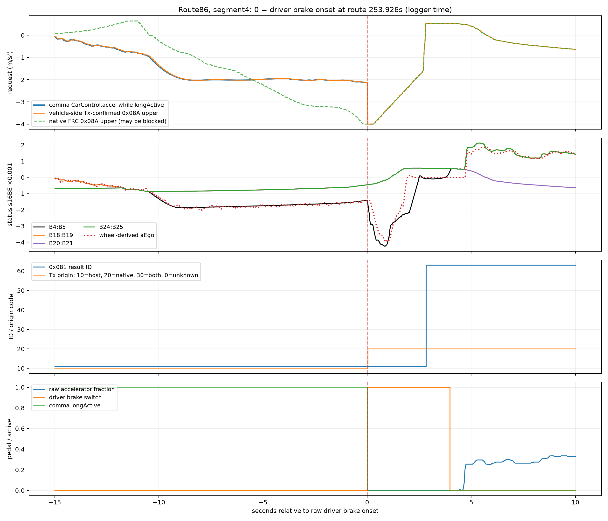
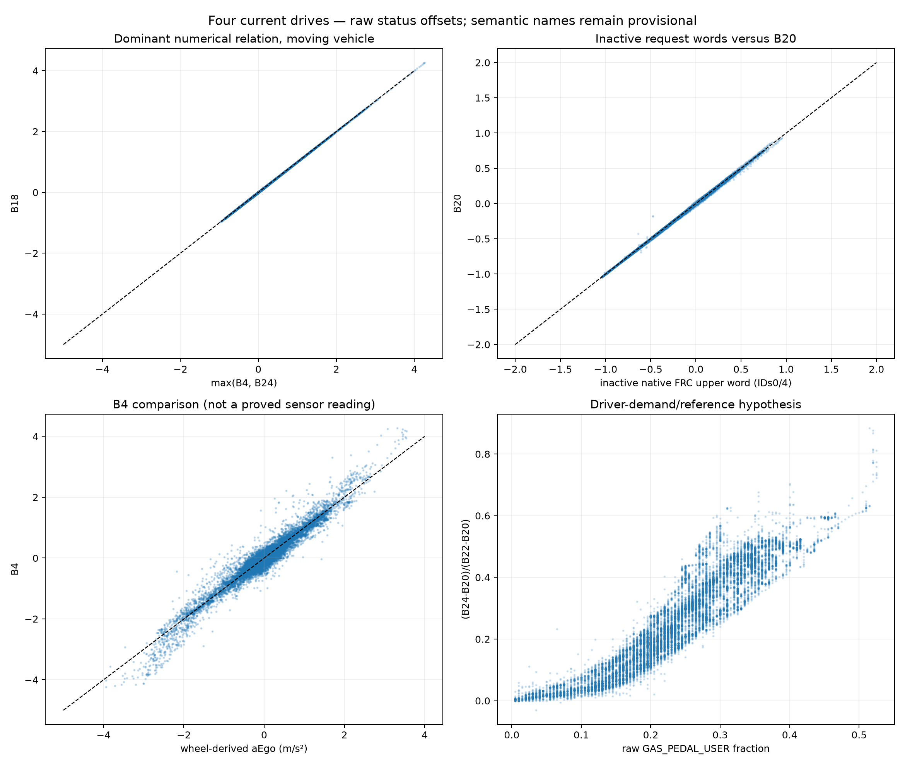

# 2026 Camry longitudinal evidence packet and status (WP4)

**Evidence scope:** the September-16 command-role correction, followed by
later dated request/result and archive-wide analyses. This is a wire-evidence
report, not a statement of the currently deployed sender. `0x160` is an
FRC-origin longitudinal/ego-state publication, not the demonstrated Camry
actuator ingress. The central request surface is `0x08A`: it carries the
FRC-submitted upper/lower longitudinal request packages plus the recovered lateral
request tuple. Brake-owned `0x081` publishes the downstream selected/employed result state.
The Camry `0x160` B4:B5+B12 encoder remains withdrawn.

The current architecture is more precise than the earlier shorthand
"FRC request -> Brake arbitration." Toyota Motor Corporation's
US20200070849A1 describes a generic vehicle-movement interface in which each
**request longitudinal ID is the identifier of an application**. A request
arbitration unit independently selects lower- and upper-limit longitudinal IF
packages from the applications; request-generation units then carry the
selected application IDs/accelerations toward the powertrain and brake
controllers. The powertrain additionally compares the selected application
request with the driver's accelerator request. The reported
`arbitration result_longitudinal ID` is the selected application's ID when the
application request is employed, or a distinct value that identifies a driver
request when the driver wins. The patent also defines the analogous lateral ID
as an application identifier. This is generic Toyota architecture, not by
itself a byte-level proof for F33, but it matches the recovered `0x08A/0x081`
behavior unusually closely.

That distinction explains the ID63 observation cleanly. On the Camry, FRC-origin
`0x08A` request slots carry IDs such as 0/4 and 11/17; **ID63 is not observed in
either request slot**. Brake/VMC-owned `0x081` can instead report ID63 after the
VMC compares the FRC-submitted bounds with driver demand. Toyota labels 63
`Driver Operation` on a P5 FRC diagnostic display surface, but that display does
not make 63 an FRC-origin request: dynamically it is result-side feedback from
the downstream VMC. The strongest current model is therefore **FRC-submitted
application request package(s) in `0x08A`, downstream arbitration/employed-source
feedback in `0x081`**.

The retained source document is local-only under
`REFERENCE/patents/toyota_vehicle_movement_arbitration_patent/US20200070849A1.pdf`
(`REFERENCE/` remains intentionally ignored). Public source:
<https://patents.google.com/patent/US20200070849A1/en>.

Transport, request semantics, physical publication/security ownership, and
actuator authority remain separate questions. Later source-direction evidence
places protected `0x08A` publication inside the FRC assembly, while the recovered
Toyota architecture places request arbitration downstream in the Brake/VMM
layer. The exact Brake code implementing that arbitration and the security/physical
handoff remain unresolved; the archive-wide unequal-bound census now strongly resolves
ordinary Camry A/B ordering as upper/lower.

**Request/result wire closure:** FRC normal-Tx suppression establishes `0x08A`
as the upstream TSS request/instruction plane; Brake owns `0x081` and continues
publishing it with request-loss supervision if the FRC request disappears. The
byte-level audit maps `0x08A B8:B9` to the ordinary-DRCC upper bound and
`B11:B12` to the lower bound at signed16 x0.001, and maps `0x081 B6[5:0]` as
the strongest `5284` employed-source-ID candidate. An early draft also read
`B20:B21` as the `57DB` result-acceleration candidate; the
[2026-09-30 VMC status corpus](#2026-09-30-vmc-status-corpus) corrects that:
`B20` is a closed-accelerator reference; `B4:B5` and `B18:B19` are candidate
combined and drive-side quantities, respectively. Neither is OEM-joined to `57DB`.
The [braking-ceiling comparison](#repeated-braking-ceiling-and-request-policy-candidate)
narrows the weak-braking behavior. `0x0CA` remains
protected longitudinal/chassis state but is no longer the primary result
interpretation. See `data/generated/camry_2026_longitudinal_request_plane.json`.

## September 16: command versus feedback audit

Inputs are both complete tracked August-27 CAN captures and seven original
rlog segments: September-11 combined trial `000000d4--327b2c4bb8`, segments
2–5, and September-4 stock routes `0000003b--62262eb7a1` segment 84 and
`0000003c--97b9e7a69a` segments 26–27. Selected original frames, publication
timestamps, source-file identities, and SHA-256 values are retained in
`tests/fixtures/camry_20260916_longitudinal_motion_audit.jsonl.gz`. No live vehicle access,
new sender, firmware change, or production port change is part of this audit.

The reducer is
`tools/targets/camry/analysis/analyze_camry_20260916_longitudinal_motion_audit.py`; its
portable result is `data/generated/camry_20260916_longitudinal_motion_audit.json`.

### B4:B5 is feedback-like on this Camry

The existing signed-15/0.001 interpretation closely reproduces a derivative of
independent `0x0AA` wheel speed. This is not a comparison against our own
controller request or against another presumed command field. At speeds above
2 m/s and with the native cruise-operating latch clear:

| Complete capture | Samples | Correlation with measured acceleration | Fitted measured/field slope | Intercept (m/s²) |
|---|---:|---:|---:|---:|
| August drive A | 7,032 | 0.971345 | 0.966845 | −0.000761 |
| August drive B | 9,822 | 0.988851 | 0.970301 | −0.002508 |

These figures compare the field against a 400-ms centered wheel-speed
derivative 100 ms earlier. The same-time correlations are also high:
0.965798 and 0.986154. The all-moving populations give 0.966444 and 0.986667
at the −100-ms shift. The cruise-active subset of drive A has little excitation
and a much weaker relationship (r=0.616232); do not hide it or claim universal
per-regime precision. Both complete PDU streams pass the recovered CRC:
20,510 and 23,998 frames.

The negative shift is consistent with estimated/filtered motion being
reported after the physical change. It is **not a measured ECU or actuator
latency**: CAN publication times and the derivative filter both contribute.
The analysis rejects invalid wheel samples, long interpolation gaps,
extrapolation, future cruise-state samples, and joins across source files.

The stock start transients are a separate discriminator. Using the first
mean-wheel speed above 0.1 m/s near each previously identified resume:

| Stock resume | First nonzero B4:B5 after motion | B4:B5 at +200 ms | Mean wheel speed at +200 ms |
|---|---:|---:|---:|
| `3b`, near 5122.256 s | 261.861 ms | 0 | 0.479 m/s |
| `3c`, near 9068.054 s | 222.947 ms | 0 | 0.472 m/s |
| `3c`, near 9147.517 s | 252.375 ms | 0 | 0.472 m/s |

An unconstrained acceleration-demand interpretation for this field does not
explain these stock starts: the vehicle is already accelerating while the fine
field remains zero. A measured-acceleration/estimated-motion role is the
stronger interpretation. This is a **bounded semantic classification**, not
recovery of an OEM field name or proof that the entire PDU is read-only.

### Independent chassis-state and ego-speed cross-check

A second reduction in the maintained motion-audit producer now checks the two
complete August captures against raw chassis messages, rather than relying
only on the wheel-speed derivative or the current port's signal names. Inputs
are already tracked; regeneration needs neither `REFERENCE/` nor `build/`.

| Cross-check | Drive A | Drive B |
|---|---:|---:|
| Fine B4:B5 vs native `0x13C` acceleration-like word, all samples: r | 0.979516 | 0.989355 |
| Same comparison, cruise off: r | 0.979857 | 0.988391 |
| Cruise-off median absolute difference (m/s²) | 0.005 | 0.013 |
| Packed speed vs valid raw wheels above 2 m/s: r | 0.999758 | 0.999936 |
| Speed median absolute difference (m/s) | 0.018750 | 0.020139 |
| Moving speed samples | 8,930 | 14,413 |

The packed speed candidate spans B7:B9. Its observed numerical encoding is
compatible with the existing Toyota wheel-speed representation; this is an
ego-speed match, not a new OEM name or command definition. Invalid wheel flags
are rejected. The acceleration comparison uses the preceding chassis sample
within 100 ms; speed uses the preceding wheel sample within 80 ms. Neither
joins across original source files or consumes a future sample at the queried
instant. The `0x13C` word remains described structurally; the independently
derived physical acceleration and stock-start evidence are what anchor its
measured-motion interpretation.

This substantially strengthens the **ego-state publication** interpretation
of the PDU. It does not prove all its other fields are telemetry, that only a
radar consumes it, or that changing reported state could have no indirect
control effect. In particular, our DBC name `TSS3_LONGITUDINAL_REQUEST` is a
project-assigned hypothesis, not Toyota evidence.

### B12 timing favors a return-derived quantity, but does not measure a path delay

A native-sample sweep, restricted to the stock cruise-operating intervals,
aligns B12 best with `0x0CA` **50 ms earlier in both complete drives**:
r=0.951994 and 0.989911. However, same-time r is already 0.951673 and 0.989495.
The peak is shallow. The separately reviewed fixed-25-ms-grid role reducer
places its maxima at -50/-75 ms; this sampling dependence is another reason
not to claim an exact 50-ms or 75-ms ECU delay or causal chain.

The supported statement is narrower: the data does not show B12 uniquely
leading the result-like chassis channel. The three stock starts and the
intact-native comparator below provide more discriminating evidence than the
lag maximum alone. A state export derived from an already selected result, or
parallel outputs of a common internal calculation, both remain compatible.
There is no established byte-copy from a different FRC command.

The follow-up independently re-extracted the 28-source role-audit fixture
from the original rlogs: **306,073 publication events** reproduce byte-for-byte
(SHA-256 `c15b4e9544fc73624fe8aff09c2f40cda8196039de4eb83cee038605f37c2833`).
The companion role audit below was completed separately during this review.
The maintained motion-audit producer and its seven-source fixture independently
own the core physical-motion, native-comparator, resume, and direction checks;
the new cross-checks above use the already tracked full August captures.

### Combined replacement does not establish host influence

All **1,249** host frames can be paired to a CRC-valid preceding camera frame
with the **same B2 counter** in the same original source file. Source ages are
1.619–2.733 ms (median 1.879 ms). This is a local time-bounded match, not a
whole-route dictionary indexed by an 8-bit wrapping counter. All 1,249 have a
byte-identical returned Panda TX within 3.892–21.305 ms. Thus this audit is not
mistaking a host send request for proof that the frame was actually transmitted.
The returned TX still does **not** acknowledge receiver acceptance.

B4:B5 differs from its native source in 1,243 frames; B12 differs in 970.
Comparing the result-like `0x0CA B7:B8` with the intact source and replacement:

| `0x0CA` observation time relative to host | Intact native B12 correlation | Replacement B12 correlation |
|---|---:|---:|
| −100 ms | 0.932004 | 0.671457 |
| Nearest time | 0.930230 | 0.700465 |
| +100 ms | 0.923148 | 0.727055 |

Correlations use the historical `−0.1 × signed7(B12)` convention to align the
sign. The assumed magnitude is not a newly proved actuation scale. Restricting
to the **970 frames where the two B12 values actually disagree** preserves the
result: at nearest time native r=0.926554 versus host r=0.696919.

The native quantity is still the better predictor, including of a result
published before the host frame. Closed-loop co-movement can explain the
previously quoted host/result correlation without the modified field causing
it. This does **not** prove an effect is exactly zero; it invalidates that
correlation as independent evidence of acceptance, and it invalidates "DRCC
clamping" as an established explanation. The preceding cruise mode is
conventional-active `0x90` for 1,247 frames and conventional-available `0x88`
for two transition frames. Healthy adaptive-mode behavior is not represented.

### B12-before-motion is not B12-before-the-native-output

At 500 ms before the wheel-defined motion onsets, the three `0x0CA` result-like
values are already **+0.453, +0.335, and +0.516 m/s²**, while B12 remains at its
preceding baseline (+0.1, −0.1, and 0 under the historical comparison convention)
and B4:B5 remains zero. B12 changes later but still before wheel motion.
The complete neighborhoods, not only threshold-crossing timestamps, are in the
result artifact. Different quantization/filtering and parallel calculations
prevent treating this temporal order as a unique internal dataflow proof.
Nevertheless, "B12 changes before the car moves" cannot identify it as the
upstream command: an export of an already selected native acceleration can do
that too.

The three stock segments also directly separate native traffic from Panda
returns: `0x0CA` has **7,641 native bus0 frames and 7,641 returned bus2 TXs
(src=130)**, with no native bus2 copy. It is a chassis-to-camera publication on
the temporary repin, not a proven FRC-origin acceleration request. In these
same captures `0x160` is native on bus1. On the restored stock harness, the
camera link is the split bus2→bus0 pair and `0x0CA` is on unsplit bus1.
Toyota network numbers and Panda indices must not be mixed across harnesses.
The exact chassis ECU that publishes `0x0CA` remains unassigned here.

### What GTS and the source inventory do—and do not—establish

Direct reads of the retained `FRC_P5.ddb` expose both estimated motion and
request/output vocabulary. DID `0x1253` names **Estimate Vehicle Acceleration**.
DID `0x1B08` contains **Driver Acceleration for Output**, **Acceleration Limit
for Output**, and **Acceleration for Output**. Those names are diagnostic
observables, not an assignment to a particular byte of `0x160`.

The previously proposed `0x1B03..0x1B07` join is specifically an **ISA**
upper-limit/permission surface. It must not be described as a proved generic
DRCC demand decoder. Brake `0x10A1..0x10A4` and the TSS operation-FFD request
and arbitration records provide additional semantic candidates, but no retained
synchronized sample or receiver implementation binds them to these CAN fields.

The September-1 source-isolation notebook supports FRC normal-Tx ownership of
`0x160`; it does not prove every quantity in an FRC transmission is a request.
The `0x0C9` member of the same recorded source group was also checked rather
than promoted by ID adjacency: in the two August captures its only changing
application word is B12:B13, with zero header/counter/trailer. It is **not** a
SecOC-shaped alternative command in those captures. No alternate FRC command
is identified by this audit.

**Implementation consequence:** keep the Camry alpha encoder explicitly
unqualified. Do not call its current fine/coarse field writes production-ready,
rename them as OEM demand signals, remove the intact native comparator from
future analyses, or replace this hypothesis with a speculative different
sender. A mixed-role PDU or a mode-dependent request remains possible. The
available data supports exported/feedback-like quantities more strongly than
it supports the claimed direct control path, but does not prove `0x160` can
never carry a usable command on this or another Toyota.

Reproduce without `REFERENCE/`, `build/`, original September rlogs, or a car:

```bash
uv run --locked python -m tools.targets.camry.analysis.analyze_camry_20260916_longitudinal_motion_audit
tools/test camry_20260916_longitudinal_motion_audit
```

The optional `--extract-fixture` path rereads the seven external originals using
an existing openpilot Python environment; it does not call vehicle tooling.


### Independent original-source recheck and the meaning of "echo"

The follow-up review reread the **28 original rlogs** selected by the expanded
local role analysis: September-11 `d1` segments 3–6 and 9–12, `d4` segments 0–6,
historical relay-direction route `2d` segments 0–5, September-4 `3b` segments
83–85, and `3c` segments 25–28. The last two groups retain the declared
four-second neighborhoods around the three stock-resume landmarks. This is a
selection of source files/windows, not a claim to have reviewed every Camry
route or every message in those files.

Re-extraction produced **306,073 original publication events** and was
byte-identical to the existing expanded local fixture
`tests/fixtures/camry_2026_longitudinal_role.jsonl.gz`
(SHA-256 `c15b4e9544fc73624fe8aff09c2f40cda8196039de4eb83cee038605f37c2833`).
Both `tools/test camry_20260916_longitudinal_motion_audit` and the existing
worktree suite `tools/test camry_2026_longitudinal_role` passed. The expanded
role files were already pending at the start of this review and were not
staged or altered; the committed seven-source motion audit above remains the
portable source for its reported conclusions.

The expanded comparison supplies useful independent corroboration: native
B4:B5 agrees with the chassis `0x13C` signed-15 numerical channel in both August
captures (r=0.979516/0.989355; median absolute difference 0.006/0.014 m/s²), and
a separate packed speed candidate in `0x160` agrees with raw wheel speed
(r=0.999789/0.999942). These are numerical/behavioral matches, **not** OEM
signal-name assignments or proof of a byte-for-byte forwarding operation.
The wheel-derivative audit and stock starts remain important because merely
matching a second presumed command would not resolve the original question.

The disposition must distinguish four claims:

- **FRC-origin publication:** supported by source isolation and camera-side
  observations. Sender identity alone says nothing about request authority.
- **Fine acceleration field:** motion/feedback-like on the captured Camry;
  treating B4:B5 as a demonstrated independent acceleration demand is not
  supported.
- **B12:** related to a native longitudinal result that can precede physical
  motion. Its best native alignment follows `0x0CA`, and the untouched native
  comparator outperforms the replacement during the combined trial. This
  favors an exported state/result interpretation, but does not recover the
  exact consumer or exclude mode-dependent use.
- **Entire PDU / alternative command:** neither "all 32 bytes are telemetry"
  nor "a byte-exact echo of another FRC command" is established. A mixed-role
  PDU is still possible. No replacement longitudinal command is identified by
  this review, and `0x0CA` must not silently be promoted to that role either.

The leading working model is an FRC publication of ego-motion and
longitudinal-state information onto the ADAS link, potentially for other
perception participants. The recipient and internal transformation remain
unrecovered. Even an observed vehicle response to altered state information
would not, by itself, establish a proper acceleration-demand interface.

This follow-up changed the review only. No vehicle interaction, sender,
controller, Panda rule, firmware, or experimental-mode default was changed.
`REFERENCE/` and `build/` remain ignored and were not staged.

## Expanded passive review: physical source is not control authority

The pending role audit was independently re-extracted from **28 original rlog
segments**. Its **306,073 retained publication events** reproduce the existing
fixture byte-for-byte (SHA-256
`c15b4e9544fc73624fe8aff09c2f40cda8196039de4eb83cee038605f37c2833`). Both complete
August captures were then reprocessed independently of those September logs.
The expanded evidence lives in:

- `tools/targets/camry/extract/extract_camry_2026_longitudinal_role.py`
- `tools/targets/camry/analysis/analyze_camry_2026_longitudinal_role.py`
- `tests/fixtures/camry_2026_longitudinal_role.jsonl.gz`
- `data/generated/camry_2026_longitudinal_role.json`

**Working diagnosis:** the examined Camry fields fit an FRC publication of ego
motion and selected longitudinal state better than a direct independent
acceleration-demand interface. A perception/radar-side state report is the
leading architectural interpretation, **not a recovered receiver contract**.
Neither "every field is telemetry" nor "the packet can never influence control"
follows. It is also not established that this is an exact echo of some other
FRC-origin command: the correlated `0x0CA` channel travels from the chassis
side toward the camera on the historical split.

### Independent ego-state comparisons

With no additional unit fit, the fine field agrees with the acceleration-like
quantity in chassis `0x13C`: all-sample correlations **0.979516 / 0.989355**, with
median absolute differences **0.006 / 0.014 m/s²** in August A/B. This names the
observed chassis channel, **not its physical ECU owner or an OEM signal**. The
independent wheel derivative and cruise-off moving results above avoid circularly
validating one presumed command against another presumed command.

A separate packed speed-like field in `0x160` follows mean wheel speed with
correlations **0.999789 / 0.999942** and median absolute differences about
**0.019 / 0.020 m/s**, above the declared low-speed cut. The selected packet
therefore contains ego-state information, not merely an acceleration-shaped
number. Its validity/sentinel semantics and every other field remain unmapped.
Invalid wheel flags are excluded rather than interpreted as zero speed.

In the restored-harness d1/d4 captures, with cruise disengaged and speed above
2 m/s, the fine field also agrees with the independently wheel-derived
`carState.aEgo`: **r=0.970690 / 0.957737**, using **6,096 / 6,503** samples.

### B12 timing is consistent with a report, but is not a causal clock

The complete native sweeps align B12 best with `0x0CA` **50 / 75 ms earlier**.
However, the level-correlation gain over zero lag is only
**0.000258 / 0.000472**; correlations of 200-ms changes peak at just
**0.185 / 0.455**. The peaks are broad, the series autocorrelated, and rlog
publication timestamps are shared by a CAN batch. Do not turn the maximizing
lag into an exact gateway delay or proof of an internal dataflow edge.

The actual start neighborhoods are more useful. Relative to the first three
consecutive raw-wheel samples above 0.025 m/s:

| Stock resume | `0x0CA` result-like field persistently >0.5 m/s² | Fine field persistently >0.05 m/s² |
|---|---:|---:|
| 3b / 5122.256 s neighborhood | −441 ms | +272 ms |
| 3c / 9068.054 s neighborhood | −372 ms | +263 ms |
| 3c / 9147.517 s neighborhood | −482 ms | +262 ms |

These definitions differ from the 0.1 m/s onset / first-nonzero-field table
above; they are not contradictory estimates. No gas, brake, RES, SET, or CANCEL
assertion is present in the declared −1.0 to +0.5 s windows. At the −500-ms
landmarks, `0x0CA` is already positive while B12 is still at its preceding
baseline. **B12 preceding wheel motion is not evidence that it precedes the
native longitudinal decision.** Different resolutions and filtering still
prevent an exact copy/transform claim.

### Actual replacements and the native comparator

The expanded d1 selection contains **10,259** host frames, **10,228** changed
fine fields, and no B12 modifications. The d4 selection contains **1,249** host
frames, **1,243** changed fine fields, and **970** changed B12 fields. Every host
frame has a source/time/counter-matched native template and valid CRC; d4 has
**1,249/1,249** exact returned TX payloads. All changed bytes are confined to the
historical encoder's declared fields and CRC. These establish transport only.

At a common 25-ms grid during d4 replacement, native B12 versus the `0x0CA`
result-like channel has **r=0.931904**, while replacement B12 has **r=0.699657**
(**1,244** observations). All 1,244 have a preceding conventional-active `0x90`
mode observation within 1.5 s. The age bound reflects the slow mode message;
unknown-mode observations remain explicitly counted instead of silently labeled.
No healthy adaptive-mode acceptance claim follows from this trial.

The host and stock controllers share a moving scene, and the camera continues
to observe the car while its ADAS-side output is being replaced. Either closed
loop can correlate with the same motion. The better intact-source fit defeats
the previous correlation-only proof of host authority; it does not prove zero
possible influence or identify a particular acceptance gate.

### Source ownership, vocabulary, and remaining information boundary

The September-1 notebook §19 records `0x160` **40 → 0 → 40** under FRC normal-Tx
suppression/restoration on the observed ADAS network. This supports the FRC
publication source, not a propulsion/brake destination. The full six-segment
historical relay capture has `0x0CA` **13,756 native bus-0 RXs** and **13,256
returned bus-2 TXs**, versus only 503 startup/native bus-2 observations. FRC-side
`0x08A` has the opposite dominant direction. On the restored stock harness,
`0x160` is the camera-side ADAS source and `0x0CA` remains on the unsplit chassis
network. Panda bus indices are not Toyota network numbers.

Direct GTS DDB queries reproduce `FRC_P5` DID `0x1253` (estimated acceleration)
and `0x1B08` (separate driver, limit and output accelerations). `0x1B03..0x1B07`
are ISA-specific request/permission observables, not a generic decoded DRCC
request. Brake `0x10A1..0x10A4` name TSS requests, but no retained synchronized
CAN/DID sample assigns these names to B4:B5 or B12. The current checked-in
firmware inventory contains EPS applications, not the relevant Camry
longitudinal producer/receiver implementation. EPS receive behavior cannot fill
that provenance gap. The candidate re-rank below identifies a protected
chassis-facing request carrier, but not yet the preferred upstream replacement
carrier.

### Longitudinal candidate re-rank after topology normalization

The earlier search mixed three harness eras too easily. Raw Panda bus numbers are
therefore normalized to Toyota network role before any candidate is compared:

| Capture era | Panda CAN0/CAN2 relay pair | Panda bus 1 | Longitudinal interpretation |
|---|---|---|---|
| Stock Toyota-B before the temporary repin | Toyota Bus 1 camera/ADAS: source side bus2 -> downstream bus0 | Toyota Bus 4 Brake/EPS/chassis, unsplit | Same physical wiring as the restored configuration below; direct-Panda ELM327 mux state is a separate axis |
| Temporary CAN0/CAN1 repin (Aug-27 through lateral development) | **Toyota Bus 4**: upstream `0x08A/0x0C9` on bus2 -> chassis bus0; `0x0CA` returns bus0 -> bus2 | **Toyota Bus 1** camera/radar/FRC P05 family | Healthy Sep-4 DRCC routes `3b/3c` are in this era |
| Stock Toyota-B restored in the Sep-11 integration cleanup | **Toyota Bus 1** camera/ADAS: FRC `0x020/0x160/0x230/0x440` source bus2 -> downstream bus0 | **Toyota Bus 4** request/result/chassis family `0x08A/0x0C9/0x0CA`, unsplit | Current production-shaped topology |

`harnessStatus=flipped` means harness/cable orientation, **not** the physical
CAN0/CAN1 repin. Likewise Panda sources 128/130 are returned host-TX echoes, not
additional ECU transmitters. The regenerated stock-topology artifact checks all
seven request/result candidate IDs explicitly rather than inferring this mapping
from unrelated state messages.

With that normalization, protected Bus-4 **`0x08A` is the strongest direct
chassis-facing longitudinal candidate**. It was already recovered as a
multi-function TSS request/state PDU carrying Target Lateral ID and target
steering angle. The complete August captures add a second, independent shape:

- B8:B9 and B11:B12 are signed16 words and are **identical in 44,617/44,617
  source-side frames** across the two complete drives;
- their raw ranges are -1146..+995 and -1102..+1070, naturally giving
  -1.146..+0.995 and -1.102..+1.070 m/s² at 0.001 m/s²/count;
- the prior complete-capture census independently bounded these words away from
  simple measured-motion/steering interpretations: all four joins against
  wheel-derived acceleration, steering angle, driver torque, and target-angle
  rate have `|r| <= 0.0967`;
- in all three no-driver-input Sep-4 stock resumes, the B8/B11 value is already
  positive **500 ms before wheel motion** (+0.350, +0.277, +0.391 m/s²) and has
  risen to +0.828/+0.605/+0.590 m/s² at the wheel-defined onset. The duplicated
  words remain equal throughout these retained neighborhoods.

Toyota's own GTS surface supplies an unusually exact semantic template. Current
P5 Brake/Booster/EPB dictionaries expose `0x10A1` **Request Acceleration of
Upper Limit from Toyota Safety Sense** and `0x10A2` **...Lower Limit...**, both
signed16 at 0.001 m/s², plus 6-bit upper/lower request IDs (`0x10A3/0x10A4`) explicitly occupying bits7:2.
That geometry gives a new structural join: `0x08A B6` and `B7` each split exactly
as a six-bit request-ID candidate in bits7:2 plus a two-bit 0..3 allocation-method
candidate in bits1:0. Active Camry cruise uses `(ID11, allocation1)` and
`(ID17, allocation3)`; the Brake-side selected result is overwhelmingly ID11.
The FRC-hosted PCS Operation-FFD recorder independently contains record `5280`
"TSS required acceleration (lower limit)" and `5281` "TSS request acceleration
(upper limit)", again signed16 at 0.001 m/s², as well as longitudinal IDs,
braking/driving-force allocation, and arbitration-result records.

The original two-drive result did **not** resolve upper-versus-lower ordering because
B8:B9 == B11:B12 in all 44,617 frames in that selected corpus. A 2026-09-22
archive-wide raw-log census supersedes that limitation. Scanning every recoverable
`rlog.zst` / `*.rlog.zst` under `~/dev/inspect/logs` with `LogReader`, and retaining
native-RX `0x08A/32` observations (`src < 128`), yields **1,505,266 observations from
605 rlogs**. Only 48 have unequal B8:B9/B11:B12 values, but 12 of those are the
ordinary Camry DRCC tuple `(ID11,allocation1)/(ID17,allocation3)`, spread across six
independent route segments as two-frame episodes. Their `(B8:B9, B11:B12)` values in
m/s² are `(+0.682,-0.769)`, `(+0.687,-0.437)`, `(+0.217,-0.442)`,
`(+0.432,-0.659)`, `(+0.215,-0.452)`, and `(-0.621,-0.701)`: **A > B in 12/12
ordinary-DRCC unequal frames**. The first five episodes occur immediately before the
request drops to idle `0/4`; the sixth occurs on an idle->active transition. This is
strong dynamic evidence that, for the ordinary `11/17` DRCC package, **B8:B9 is the
upper acceleration bound and B11:B12 is the lower acceleration bound**, with B6/ID11
paired to the upper slot and B7/ID17 paired to the lower slot.

The other 36 unequal observations are one distinct route-45 intervention family with
request IDs `13/20`, B5=`0x04`, B8:B9 sweeping `-0.175..-0.500 m/s²`, and B11:B12
held at zero. That tuple is structurally different from ordinary DRCC and must not be
used to invert the `11/17` ordering; its exact application semantics remain unnamed.
This still stops short of a synchronized literal DID-to-byte proof for `0x10A1..0x10A4`,
but the ordinary-DRCC A/B upper/lower ordering is no longer open.

The alternatives now rank as follows:

1. **Protected `0x08A` B8:B9/B11:B12** — strongest direct downstream TSS
   acceleration-request candidate.
2. **Protected `0x5AF` B26** — a coarse longitudinal companion, not a
   replacement for the `0x08A` magnitude. Interpreting B26 as signed 6-bit gives
   a reproducible fit of **0.251/0.246 m/s² per count** against the `0x08A`
   request word (r=0.756/0.857), but its best alignment is **50/75 ms after**
   `0x08A`. Around the three stock resumes it steps through small signed values
   as the fine request rises. Low-rate `0x5F7` B7 shows a similar coarse family
   (raw signed6 values are multiples of four; fitted scale is ~0.062 per raw
   count, i.e. ~0.25 per four-count step) and likewise does not lead `0x08A`.
   These are better treated as quantized request/result/status companions than
   as the originating acceleration command; no OEM field name is assigned.
3. **`0x0C9`** — upstream-to-chassis and therefore directionally plausible as
   sideband/request metadata, but B12:B13 correlates only weakly with `0x0CA`
   (best |r| 0.265/0.140 in the two complete drives) and remains `0x1838`
   through the early portion of all three stock-resume ramps. It is not the
   leading acceleration-magnitude carrier.
4. **`0x0CA`** — other protected longitudinal/chassis state in the wrong
   direction for an FRC request. The newer `0x081` request/result audit supersedes
   the old B3:B4/B5:B6/B7:B8 arbitration-result interpretation.

The direct FRC Toyota-Bus-1 P05 candidates `0x020/0x160/0x230/0x440` were also
screened against the protected `0x08A` request word using every byte-aligned
8/16/24/32-bit signed/unsigned BE/LE field and +/-300 ms lags. `0x020`, `0x230`,
and `0x440` have **no** same-sign field reproducing at |r| >= 0.25 in both
complete drives. `0x160` has moderate state-related correlations (best
min-|r| 0.631), but those maximize at the **+300 ms search boundary** and overlap
its already recovered ego-state structure.

A second screen covers all **47 recurring protected Bus-4 PDUs** that vanished
under the Sep-1 FRC CommunicationControl normal-Tx suppression. `0x08A` itself
is excluded as the reference. Every byte-aligned signed16-BE field plus
signed-low6 fields is compared in both complete drives. This recovers the
coarse `0x5AF`/`0x5F7` companions above, but **no second same-scale signed16
acceleration carrier**. Thus there is no second same-scale request magnitude hiding in the
observed FRC-dependent protected domain. This does **not** mean a different semantic
request must exist before `0x08A`: the retained CommunicationControl experiment
already establishes `0x08A` as the upstream TSS request-side plane. A proxy or
signer may physically publish the protected Bus-4 PDU, but that is a
transport/cryptographic ownership question, not a second request layer.

This distinction matters for the port. On the temporary repin, `0x08A` sat on
the intercept pair and its source side was observable separately. On final
stock Toyota-B it sits on **unsplit Panda bus1 with the stock sender and chassis
consumer together**. Therefore "just transmit modified `0x08A`" is not a clean
production replacement strategy even if its acceleration fields are fully
recovered. The remaining integration problem is therefore **source suppression /
sole-emitter ownership for the already-recovered `0x08A` request plane**. If a
separate FRC-to-signer publication handoff exists, recovering it would solve that
physical ownership problem; it would not reveal a different semantic request.
Do not return to the disproved Camry `0x160` B4:B5+B12 encoder.

`0x08A` should also not be described as *all* authoritative TSS3 FRC egress.
It is the central observed continuous request PDU and already carries the full
recovered lateral request family plus the strongest longitudinal acceleration
request candidates. Toyota's FRC-hosted recorder also exposes upper/lower
longitudinal request IDs, braking/driving-force allocation, shift/EPB,
override/priority and other request metadata whose exact wire locations are not
all mapped. Ordinary FRC state/display/ego-motion publications (`0x020`,
`0x160`, `0x230`, `0x440`, `0x371`, `0x412`, etc.) also exist outside `0x08A`.
The bounded claim is **central control-request plane**, not exhaustive FRC output.


### Request/result recorder layout: what is actually mapped

Toyota's architecture changes the meaning of the longitudinal pair. The lower and
upper packages are independently arbitrated **bounds** on allowed acceleration, not
two redundant acceleration commands. The downstream powertrain compares driver demand
with those bounds and clips it into the selected range; the longitudinal result ID then
reports the request source whose acceleration was actually employed. This explains why
result ID63 (`Driver Operation`) can appear while neither `0x08A` bound-package ID is
63. Equality of the two retained acceleration words means the observed bounds collapse
to the same value in those states, or that a remaining wire/order assumption needs
refinement; it must not be described as intentional duplication by design.

GTS independently preserves the request-generation boundary described by Toyota.
Brake-domain P5/P6 databases expose `0x10A1..0x10A4` as upper/lower requests **from
Toyota Safety Sense**, then separately expose `0x10A5..0x10AA` as upper/lower target
acceleration, target ID, and target driving force **from Vehicle Motion Control**. That
is the diagnostic equivalent of application request -> arbitration/request generation
-> controller target.

The recorder schema and wire evidence now line up as follows. "Strong candidate"
means the width/scale, topology, and dynamic arbitration behavior match, but no
synchronized diagnostic/FFD value directly names that wire field.

| Toyota recorder quantity | Wire disposition | Evidence status |
|---|---|---|
| `5280` lower longitudinal request ID | `0x08A B7[7:2]` | strongly resolved for ordinary Camry DRCC by unequal-bound census |
| `5280` lower acceleration | `0x08A B11:B12`, s16 x0.001 m/s² | strongly resolved for ordinary Camry DRCC |
| `5280` force distribution | `B7[1:0]` | strong structural join; 0..3 exactly matches Toyota allocation enum |
| `5280` shift / EPB / override / priority | unresolved | complete-drive byte census does not justify an OEM-name assignment |
| `5281` upper longitudinal request ID | `0x08A B6[7:2]` | strongly resolved for ordinary Camry DRCC by unequal-bound census |
| `5281` upper acceleration | `0x08A B8:B9`, s16 x0.001 m/s² | strongly resolved for ordinary Camry DRCC |
| `5281` upper force distribution | `B6[1:0]` | strong structural join; synchronized DID oracle still absent |
| `5282` lateral request ID | `0x08A B21[5:0]` | recovered |
| `5282` requested pinion angle | `0x08A B18:B19` | recovered; controller scale is 0.00100012 rad/count versus recorder 0.001 |
| `5282` steering assist gain | `0x08A B24` x0.01 | strong structural join |
| `5282` damping gain | `0x08A B25` x0.01 | bounded; zero in both complete drives |
| `5284` arbitration-result longitudinal ID | `0x081 B6[5:0]` | strong candidate; observed values 11 and 63 |
| `5285` arbitration-result lateral ID | `0x081 B13[5:0]` | recovered |
| `57D3` acceleration-valid flag | unresolved | `0x081 B11[4]` is proven request-loss supervision, but is not OEM-joined to `57D3` |
| `57DB` arbitration-result acceleration | no confirmed wire join | `B20:B21` is a closed-accelerator reference candidate; `B4:B5` and `B18:B19` are candidate combined and drive-side quantities. Their distinction matters under braking; neither has a synchronized diagnostic join to `57DB` ([status reconstruction](#message-structure-and-drivebrake-decomposition)) |
| `57DE` arbitration-result pinion angle | `0x081 B16:B17` | recovered |

The packed-ID interpretation has an independent arbitration check. In the same
pairs, selected `0x081` result ID11 equals `0x08A B6[7:2]` in **1,525/1,529**
Drive-A and **3,276/3,281** Drive-B ID11 samples; it never equals the B7 candidate.
Every selected ID63 sample (**15,544 / 16,718**) has ID63 absent from both FRC
request A/B fields. Toyota's P5 FRC diagnostic display vocabulary includes
`63 = Driver Operation`, and Toyota's movement-control patent explicitly allows
the **result** longitudinal ID to carry a driver discriminator when driver demand
is employed. Thus 63 is evidence for Brake/VMC result feedback to the FRC, not an
FRC requester. This also strongly supports B6/B7 as packed FRC-submitted
application-ID/allocation bytes rather than generic ACC-state bytes.

The retained delayed-stop corpus gives a second dynamic check and supersedes the
old raw-byte `ACC_STATE` description. Ordinary active cruise is
`B6/B7=0x2D/0x47`, which decodes to request A `(ID11, allocation1)` and request B
`(ID17, allocation3)`. Accelerator override produces `0x2C/0x46`, preserving IDs
11/17 while changing allocation methods to 0/2. The three delayed hold episodes
contain **198** frames of `0x2D/0x67` or `0x2C/0x66`: request B changes to ID25
while the same allocation 3/2 distinction remains. Independently, `0x08A B4[5]`
is set on **198/198** of those delayed-hold frames and clear on every other native
`0x08A` frame in the complete `3b/3c` routes (zero XOR violations). A moving
retained `B7=0x65` is ID25/allocation1 with B4[5] clear, proving ID25 alone is not
a standstill flag. Camry runtime therefore uses the source-real B4[5] structural
hold state; the ID25/allocation2-or-3 tuple is its independent request-state
corroboration. The exact OEM recorder name for B4[5] remains unknown.

### Longitudinal request IDs versus result-source IDs

Do not flatten the FRC request IDs and Brake/VMC result IDs into one wire namespace.
`0x08A` carries **FRC-origin application request IDs** for the upper/lower bound
packages. `0x081` carries the downstream **employed-source result ID**; that result
can identify the driver even though no FRC request used that number. The numeric
values are identities, not priorities or ECU addresses. The current Toyota corpus
does not contain one complete longitudinal 0..63 request enum analogous to EMPS
`Target Lateral ID`. A six-region sweep
of current GTS+ and Techstream V18 (NA/EU/JP; 3,207 DDB files total) found the
same sparse named anchors but no hidden complete `5280/5281/5284`, `0x1284`, or
P6 longitudinal-arbitration value dictionary. The tracked request-plane producer
now extracts the relevant labels directly from Toyota DDBs rather than hard-coding
them.

The working namespace is:

| ID | Longitudinal evidence | Lateral comparison | Current disposition |
|---:|---|---|---|
| **0** | P5 FRC ISA Vertical ID names `No Request`; Camry request A uses 0 while idle | `No Request (Manual Operation)` | common no-request anchor |
| **4** | Camry/Corolla default lower-bound request slot in manual `0/4`; Camry scalar is positive creep-like at very low speed, declines through zero into coast/decel with speed, and falls on 9/9 matched low-speed brake presses | LDA | **strong closed-accelerator/manual baseline lower-bound attribution**; exact longitudinal OEM application name unknown, and lateral `LDA` label must not be copied |
| **9** | P6 Speed Limiter Requesting Vertical ID explicitly names `ISA` | no generation-20 lateral label | named cross-generation longitudinal/vertical anchor; not observed on Camry `0x08A` |
| **11** | Camry request A during ordinary DRCC; `0x081` result ID11 when that application request is employed | LTA/LCA | **strong shared-TSS-application-ID hypothesis**, not yet an OEM longitudinal enum name |
| **17** | Camry active request B; retained 2025 Corolla active request A | no lateral label | repeatable cross-platform active longitudinal requester; OEM name unknown |
| **18** | not observed in Camry longitudinal A/B | SDG; P6 PDA-SA lateral request also uses 18 | lateral-only named anchor; no longitudinal transfer |
| **23** | retained 2025 Corolla active request B | no lateral label | observed longitudinal requester; OEM name unknown |
| **25** | Camry delayed ACC-hold request B (with allocation state distinguishing held/moving use) | AP | unresolved application identity; no longer treated as a namespace counterexample |
| **36** | 33-frame (~0.79 s) Camry startup-only request-B state; zero request acceleration; result stays 63 | no lateral label | startup/initialization requester; OEM name unknown |
| **41** | P6 MaaS lower-limit longitudinal ID = `Request 1 of MaaS Autonomous Driving System` | AD (Lv.4) | plausible shared automated-driving application identity |
| **45** | P6 MaaS lower-limit longitudinal ID = `Request 2 of MaaS Autonomous Driving System` | DES (Lv.4) | plausible shared automated-driving application identity |

**Result-side-only observation:** longitudinal ID63 is OEM-labeled `Driver Operation`
on a P5 FRC diagnostic display surface and is observed in Brake/VMC-owned `0x081`.
It is absent from both FRC-origin `0x08A` request slots in the retained Camry and
Corolla evidence, so it must not be listed as an observed FRC longitudinal requester.

The idle `0/4` state is now dynamically much better constrained. In both complete
Camry drives, after excluding request/result transition neighborhoods, **every stable
FRC `0/4` request pairs with Brake/VMC longitudinal result ID63**: 18,608/18,608
Drive-A and 19,441/19,441 Drive-B. The same is true while moving above 1 m/s
(7,713/7,713 and 10,563/10,563). This is exactly the expected architecture:
FRC contributes upper/lower application bounds while VMC reports `63=Driver Operation`
when the driver's longitudinal request is the value actually employed.

ID4's lower-bound magnitude is also not an inert idle constant. Restricting the two
complete drives to FRC `0/4`, accelerator=0, D, and matched brake-pedal **press** edges
below 1 m/s, all **9/9** events reduce B11:B12, the ID4 lower-bound acceleration:
Drive-A 4/4 (median change -0.0295 m/s²) and Drive-B 5/5 (median -0.036 m/s²), with
combined changes spanning -0.071..-0.0265 m/s². With the brake released, the same
low-speed D/no-accelerator lower bound is positive and falls with speed (for example,
Drive-B medians +0.468 m/s² below 0.15 m/s, +0.277 at 0.15..0.5 m/s, +0.202 at
0.5..1.0 m/s). This is behaviorally consistent with a minimum-drive/creep-related
lower-bound application whose request is cut when the driver brakes. It remains a
**hypothesis about ID4's application identity**, because no Toyota longitudinal enum
currently names value 4.

Toyota's patent record makes the broader attribution substantially stronger than
`ID4 = creep`. `US20200070849A1` defines the lower longitudinal package as the
**minimum acceleration requested by an application**, separately reports the powertrain's
**full-closed estimated ground acceleration**, and has the powertrain compare driver
demand against the selected application bounds. Toyota's closely contemporary
`US20200094835A1 / US11285952B2` then describes the physical powertrain **lower limit
of availability** as the fully-closed/throttle-off baseline: it can be negative from
engine braking at speed, but below roughly 8--10 km/h creep torque becomes dominant and
drives that lower limit positive. Older Toyota `JP5195257B2` independently describes
accelerator-off creep torque and creep-cut control under brake demand.

That is almost exactly the shape seen on ID4. The best current semantic attribution is
therefore **closed-accelerator/manual baseline lower-bound application**: its low-speed
positive portion is creep, while its higher-speed negative portion is the coast/regen/
engine-braking side of the same no-pedal baseline envelope. The patents do **not**
identify numeric value 4, and the current 3,207-DDB sweep contains no longitudinal
request/result enum assigning a name to value 4, so this remains a strong behavioral
attribution rather than an OEM enum recovery.

Toyota's architecture materially strengthens the ID11 observation: it defines both
the longitudinal request ID and the lateral request ID as the **identifier of an
application**. The leading model is therefore a coordinated/shared application-ID
namespace, not two unrelated numeric enums. Camry ID11 is the ordinary DRCC
longitudinal application source while generation-20 lateral ID11 is LTA/LCA, making
ID11 a strong TSS continuous-driving application-identity candidate. This is still not
an OEM label assignment for the longitudinal field: the static corpus does not publish
the complete longitudinal value dictionary. ID25 and P6 41/45 are retained as semantic
clues, not counterexamples—axis-local labels can describe different control roles of
the same application.

Toyota also exposes feature-specific longitudinal-ID recorder fields that can
supply future direct joins: `5271` **IFU request vertical ID (lower limit)**,
`5A04` **PDA(OAA) Request Vertical ID**, and `5B07` **Longitudinal Request ID of
Lower Limit from PDA(DA)**, in addition to generic `5280/5281/5284`. The retained
same-car Operation-FFD samples do not contain those longitudinal records, so no
numeric values can yet be attached to those feature names. A future stock
capture that exercises them is a much better enum oracle than inferring names
from numeric coincidence.

The retained FRC CUWs do not currently solve the missing names. Their ReproStd
`.xx` members are Motorola-S-record framing around a manufacturer-encrypted
target representation (DFI encryption method 1); the selected host path does
not decrypt/decompress that application payload. Until that transform is
recovered, the FRC application image cannot be searched as plaintext for an ID
table, and **absence of a firmware enum has not been established**.

The cross-platform Corolla evidence is now owned by its tracked rlog reducer:
idle A/B are 0/4, active A/B are 17/23, and its `0x081` result stays ID63 across
all 2,000 retained result frames. That reinforces the requester-identity model
without assigning 17 or 23 an OEM feature name.

Across 17,073 / 19,999 request-result pairs in the complete A/B drives,
`0x081 B20:B21` correlates with the request at r=0.941674 / 0.836884. The more
discriminating result-ID split is stronger: for selected ID63 the median
result-minus-request is **0.000 m/s²** in both drives (p10/p90 only a few
0.001 m/s² counts apart), while selected ID11 gives median deltas
**-0.181 / -0.435 m/s²**. That is the behavior expected of an employed-source/result publication rather
than a second request echo. In Toyota's documented architecture, the selected
application upper/lower request may still be constrained or superseded by the
driver request in the powertrain/brake execution layer. The
[2026-09-30 VMC status corpus](#2026-09-30-vmc-status-corpus) later narrowed
which word carries that result-like behavior: these two-drive observations
remain valid history, but `B20:B21` itself is a closed-accelerator reference
while `B4:B5` and `B18:B19` are candidate combined and drive-side quantities.
Neither correspondence establishes the exact `57DB` wire location.

This closes `0x08A` as the **unified observed continuous TSS3 request-side envelope**
for the recovered lateral tuple plus longitudinal request magnitudes. It does
*not* close the entire `5280/5281` metadata record into that PDU: the two request
ID/allocation bytes are now structurally located but their upper/lower ordering is
unresolved, while shift/EPB/override/priority and validity remain unmapped. Correspondingly, `0x081` is the Brake-owned selected/employed-result/reference
envelope, with the longitudinal result fields now visible alongside the previously
recovered lateral result. Physical publication ownership does not by itself prove
that every selection step executes inside the Brake ECU.

The reproducible reduction is
`data/generated/camry_2026_longitudinal_request_candidates.json`, generated by
`tools/targets/camry/analysis/analyze_camry_2026_longitudinal_request_candidates.py`
and protected by `tools/test camry_2026_longitudinal_request_candidates`.

Reproduce the portable reductions:

```bash
uv run --locked python -m tools.targets.camry.analysis.analyze_camry_2026_longitudinal_role
tools/test camry_2026_longitudinal_role camry_20260916_longitudinal_motion_audit
```

This review changes only passive evidence tooling and documentation. No ECU,
Panda, authentication, vehicle-control, or firmware operation is performed.
The local research bundle under `REFERENCE/camry_2026_0x160_role_audit/` and
all re-extraction workspace files under `build/` remain ignored/untracked.

## 2026-09-30 VMC status corpus

An archive-wide reduction of Brake-owned `0x081` status traffic **retracts the
present-tense reading of `B20:B21` as the `57DB` result-acceleration candidate**.
Across 1,232,664 native status frames `B20` behaves as a closed-accelerator
reference. The subsequent decomposition strengthens **`B4:B5` as a combined
longitudinal control/force-equivalent quantity and `B18:B19` as a drive-side
result/reference**, both still inferred roles rather than OEM names.
`B4/B18/B20/B22/B24` are signed16BE words read at nominal
**0.001 m/s²/count**; `B26:B27` is a separate signed low-13-bit quantity
whose physical scale remains unresolved. Nothing below is in milli-g.
OEM diagnostic names (`5280/5281`, `5284`, `57D3`, `57DB`) remain
**unjoined hypotheses**: no synchronized diagnostic/Operation-FFD capture
names these words, and this corpus does not change that.

### Scope and source artifacts

| Population | Routes | Segments | `0x081` status frames | Moving rows | Covered time |
|---|---:|---:|---:|---:|---:|
| Primary openpilot-longitudinal drives `86/87/88/8a` | 4 | 50 | 96,593 | 56,524 | 2,898.1 s |
| Historical stock (`openpilotLongitudinalControl=false`) | 21 | 353 | 689,752 | 494,875 | 20,692.3 s |
| Historical openpilot | 19 | 229 | 446,168 | 289,169 | 13,386.1 s |
| All status (union of the above plus two tiny no-mode clips) | 46 | 634 | 1,232,664 | 840,645 | 36,981.0 s |

Route `00000089--0dd1afd752` is primary-flagged but never reaches an openpilot
longitudinal phase; it and `00000042--169d4d611d` are one-segment no-mode clips
(74/77 status frames) counted only in the all-status totals. No vehicle
operations are involved: every source is an existing recorded rlog under an
external logs root.

Raw logs remain external. The committed compact evidence lives in
`data/generated/camry_20260930_vmc_status/`: `input_manifest.json` (per-route/
segment paths relative to the external logs root, sizes, SHA-256, software
metadata, and extraction/join cache identities), `summary.json`,
`corpus_validation.json` (per-route/per-phase recomputation),
`phase_comparison.csv` (route × git-phase aggregates),
`stock_epochs.csv` (the 126 window table), `b18_exceptions.csv` (every
non-exact `B18=max(B4,B24)` row with pedal context),
`representative_samples.json`, and the two plots below. Per-route software
provenance is committed alongside: available `initData` records identify
openpilot `0.11.2`, branches `kai`/`tss3`/`tss3-camry-port`, and per-route
git commits; available `TOYOTA_CAMRY_TSS3` CarParams retain
`openpilotLongitudinalControl`. Extraction/join intermediates are git-ignored
under `build/cache/camry_20260930_vmc_corpus/` and are regenerated on demand;
`--corpus-dir` explicitly accepts an existing extraction directory.

### Method, timing, and origin bounds

The pipeline is extract → join → analyze → plot (commands in
[WORKFLOW.md](../WORKFLOW.md#external-openpilot-rlog-reducers)). The join is
**preceding-only** with request windows of 75 ms and
carState/carControl/carOutput/wheel/pedal windows of 60 ms (plan/selfdriveState
120 ms); every snapshot carries per-source ages. These are bounded-fresh
samples, not atomic same-instant measurements or interpolation across gaps.
Covered time sums adjacent status intervals, capping each contribution at
100 ms. It includes parked time and bounds each recording-gap contribution.
`t_route` is seconds from the minimum recorded monotonic
timestamp; cached segment metadata timestamps may repeat and are not playback
anchors. All times are logger/event timestamps and must not be read as
physical wire timing or ECU execution/acceptance deadlines.

Each delivered `0x08A` request is classified by exact 32-byte payload match
against host sendcan versus native CAN traffic (plot legend `10=comma`,
`20=native`). Vehicle-side Tx confirmations therefore establish **observed
publication only** — not ECU execution, acceptance, or an acceptance deadline.
`ID11` also appears on native stock traffic, so it is **not a comma-ownership
marker**.

### Six acceleration-like words: candidate roles, not OEM joins

| Word | Candidate role | Dominant evidence and bounds |
|---|---|---|
| `B4:B5` | inferred combined longitudinal control/force-equivalent quantity; normally request-following | in every one of 126 excited no-pedal moving stock windows the direct `B4−request` RMS beats the direct `B4−wheel CarState` RMS (medians 0.00921 vs 0.09756 m/s²); `B4−B18` follows the separate driver-brake word during manual braking; not literal body motion (−2.458 at held-brake standstill), an unconditional echo, or an established `57DB` join |
| `B18:B19` | inferred drive-side result/reference; empirically `max(B4,B24)` | exact in 1,232,419/1,232,664 frames; `B22 ≥ B18` in all frames; distinct from the combined quantity during braking, but not an established `57DB` join or recovered ECU formula |
| `B20:B21` | **closed-accelerator reference** | equals `B24` in 1,005,245/1,010,206 fresh closed-pedal frames (~99.5%); mirrors inactive native request words (IDs 0/4); not whole-vehicle achieved acceleration |
| `B22:B23` | upper/open-accelerator envelope | `B22 ≥ B18` with zero violations in 1,232,664 frames; `B24` itself exceeds `B22` in 11 frames, so it is not a proved hard cap on driver demand; exact quantity and speed/gear/grade dependence unresolved |
| `B24:B25` | driver-accelerator demand/reference | rises from `B20` toward `B22` with physical accelerator fraction; not a universal selected-result or motion measurement |
| `B26:B27` low 13 bits | driver-brake-linked signed quantity | nonzero on 121,174/121,175 brake-on frames and negative whenever nonzero (135,686/135,686); remains zero in the route-86 automatic-braking example; physical scale unresolved |

Separately, `B6[7]` — the high bit above the six-bit result ID — is
**standstill-associated in this corpus**: it is set in 363,989 of 370,244
known `CarState.standstill=true` samples and zero known non-standstill
samples or raw-wheel moving rows above 0.5 m/s. Missing CarState samples
are excluded from the CarState denominators.
This bounds it as a standstill-associated state bit; it is **not** a proved
availability or hold enum, and its exact semantic (hold request, stop-hold
status, or another standstill state) remains open.

### Empirical envelope and its exceptions

Raw-count equality `B18 = max(B4, B24)` holds exactly in **1,232,419/1,232,664**
all-status frames (primary drives 96,591/96,593 exact with both remaining
frames within 5 counts; 1,232,427 within ±5 corpus-wide). The 245 remaining
rows split **234 above / 11 below** and are each listed with raw packet and
pedal/gas/brake transition context in `b18_exceptions.csv`. The 11 below
cases are exactly the frames where `B24` exceeds `B22` (routes `3f` and
`16a`, excesses of 5–139 counts). Including that ceiling gives
`B18 = min(max(B4, B24), B22)` exactly in **1,232,430/1,232,664** frames,
with **no below-envelope violations**. The remaining 234 above-envelope
rows are concentrated around braking and stop/launch transitions.
This is an empirical envelope relationship, not a recovered ECU formula;
the additional dynamics behind those above-envelope rows remain unresolved.

### Independent stock direct-difference comparison

An earlier draft of this comparison reported fitted-gain RMSE figures with
milli-g wording; that wording was **incorrect and is withdrawn**. The maintained
result uses direct differences with **no fitted gain or offset**: in the 126
existing excited no-pedal moving stock windows, comparing fresh vehicle-side
TX/request against `B4` and `B4` against wheel-derived `CarState.aEgo`, all
**126/126** windows have `RMS(B4−request) < RMS(B4−wheel CarState)`, with
medians **0.00921 vs 0.09756 m/s²** (≈0.009 vs 0.098). `B4` tracks the
delivered request far better than measured motion in this population. This
supports a control quantity rather than a literal body sensor; request-following
alone does not choose the OEM result name or distinguish drive-only from combined
braking/driving semantics.

The excitation selector uses an 11-sample centered median of wheel speed
and differentiates only **unique logger-time knots**. Different status
payloads sharing a batch timestamp remain in every status count; only the
derivative's time axis is deduplicated. This avoids zero-time division without
discarding status evidence or treating the selection filter as a latency oracle.

### Representative status states

Values are 0.001 m/s² counts converted to m/s²; ages are logger timestamps.

| Case | Route / segment / t_route | Delivered request (origin) | `B4` | `B18` | `B20` | `B22` | `B24` | Reading |
|---|---|---|---:|---:|---:|---:|---:|---|
| stock braking ramp start | `3f` seg21 t=1318.83 | −0.436 (native) | −0.303 | −0.303 | −0.314 | 3.113 | −0.314 | early request/result transient; wheel aEgo −0.084, result ID11 |
| **weak OP braking before pedal** | `86` seg4 t=253.876497 | −2.123 (comma) | −1.423 | −0.466 | −0.466 | 4.216 | −0.466 | no pedals, requestLoss 0, aEgo −1.453; `B4` under-follows while the envelope words hold the closed-pedal reference; see below |
| driver brake after disengagement | `86` seg4 t=254.028 | −4.0 (native, post-intervention) | −2.249 | −0.442 | −0.442 | 4.249 | −0.442 | brake on, `B26`=8097 raw (−95 as signed13); native request-loss supervision set |
| driver accelerator | `86` seg4 t=259.792 | −0.049 (native, inactive) | 1.649 | 1.649 | −0.082 | 5.760 | 1.649 | gas 0.25; `B24` leaves `B20` toward `B22`; result ID63 |
| normal OP acceleration | `86` seg4 t=272.840 | 0.642 (comma) | 0.636 | 0.636 | −0.461 | 2.960 | −0.461 | native FRC upper was 0.171; `B4` follows the delivered request, result ID11 |
| stationary with brake held | `87` seg0 t=9.973 | 0.666 (native, inactive) | −2.458 | 0.666 | 0.666 | 0.849 | 0.666 | aEgo 0; `B4` is not literal motion at standstill; result ID63 |

For the weak-braking case the full native-shaped status packet is
`00000018fa710b1700000004000b0000003ffe2efe2e1078fe2e0000a47702d5`
(`B4:B5=0xfa71`=−1423, `B18:B19`/`B20:B21`/`B24:B25`=`0xfe2e`=−466,
`B22:B23`=`0x1078`=4216, `B26:B27`=0). The native FRC was already
publishing an upper request of −4.0 **before** driver intervention, while
the vehicle-side publication remained the host's −2.123. Native forwarding
resumed only after the brake press; subsequent deep deceleration is
confounded by driver braking, not unconfounded proof of native execution.
The [repeated braking-ceiling comparison](#repeated-braking-ceiling-and-request-policy-candidate)
below explains the numerical shape of this gap; its exact policy cause remains open.





### Message structure and drive/brake decomposition

The same 46-route cache supplies an exact additional structural result:
`0x081 B7 = (0x81 + 8 + sum(B0..B6)) & 255` in
**1,232,664/1,232,664 frames**. This is an embedded classic Toyota checksum over
the first seven bytes, inside the 32-byte publication. It is not a rolling
counter or an independent acceleration word. `B0:B3` is always `00000018`
in this population; that constant alone does not identify a length or flag.

The current byte-level reconstruction is:

| Message | Location | Supported interpretation |
|---|---|---|
| `0x08A` | `B3[3]`, `B4[5]` | cruise-operating latch; delayed-hold-associated request state |
| `0x08A` | `B6[7:2]` / `B6[1:0]`, `B8:B9` | upper application ID / allocation / signed16BE acceleration |
| `0x08A` | `B7[7:2]` / `B7[1:0]`, `B11:B12` | lower application ID / allocation / signed16BE acceleration |
| `0x08A` | `B10` | requested/set speed, km/h |
| `0x08A` | `B13:B14`, `B16:B17` | unidentified `0x7FFF` slots, constant in all 1,479,225 native request frames examined |
| `0x08A` | `B18:B19`, `B21[5:0]`, `B24`, `B25` | lateral pinion request, application ID, assistance and damping gains |
| `0x08A` | `B20`, `B22`, `B23` | partially understood control-state/policy fields; `B20[7]` needs the distinction below |
| `0x08A` | `B26[5:0]` | request sequence |
| `0x081` | `B4:B5`, `B6[5:0]`, `B6[7]`, `B7` | inferred combined quantity, result-source ID, standstill-associated state, verified checksum |
| `0x081` | `B11[4]`, `B13`, `B16:B17` | request-loss supervision; lateral result ID/status; pinion result/reference |
| `0x081` | `B18:B19`, `B20:B21`, `B22:B23`, `B24:B25`, `B26:B27` | inferred drive-side, closed/open capability, accelerator demand, and driver-brake quantities as bounded above |
| both | `B28:B31` | security trailer, not application acceleration words |

The request census selects each route's native source using the saved
`*.joined.json` metadata, rather than counting host requests or forwarded copies.
`0x08A B15/B27` are also zero throughout. No variation identifies the constant
`0x7FFF` words as jerk quantities rather than other unused slots.

Manual-braking observations independently distinguish the two result-like words.
On primary-drive rows with result ID63, no accelerator, and signed13 brake word
below −50, the median raw-count ratio `(B4−B18)/brake_word` is **10.268**.
Applying that coefficient without refitting to **84,434 historical rows** gives
a median absolute residual of **3.53 counts** (nominal 0.00353 m/s²).
This is an empirical relationship, not a calibration or an OEM force unit:
a fixed **10.24-count step with truncation** explains much of the apparent
gain difference, and transitions produce larger residuals. At held-brake
standstill on route `87`, t=9.972897, `B4=−2.458`, `B18=+0.666`,
brake word=−305, and wheel acceleration is zero. During route-86 automatic
braking, the brake word is zero despite `B4−B18=−0.957`.

[US20200070849A1, Fig. 4 and sections 2-1 through 2-4](https://patents.google.com/patent/US20200070849A1/en)
separates selected acceleration, sensor-derived body acceleration, fully
closed/open powertrain capability, and accelerator/brake-pedal demand.
The brake-pedal quantity explicitly excludes automatic braking.
[US20200094835A1, steps S104–S107](https://patents.google.com/patent/US20200094835A1/en)
separately describes powertrain availability and the additional braking needed
below that availability. These definitions support the decomposition, but do
not prove that a particular Camry word is a particular patent variable.
In particular, the empirical `B18=min(max(B4,B24),B22)` relation is not literally
the first patent's request-bound clamp: `B22` is a capability candidate, not
the application-request upper bound.

GTS recorder records `5252/5253/5261/5262` name brake-pedal demand, body
acceleration/status, fully closed ground acceleration, and accelerator demand.
They use float32, while `57DB` uses signed16 × 0.001. Re-encoding permits
semantic correspondence; neither matching nor differing representation proves
a wire join. The retained Operation-FFD examples do not contain the longitudinal
result records needed to decide `57DB=B4` versus `57DB=B18`.

### Repeated braking ceiling and request-policy candidate

The weak-braking shape repeats as a roughly **−1.0 m/s² additional contribution**,
not as a total-acceleration clamp at the closed-pedal baseline. In the route-86
packet above, `−0.466 + (−0.957) = −1.423`, close to wheel-derived −1.453.
The drive/brake interpretation remains an inference; the subtraction is observed.

Selection uses the existing preceding-only joins and exact-payload host origin:
fresh request and CarState; no driver pedals; result ID11; no request loss;
speed >2 m/s; request IDs11/17 with allocation1/3; bounds equal within
0.001 m/s²; upper request <−0.7; delivered `0x08A B20[7]=1`; and
`request−0x081.B18 <−1.1 m/s²` continuously for at least 300 ms.
Gaps over 100 ms break an episode; discard its first 300 ms.
**No selection condition uses the B4 tracking error.**

This yields **12 episodes / 8 routes / 708 status rows**. Every retained
`B4−B18` lies between **−1.010 and −0.956 m/s²**:

| Route suffix | Episode start, t_route (s) | Duration (s) | Rows after 300 ms | Median `B4−B18` (m/s²) |
|---|---:|---:|---:|---:|
| `03--78555c9090` | 505.788 | 0.512 | 7 | −1.000 |
| `51--894db634a8` | 69.214 | 1.792 | 50 | −1.004 |
| `51--894db634a8` | 338.208 | 2.009 | 57 | −1.003 |
| `55--0d20bbf0c0` | 110.319 | 1.118 | 28 | −1.004 |
| `64--6d1ea4acc9` | 178.423 | 2.426 | 72 | −0.981 |
| `64--6d1ea4acc9` | 604.445 | 1.436 | 38 | −0.997 |
| `64--6d1ea4acc9` | 639.328 | 1.265 | 33 | −0.990 |
| `67--abf9d48e19` | 278.071 | 1.166 | 29 | −0.997 |
| `67--abf9d48e19` | 411.124 | 2.490 | 73 | −1.002 |
| `86--575a5fd6a5` | 245.092 | 8.815 | 285 | −0.976 |
| `88--462e38e23b` | 454.885 | 0.819 | 18 | −0.974 |
| `175--6c2758b35b` | 58.539 | 0.814 | 18 | −1.008 |

All times and software identities resolve through the existing
`input_manifest.json`; full route IDs are zero-padded to eight hexadecimal
digits before `--`. This is a follow-on calculation over the saved raw/joined
caches, not an output already emitted by the original summary generator.
An empirical model for these states is
`B4 ≈ max(request, B18−1.0 m/s²)`; median absolute error is **0.008 m/s²**,
maximum **0.044 m/s²**.

The stock strong-braking comparison on route `3f`, segment21, is an important
counterexample to a universal cap. Its `B4−B18` reaches **−1.352 m/s²** while
B4 follows the request. A directly redecoded packet at t=1313.999846 is
`00000018f8c00b6400000004000b00000016fdddfddd1208fddd000094a9766d`:
`B4=−1.856`, `B18=−0.547`, difference=−1.309, driver-brake word=0.
Strong stock comparison coverage is one episode, not a matched causal experiment.

**Request-policy lead:** the inspected opendbc encoder
`create_tss3_control_request_values` hardcodes `CRUISE_STATE_MIRROR=3`,
making `0x08A B20[7:6]=0b11` (`0xC0`). The stock strong-braking example uses
`0b01` (`0x40`). GTS `FRC_P5 0x1B07` independently names **Brake Usage Limit
Permission**, Stop Control Permission, and Brake Hold Control Prohibited;
`0x1B06` separately names responsiveness values No FB / High / Medium / Low.
Source: [recovered control-ownership vocabulary](../../data/generated/gtsplus_2026/tss3_control_ownership_surface.json).
Thus `B20[7]` is a **brake-limitation-policy candidate**, not an established
OEM join; responsiveness or another request policy remains an alternative.
The observed `0x40/0xC0` distinction cannot be described adequately as just
another copy of the cruise latch.

This identifies a repeatable limiting regime and a concrete encoder-policy
suspect. It does not prove which bit causes the limit, the exact receiver
algorithm, or that changing this field alone is a safe fix. Publication echoes
still do not prove execution. No controller, DBC, safety, gain, or cap was changed.

### What this changes and what stays open

- The earlier `0x081 B20:B21 → 57DB` interpretation is withdrawn. `B20` is a
  closed-accelerator reference candidate; B4 and B18 have distinct combined
  and drive-side candidate roles. Neither is conclusively joined to `57DB`.
  The earlier request correlations and ID63/ID11 deltas remain observations,
  not evidence assigning one universal "result acceleration" name.
- `0x08A` B6/B7 request-ID/allocation geometry, the ID63/ID11 result-ID
  observations, and `B11[4]` request-loss supervision are unchanged by this
  corpus.
- The route-86 discrepancy now belongs to a repeated approximately 1 m/s²
  additional-braking regime. Its exact request-policy cause, all acceleration
  OEM joins, B26 physical scale, rare B18 envelope departures, and B22
  speed/gear/grade dependence remain unresolved. Vehicle-side Tx confirmations
  bound publication, not ECU execution or acceptance deadlines.
- No new gain or cap recommendation follows from this corpus, and none is
  implied.

Reproduce from an external logs root (see
[WORKFLOW.md](../WORKFLOW.md#external-openpilot-rlog-reducers) for the full
prerequisites):

```bash
uv run --no-sync --project ../kai-openpilot/opendbc_repo python -m tools.targets.camry.analysis.analyze_camry_20260930_vmc_status --corpus-dir /tmp/tss3_vmc_corpus --logs-root ~/dev/inspect/logs --output-dir data/generated/camry_20260930_vmc_status
```

---

The following historical record predates this role audit. Its transport and
observational results remain useful; any earlier causal interpretation is
superseded by the intact-source comparison above.

## Discovery record

This Camry work predates the independent Corolla live report. Commit `6d02fc4`
documented the non-SecOC `0x160` request-plane candidate on 2026-08-31;
`d73baf5` added the offline generator later that day; `1661e5c` then recovered
and implemented the exact Profile-5 integrity contract. Commit `198d8da`
documented the native openpilot integration path on 2026-09-05. The attributed
albinoelephant Corolla field run was reported on 2026-09-10. Its contribution
is independent live validation, not the original discovery or generator. The
contributor's 2026-09-11 architecture/change reference is now retained under
`community/albinoelephant/`;
it documents the Corolla-specific B4:B5 request, Data ID `0x444A`, and the
post-fault handoff design, but the exact source checkout and rlog are still
external.


## Historical stock-ACC configuration (Milestone-A longitudinal arrangement)

Before the current test branch, `TOYOTA_CAMRY_TSS3` set `openpilotLongitudinalControl=False`,
`pcmCruise=True`, Toyota `STOCK_LONGITUDINAL`, and `autoResumeSng=False`; the
current TSS3 `CarController.update()` emits only the exact-F33 C7 lateral
sideband and returns, so Toyota still owns acceleration. Physical RES/SET
buttons and the parsed `0x08A`/`0x251` set-speed state choose `vCruise`;
`radarUnavailable=True` is not a planner blocker (generic radar interface
publishes an empty set; model-lead `radarState` continues). Verified in the WP2
audit replay and stock-harness opendbc `3c79d935`.

The current branch instead uses the ordinary openpilot ownership shape, gated
by the standard Alpha Long toggle: it captures the camera-side 32-byte `0x160`
and emits at most once per new camera B2 counter. Corolla retains its validated
signed-15 B4:B5 mapping at 0.001 m/s²/count. Camry modifies B4:B5 and the
additional inverse signed-7 B12 candidate at 0.1 m/s²/count, while otherwise
relaying the camera request byte-exact. Panda blocks the camera copy only while
its normal longitudinal-allowed state authorizes the replacement and bounds
both Camry request quantities independently. The 2026-09-11 trial below proved
the transport path and disproved B4:B5 alone as a sufficient Camry mapping; the
later dead-EPS trial observed protected-result co-movement during combined
replacement under conventional cruise, without the requested physical stopping
behavior. The September-16 audit does not attribute that co-movement to the host.

## Evidence matrix (FRC `0x160` request plane)

| Question | Status | Evidence |
|---|---|---|
| Wire geometry | **established** (firmware-static + captures) | 32-byte PDU; B0:B1 CRC-16/CCITT, B2 mod-256 counter, no secret; `tools/targets/camry/live/camry_frc_request_poc.py` clones/recomputes offline. The recovered init=`0xFFFF`/Data-ID=`0x0160` expression and the contributor's init=`0`/Data-ID=`0x444A` expression are deterministically wire-equivalent for this fixed PDU length. |
| Selected controller field | **Camry command mapping unproved; fine field is feedback-like; combined-trial causality withdrawn** | The independent Corolla road implementation causally establishes signed-15 B4:B5 at 0.001 m/s²/count. Route `000000d1--ad906be282` replaced 10,228 Camry frames with B4:B5 modifications while leaving B12 stock; the protected result continued tracking B12. In route `000000d4--327b2c4bb8`, 1,249 combined replacements changed B4:B5 and inverse signed-7 B12. Protected `0x0CA` varied, but the intact native camera value predicts it better than the replacement; the desired stop-sign response did not occur while stock DRCC was unavailable. |
| Command semantics | **correlation observed; host influence and full command authority unproved** | In three no-driver-input stock auto-resumes, B12 ramps in the acceleration direction 351–433 ms before ego motion. At the start of the combined trial, openpilot's B12 and protected `0x0CA` moved in the expected direction, but across strong-braking samples requested acceleration correlated only `r=0.276` with the protected result and `r=0.176` with measured acceleration. |
| Scale/sign | **comparison sign supported; request meaning/scale and gating unresolved** | Synthetic B12 and protected `0x0CA` result correlate negatively across the complete replacement windows, but when openpilot requested as much as −1.2 m/s² under conventional cruise, the protected result remained roughly −0.15 to −0.34 m/s². This does not prove a literal 0.1 m/s²/count physical scale or full authority. |
| Validity/counter rules | **transport observed, receiver processing unproved** | Profile-5 counter/CRC and one-for-one source-counter-paced TX are observed; absence of an observed integrity fault does not establish acceptance. Gap, replay, authority, and fault thresholds remain untested. |
| Receiver acceptance | **processing/authority unproved with a genuine conventional latch; `0x251` substitution did not establish engagement** | FRC DRCC attempts were rejected and the successful cruise latch in route `000000d4--327b2c4bb8` was conventional (`0x251` B0=`0x90`). Panda suppressed the stock downstream copy and transmitted the combined replacements, but the requested stopping deceleration was not applied. In route `000000d9--a1a459c5b5`, accepted synthetic `0x251` `0xA0/0xC0` frames did not make authenticated `0x08A` active even once; stock `0x251=0xE0` also continued on the unsplit bus. |
| Source ownership | **FRC transmit side observed; downstream receiver unresolved** | The 2026-09-01 selective normal-Tx suppression run isolates `0x160` as a 40-Hz FRC normal-Tx PDU. Which downstream participant accepts/transforms it, and its exact replacement/fallback contract, remain open. |
| Physical response | **combined synthetic stopping response negative without DRCC** | Four captured short stock stops auto-resume without gas/brake/RES/SET; in three examples B12 ramps before motion and protected `0x0CA` exceeds +0.5 m/s² 413–503 ms before motion. In the combined trial, measured acceleration closely followed the limited protected result (`r=0.912` over strong-braking samples), not openpilot's substantially stronger requested deceleration; the driver directly observed that the car did not slow for the modeled stop sign. |
| Release/override | **partially closed** | Short-stop auto-resume works natively. After ~5.2–9.3 s stopped, Toyota enters a delayed hold state (`0x08A` B7 `0x67`, `0x66` on accelerator override); all three retained long-hold exits require accelerator input, and hold clears before motion. The command-side hold/release semantic is not yet mapped. |
| Fault behavior | **no request-path fault observed; standstill remains open** | The moving combined-request trial completed without an observed request-integrity/system-malfunction fault. The Corolla port initially faulted at complete standstill; its 2026-09-11 contributor architecture note reports a successor frame-for-frame/camera-counter handoff plus <~1 mph stock relay that validates stop/go externally. That does not close the distinct Camry hold/release contract. |
| Source suppression | **live transport validated** | Route `000000d1--ad906be282` retained all camera-side bus-2 templates while the active replacement windows had no competing native bus-0 copy. Across segments 3–6 and 9–12, openpilot emitted 10,259 bus-0 `0x160` frames paced by the camera counter; 10,228 carried modified B4:B5, and only 13 transient Panda rejects occurred at control transitions. Route `000000d4--327b2c4bb8` repeats the one-for-one handoff for 1,249 combined replacements. |

## 2026-09-11 live B4:B5 replacement trial

Route `000000d1--ad906be282`, segments 3–6 and 9–12, is the first retained
Camry drive with active synthetic `0x160` replacement on restored stock
Toyota-B. Both driver attempts occurred in this one ignition route. The branch
at the time incorrectly forced `openpilotLongitudinalControl=True`, so changing
the Alpha Long setting between attempts did not distinguish them; the branch
was subsequently corrected to advertise `alphaLongitudinalAvailable` and honor
the standard toggle on the next `CarParams` initialization.

The software control and transport path did run:

- `CC.longActive` covered about 160 seconds in segments 3–6 and about 178
  seconds in segments 9–12; Panda `controlsAllowed` followed the stock cruise
  latch.
- The planner/controller requested −1.28 to +0.542 m/s².
- 10,259 bus-0 `0x160` replacements were sent. Of these, 10,228 differed from
  the nearest stock camera template only in the Profile-5 CRC and B4:B5; their
  decoded B4:B5 request matched `CC.actuators.accel` to 0.001 m/s² rounding.
- The camera-side bus-2 source remained observable as the live template while
  the competing stock downstream copy was suppressed. Panda recorded 19,197
  bus-0 TX returns and 13 rejected transition-race attempts across the eight
  analyzed segments.

The downstream result did not support the Corolla-to-Camry field transfer. In
two continuous representative active minutes, protected `0x0CA` B7:B8 had
correlation `r=0.596` and `r=0.507` with injected B4:B5, but `r=-0.916` and
`r=-0.890` with the untouched stock signed-7 B12. The moderate B4:B5
correlation is expected because openpilot and Toyota were responding to the
same vehicle-speed error; it is not evidence of synthetic causality. Together
with the driver's direct observation that behavior did not change, this is
strong negative evidence for **B4:B5 alone** as the Camry command. The corrected
test encoder therefore retains the fine B4:B5 request and also changes B12 as
`round(-accel / 0.1)`. The sign and 0.1-unit choice are supported by both the
stock cross-plane regressions and the GTS+ FRC output-acceleration vocabulary;
synthetic causality and any additional companion semantics still require the
next controlled drive.

Supporting bounds: the two retained drives give B12↔protected-`0x0CA`
correlation r = −0.9517/−0.9894 — strong association, explicitly **not** a
command calibration. Plain set-speed state (`0x08A B10`, `0x251 B2`) is
insufficient evidence of a writable cruise command. `0x0FE` is the
SecOC-shaped switch PDU (VAR-127) and cannot be forged without the key story.

## 2026-09-11 combined-request trial with stock DRCC unavailable

Route `000000d4--327b2c4bb8` was captured after the EPS stopped providing its
normal `0x030` traffic. MAIN attempts first produced the already-observed
DRCC-unavailable/rejection state; the later successful latch was conventional
cruise (`0x251` B0=`0x90`), not stock DRCC. This limits the route to a conventional-cruise observation. It does not
distinguish a DRCC-mode permission requirement from an ineffective field
substitution or a parallel/feedback publication.

During two `CC.longActive` windows, openpilot emitted **1,249**
combined B4:B5+B12 `0x160` frames at the camera-counter rate. The Panda relay
continued to expose the live camera-side `0x160` template and made the
replacement the sole downstream copy while longitudinal control was allowed.
No synthetic EPS `0x030`, FRC health response, or broad cruise-status spoof was
present.

At the start of the first control window, the relationship is directly visible:

```text
openpilot requested accel       -0.542  ...  +0.360 m/s²
synthetic 0x160 B12                  +5  ...      -4 counts
protected 0x0CA result          -0.320  ...  +0.397 m/s²
```

Across both windows, synthetic B12 versus the protected result gives
`r=-0.705` at nearest time and `r=-0.730` at +100 ms in the original reduction.
The September-16 counter-matched analysis reproduces comparable host
correlations but shows a substantially stronger intact-native correlation.
The earlier claim that this proves influence is withdrawn; it does not
establish either acceptance or full authority. Over the strong-braking subset,
openpilot requested as much as `-1.2 m/s²`, while the protected result remained
roughly `-0.15..-0.34 m/s²`; requested acceleration correlates only `r=0.276`
with the protected result and `r=0.176` with measured acceleration. Measured
acceleration instead tracks the limited protected result at `r=0.912`. The
driver's direct observation closes the practical consequence: the car did not
perform the modeled stop-sign deceleration.

The explicit normal-CAN mode discriminator is `0x251` B0: retained healthy
DRCC uses `0xA0/0xC0` for available/active, while the dead-EPS route uses
`0x88/0x90` for conventional available/active. Route
`000000d9--a1a459c5b5` closes the proposed `0x251` middleman negatively.

### 2026-09-11 virtual-engagement / `0x251` middleman result

The test branch set `pcmCruise=False`, synthesized an openpilot MAIN state from
the physical buttons, and allowed openpilot/Panda to own engagement without
Toyota's authenticated cruise-operating latch. It also followed stock
`0x251=0xE0` with synthetic `0xA0/0xC0` states.

The host and transport paths worked: `CC.longActive` covered about **47.4 s**,
and **1,861** nonzero downstream `0x160` replacements matched the requested
acceleration over `-1.2..+1.296 m/s²`. Their B4:B5 and B12 correlations with
the controller request were `0.99982` and `0.99905`, respectively, and every
checked source, synthetic, and downstream frame passed the recovered E2E
Profile-5 integrity relation.

The Toyota authority path did not engage. Authenticated `0x08A` remained
inactive for every one of **9,525** driving-window samples. During the 1,861
active nonzero requests, protected `0x0CA` remained within 0.005 m/s² of its
lower arbitration bound in **96.45%** of samples and did not follow the
requested acceleration. Panda accepted 55 synthetic `0x251=0xC0` transmissions
(48 transition/state attempts were rejected), but none changed authenticated
`0x08A`; the FRC's stock `0x251=0xE0` publication continued on the same unsplit
bus. Thus `0x251` is not a sufficient downstream DRCC authority control, and
the virtual branch merely made openpilot believe cruise was engaged.

The virtual MAIN ownership, physical-button Panda permission state, MAIN-time
stock-`0x160` suppression, and `0x251` transmitter were consequently removed.
The integration again requires the genuine `0x08A` operating latch before it
replaces `0x160`.

### 2026-09-11 retained stop/resume audit

The long 2026-09-04 routes contain more longitudinal state than the original WP4
matrix used. A direct rlog reduction of routes `0000003b--62262eb7a1` and
`0000003c--97b9e7a69a` finds seven cruise-enabled stops longer than 0.4 s. Four
short stops, lasting **2.893–4.288 s**, resume with cruise still enabled and
with **no gas, brake, RES+, or SET- input within one second of motion**. Three
longer stops, lasting **6.941–13.079 s**, enter Toyota's delayed stock-ACC hold
state after **5.223–9.254 s** stopped. Those are the already-source-real
`0x08A` `CRUISE_SUBSTATE_2=0x67` episodes (`0x66` during accelerator override).
All three long-hold exits clear on accelerator input before ego motion; none has
a RES+/SET- edge.

The short no-input resumes are especially useful for `0x160`. In three examples
with complete local context:

| route / motion time | stopped B12 baseline | first persistent B12 departure | protected `0x0CA` result > +0.5 m/s² | driver input |
|---|---:|---:|---:|---|
| `3b` / 5122.256 s | −1 | **351 ms before motion** | **463 ms before motion** | none |
| `3c` / 9068.054 s | +1 | **404 ms before motion** | **413 ms before motion** | none |
| `3c` / 9147.517 s | 0 | **433 ms before motion** | **503 ms before motion** | none |

In each case B12 ramps more negative as the protected result rises positive and
the vehicle starts. During the last roughly one second stopped, the primary
`0x160` application template is otherwise stable (`B3=0x82`, `B4:B5=0x8000`,
`B6=0x40`, `B7=0x03`, `B8:B9=0x4DE8`, `B11=0`, `B15=0x80`, `B16=2`; B10
is route/state dependent, and B13/B14 continue their independent dynamic
pattern). This does not turn a stock correlation into a modified-frame receiver
proof, but it materially strengthens B12 as the request-related scalar: the
change precedes physical motion without any driver resume command.

The delayed-hold transition is a separate state boundary. At the exact
`0x08A` B7 `0x47 -> 0x67` edge, two of the three episodes have no `0x160`
application-byte change at all; the third changes only already-dynamic/cyclic
fields. The protected `0x0CA` result is already zero before hold and remains
zero through it, with the other two acceleration-like words settled near
`+3.75` and `+0.665 m/s²`. An all-Bus-4 bit sweep finds no one ordinary CAN bit
that makes a repeatable high-confidence transition at all three hold onsets.
Likewise, the apparent Bus-1 `0x230` candidates are ramps/counters rather than a
discrete hold edge. The captured hold therefore is not presently encoded as a
simple newly identified `0x160` or `0x0CA` flag; it may be downstream/local or
carried in a still-unmapped/request-side field.

That distinction matters to openpilot stop-and-go. Current `LongControl` will
stay in its stopping state while `CarState.cruiseState.standstill` remains true.
The current Camry parser intentionally maps the delayed Toyota hold state to
that standard field. The retained logs prove that ordinary **short-stop
stop-and-go is already compatible with the stock request pipeline**, because
four stops restart automatically before delayed hold. They do **not** yet prove
openpilot can automatically release Toyota's delayed long-stop hold. Current
GTS+ gives the exact semantic leads to close that gap: FRC DID `0x1B07` exposes
Brake-Hold Control Prohibited, Stop Control Permission, and Brake-Usage-Limit
Permission, while PCS request record `5280` additionally carries EPB, accelerator-
override-prohibition, low-priority, shift-range, and braking/driving-force
fields.

The retained normal rlogs do not contain synchronized `0x1B03..0x1B07` /
Brake `0x10A1..0x10A4` reads. A later September-21 retained route **does** contain
a real user-reported PCS alert with a native FRC emergency-request transition;
see [the current request-plane analysis](camry-2026-tss3-opendbc-port.md#415-the-retained-pcs-alert-drive-proves-a-native-emergency-request-transition).
That capture does not prove PCS wins downstream arbitration. Instead, it proves
the then-active replacement path suppresses the first two native ID34 emergency
requests; driver braking begins before native `0x08A` forwarding resumes. It is
therefore a negative PCS/AEB coexistence result for that replacement architecture,
not a clean stock-AEB actuation experiment.

The openpilot-facing carrier question is nevertheless closed: PCS braking is
present on the same native FRC `0x08A CONTROL_REQUEST` that host longitudinal
replaces, while `0x5AE` carries a separate warning/UI path. `0x081` remains
the downstream Brake/VMM result witness. The corrected integration target is
therefore to **relinquish host `0x08A` ownership and pass the original
authenticated native PCS request untouched** when the source-side emergency
request is detected, rather than to merge or synthesize PCS into the host
request. What remains open is the timing/implementation of that handoff and an
unconfounded downstream result/physical-actuation validation.

## Branch implementation and validation boundary

`controlsd` owns `CC.longActive`/`CC.actuators.accel`; Toyota `CarController`
owns encoding and camera-counter pacing; Panda owns the TX whitelist, normal
longitudinal bounds, and selective forwarding. No second permission state or
legacy Toyota PCM compensation loop remains. Corolla can exercise the
contributor-reported field and handoff. Camry combined-request transport is
observed under conventional cruise; independent host influence and full
requested authority are not established. The exact-Camry branch again derives cruise availability and engagement
from Toyota's source-real state and does not transmit `0x251`.

## Next evidence steps

1. Establish which quantities are requests versus measured/selected-state
   exports, and identify the relevant receiver contract before changing another
   PDU or treating conventional-mode co-movement as acceptance. `0x251` is no longer a candidate
   authority input.
2. Run the existing synchronized FRC/Brake request capture during stock DRCC,
   including a short stop, delayed hold, release, and (if naturally observed)
   PCS intervention: FRC `0x792` `1B03..1B07`, Brake `0x7B0` `10A1..10A4`,
   `0x160`, protected `0x0CA`, and all ordinary state on one clock. This should
   bind the stop/hold permissions and request ID/acceleration to the wire without
   guessing from correlation.
3. Implement and validate the now-defined PCS/AEB ownership handoff. The
   September-21 event proves the old replacement path **did not preserve
   emergency-request onset** and also identifies the integration point: native
   source-side `0x08A` carries the PCS braking request, `0x5AE` carries the
   separate warning path, and `0x081` reports the downstream result. A future
   validation must relinquish host `0x08A` ownership early enough that the
   original authenticated emergency request passes untouched while host
   longitudinal had been active, then separately capture Brake/VMM
   selection/result and physical actuation without the relay confound.

**Exit status:** the historical B12 offline generator remains verified evidence,
and the test branch now implements the Corolla-validated B4:B5 request plus the
gap-free stock-Toyota-B replacement topology. For Camry, B4:B5 is strongly feedback-like in the retained evidence and the
combined B4:B5+B12 trial does not establish independent influence on the
protected plane. The requested stopping response did not occur; its cause
is not selected by this trial. The `0x251` mode-middleman and
virtual engagement path are disproved and removed; delayed-hold release and the
missing request/permission semantics remain open. PCS/AEB coexistence is no longer
merely untested: the September-21 event disproves preservation at emergency-request
onset for the then-active replacement path **and closes the logical correction**:
release host ownership and pass the stock authenticated `0x08A` PCS request,
rather than synthesize/merge it. Corrected handoff timing plus an unconfounded
downstream AEB result/actuation capture remain open.
